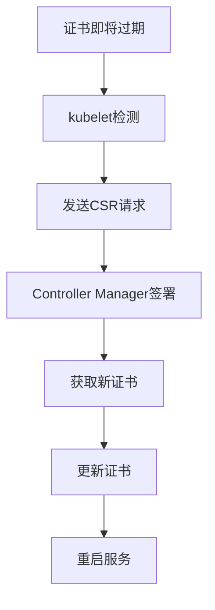

# K8S证书管理与自动轮换：集群安全保障指南

## 情境与背景

Kubernetes证书管理是集群安全的核心环节。证书过期会导致组件通信失败，进而引发集群故障。作为高级DevOps/SRE工程师，必须掌握证书有效期配置和自动轮换机制。本文从DevOps/SRE视角，深入讲解K8S证书管理的最佳实践。

## 一、证书类型与有效期

### 1.1 证书类型

**证书分类**：

| 证书类型 | 文件路径 | 用途 |
|:--------:|----------|------|
| **CA证书** | /etc/kubernetes/pki/ca.crt | 根证书，签发其他证书 |
| **API Server证书** | /etc/kubernetes/pki/apiserver.crt | API Server服务证书 |
| **API Server Kubelet证书** | /etc/kubernetes/pki/apiserver-kubelet-client.crt | API Server访问kubelet |
| **etcd CA证书** | /etc/kubernetes/pki/etcd/ca.crt | etcd根证书 |
| **etcd Server证书** | /etc/kubernetes/pki/etcd/server.crt | etcd服务证书 |
| **kubelet证书** | /var/lib/kubelet/pki/kubelet.crt | kubelet服务证书 |
| **服务账户证书** | /etc/kubernetes/pki/sa.pub | 服务账户签名 |

### 1.2 默认有效期

**有效期配置**：
```yaml
# 证书有效期配置
certificates:
  ca:
    validity: "10y"  # 10年
  apiserver:
    validity: "1y"   # 1年
  apiserver-kubelet-client:
    validity: "1y"   # 1年
  etcd-ca:
    validity: "10y"  # 10年
  etcd-server:
    validity: "1y"   # 1年
  kubelet:
    validity: "1y"   # 1年
  service-account:
    validity: "1y"   # 1年
```

### 1.3 查看证书有效期

**查看命令**：
```bash
# 查看证书有效期
openssl x509 -in /etc/kubernetes/pki/apiserver.crt -text -noout | grep "Not After"

# 输出示例
# Not After : May  8 10:00:00 2027 GMT
```

## 二、证书轮换机制

### 2.1 自动轮换

**自动轮换配置**：
```yaml
# kubelet自动轮换配置
kubelet:
  rotateCertificates: true
  serverTLSBootstrap: true
  certificateExpiry: "24h"  # 提前24小时轮换
```

**自动轮换流程**：


### 2.2 手动轮换

**手动轮换步骤**：
```yaml
# 手动轮换流程
manual_rotation:
  steps:
    1. "备份现有证书"
    2. "生成新证书"
    3. "替换证书文件"
    4. "重启相关服务"
    5. "验证证书"
```

**手动生成证书**：
```bash
# 生成API Server证书
kubeadm init phase certs apiserver \
  --apiserver-advertise-address=192.168.1.10 \
  --apiserver-cert-extra-sans=kubernetes.default
```

### 2.3 kubeadm证书管理

**kubeadm证书命令**：
```yaml
# kubeadm证书管理命令
kubeadm_certs:
  check_expiration: "kubeadm certs check-expiration"
  renew: "kubeadm certs renew <cert-name>"
  renew_all: "kubeadm certs renew all"
```

**证书检查**：
```bash
# 检查证书有效期
kubeadm certs check-expiration

# 输出示例
# CERTIFICATE                EXPIRES                  RESIDUAL TIME   CERTIFICATE AUTHORITY   EXTERNALLY MANAGED
# admin.conf                 May  8, 2027 10:00:00   364d            ca                      no
# apiserver                  May  8, 2027 10:00:00   364d            ca                      no
```

## 三、证书轮换配置

### 3.1 API Server自动轮换

**配置示例**：
```yaml
# API Server自动轮换配置
apiServer:
  extraArgs:
    rotate-certificates: "true"
    certificate-manager: "true"
  volumeMounts:
    - name: certs
      mountPath: /etc/kubernetes/pki
      readOnly: true
```

### 3.2 Controller Manager配置

**配置示例**：
```yaml
# Controller Manager配置
controllerManager:
  extraArgs:
    cluster-signing-duration: "8760h"  # 1年
    cluster-signing-key-file: "/etc/kubernetes/pki/ca.key"
    cluster-signing-cert-file: "/etc/kubernetes/pki/ca.crt"
```

### 3.3 kubelet配置

**配置示例**：
```yaml
# kubelet配置文件
apiVersion: kubelet.config.k8s.io/v1beta1
kind: KubeletConfiguration
rotateCertificates: true
serverTLSBootstrap: true
featureGates:
  RotateKubeletServerCertificate: true
```

## 四、监控与告警

### 4.1 证书过期监控

**监控配置**：
```yaml
# 证书监控配置
certificate_monitoring:
  metrics:
    - name: "certificate_expiry_days"
      query: "certificate_expiry_time - time() / 86400"
      thresholds:
        warning: 30  # 30天前告警
        critical: 7  # 7天前严重告警
  
  alerts:
    - name: "CertificateExpiryWarning"
      condition: "certificate_expiry_days < 30"
      severity: "warning"
    
    - name: "CertificateExpiryCritical"
      condition: "certificate_expiry_days < 7"
      severity: "critical"
```

### 4.2 监控命令

**检查命令**：
```bash
# 检查所有证书有效期
find /etc/kubernetes/pki -name "*.crt" -exec openssl x509 -in {} -text -noout \; | grep -E "(Subject:|Not After)"
```

## 五、证书备份与恢复

### 5.1 证书备份

**备份脚本**：
```bash
#!/bin/bash
# 证书备份脚本

BACKUP_DIR="/backup/k8s-certs-$(date +%Y%m%d)"
mkdir -p ${BACKUP_DIR}

# 备份所有证书
cp -r /etc/kubernetes/pki ${BACKUP_DIR}/

# 备份kubeconfig文件
cp /etc/kubernetes/admin.conf ${BACKUP_DIR}/
cp /etc/kubernetes/kubelet.conf ${BACKUP_DIR}/
cp /etc/kubernetes/controller-manager.conf ${BACKUP_DIR}/
cp /etc/kubernetes/scheduler.conf ${BACKUP_DIR}/

# 压缩备份
tar -czvf ${BACKUP_DIR}.tar.gz ${BACKUP_DIR}

# 上传到S3
aws s3 cp ${BACKUP_DIR}.tar.gz s3://k8s-backup/certs/
```

### 5.2 证书恢复

**恢复流程**：
```yaml
# 证书恢复流程
certificate_restore:
  steps:
    1. "停止相关服务"
    2. "解压备份文件"
    3. "恢复证书文件"
    4. "恢复kubeconfig文件"
    5. "重启服务"
    6. "验证证书"
```

## 六、安全最佳实践

### 6.1 证书存储安全

**权限配置**：
```yaml
# 证书权限配置
certificate_permissions:
  directory:
    path: "/etc/kubernetes/pki"
    owner: "root"
    group: "root"
    permissions: "700"
  
  key_files:
    permissions: "600"
  
  cert_files:
    permissions: "644"
```

### 6.2 使用外部CA

**外部CA配置**：
```yaml
# 外部CA配置
external_ca:
  enabled: true
  issuer: "Let's Encrypt"
  acme_server: "https://acme-v02.api.letsencrypt.org/directory"
  renewal_days: 30
```

## 七、实战案例分析

### 7.1 案例1：kubeadm自动轮换

**场景描述**：
- 使用kubeadm部署的集群
- 需要配置证书自动轮换

**配置方案**：
```yaml
# kubeadm配置文件
apiVersion: kubeadm.k8s.io/v1beta3
kind: ClusterConfiguration
kubernetesVersion: "v1.30.0"
certificatesDir: "/etc/kubernetes/pki"
clusterName: "my-cluster"
```

**执行命令**：
```bash
# 查看证书状态
kubeadm certs check-expiration

# 手动轮换所有证书
kubeadm certs renew all

# 重启组件
systemctl restart kube-apiserver
systemctl restart kube-controller-manager
systemctl restart kube-scheduler
```

### 7.2 案例2：手动更新证书

**场景描述**：
- 证书即将过期
- 需要手动更新

**更新步骤**：
1. 备份现有证书
2. 使用kubeadm生成新证书
3. 替换证书文件
4. 重启相关服务
5. 验证证书有效性

## 八、面试1分钟精简版（直接背）

**完整版**：

K8S集群证书的默认有效期根据类型不同有所区别。CA根证书默认10年，API Server、kubelet、etcd等证书默认1年有效期。证书轮换方面，kubelet证书支持自动轮换，API Server和etcd证书可以配置自动轮换也可以手动更新。我们采用自动轮换为主、手动干预为辅的策略，确保证书在过期前自动更新，避免影响集群运行。

**30秒超短版**：

CA证书默认10年，其他证书默认1年。kubelet自动轮换，API Server和etcd支持自动和手动轮换。

## 九、总结

### 9.1 核心要点

1. **有效期**：CA证书10年，其他证书1年
2. **自动轮换**：kubelet支持自动轮换
3. **手动轮换**：使用kubeadm certs renew命令
4. **监控告警**：提前30天告警，7天严重告警
5. **备份恢复**：定期备份证书文件

### 9.2 管理原则

| 原则 | 说明 |
|:----:|------|
| **自动化** | 配置自动轮换，减少人工干预 |
| **监控** | 定期检查证书有效期 |
| **备份** | 定期备份证书文件 |
| **安全** | 限制证书文件访问权限 |

### 9.3 记忆口诀

```
CA证书十年期，其他证书一年期，
kubelet自动换，API Server可自动可手动，
定期检查有效期，备份恢复不能少。
```

> **参考链接**：[SRE运维面试题全解析：从理论到实践（第二部分）]()