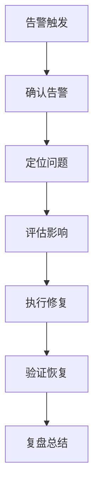

# K8S日常运维工作全解析：从监控到安全的完整指南

## 情境与背景

Kubernetes运维是DevOps/SRE工程师的核心工作之一。作为高级DevOps/SRE工程师，需要掌握全面的K8S运维技能。本文从DevOps/SRE视角，深入讲解K8S日常运维工作的各个方面和最佳实践。

## 一、日常监控

### 1.1 监控指标

**核心指标**：

| 指标类别 | 具体指标 | 监控目的 |
|:--------:|----------|----------|
| **集群状态** | node状态、Pod状态、组件健康 | 整体健康度 |
| **资源使用** | CPU、内存、存储、网络 | 资源规划 |
| **应用性能** | QPS、响应时间、错误率 | 服务质量 |
| **日志告警** | 错误日志、异常事件 | 问题发现 |

### 1.2 监控工具

**工具栈配置**：
```yaml
# 监控工具配置
monitoring:
  metrics:
    tool: "Prometheus"
    scrape_interval: "15s"
    
  visualization:
    tool: "Grafana"
    dashboards:
      - "cluster-overview"
      - "pod-performance"
      - "node-resources"
    
  alerting:
    tool: "Alertmanager"
    receivers:
      - "slack"
      - "pagerduty"
```

### 1.3 告警配置

**告警规则**：
```yaml
# 告警规则配置
groups:
  - name: cluster-alerts
    rules:
      - alert: NodeNotReady
        expr: kube_node_status_condition{condition="Ready", status="false"} == 1
        for: 5m
        labels:
          severity: critical
        annotations:
          summary: "Node is not ready"
      
      - alert: HighPodRestarts
        expr: rate(kube_pod_container_status_restarts_total[15m]) > 5
        for: 10m
        labels:
          severity: warning
        annotations:
          summary: "High pod restarts detected"
```

## 二、版本升级

### 2.1 升级流程

**升级步骤**：
```yaml
# 升级流程
upgrade:
  steps:
    1. "备份etcd数据"
    2. "升级控制平面"
    3. "升级kubelet"
    4. "升级工作节点"
    5. "验证集群状态"
    6. "升级插件"
```

### 2.2 升级策略

**策略配置**：
```yaml
# 升级策略
strategy:
  control_plane:
    type: "rolling"
    max_unavailable: 1
    
  worker_nodes:
    type: "drain"
    max_concurrent: 1
    drain_timeout: "5m"
    
  plugins:
    order: ["calico", "istio", "argocd"]
```

### 2.3 版本管理

**版本矩阵**：
```yaml
# 版本管理
versions:
  current: "v1.30"
  target: "v1.31"
  supported_versions:
    - "v1.29"
    - "v1.30"
    - "v1.31"
```

## 三、备份恢复

### 3.1 etcd备份

**备份配置**：
```yaml
# etcd备份配置
backup:
  etcd:
    enabled: true
    schedule: "0 2 * * *"
    retention: "7 days"
    storage:
      type: "s3"
      bucket: "k8s-backup"
```

**备份命令**：
```bash
# 执行备份
ETCDCTL_API=3 etcdctl snapshot save /backup/etcd-snapshot.db \
  --endpoints=https://127.0.0.1:2379 \
  --cacert=/etc/kubernetes/pki/etcd/ca.crt \
  --cert=/etc/kubernetes/pki/etcd/server.crt \
  --key=/etc/kubernetes/pki/etcd/server.key
```

### 3.2 恢复流程

**恢复步骤**：
```yaml
# 恢复流程
restore:
  steps:
    1. "停止kube-apiserver"
    2. "恢复etcd数据"
    3. "重启etcd"
    4. "重启kube-apiserver"
    5. "验证集群状态"
```

## 四、故障排查

### 4.1 常用排查命令

**命令清单**：
```yaml
# 排查命令
commands:
  - name: "查看节点状态"
    cmd: "kubectl get nodes"
    
  - name: "查看Pod状态"
    cmd: "kubectl get pods -A"
    
  - name: "查看Pod日志"
    cmd: "kubectl logs <pod-name> -n <namespace>"
    
  - name: "查看事件"
    cmd: "kubectl get events -A"
    
  - name: "查看节点详情"
    cmd: "kubectl describe node <node-name>"
```

### 4.2 常见故障处理

**故障处理指南**：

| 故障类型 | 表现 | 排查方法 | 解决措施 |
|:--------:|------|----------|----------|
| **Pod Pending** | Pod无法调度 | 检查节点资源、调度约束 | 扩容节点、调整约束 |
| **Pod CrashLoopBackOff** | Pod反复重启 | 查看Pod日志、资源配置 | 修复代码、调整资源 |
| **Node NotReady** | 节点不可用 | 检查kubelet、网络 | 重启kubelet、修复网络 |
| **Service不可访问** | 服务无法访问 | 检查Service配置、Endpoint | 修复配置、检查后端Pod |

### 4.3 应急响应流程

**响应流程**：


## 五、性能优化

### 5.1 资源优化

**优化策略**：
```yaml
# 资源优化策略
resource_optimization:
  pod_resources:
    requests_limits_ratio: "0.5"
    recommendations:
      - "分析历史资源使用"
      - "设置合理的requests"
      - "配置LimitRange约束"
  
  node_resources:
    utilization_target: "70%"
    autoscaling:
      enabled: true
      min_nodes: 3
      max_nodes: 50
```

### 5.2 调度优化

**调度配置**：
```yaml
# 调度优化配置
scheduler:
  strategy: "LeastAllocated"
  
  node_affinity:
    enabled: true
    rules:
      - key: "zone"
        operator: "In"
        values: ["zone-a", "zone-b"]
  
  pod_topology_spread:
    enabled: true
    max_skew: 1
    topology_key: "kubernetes.io/hostname"
```

### 5.3 存储优化

**存储配置**：
```yaml
# 存储优化配置
storage:
  provisioner: "csi"
  storage_class:
    name: "fast"
    parameters:
      type: "SSD"
      iops: 3000
  
  volume_expansion:
    enabled: true
```

## 六、安全合规

### 6.1 安全扫描

**扫描配置**：
```yaml
# 安全扫描配置
security_scanning:
  image_scanning:
    tool: "trivy"
    schedule: "daily"
    
  vulnerability_scanning:
    tool: "grype"
    severity_threshold: "high"
    
  compliance_check:
    tool: "kube-bench"
    standards: ["cis"]
```

### 6.2 权限管理

**RBAC配置**：
```yaml
# RBAC配置
rbac:
  roles:
    - name: "admin"
      permissions:
        - "create"
        - "update"
        - "delete"
        - "get"
    
    - name: "viewer"
      permissions:
        - "get"
        - "list"
        - "watch"
  
  service_accounts:
    automount_token: false
```

### 6.3 审计日志

**审计配置**：
```yaml
# 审计配置
audit:
  enabled: true
  log_path: "/var/log/kubernetes/audit.log"
  policy:
    rules:
      - level: "RequestResponse"
        resources:
          - group: "*"
            resources: ["secrets", "configmaps"]
```

## 七、实战案例分析

### 7.1 案例1：Pod故障排查

**场景描述**：
- Pod状态为CrashLoopBackOff
- 需要快速定位问题

**排查步骤**：
1. 查看Pod状态：`kubectl get pods`
2. 查看Pod日志：`kubectl logs <pod-name>`
3. 查看Pod详情：`kubectl describe pod <pod-name>`
4. 发现问题：内存不足
5. 解决：调整Pod资源配置

### 7.2 案例2：节点故障处理

**场景描述**：
- 节点状态变为NotReady
- 需要快速恢复

**处理步骤**：
1. 检查节点状态：`kubectl get nodes`
2. 查看节点详情：`kubectl describe node <node-name>`
3. 登录节点检查kubelet状态
4. 重启kubelet：`systemctl restart kubelet`
5. 验证节点恢复

## 八、面试1分钟精简版（直接背）

**完整版**：

K8S运维工作主要包括几个方面。日常维护方面，实时监控集群状态、Pod运行状态和资源使用情况，定期进行版本升级和备份恢复；故障处理方面，及时排查Pod异常、节点故障和网络问题，建立应急响应机制；性能优化方面，调整资源配置、优化调度策略和存储性能；安全合规方面，定期进行安全扫描、权限管理和审计日志检查。这些工作确保集群稳定、高效、安全运行。

**30秒超短版**：

日常运维包括监控集群状态、版本升级、备份恢复；故障处理包括排查Pod和节点问题；性能优化包括资源和调度优化；安全合规包括扫描和权限管理。

## 九、总结

### 9.1 核心要点

1. **日常监控**：实时监控集群和应用状态
2. **版本管理**：定期升级，确保安全和功能
3. **备份恢复**：定期备份，确保数据安全
4. **故障处理**：快速定位，及时修复
5. **性能优化**：持续优化资源配置和调度
6. **安全合规**：定期扫描，严格权限管理

### 9.2 运维原则

| 原则 | 说明 |
|:----:|------|
| **自动化** | 自动化监控、告警、备份 |
| **预防性** | 提前发现问题，避免故障 |
| **可追溯** | 完整的审计日志 |
| **持续改进** | 定期复盘，优化流程 |

### 9.3 记忆口诀

```
日常监控不能少，版本升级要谨慎，
备份恢复要定期，故障排查要及时，
性能优化要持续，安全合规要重视。
```

> **参考链接**：[SRE运维面试题全解析：从理论到实践（第二部分）]()