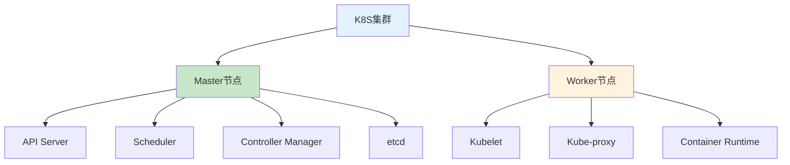
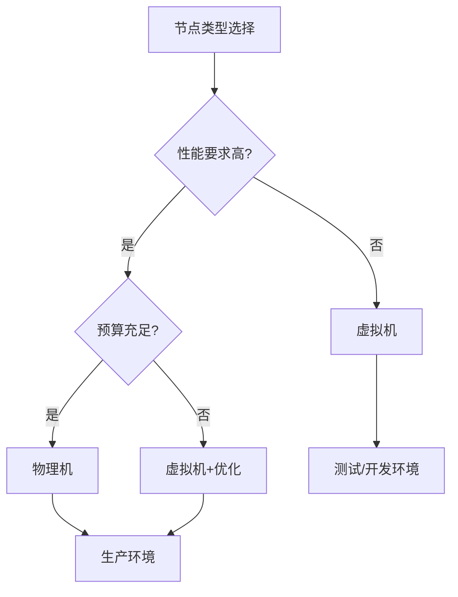

# K8S基础设施选型指南：物理机vs虚拟机与架构决策

## 情境与背景

Kubernetes集群的基础设施选型直接影响系统性能、成本和运维复杂度。作为高级DevOps/SRE工程师，需要根据业务需求合理选择物理机或虚拟机、CPU架构和操作系统。本文从DevOps/SRE视角，深入讲解K8S基础设施选型的关键因素和最佳实践。

## 一、部署平台选择

### 1.1 K8S部署方式

| 部署方式 | 适用场景 | 优势 | 劣势 |
|:--------:|----------|------|------|
| **自建K8S** | 大型企业、定制需求高 | 完全控制、成本可控 | 运维复杂、需要专业团队 |
| **托管K8S** | 中小企业、快速上线 | 运维简单、高可用 | 成本较高、定制受限 |
| **混合部署** | 多云场景、合规要求 | 灵活性高、容灾能力强 | 架构复杂、管理成本高 |

### 1.2 K8S集群架构



## 二、物理机 vs 虚拟机

### 2.1 物理机（Bare Metal）

**优势**：
- 性能损耗小（无虚拟化开销）
- 网络延迟低
- 存储性能高
- 资源独占

**劣势**：
- 成本高（采购周期长）
- 扩容慢
- 资源利用率低
- 运维复杂

**适用场景**：
- 高性能计算
- 低延迟要求
- 大数据场景
- 存储密集型应用

### 2.2 虚拟机（VM）

**优势**：
- 快速扩容
- 资源利用率高
- 成本灵活
- 管理方便

**劣势**：
- 性能损耗（虚拟化开销5-15%）
- 网络延迟略高
- 存储性能受限
- 资源竞争

**适用场景**：
- 快速迭代
- 测试环境
- 开发环境
- 成本敏感场景

### 2.3 性能对比

| 指标 | 物理机 | 虚拟机 |
|:----:|:------:|:------:|
| CPU性能 | 100% | 85-95% |
| 内存性能 | 100% | 90-95% |
| 网络延迟 | 低 | 中 |
| 存储IOPS | 高 | 中 |
| 扩容速度 | 慢（天级） | 快（分钟级） |
| 成本 | 高 | 中 |

### 2.4 选型决策树



## 三、CPU架构选择

### 3.1 x86_64架构

**优势**：
- 生态成熟
- 软件兼容性好
- 性能强劲
- 社区支持完善

**适用场景**：
- 通用业务系统
- 数据库
- 中间件
- 大多数应用场景

### 3.2 ARM64架构

**优势**：
- 成本低
- 功耗低
- 云原生支持好
- 适合边缘计算

**劣势**：
- 软件兼容性需验证
- 生态相对不成熟
- 性能略低于x86

**适用场景**：
- 云原生应用
- 边缘计算
- 成本敏感场景
- 绿色计算

### 3.3 架构对比

| 维度 | x86_64 | ARM64 |
|:----:|:------:|:-----:|
| 性能 | 高 | 中高 |
| 成本 | 高 | 低 |
| 功耗 | 高 | 低 |
| 兼容性 | 优秀 | 良好 |
| 生态 | 成熟 | 发展中 |

### 3.4 混合架构策略

```yaml
# 混合架构节点配置
node_pools:
  - name: x86-pool
    architecture: amd64
    node_type: physical
    use_case: database, middleware
    
  - name: arm-pool
    architecture: arm64
    node_type: vm
    use_case: web, api
```

## 四、操作系统选择

### 4.1 主流Linux发行版

| 发行版 | 优势 | 适用场景 |
|:------:|------|----------|
| **CentOS 7/8** | 稳定、企业级支持 | 生产环境 |
| **Ubuntu 20.04/22.04** | 社区活跃、更新快 | 开发/测试 |
| **RHEL** | 企业支持、安全认证 | 金融/政府 |
| **Debian** | 稳定、轻量 | 通用场景 |

### 4.2 操作系统选型考虑

**稳定性**：
- CentOS/RHEL：企业级稳定性
- Ubuntu LTS：长期支持版本

**性能**：
- 内核版本：4.19+（推荐5.4+）
- 文件系统：XFS（推荐）
- 网络栈：优化配置

**安全**：
- SELinux/AppArmor
- 内核安全模块
- 定期安全更新

### 4.3 操作系统优化配置

```yaml
# 系统优化配置
kernel:
  version: "5.4+"
  parameters:
    net.ipv4.ip_forward: 1
    net.bridge.bridge-nf-call-iptables: 1
    vm.max_map_count: 262144
    fs.file-max: 1000000
    
filesystem:
  type: "XFS"
  mount_options: "noatime,nodiratime"
  
network:
  dns: "systemd-resolved"
  ntp: "chrony"
```

## 五、实战案例分析

### 5.1 案例1：客户系统（生产环境）

**基础设施配置**：
```yaml
# 客户系统基础设施
cluster:
  name: "production-cluster"
  node_type: "physical"
  architecture: "x86_64"
  os: "CentOS 7.9"
  
nodes:
  master:
    count: 3
    cpu: 16 cores
    memory: 64GB
    disk: 500GB SSD
    
  worker:
    count: 50
    cpu: 32 cores
    memory: 128GB
    disk: 2TB SSD
    
network:
  cni: "Calico"
  bandwidth: "10Gbps"
  
storage:
  csi: "Ceph RBD"
  type: "distributed"
```

**选型理由**：
- 物理机：高性能、低延迟
- x86_64：生态成熟、兼容性好
- CentOS 7.9：企业级稳定

### 5.2 案例2：内部系统（测试环境）

**基础设施配置**：
```yaml
# 内部系统基础设施
cluster:
  name: "test-cluster"
  node_type: "vm"
  architecture: "x86_64"
  os: "CentOS 7.9"
  
nodes:
  master:
    count: 3
    cpu: 8 cores
    memory: 16GB
    disk: 100GB SSD
    
  worker:
    count: 10
    cpu: 8 cores
    memory: 32GB
    disk: 200GB SSD
    
network:
  cni: "Flannel"
  bandwidth: "1Gbps"
  
storage:
  csi: "Local Path"
  type: "local"
```

**选型理由**：
- 虚拟机：快速扩容、成本灵活
- x86_64：与生产环境一致
- CentOS 7.9：环境统一

### 5.3 案例3：混合架构

**基础设施配置**：
```yaml
# 混合架构基础设施
clusters:
  - name: "x86-cluster"
    node_type: "physical"
    architecture: "x86_64"
    use_case: "database, middleware"
    
  - name: "arm-cluster"
    node_type: "vm"
    architecture: "arm64"
    use_case: "web, api"
    
federation:
  enabled: true
  control_plane: "x86-cluster"
```

## 六、成本与性能平衡

### 6.1 成本分析

| 项目 | 物理机 | 虚拟机 |
|:----:|:------:|:------:|
| 硬件成本 | 高 | 低 |
| 运维成本 | 高 | 低 |
| 电力成本 | 高 | 低 |
| 扩容成本 | 高 | 低 |
| 总体成本 | 高 | 中 |

### 6.2 性能优化策略

**物理机优化**：
- 内核参数调优
- 网络栈优化
- 存储性能优化
- 资源隔离

**虚拟机优化**：
- 选择合适的虚拟化技术（KVM）
- CPU绑定
- 内存大页
- 网络SR-IOV

## 七、面试1分钟精简版（直接背）

**完整版**：

是的，两套平台都部署在K8S上。客户系统部署在物理机集群上，使用x86_64架构，操作系统是CentOS 7.9，共50+节点，性能更强、延迟更低；内部系统部署在虚拟机集群上，同样使用x86_64架构和CentOS 7.9，共10+节点，资源更灵活、成本更低。物理机适合高性能场景，虚拟机适合快速扩容和资源隔离。选择时需要考虑性能需求、成本预算和运维复杂度。

**30秒超短版**：

两套平台都在K8S上。客户系统用物理机，x86_64架构，CentOS 7.9，50+节点；内部系统用虚拟机，同样架构和系统，10+节点。物理机高性能，虚拟机灵活低成本。

## 八、总结

### 8.1 核心要点

1. **部署平台**：K8S是主流选择，自建或托管根据需求
2. **节点类型**：物理机性能强，虚拟机灵活成本低
3. **CPU架构**：x86_64生态成熟，ARM64成本低
4. **操作系统**：CentOS/Ubuntu LTS稳定可靠

### 8.2 选型原则

| 原则 | 说明 |
|:----:|------|
| **性能优先** | 生产环境选物理机 |
| **成本优先** | 测试环境选虚拟机 |
| **生态优先** | x86_64兼容性好 |
| **稳定优先** | LTS版本操作系统 |

### 8.3 记忆口诀

```
物理机性能强，虚拟机成本低，
x86生态好，ARM成本低，
CentOS稳定，Ubuntu活跃，
选型看需求，平衡最重要。
```

> **参考链接**：[SRE运维面试题全解析：从理论到实践（第二部分）]()