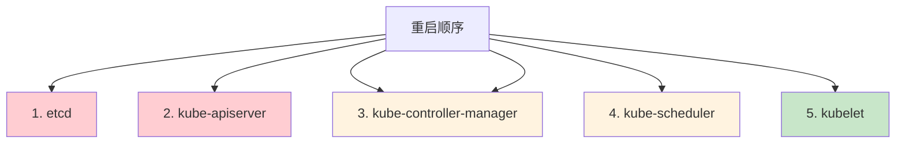

# K8S手工证书轮换实战：步骤详解与组件重启指南

## 情境与背景

在生产环境中，自动证书轮换可能因各种原因失败，如网络问题、权限问题或组件故障。掌握手工轮换证书的技能是DevOps/SRE工程师的必备能力。本文从DevOps/SRE视角，详细讲解K8S手工证书轮换的完整操作流程和组件重启步骤。

## 一、手工轮换前准备

### 1.1 环境确认

**检查当前环境**：
```bash
# 查看K8S版本
kubectl version --short

# 查看kubeadm版本
kubeadm version

# 查看证书位置
ls -la /etc/kubernetes/pki/
```

### 1.2 备份现有证书

**备份命令**：
```bash
#!/bin/bash
# 证书备份脚本

BACKUP_DATE=$(date +%Y%m%d_%H%M%S)
BACKUP_DIR="/backup/k8s-certs-${BACKUP_DATE}"

# 创建备份目录
mkdir -p ${BACKUP_DIR}

# 备份所有证书
cp -r /etc/kubernetes/pki ${BACKUP_DIR}/

# 备份kubeconfig文件
cp /etc/kubernetes/admin.conf ${BACKUP_DIR}/
cp /etc/kubernetes/kubelet.conf ${BACKUP_DIR}/
cp /etc/kubernetes/controller-manager.conf ${BACKUP_DIR}/
cp /etc/kubernetes/scheduler.conf ${BACKUP_DIR}/

# 备份etcd数据（如需要）
if [ -d "/var/lib/etcd" ]; then
    cp -r /var/lib/etcd ${BACKUP_DIR}/
fi

# 显示备份内容
echo "Certificates backed up to: ${BACKUP_DIR}"
ls -la ${BACKUP_DIR}
```

### 1.3 检查证书状态

**查看命令**：
```bash
# 使用kubeadm检查证书状态
kubeadm certs check-expiration

# 输出示例
# CERTIFICATE                EXPIRES                  RESIDUAL TIME   CERTIFICATE AUTHORITY   EXTERNALLY MANAGED
# admin.conf                 May  8, 2027 10:00:00   364d            ca                      no
# apiserver                  May  8, 2027 10:00:00   364d            ca                      no
# apiserver-kubelet-client   May  8, 2027 10:00:00   364d            ca                      no
# controller-manager.conf    May  8, 2027 10:00:00   364d            ca                      no
# scheduler.conf             May  8, 2027 10:00:00   364d            ca                      no
```

## 二、生成新证书

### 2.1 更新所有证书

**命令**：
```bash
# 更新所有证书
kubeadm certs renew all

# 输出示例
#certificate embedded in the kubeconfig file for the admin to use and is stored in /etc/kubernetes/admin.conf was successfully renewed.
#certificate for serving the API was successfully renewed.
#certificate for the API server's serving certificate was successfully renewed.
#certificate for the front-proxy client was successfully renewed.
#certificate for serving the API was successfully renewed.
#certificate for serving the API was successfully renewed.
```

### 2.2 更新指定证书

**命令列表**：

| 证书类型 | 更新命令 | 说明 |
|:--------:|----------|------|
| **admin.conf** | kubeadm certs renew admin.conf | 管理员kubeconfig |
| **apiserver** | kubeadm certs renew apiserver | API Server证书 |
| **apiserver-kubelet-client** | kubeadm certs renew apiserver-kubelet-client | kubelet客户端证书 |
| **controller-manager.conf** | kubeadm certs renew controller-manager.conf | Controller Manager kubeconfig |
| **scheduler.conf** | kubeadm certs renew scheduler.conf | Scheduler kubeconfig |
| **etcd-ca** | kubeadm certs renew etcd-ca | etcd CA证书 |
| **etcd-server** | kubeadm certs renew etcd-server | etcd Server证书 |
| **front-proxy-ca** | kubeadm certs renew front-proxy-ca | Front Proxy CA |
| **front-proxy-client** | kubeadm certs renew front-proxy-client | Front Proxy客户端证书 |

### 2.3 验证更新结果

**验证命令**：
```bash
# 再次检查证书状态
kubeadm certs check-expiration

# 查看证书详情
openssl x509 -in /etc/kubernetes/pki/apiserver.crt -text -noout | grep -E "(Subject:|Not Before|Not After|Issuer)"

# 查看证书有效期（计算天数）
openssl x509 -in /etc/kubernetes/pki/apiserver.crt -noout -enddate
```

## 三、分发证书到集群节点

### 3.1 控制平面节点证书

**单节点集群**：
```bash
# 本地证书已经更新，直接进入重启步骤
```

**多节点集群 - 主节点**：
```bash
# 在主节点更新证书后，分发到其他控制平面节点
ssh user@master-node-2 "mkdir -p /etc/kubernetes/pki"
scp /etc/kubernetes/pki/*.crt user@master-node-2:/etc/kubernetes/pki/
scp /etc/kubernetes/pki/*.key user@master-node-2:/etc/kubernetes/pki/
```

### 3.2 工作节点证书

**分发kubelet证书**：
```bash
# 在工作节点执行
ssh user@worker-node-1

# 重启kubelet以触发新的CSR请求
systemctl restart kubelet

# 或者手动更新kubelet证书
cp /etc/kubernetes/pki/ca.crt /var/lib/kubelet/pki/
```

## 四、重启K8S组件

### 4.1 需要重启的组件

**组件重启顺序**：



### 4.2 重启etcd

**重启命令**：
```bash
# 检查etcd状态
systemctl status etcd

# 重启etcd
systemctl restart etcd

# 等待etcd启动
sleep 10

# 验证etcd健康状态
crictl exec $(crictl ps --name etcd -q) etcdctl endpoint health
```

### 4.3 重启API Server

**重启命令**：
```bash
# 重启kube-apiserver
systemctl restart kube-apiserver

# 检查API Server状态
systemctl status kube-apiserver

# 等待API Server启动
sleep 30

# 验证API Server
kubectl get cs
```

### 4.4 重启Controller Manager和Scheduler

**重启命令**：
```bash
# 重启kube-controller-manager
systemctl restart kube-controller-manager

# 重启kube-scheduler
systemctl restart kube-scheduler

# 检查组件状态
systemctl status kube-controller-manager
systemctl status kube-scheduler
```

### 4.5 重启kubelet（可选）

**重启命令**：
```bash
# 重启所有节点的kubelet
systemctl restart kubelet

# 检查kubelet状态
systemctl status kubelet

# 查看kubelet日志
journalctl -u kubelet -n 50
```

## 五、验证证书轮换

### 5.1 验证证书有效性

**验证命令**：
```bash
# 验证所有证书
for cert in $(find /etc/kubernetes/pki -name "*.crt"); do
    echo "Checking: $cert"
    openssl x509 -in $cert -noout -enddate
done

# 验证API Server证书
curl -k https://localhost:6443/healthz

# 验证集群状态
kubectl get nodes
kubectl get cs
```

### 5.2 验证组件通信

**验证命令**：
```bash
# 验证kubectl访问API Server
kubectl get pods -A

# 验证Controller Manager与API Server通信
kubectl get componentstatuses/controller

# 验证Scheduler与API Server通信
kubectl get componentstatuses/scheduler

# 验证kubelet与API Server通信
kubectl get nodes
```

## 六、故障排除

### 6.1 常见问题

**问题1：证书更新失败**

**解决方法**：
```bash
# 查看错误日志
journalctl -u kubelet -n 100

# 手动删除过期的kubelet证书
rm -f /var/lib/kubelet/pki/kubelet.crt
rm -f /var/lib/kubelet/pki/kubelet.key

# 重启kubelet生成新证书
systemctl restart kubelet
```

**问题2：组件无法启动**

**解决方法**：
```bash
# 检查配置文件
cat /etc/kubernetes/manifests/kube-apiserver.yaml

# 检查证书权限
ls -la /etc/kubernetes/pki/

# 重新生成缺失的证书
kubeadm init phase certs all
```

### 6.2 回滚操作

**回滚步骤**：
```bash
# 停止所有组件
systemctl stop kube-apiserver kube-controller-manager kube-scheduler kubelet etcd

# 恢复备份的证书
cp -r /backup/k8s-certs-YYYYMMDD_HHMMSS/pki/* /etc/kubernetes/pki/
cp /backup/k8s-certs-YYYYMMDD_HHMMSS/*.conf /etc/kubernetes/

# 重启所有组件
systemctl start etcd
systemctl start kube-apiserver
systemctl start kube-controller-manager
systemctl start kube-scheduler
systemctl start kubelet

# 验证恢复
kubectl get nodes
```

## 七、最佳实践

### 7.1 轮换策略

**建议**：

| 场景 | 建议 |
|------|------|
| **生产环境** | 提前60天轮换，使用自动化工具 |
| **测试环境** | 提前30天轮换，可手动操作 |
| **紧急情况** | 立即轮换，评估影响后执行 |

### 7.2 维护窗口

**建议**：
- 生产环境证书轮换安排在维护窗口期
- 通知相关团队做好准备
- 准备回滚方案
- 记录操作日志

## 八、面试1分钟精简版（直接背）

**完整版**：

手工轮换证书的流程是：首先备份现有证书到安全位置，然后使用kubeadm certs check-expiration查看证书状态，确认需要更新的证书。接着执行kubeadm certs renew命令生成新证书，可以指定单个证书或使用all参数更新所有证书。更新完成后需要重启相关组件，包括kube-apiserver、kube-controller-manager、kube-scheduler等控制平面组件，以及各节点的kubelet。最后使用openssl命令验证新证书的有效期。

**30秒超短版**：

备份证书后用kubeadm certs renew更新，重启kube-apiserver、controller-manager、scheduler、kubelet等组件，验证证书有效性。

## 九、总结

### 9.1 核心要点

1. **备份**：操作前必须备份现有证书
2. **检查**：使用kubeadm certs check-expiration确认状态
3. **更新**：使用kubeadm certs renew更新证书
4. **重启**：按顺序重启etcd→apiserver→controller-manager→scheduler→kubelet
5. **验证**：确认组件正常通信和集群健康

### 9.2 重启原则

| 原则 | 说明 |
|:----:|------|
| **按顺序** | 按依赖顺序重启 |
| **等待就绪** | 等待组件启动后再操作下一个 |
| **验证** | 每步都验证组件状态 |

### 9.3 记忆口诀

```
备份先做，检查状态，生成证书，
分发到位，重启组件，验证无误。
```

> **参考链接**：[SRE运维面试题全解析：从理论到实践（第二部分）]()