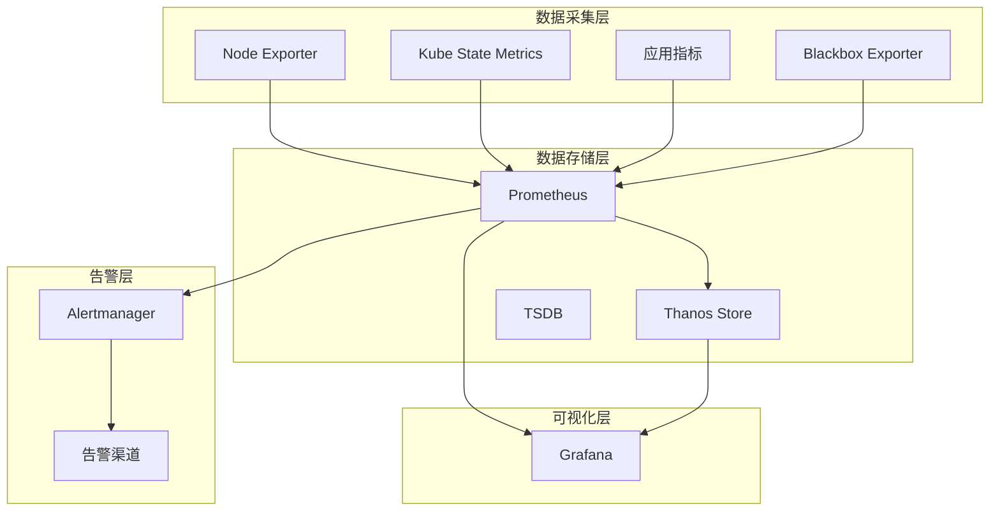

# K8S监控体系架构设计：从采集到告警的完整方案

## 情境与背景

监控体系是Kubernetes集群稳定运行的核心保障。作为高级DevOps/SRE工程师，必须掌握完整的监控方案设计和架构规划能力。本文从DevOps/SRE视角，详细讲解K8S监控体系的架构设计和最佳实践。

## 一、监控方案概述

### 1.1 方案选择

**监控方案对比**：

| 方案 | 适用场景 | 优势 | 劣势 |
|:----:|----------|:----:|:----:|
| **Prometheus+Grafana** | 中小型集群 | 开源、灵活、生态成熟 | 需要自行维护 |
| **云厂商监控** | 云环境 | 托管服务、集成度高 | 成本高、绑定云厂商 |
| **商业监控** | 大型企业 | 功能完善、支持好 | 成本高 |

**我们的选择**：
```yaml
# 监控方案配置
monitoring_solution:
  name: "Prometheus + Grafana"
  components:
    - "Prometheus"
    - "Grafana"
    - "Alertmanager"
    - "Node Exporter"
    - "Kube State Metrics"
    - "Thanos"
```

### 1.2 架构设计原则

**设计原则**：
```yaml
# 架构设计原则
architecture_principles:
  - "分层设计"
  - "松耦合"
  - "高可用"
  - "可扩展"
  - "可观测性"
```

## 二、监控架构详解

### 2.1 架构分层

**四层架构**：



### 2.2 数据采集层

**采集组件**：

| 组件 | 采集内容 | 部署方式 |
|:----:|----------|----------|
| **Node Exporter** | 节点CPU、内存、磁盘、网络 | DaemonSet |
| **Kube State Metrics** | K8S资源状态 | Deployment |
| **Blackbox Exporter** | 外部服务探测 | Deployment |
| **应用指标** | 业务自定义指标 | Sidecar |

**配置示例**：
```yaml
# Node Exporter DaemonSet
apiVersion: apps/v1
kind: DaemonSet
metadata:
  name: node-exporter
  namespace: monitoring
spec:
  selector:
    matchLabels:
      app: node-exporter
  template:
    metadata:
      labels:
        app: node-exporter
    spec:
      containers:
        - name: node-exporter
          image: quay.io/prometheus/node-exporter:v1.8.2
          args:
            - "--path.rootfs=/host/root"
          volumeMounts:
            - name: root
              mountPath: /host/root
              readOnly: true
      volumes:
        - name: root
          hostPath:
            path: /
```

### 2.3 数据存储层

**存储架构**：
```yaml
# 存储配置
storage:
  prometheus:
    type: "local"
    size: "100Gi"
    retention: "15d"
  
  thanos:
    type: "s3"
    bucket: "k8s-monitoring"
    retention: "90d"
  
  federation:
    enabled: true
    clusters:
      - "prod-cluster"
      - "staging-cluster"
```

**Thanos配置**：
```yaml
# Thanos Sidecar配置
thanos:
  sidecar:
    enabled: true
    object_storage_config:
      type: s3
      config:
        bucket: k8s-monitoring
        endpoint: s3.amazonaws.com
        region: us-west-2
```

### 2.4 可视化层

**Grafana配置**：
```yaml
# Grafana配置
grafana:
  replicas: 2
  persistence:
    enabled: true
    size: "10Gi"
  
  datasources:
    - name: "Prometheus"
      type: "prometheus"
      url: "http://prometheus:9090"
    
    - name: "Thanos"
      type: "prometheus"
      url: "http://thanos-query:9090"
  
  dashboards:
    - name: "Kubernetes Cluster"
      url: "https://grafana.com/api/dashboards/12900"
    
    - name: "Node Exporter"
      url: "https://grafana.com/api/dashboards/1860"
```

### 2.5 告警层

**Alertmanager配置**：
```yaml
# Alertmanager配置
alertmanager:
  replicas: 3
  
  config:
    global:
      resolve_timeout: 5m
    
    route:
      group_by: ["alertname"]
      group_wait: 10s
      group_interval: 10s
      repeat_interval: 1h
      receiver: "slack"
    
    receivers:
      - name: "slack"
        slack_configs:
          - api_url: "https://hooks.slack.com/services/XXX"
            channel: "#alerts"
            send_resolved: true
```

**告警规则示例**：
```yaml
# 告警规则
groups:
  - name: node_alerts
    rules:
      - alert: HighNodeCPU
        expr: 100 - (avg by(instance) (irate(node_cpu_seconds_total{mode="idle"}[1m])) * 100) > 80
        for: 5m
        labels:
          severity: "warning"
        annotations:
          summary: "High CPU usage on {{ $labels.instance }}"
      
      - alert: HighNodeMemory
        expr: (node_memory_MemTotal_bytes - node_memory_MemAvailable_bytes) / node_memory_MemTotal_bytes * 100 > 85
        for: 5m
        labels:
          severity: "warning"
        annotations:
          summary: "High memory usage on {{ $labels.instance }}"
```

## 三、部署架构

### 3.1 部署位置

**部署架构**：
```yaml
# 部署架构
deployment:
  monitoring_cluster:
    name: "monitoring-cluster"
    nodes: 3
    purpose: "专用监控集群"
  
  network:
    isolation: true
    vpc: "monitoring-vpc"
    security_group: "monitoring-sg"
  
  connectivity:
    prometheus:
      - "业务集群Node Exporter"
      - "业务集群Kube State Metrics"
      - "业务集群应用指标"
```

### 3.2 高可用部署

**高可用配置**：
```yaml
# 高可用配置
high_availability:
  prometheus:
    replicas: 2
    federation: true
  
  grafana:
    replicas: 2
    load_balancer: true
  
  alertmanager:
    replicas: 3
    cluster: true
  
  thanos:
    query_replicas: 3
    store_replicas: 3
```

## 四、监控指标分类

### 4.1 基础设施指标

**节点指标**：
```yaml
# 节点指标
node_metrics:
  - "node_cpu_seconds_total"
  - "node_memory_MemTotal_bytes"
  - "node_memory_MemAvailable_bytes"
  - "node_disk_io_time_seconds_total"
  - "node_network_receive_bytes_total"
```

### 4.2 K8S指标

**集群指标**：
```yaml
# K8S指标
k8s_metrics:
  - "kube_node_status_condition"
  - "kube_pod_status_phase"
  - "kube_deployment_replicas"
  - "kube_service_info"
  - "kube_namespace_labels"
```

### 4.3 应用指标

**自定义指标**：
```yaml
# 应用指标
app_metrics:
  - "http_requests_total"
  - "http_request_duration_seconds"
  - "app_error_rate"
  - "app_health_status"
  - "app_cache_hit_ratio"
```

## 五、最佳实践

### 5.1 指标命名规范

**规范示例**：
```yaml
# 指标命名规范
metrics_naming:
  prefix: "app_"
  labels:
    - "namespace"
    - "service"
    - "version"
    - "environment"
  
  example:
    name: "app_requests_total"
    type: "counter"
    help: "Total number of requests"
```

### 5.2 告警策略

**告警分级**：
```yaml
# 告警分级
alert_severity:
  critical:
    description: "紧急问题，需要立即处理"
    notification: ["pagerduty", "slack"]
    response_time: "5分钟"
  
  warning:
    description: "警告，需要关注"
    notification: ["slack"]
    response_time: "30分钟"
  
  info:
    description: "信息，供参考"
    notification: ["slack"]
    response_time: "无"
```

### 5.3 监控治理

**治理策略**：
```yaml
# 监控治理
monitoring_governance:
  review_frequency: "季度"
  cleanup_rules: "删除无效告警"
  optimize_rules: "合并重复告警"
  documentation: "维护监控文档"
```

## 六、实战案例分析

### 6.1 案例1：监控架构设计

**场景描述**：
- 需要为多个K8S集群设计统一监控方案

**设计方案**：
```yaml
# 多集群监控设计
multi_cluster_monitoring:
  central_cluster:
    components:
      - "Thanos Query"
      - "Grafana"
      - "Alertmanager"
  
  edge_clusters:
    components:
      - "Prometheus"
      - "Node Exporter"
      - "Kube State Metrics"
  
  federation:
    thanos_sidecar: true
    remote_write: true
```

### 6.2 案例2：告警配置优化

**场景描述**：
- 告警过多，需要优化

**优化方案**：
```yaml
# 告警优化
alert_optimization:
  reduce_noise:
    - "增加for条件"
    - "设置合理的repeat_interval"
    - "合并类似告警"
  
  prioritize:
    - "按业务重要性分级"
    - "设置不同的通知渠道"
```

## 七、面试1分钟精简版（直接背）

**完整版**：

我们采用Prometheus+Grafana的监控方案。监控架构分为四层：数据采集层使用Node Exporter采集节点指标、Kube State Metrics采集K8S状态、应用自定义指标；数据存储层使用Prometheus作为主存储，Thanos做远程存储和联邦查询；可视化层使用Grafana展示监控面板；告警层使用Alertmanager管理告警规则。整个监控系统部署在独立的监控集群中，与业务集群隔离，确保监控服务的高可用性。

**30秒超短版**：

使用Prometheus+Grafana方案，四层架构设计，独立监控集群部署，确保高可用。

## 八、总结

### 8.1 核心要点

1. **采集层**：Node Exporter、Kube State Metrics、应用指标
2. **存储层**：Prometheus本地存储+Thanos远程存储
3. **可视化层**：Grafana多数据源支持
4. **告警层**：Alertmanager统一管理告警
5. **部署**：独立监控集群，高可用配置

### 8.2 设计原则

| 原则 | 说明 |
|:----:|------|
| **分层设计** | 各层职责清晰 |
| **松耦合** | 组件独立演进 |
| **高可用** | 关键组件多副本 |
| **可扩展** | 支持多集群扩展 |
| **可观测性** | 完善的监控指标 |

### 8.3 记忆口诀

```
采集用Exporter，存储用Prometheus，
展示用Grafana，告警用Alertmanager，
独立集群部署，高可用保障。
```

> **参考链接**：[SRE运维面试题全解析：从理论到实践（第二部分）]()