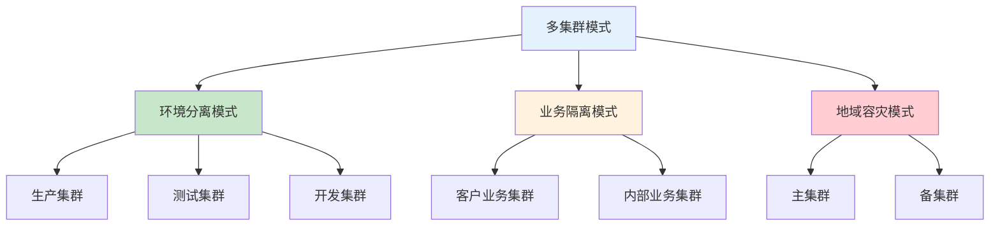

# K8S多集群架构设计：环境隔离与资源管理策略

## 情境与背景

在企业级Kubernetes运维中，多集群架构已成为标准实践。作为高级DevOps/SRE工程师，需要根据业务需求设计合理的多集群架构，实现环境隔离、资源管理和安全保障。本文从DevOps/SRE视角，深入讲解多集群架构设计的关键因素和最佳实践。

## 一、多集群架构设计原则

### 1.1 设计目标

| 目标 | 说明 |
|:----:|------|
| **环境隔离** | 生产、测试、开发环境分离 |
| **资源隔离** | 不同业务线资源独立 |
| **安全隔离** | 敏感数据保护 |
| **容灾备份** | 跨地域高可用 |
| **成本优化** | 资源弹性伸缩 |

### 1.2 多集群架构模式



### 1.3 集群数量决策

| 因素 | 建议集群数 | 说明 |
|:----:|:----------:|------|
| **业务复杂度** | 3-5套 | 生产、测试、开发、灰度、灾备 |
| **团队规模** | 2-3套 | 小规模团队精简配置 |
| **合规要求** | 独立集群 | 金融、医疗等敏感行业 |

## 二、集群类型与职责

### 2.1 生产集群

**核心职责**：
- 承载对外客户服务
- 保障高可用性
- 数据安全保护

**配置特点**：
```yaml
# 生产集群配置
cluster:
  name: "prod-cluster"
  type: "production"
  node_count: 50+
  node_config:
    cpu: 32 cores
    memory: 128GB
    disk: 2TB SSD
  availability: "99.99%"
  security:
    network_policy: enabled
    tls: enabled
    audit_log: enabled
```

**安全措施**：
- 严格的网络策略
- 完整的审计日志
- 定期安全扫描
- 最小权限原则

### 2.2 测试集群

**核心职责**：
- 内部系统运行
- 灰度发布验证
- 功能测试

**配置特点**：
```yaml
# 测试集群配置
cluster:
  name: "test-cluster"
  type: "testing"
  node_count: 10+
  node_config:
    cpu: 16 cores
    memory: 64GB
    disk: 500GB SSD
  availability: "99.9%"
  security:
    network_policy: enabled
    tls: enabled
```

**功能特点**：
- 与生产环境一致的配置
- 支持灰度发布验证
- 性能测试环境

### 2.3 开发集群

**核心职责**：
- 开发人员日常测试
- 功能开发验证
- CI/CD集成测试

**配置特点**：
```yaml
# 开发集群配置
cluster:
  name: "dev-cluster"
  type: "development"
  node_count: 5+
  node_config:
    cpu: 8 cores
    memory: 32GB
    disk: 200GB SSD
  availability: "99%"
  security:
    network_policy: basic
```

**功能特点**：
- 资源灵活分配
- 快速部署测试
- 自动清理策略

## 三、多集群管理策略

### 3.1 集群联邦（Cluster Federation）

**架构设计**：

```yaml
# 集群联邦配置
federation:
  name: "k8s-federation"
  clusters:
    - name: "prod-cluster"
      role: "primary"
    - name: "test-cluster"
      role: "secondary"
    - name: "dev-cluster"
      role: "secondary"
  
  features:
    - "cross-cluster-scheduling"
    - "service-discovery"
    - "policy-propagation"
```

**优势**：
- 统一管理多集群
- 跨集群调度
- 资源共享

### 3.2 统一配置管理

**配置管理策略**：

```yaml
# 统一配置管理
configuration:
  source: "GitOps"
  tool: "ArgoCD"
  
  sync_strategy:
    prod: "manual"
    test: "auto"
    dev: "auto"
  
  secrets:
    manager: "HashiCorp Vault"
    sync_method: "CSI driver"
```

**工具选择**：
- ArgoCD：GitOps部署
- Helm：应用打包
- Vault：密钥管理

### 3.3 跨集群网络

**网络架构**：

```yaml
# 跨集群网络配置
networking:
  cni: "Calico"
  encryption: "WireGuard"
  
  connectivity:
    type: "mesh"
    service_mesh: "Istio"
  
  policies:
    prod: "strict"
    test: "moderate"
    dev: "relaxed"
```

**安全策略**：
- 网络隔离
- 流量加密
- 访问控制

## 四、资源管理与成本优化

### 4.1 资源规划

**资源分配策略**：

| 集群类型 | CPU占比 | 内存占比 | 存储占比 |
|:--------:|:-------:|:-------:|:--------:|
| 生产集群 | 60% | 60% | 70% |
| 测试集群 | 25% | 25% | 20% |
| 开发集群 | 15% | 15% | 10% |

### 4.2 弹性伸缩

**自动伸缩配置**：

```yaml
# 自动伸缩配置
autoscaling:
  enabled: true
  
  clusters:
    prod:
      min_nodes: 50
      max_nodes: 100
      scale_down_delay: "10m"
      
    test:
      min_nodes: 10
      max_nodes: 20
      scale_down_delay: "5m"
      
    dev:
      min_nodes: 5
      max_nodes: 10
      scale_down_delay: "2m"
```

### 4.3 成本监控

**成本管理策略**：

```yaml
# 成本监控配置
cost_management:
  tool: "kubecost"
  
  budgets:
    prod: "10000$/month"
    test: "3000$/month"
    dev: "1000$/month"
  
  alerts:
    threshold: "80%"
    notification: "slack"
```

## 五、实战案例分析

### 5.1 案例1：三集群架构

**架构设计**：
```yaml
# 三集群架构
clusters:
  - name: "prod"
    type: "production"
    nodes: 50+
    purpose: "customer systems"
    
  - name: "test"
    type: "testing"
    nodes: 10+
    purpose: "internal systems, canary"
    
  - name: "dev"
    type: "development"
    nodes: 5+
    purpose: "development testing"
```

**优势**：
- 环境完全隔离
- 资源合理分配
- 安全保障

### 5.2 案例2：多地域容灾架构

**架构设计**：
```yaml
# 多地域架构
clusters:
  - name: "prod-primary"
    region: "cn-north"
    type: "production"
    
  - name: "prod-secondary"
    region: "cn-south"
    type: "disaster-recovery"
    
  - name: "test"
    region: "cn-north"
    type: "testing"
```

**容灾策略**：
- 主备切换
- 数据同步
- 故障转移

## 六、面试1分钟精简版（直接背）

**完整版**：

我们有三套K8S集群。客户系统部署在独立的生产集群上，这套集群规模最大，有50+节点，配置最高，专门用于承载对外服务；内部系统部署在测试集群上，有10+节点，同时用于灰度验证；另外还有一套开发集群，用于开发人员日常测试。这样的多集群架构实现了环境隔离，保障了生产环境的稳定性和安全性，同时也便于资源管理和成本控制。

**30秒超短版**：

三套K8S集群。生产集群跑客户系统（50+节点），测试集群跑内部系统和灰度（10+节点），开发集群用于测试（5+节点）。多集群隔离保障安全和稳定。

## 七、总结

### 7.1 核心要点

1. **集群分离**：生产、测试、开发环境分离
2. **资源分配**：根据业务重要性分配资源
3. **安全隔离**：生产环境严格安全策略
4. **统一管理**：集群联邦和GitOps

### 7.2 设计原则

| 原则 | 说明 |
|:----:|------|
| **隔离性** | 不同环境完全隔离 |
| **一致性** | 测试环境与生产一致 |
| **弹性** | 根据负载自动伸缩 |
| **可观测性** | 统一监控日志 |

### 7.3 记忆口诀

```
多集群架构好，环境隔离妙，
生产跑客户，测试做验证，
开发灵活配，安全有保障。
```

> **参考链接**：[SRE运维面试题全解析：从理论到实践（第二部分）]()