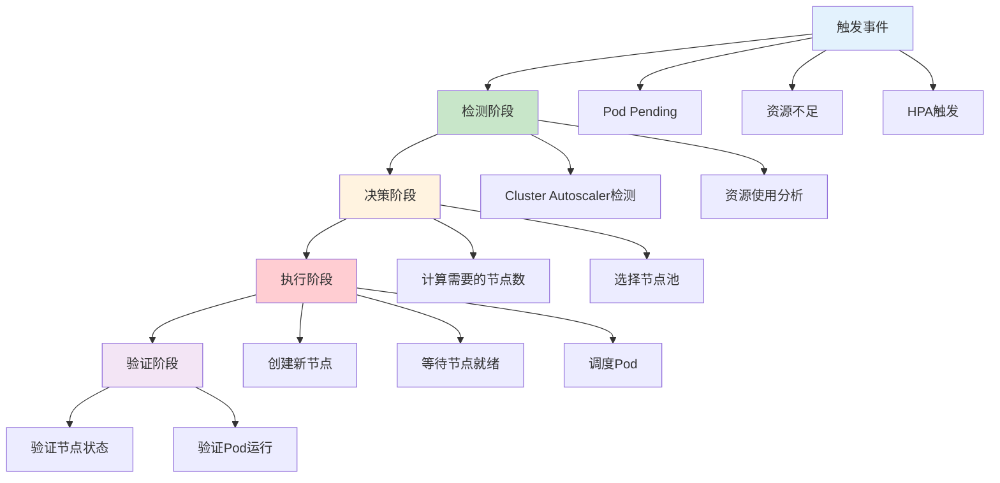
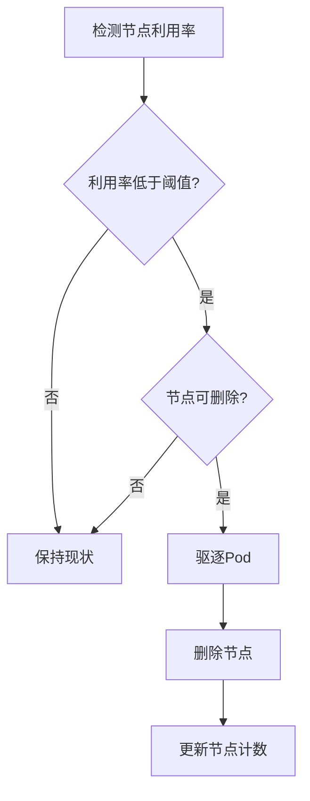

# K8S节点自动扩缩容策略：从触发到实现的完整指南

## 情境与背景

Kubernetes节点自动扩缩容是云原生架构的核心能力之一。作为高级DevOps/SRE工程师，需要掌握扩缩容触发机制、策略配置和最佳实践。本文从DevOps/SRE视角，深入讲解K8S节点扩缩容的完整流程和最佳实践。

## 一、扩缩容触发机制

### 1.1 触发类型

| 触发类型 | 说明 | 触发源 |
|:--------:|------|--------|
| **自动触发** | Cluster Autoscaler自动检测 | Pod调度失败、资源不足 |
| **HPA联动** | HPA扩容Pod后触发节点扩容 | 流量增长 |
| **手动触发** | 运维人员手动操作 | 预期流量峰值 |
| **定时触发** | 基于时间的自动扩容 | 周期性流量 |

### 1.2 触发流程



### 1.3 初始状态分析

**初始状态类型**：

| 状态 | 描述 | 触发行为 |
|:----:|------|----------|
| **正常状态** | 资源充足，Pod正常调度 | 无需扩容 |
| **资源紧张** | CPU/内存使用率超过阈值 | 触发告警，准备扩容 |
| **调度失败** | Pod处于Pending状态 | 立即触发扩容 |
| **流量激增** | HPA扩容Pod副本 | 联动触发节点扩容 |

## 二、Cluster Autoscaler配置

### 2.1 配置参数

```yaml
# Cluster Autoscaler配置
cluster_autoscaler:
  enabled: true
  
  min_nodes: 3
  max_nodes: 50
  
  scale_down:
    enabled: true
    delay_after_add: "10m"
    delay_after_delete: "5m"
    delay_after_failure: "3m"
    unneeded_time: "10m"
  
  scale_up:
    enabled: true
    delay: "0s"
    max_wait_time: "30m"
```

### 2.2 扩容策略

```yaml
# 扩容策略配置
scaling_policy:
  policies:
    - name: "default"
      min_replicas: 3
      max_replicas: 50
      scale_up:
        stabilization_window: "30s"
        select_policy: "Max"
        policies:
          - type: "Percent"
            value: 100
            period_seconds: 60
```

### 2.3 节点池配置

```yaml
# 节点池配置
node_pools:
  - name: "default-pool"
    min_nodes: 3
    max_nodes: 30
    instance_type: "c5.4xlarge"
    labels:
      role: "worker"
    taints: []
  
  - name: "high-memory-pool"
    min_nodes: 0
    max_nodes: 20
    instance_type: "r5.4xlarge"
    labels:
      role: "memory-intensive"
    taints:
      - key: "memory-intensive"
        value: "true"
        effect: "NoSchedule"
```

## 三、触发条件详解

### 3.1 Pod调度失败触发

**触发条件**：
```yaml
# 调度失败触发配置
scheduling_failure:
  enabled: true
  timeout: "10m"
  
  conditions:
    - reason: "InsufficientCPU"
    - reason: "InsufficientMemory"
    - reason: "InsufficientPods"
    - reason: "NodeSelectorMismatch"
```

**检测逻辑**：
1. 检查Pending状态的Pod
2. 判断是否是资源不足导致
3. 如果是，触发扩容

### 3.2 资源阈值触发

**阈值配置**：
```yaml
# 资源阈值配置
resource_thresholds:
  cpu:
    enabled: true
    threshold: 80
    duration: "5m"
  
  memory:
    enabled: true
    threshold: 85
    duration: "5m"
  
  storage:
    enabled: false
```

**触发逻辑**：
1. 持续监控节点资源使用率
2. 如果超过阈值持续指定时间
3. 触发扩容

### 3.3 HPA联动触发

**HPA配置**：
```yaml
# HPA配置
hpa:
  scaleTargetRef:
    apiVersion: "apps/v1"
    kind: "Deployment"
    name: "my-app"
  
  minReplicas: 1
  maxReplicas: 100
  
  metrics:
    - type: "Resource"
      resource:
        name: "cpu"
        targetAverageUtilization: 70
```

**联动流程**：
1. HPA检测到CPU使用率超过70%
2. HPA增加Pod副本数
3. Pod调度时发现资源不足
4. Cluster Autoscaler触发节点扩容

## 四、手动扩容与预扩容

### 4.1 手动扩容

**命令行操作**：
```bash
# 手动扩容节点池
kubectl scale nodegroup my-node-group --replicas=20

# 或者通过云厂商CLI
aws eks update-nodegroup-config \
  --cluster-name my-cluster \
  --nodegroup-name my-node-group \
  --scaling-config '{"minSize":5,"maxSize":30,"desiredSize":20}'
```

### 4.2 预扩容策略

**场景**：
- 大促活动
- 新品发布
- 预期流量峰值

**预扩容配置**：
```yaml
# 预扩容配置
pre_scaling:
  schedules:
    - name: "daily-peak"
      schedule: "0 9 * * *"
      min_nodes: 20
      max_nodes: 30
      duration: "4h"
    
    - name: "weekly-sale"
      schedule: "0 0 * * 6"
      min_nodes: 30
      max_nodes: 50
      duration: "24h"
```

## 五、缩容策略

### 5.1 缩容触发条件

```yaml
# 缩容配置
scale_down:
  enabled: true
  
  conditions:
    - type: "ResourceUtilization"
      threshold: 50
      duration: "10m"
    
    - type: "NodeUnderutilized"
      threshold: 30
      duration: "15m"
  
  protection:
    enabled: true
    taints:
      - "node.kubernetes.io/unschedulable"
    labels:
      - "node-role.kubernetes.io/control-plane"
```

### 5.2 缩容流程



## 六、实战案例分析

### 6.1 案例1：自动扩容场景

**场景描述**：
- 正常运行：3个节点
- 流量激增：HPA扩容Pod到20个
- 节点资源不足：Pod无法调度
- Cluster Autoscaler触发：扩容到10个节点

**配置**：
```yaml
# 自动扩容配置
cluster_autoscaler:
  min_nodes: 3
  max_nodes: 50
  
  scale_up:
    delay: "0s"
  
  scale_down:
    delay_after_add: "10m"
```

### 6.2 案例2：预扩容场景

**场景描述**：
- 大促活动前2小时预扩容
- 活动期间保持高节点数
- 活动结束后自动缩容

**配置**：
```yaml
# 预扩容配置
pre_scaling:
  schedule: "0 8 * * *"
  desired_size: 50
  duration: "6h"
```

## 七、监控与告警

### 7.1 监控指标

| 指标 | 说明 | 阈值 |
|:----:|------|------|
| `autoscaler_cluster_scaling_up` | 正在扩容的节点数 | >0 |
| `autoscaler_cluster_scaling_down` | 正在缩容的节点数 | >0 |
| `autoscaler_pending_pods` | Pending状态的Pod数 | >5 |
| `autoscaler_node_group_min_size` | 节点池最小节点数 | - |
| `autoscaler_node_group_max_size` | 节点池最大节点数 | - |

### 7.2 告警规则

```yaml
# 扩缩容告警规则
alerts:
  - name: "ClusterAutoscalerScalingUp"
    expr: "autoscaler_cluster_scaling_up > 0"
    for: "5m"
    labels:
      severity: "warning"
    annotations:
      summary: "Cluster Autoscaler is scaling up"
  
  - name: "PendingPodsHigh"
    expr: "autoscaler_pending_pods > 10"
    for: "10m"
    labels:
      severity: "critical"
    annotations:
      summary: "Too many pending pods"
```

## 八、面试1分钟精简版（直接背）

**完整版**：

节点扩容主要通过Cluster Autoscaler触发。最开始的情况通常是集群资源不足导致Pod调度失败，或者HPA（水平 Pod 自动扩缩容）触发Pod副本增加需要更多节点资源。当Pod处于Pending状态超过10分钟，或者节点CPU/内存使用率持续超过阈值（如CPU>80%、内存>85%持续5分钟），Cluster Autoscaler会自动触发节点扩容。同时我们也会根据业务预测进行手动预扩容，比如在大促活动前提前增加节点。

**30秒超短版**：

节点扩容由Cluster Autoscaler触发，最常见是Pod调度失败或资源不足。当Pending状态超过10分钟或资源超过阈值持续5分钟，就会自动扩容。也会手动预扩容应对预期峰值。

## 九、总结

### 9.1 核心要点

1. **触发机制**：Pod调度失败、资源不足、HPA联动、手动触发
2. **配置策略**：阈值设置、节点池配置、扩缩容延迟
3. **最佳实践**：预扩容应对峰值、监控告警、保护关键节点

### 9.2 扩缩容原则

| 原则 | 说明 |
|:----:|------|
| **自动化优先** | 依赖Cluster Autoscaler自动管理 |
| **弹性伸缩** | 根据实际负载动态调整 |
| **保护机制** | 防止误删关键节点 |
| **成本优化** | 及时缩容节省成本 |

### 9.3 记忆口诀

```
资源不足触发扩容，调度失败触发扩容，
HPA联动扩容，手动预扩容，
缩容要谨慎，保护关键节点。
```

> **参考链接**：[SRE运维面试题全解析：从理论到实践（第二部分）]()