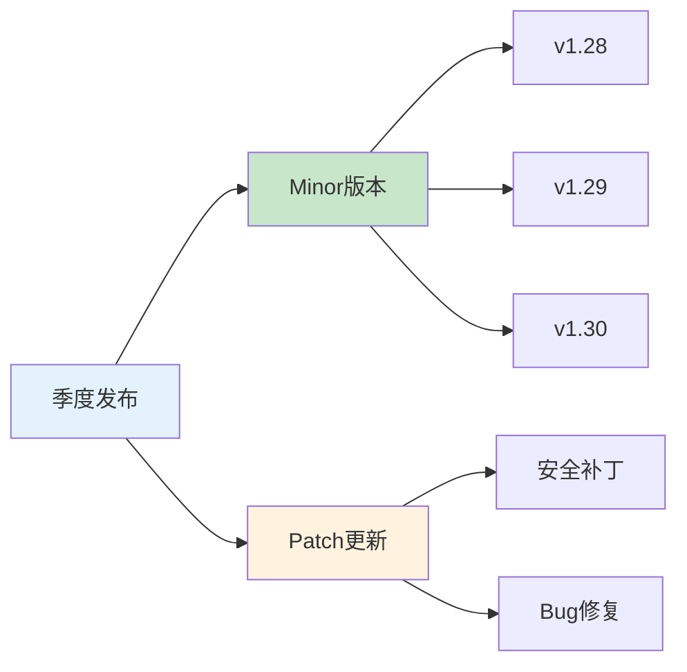
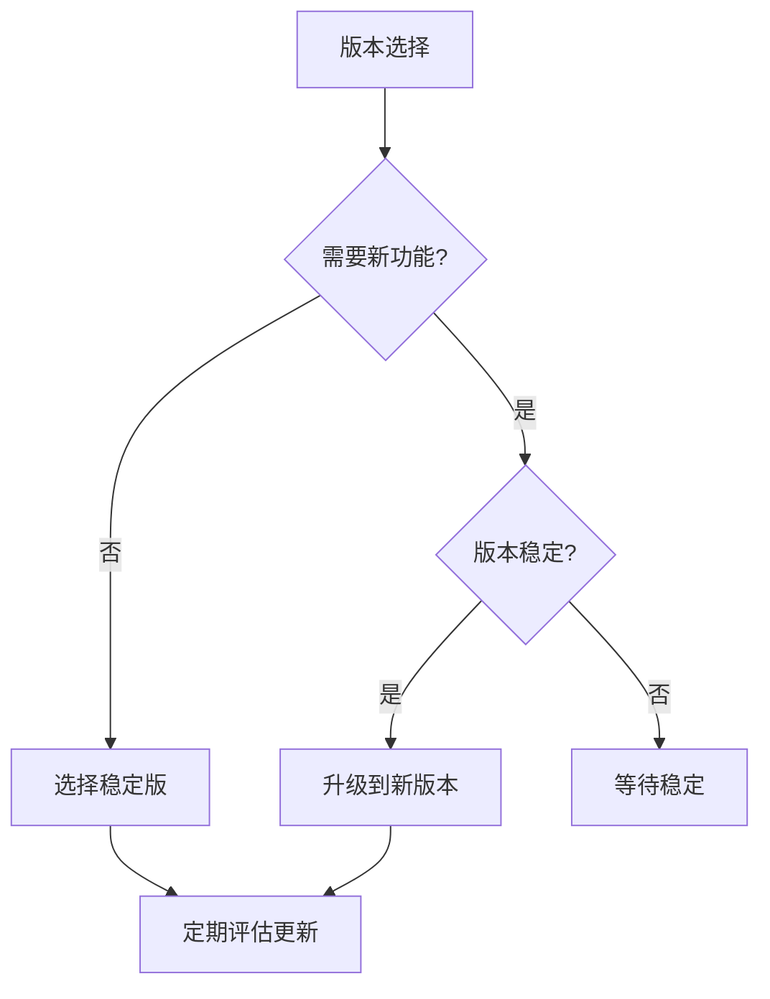

# K8S版本管理与升级策略：生产环境最佳实践

## 情境与背景

Kubernetes版本管理是生产环境运维的关键环节。作为高级DevOps/SRE工程师，需要掌握版本选择、升级策略和兼容性管理。本文从DevOps/SRE视角，深入讲解K8S版本管理的最佳实践。

## 一、K8S版本概述

### 1.1 版本命名规则

```
v1.30.0
 ^ ^ ^
 | | |
 | | +-- 补丁版本 (Patch)
 | +---- 次要版本 (Minor)
 +------ 主要版本 (Major)
```

### 1.2 版本类型

| 类型 | 说明 | 适用场景 |
|:----:|------|----------|
| **稳定版** | 经过充分测试 | 生产环境 |
| **测试版** | 功能预览 | 开发测试 |
| **Alpha** | 早期开发 | 内部测试 |
| **Beta** | 功能冻结 | 灰度验证 |

### 1.3 发布周期



## 二、版本选择策略

### 2.1 当前稳定版本

| 版本 | 发布时间 | 状态 | 推荐 |
|:----:|----------|:----:|:----:|
| v1.30 | 2024-04 | 稳定 | ✅ |
| v1.29 | 2023-12 | 稳定 | ⚠️ |
| v1.28 | 2023-08 | 即将结束支持 | ❌ |

### 2.2 版本选择考虑因素

**稳定性**：
- 选择发布后至少3个月的版本
- 查看社区反馈和已知问题

**兼容性**：
- API版本兼容性
- 插件和operator兼容性
- 第三方工具兼容性

**功能需求**：
- 新功能需求评估
- 性能改进需求
- 安全补丁需求

### 2.3 版本选择决策树



## 三、升级策略

### 3.1 升级路径

**推荐路径**：
```
v1.28 → v1.29 → v1.30
     ^     ^
     |     |
   允许   允许
```

**禁止路径**：
```
v1.28 → v1.30  ❌ 跳过超过1个次要版本
```

### 3.2 升级步骤

```yaml
# 升级流程
upgrade:
  steps:
    1. "备份数据"
    2. "升级控制平面"
    3. "升级工作节点"
    4. "验证集群状态"
    5. "升级插件"
```

### 3.3 控制平面升级

```yaml
# 控制平面升级配置
control_plane:
  components:
    - "kube-apiserver"
    - "kube-controller-manager"
    - "kube-scheduler"
    - "etcd"
  
  strategy:
    type: "rolling"
    max_unavailable: 1
    grace_period: "300s"
```

### 3.4 工作节点升级

```yaml
# 工作节点升级配置
worker_nodes:
  strategy:
    type: "drain"
    eviction_policy: "delete"
    drain_timeout: "5m"
    max_concurrent: 1
  
  steps:
    - "标记节点不可调度"
    - "驱逐Pod"
    - "升级kubelet"
    - "重启kubelet"
    - "标记节点可调度"
```

## 四、兼容性管理

### 4.1 API版本兼容性

**API版本生命周期**：

| 阶段 | 说明 | 示例 |
|:----:|------|------|
| Alpha | 实验性 | v1alpha1 |
| Beta | 测试中 | v1beta1 |
| Stable | 稳定 | v1 |

**废弃API处理**：

```yaml
# API版本检查
api_check:
  deprecated:
    - "extensions/v1beta1"
    - "apps/v1beta1"
  removed:
    - "v1beta1"
  
  migration:
    from: "v1beta1"
    to: "v1"
```

### 4.2 插件兼容性

**插件版本矩阵**：

| 插件 | v1.28 | v1.29 | v1.30 |
|:----:|:-----:|:-----:|:-----:|
| Calico | ✅ | ✅ | ✅ |
| Istio | ✅ | ✅ | ✅ |
| ArgoCD | ✅ | ✅ | ✅ |
| Prometheus | ✅ | ✅ | ✅ |

### 4.3 第三方工具兼容性

**工具版本要求**：

```yaml
# 工具版本配置
tools:
  kubectl:
    min_version: "1.30"
    recommended: "1.30"
  
  helm:
    min_version: "3.12"
    recommended: "3.14"
  
  terraform:
    min_version: "1.5"
    recommended: "1.6"
```

## 五、升级前准备

### 5.1 检查清单

```yaml
# 升级前检查清单
pre_check:
  - name: "集群健康检查"
    command: "kubectl get nodes"
    
  - name: "API版本检查"
    command: "kubectl api-resources"
    
  - name: "插件版本检查"
    command: "helm list"
    
  - name: "备份etcd"
    command: "etcdctl snapshot save"
    
  - name: "文档准备"
    document: "升级方案文档"
```

### 5.2 测试环境验证

**验证步骤**：
1. 在测试集群进行升级
2. 运行自动化测试
3. 验证业务功能
4. 性能测试

## 六、升级后验证

### 6.1 验证清单

```yaml
# 升级后验证清单
post_check:
  - name: "节点状态"
    expected: "Ready"
    
  - name: "Pod状态"
    expected: "Running"
    
  - name: "API服务"
    expected: "Healthy"
    
  - name: "日志检查"
    expected: "No errors"
    
  - name: "业务验证"
    expected: "正常运行"
```

### 6.2 回滚策略

```yaml
# 回滚策略
rollback:
  trigger:
    - "节点异常>30分钟"
    - "Pod异常>10分钟"
    - "业务中断>5分钟"
  
  steps:
    - "停止升级"
    - "回滚控制平面"
    - "回滚工作节点"
    - "验证集群状态"
```

## 七、实战案例分析

### 7.1 案例1：生产环境升级

**升级配置**：
```yaml
# 生产集群升级
cluster:
  name: "prod-cluster"
  current_version: "v1.29"
  target_version: "v1.30"
  
  upgrade_window: "off-peak"
  maintenance_time: "4 hours"
  
  strategy:
    control_plane: "rolling"
    worker_nodes: "drain"
  
  backup:
    enabled: true
    type: "etcd snapshot"
```

### 7.2 案例2：多集群升级

**升级顺序**：
1. 开发集群（先锋）
2. 测试集群（验证）
3. 生产集群（正式）

## 八、面试1分钟精简版（直接背）

**完整版**：

我们当前生产环境使用的是K8S v1.30版本。这个版本是目前的稳定版，我们每季度会评估版本更新，遵循不跳过超过1个次要版本的升级策略。升级前会在测试环境进行充分验证，确保API兼容性和插件兼容性，采用滚动升级方式，先升级控制平面再升级工作节点，确保业务不中断。同时我们也会关注社区动态，及时了解安全补丁和新功能。

**30秒超短版**：

生产环境用K8S v1.30稳定版，每季度评估更新，升级遵循不跳过1个次要版本原则，滚动升级控制平面和工作节点，升级前充分测试。

## 九、总结

### 9.1 核心要点

1. **版本选择**：选择发布后3个月以上的稳定版
2. **升级策略**：不跳过超过1个次要版本
3. **兼容性**：检查API、插件和工具兼容性
4. **验证**：升级前后充分测试验证

### 9.2 升级原则

| 原则 | 说明 |
|:----:|------|
| **循序渐进** | 逐步升级，不跳版本 |
| **充分测试** | 测试环境验证后再升级生产 |
| **备份优先** | 升级前备份数据 |
| **监控升级** | 升级过程实时监控 |

### 9.3 记忆口诀

```
版本选择要稳定，升级策略要谨慎，
兼容性先检查，测试验证不可少，
备份优先做，回滚策略要备好。
```

> **参考链接**：[SRE运维面试题全解析：从理论到实践（第二部分）]()