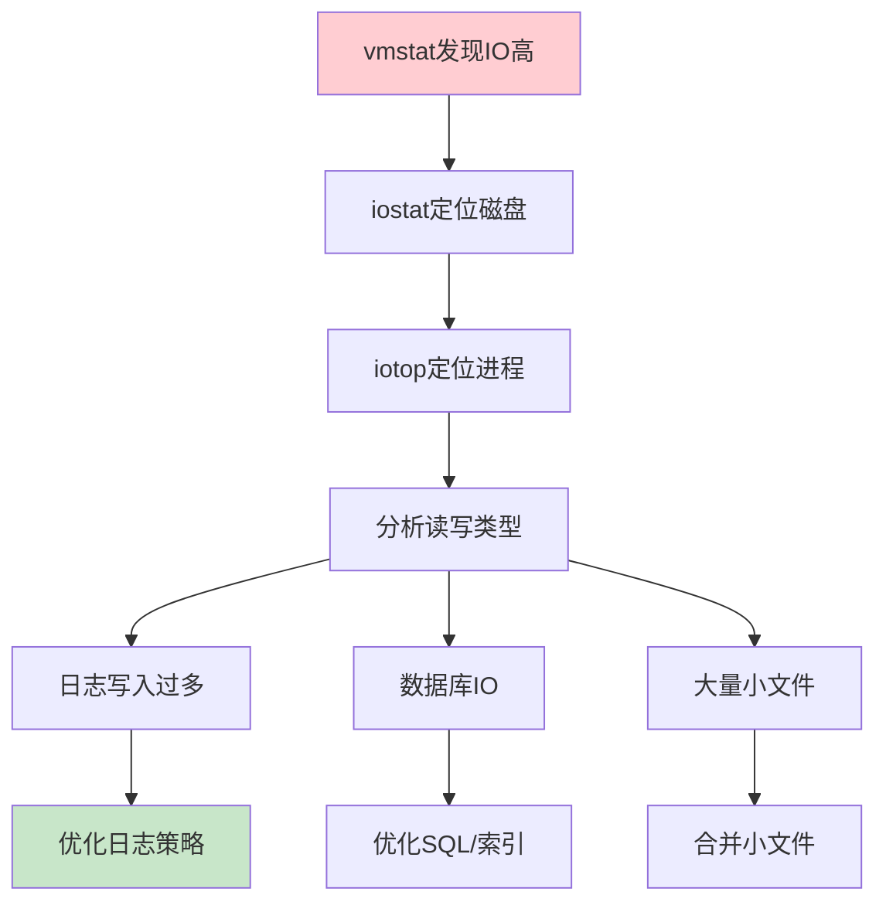
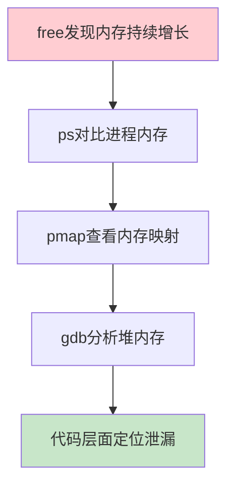
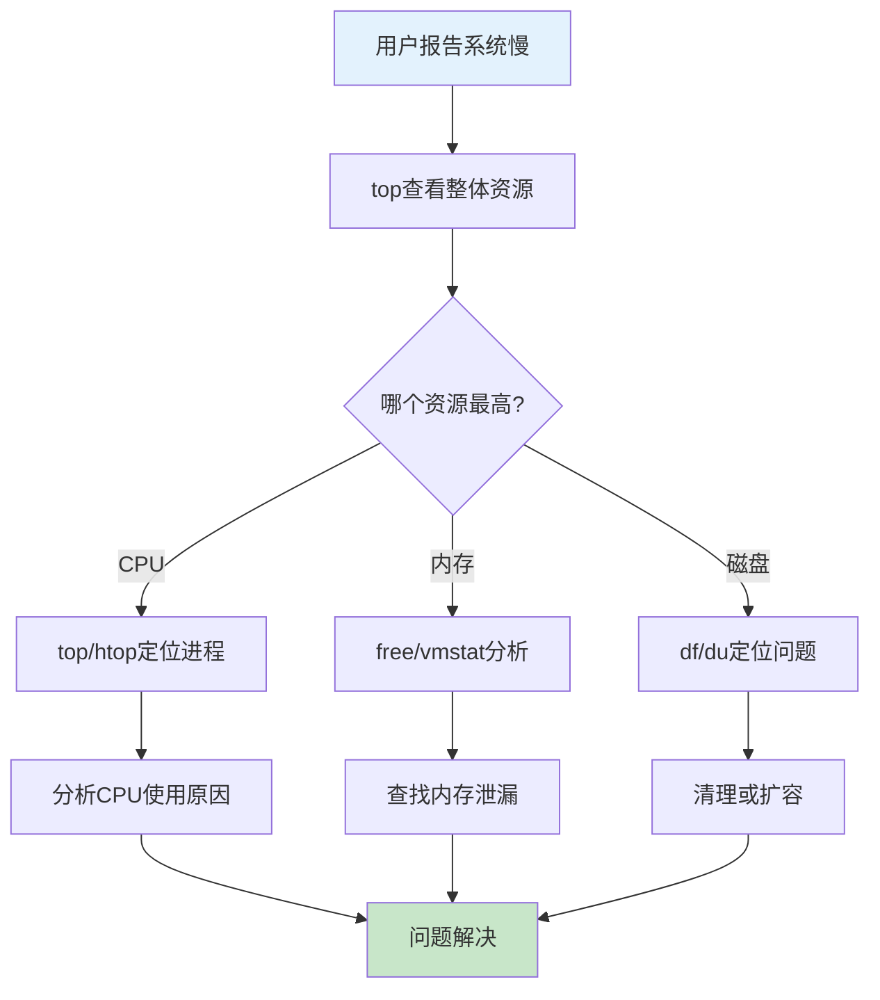

# Linux系统问题诊断与排查：从磁盘到OOM全攻略

## 情境与背景

Linux系统问题诊断是高级DevOps/SRE工程师的核心技能。磁盘满、CPU高、内存耗尽是生产环境中最高频的问题类型。本博客详细介绍各类问题的诊断思路、常用命令和解决方案，帮助你快速定位并解决生产环境问题。

## 一、磁盘问题诊断

### 1.1 磁盘空间问题

**问题现象**：
- 写入文件失败
- 应用报错"No space left on device"
- 日志无法写入

**诊断命令**：

```bash
# 1. 查看磁盘整体使用情况
df -h

# 2. 查看inode使用情况（有时磁盘有空间但inode用完）
df -i

# 3. 定位大文件和大目录
du -sh /* 2>/dev/null | sort -rh | head -10
du -sh /var/* 2>/dev/null | sort -rh | head -10

# 4. 查看打开的文件
lsof +L1  # 查看被删除但未释放的文件
lsof -p <pid>  # 查看特定进程打开的文件
```

**典型案例分析**：

```bash
# 案例1：日志文件过大
df -h
# Filesystem      Size  Used Avail Use% Mounted on
# /dev/sda1       100G   95G   5G  95% /

du -sh /var/log/*
# 89G   /var/log/nginx

# 解决：清理日志或配置日志轮转
truncate -s 0 /var/log/nginx/access.log
```

### 1.2 磁盘IO问题

**问题现象**：
- 系统响应慢
- IO wait高
- 应用程序延迟

**诊断命令**：

```bash
# 1. 查看磁盘IO情况
iostat -x 1 5

# 2. 查看进程IO使用
iotop -o

# 3. 查看具体进程IO
pidstat -d 1 5

# 4. 查看IO等待
vmstat 1 5
# procs -----------memory---------- ---swap-- -----io---- -system-- ------cpu-----
#  r  b   swpd   free   buff  cache   si   so    bi    bo   in   cs us sy id wa st
#  2  0      0 2048000 123456 789012    0    0     0     0 1000 2000 10  5 80  5  0
```

**IO问题排查流程**：



### 1.3 磁盘问题解决方案

**日志清理脚本**：

```bash
#!/bin/bash
# 日志清理脚本

LOG_DIR="/var/log"
MAX_SIZE="10G"
RETENTION_DAYS="7"

# 清理超过7天的日志
find $LOG_DIR -name "*.log.*" -mtime +$RETENTION_DAYS -exec rm -f {} \;

# 清理超过大小限制的日志
for log in $(find $LOG_DIR -name "*.log" -type f); do
    size=$(stat -f%z $log 2>/dev/null || stat -c%s $log)
    if [ $size -gt 10737418240 ]; then  # 10GB
        truncate -s 0 $log
        echo "$(date) truncated $log" >> /var/log/cleanup.log
    fi
done
```

**日志轮转配置**：

```bash
# /etc/logrotate.d/application
/var/log/app/*.log {
    daily
    rotate 14
    compress
    delaycompress
    missingok
    notifempty
    create 0644 app app
    postrotate
        systemctl reload app > /dev/null 2>&1 || true
    endscript
}
```

## 二、CPU问题诊断

### 2.1 CPU使用率高

**问题现象**：
- 系统响应慢
- 用户抱怨卡顿
- load average高

**诊断命令**：

```bash
# 1. 查看CPU整体使用情况
top
# 按1查看每核心，按shift+h查看线程，按t排序CPU

# 2. 查看CPU使用详情
mpstat -P ALL 1 5

# 3. 查看CPU负载
uptime
# load average: 5.23, 4.56, 3.21

# 4. 查看特定进程CPU使用
top -p <pid>

# 5. 查看进程线程CPU使用
ps -eLf | grep <pid>
```

**CPU高常见原因**：

| 原因类型 | 典型场景 | 解决方案 |
|:--------:|----------|----------|
| **业务高峰** | 正常负载上升 | 水平扩展 |
| **死循环** | 单线程100% | 代码优化 |
| **GC** | Java应用 | 调整JVM参数 |
| **加密/压缩** | CPU密集 | 升级硬件 |

### 2.2 进程CPU分析

**分析脚本**：

```bash
#!/bin/bash
# CPU问题排查脚本

echo "=== Top 10 CPU Processes ==="
ps aux --sort=-%cpu | head -11

echo -e "\n=== CPU Core Usage ==="
mpstat -P ALL 1 1 | grep -v "^$"

echo -e "\n=== Running Threads ==="
ps -eLf | awk '{print $2}' | sort | uniq -c | sort -rn | head -10

echo -e "\n=== Process Tree (Top CPU) ==="
pstree -p $(ps aux --sort=-%cpu | head -2 | awk 'NR==2 {print $2}')
```

### 2.3 CPU问题解决方案

**进程优先级调整**：

```bash
# 降低进程优先级
renice +10 -p <pid>

# 限制CPU使用率（cpulimit）
cpulimit -p <pid> -l 50  # 限制50%

# 使用cgroups限制
# /sys/fs/cgroup/cpu/app.slice/cpu.max
echo "50000 100000" > /sys/fs/cgroup/cpu/app.slice/cpu.max
```

## 三、内存问题诊断

### 3.1 内存使用率高

**问题现象**：
- 应用变慢
- OOM Killer触发
- Swap开始使用

**诊断命令**：

```bash
# 1. 查看内存使用情况
free -h

# 2. 查看详细内存信息
cat /proc/meminfo

# 3. 查看内存使用趋势
vmstat 1 10

# 4. 查看进程内存使用
ps aux --sort=-%mem | head -11

# 5. 查看OOM Killer日志
dmesg | grep -i "out of memory"
journalctl | grep -i "out of memory"
```

**内存分析命令详解**：

```bash
# free -h 输出解释
#               total        used        free      shared  buff/cache   available
# Mem:          125G        80Gi        10Gi       1Gi        35Gi        40Gi
# Swap:         16G        2Gi        14Gi

# 重要指标：
# available = free + buff/cache - 不可用部分
# buff/cache = 缓冲区 + 页缓存，可回收
```

### 3.2 内存泄漏排查

**排查流程**：



**排查命令**：

```bash
# 1. 查看进程内存使用
ps -eo pid,rss,vsz,comm --sort=-rss | head -11

# 2. 查看进程内存映射
pmap -x <pid> | sort -k3 -n -r | head -20

# 3. 查看内存分配
cat /proc/<pid>/status | grep -iVmRSS

# 4. 持续监控内存
while true; do
    date
    ps -eo pid,rss,comm --sort=-rss | head -6
    sleep 5
done
```

### 3.3 内存问题解决方案

**Swap配置优化**：

```bash
# 查看当前Swap配置
swapon -s

# 关闭Swap（生产环境谨慎）
swapoff -a

# 配置Swappiness（值越小越少使用Swap）
# 临时设置
sysctl vm.swappiness=10

# 永久设置
echo "vm.swappiness=10" >> /etc/sysctl.conf
```

**OOM Killer配置**：

```bash
# 查看OOM评分
cat /proc/<pid>/oom_score_adj
# 值范围：-1000到1000，越高越容易被杀

# 调整OOM评分
echo -500 > /proc/<pid>/oom_score_adj

# 永久禁用某用户进程被OOM
echo "<username> -1000" >> /etcoonf/oomd.conf
```

## 四、OOM问题深度解析

### 4.1 OOM Killer机制

**原理说明**：

```bash
# 内核日志中的OOM信息
[Thu Jan 15 10:23:45 2023] Out of memory: Kill process 12345 (java) score 856 or sacrifice child
[Thu Jan 15 10:23:45 2023] Killed process 12345 (java) total-vm:8234560kB, anon-rss:7890124kB, file-rss:0kB
```

**OOM触发条件**：
- 物理内存和Swap都用尽
- 内核无法分配所需内存
- 根据OOM评分选择进程杀死

### 4.2 OOM问题排查

**排查命令**：

```bash
# 1. 查看OOM历史
dmesg | grep -i "out of memory" | tail -20

# 2. 查看系统日志
journalctl -xb | grep -i oom

# 3. 查看被杀进程详情
dmesg | grep -i "killed process"

# 4. 查看内存变化趋势
sar -r 1 100
```

**OOM分析脚本**：

```bash
#!/bin/bash
# OOM问题分析脚本

echo "=== System Memory Info ==="
free -h

echo -e "\n=== Top 10 Memory Processes ==="
ps aux --sort=-%mem | head -11

echo -e "\n=== OOM Events (Last 50) ==="
dmesg | grep -i "out of memory" | tail -50

echo -e "\n=== OOM Score Configuration ==="
for pid in $(ps aux --sort=-%mem | head -11 | awk 'NR>1 {print $2}'); do
    score=$(cat /proc/$pid/oom_score 2>/dev/null)
    adj=$(cat /proc/$pid/oom_score_adj 2>/dev/null)
    cmd=$(ps -p $pid -o comm= 2>/dev/null)
    echo "PID: $pid, Score: $score, Adj: $adj, CMD: $cmd"
done
```

### 4.3 预防OOM措施

**应用层优化**：

```yaml
# Java JVM优化
java_opts:
  - "-Xms2g"  # 最小堆
  - "-Xmx4g"  # 最大堆
  - "-XX:+HeapDumpOnOutOfMemoryError"
  - "-XX:HeapDumpPath=/var/log/heapdump.hprof"
  - "-XX:+UseG1GC"
  - "-XX:MaxGCPauseMillis=200"

# Nginx worker_rlimit_nofile
worker_rlimit_nofile 65535;
worker_connections 10240;
```

**系统层优化**：

```bash
# /etc/sysctl.conf
vm.overcommit_memory = 1  # 允许过量使用
vm.swappiness = 10  # 减少swap倾向
vm.dirty_ratio = 60  # 脏页比例
vm.dirty_background_ratio = 5  # 后台写回比例
```

## 五、综合问题诊断流程

### 5.1 标准化诊断流程

**诊断流程图**：



### 5.2 快速诊断脚本

**一键诊断脚本**：

```bash
#!/bin/bash
# Linux系统快速诊断脚本

echo "============================================"
echo "Linux System Quick Diagnostic Report"
echo "============================================"
echo "Generated: $(date)"
echo ""

echo "=== System Overview ==="
uname -a
echo ""

echo "=== Uptime & Load ==="
uptime
echo ""

echo "=== CPU Usage ==="
mpstat 1 1 2>/dev/null || top -bn1 | head -5
echo ""

echo "=== Memory Usage ==="
free -h
echo ""

echo "=== Disk Usage ==="
df -h | grep -v "tmpfs\|devtmpfs\|loop"
echo ""

echo "=== Top 5 CPU Processes ==="
ps aux --sort=-%cpu | head -6
echo ""

echo "=== Top 5 Memory Processes ==="
ps aux --sort=-%mem | head -6
echo ""

echo "=== Recent OOM Events ==="
dmesg | grep -i "out of memory" | tail -5
echo ""

echo "=== IO Statistics ==="
iostat -x 1 1 2>/dev/null | head -10
echo ""

echo "============================================"
```

## 六、生产环境最佳实践

### 6.1 监控配置

**Prometheus监控指标**：

```yaml
# node_exporter配置
groups:
  - name: system-resources
    rules:
      - alert: HighCPU
        expr: 100 - (avg by(instance) (rate(node_cpu_seconds_total{mode="idle"}[5m]))) > 80
        for: 5m
        labels:
          severity: warning
          
      - alert: HighMemory
        expr: (1 - node_memory_MemAvailable_bytes / node_memory_MemTotal_bytes) > 0.85
        for: 5m
        labels:
          severity: warning
          
      - alert: DiskSpaceLow
        expr: (node_filesystem_avail_bytes{mountpoint="/"} / node_filesystem_size_bytes) < 0.1
        for: 5m
        labels:
          severity: critical
```

### 6.2 告警阈值建议

**告警阈值表**：

| 指标 | 警告阈值 | 严重阈值 | 说明 |
|:----:|:--------:|:--------:|------|
| **CPU使用率** | 70% | 85% | 持续5分钟 |
| **内存使用率** | 80% | 90% | 持续5分钟 |
| **磁盘使用率** | 80% | 90% | 立即告警 |
| **Load Average** | CPU核数*0.7 | CPU核数*0.85 | 持续5分钟 |
| **Swap使用率** | 50% | 80% | 持续5分钟 |

### 6.3 容量规划

**资源规划公式**：

```yaml
# 容量规划建议
capacity_planning:
  # 内存规划
  memory_per_node:
    system_reserved: "4GB"
    buffer: "10%"
    application_max: "节点内存 * 0.7"
    
  # CPU规划
  cpu_per_node:
    system_reserved: "2核"
    application_max: "节点CPU * 0.8"
    
  # 磁盘规划
  disk_per_node:
    root_partition: "100GB"
    data_partition: "根据业务定"
    reserved: "20%"
```

## 七、面试1分钟精简版（直接背）

**完整版**：

我常用这些命令处理Linux问题。磁盘问题用df看使用率，du定位大文件，lsof查看打开文件；IO高用iostat和iotop定位；CPU问题用top和htop，shift+h可看线程；内存问题用free看内存和swap，vmstat看虚拟内存；遇到OOM用dmesg查看内核日志。排查思路是：先看资源使用情况定位问题类型，再找具体进程或文件，最后分析原因并处理。

**30秒超短版**：

磁盘df/du/lsof，CPU top/htop，内存free/vmstat，OOM看dmesg。先定位问题类型，再找具体进程。

## 八、总结

### 8.1 命令速查表

| 问题类型 | 快速诊断 | 详细分析 |
|:--------:|:--------:|----------|
| **磁盘满** | `df -h` | `du -sh /*` |
| **磁盘IO** | `vmstat 1` | `iostat -x 1` |
| **CPU高** | `top` | `mpstat -P ALL` |
| **内存高** | `free -h` | `vmstat 1` |
| **OOM** | `dmesg \| grep oom` | `journalctl -xb` |

### 8.2 排查口诀

```
系统慢了top先看，CPU高用htop线，
内存满了free+vmstat，磁盘满了df/du/lsof，
IO高了iostat+iotop，OOM了dmesg找原因，
问题定位要精准，解决问题要对症。
```

### 8.3 最佳实践清单

```yaml
best_practices:
  - "配置好监控告警，提前发现资源问题"
  - "定期巡检资源使用情况"
  - "日志轮转配置，避免磁盘满"
  - "合理规划容量，预留余量"
  - "OOM分析定期做，优化配置"
  - "重要进程配置oom_score_adj"
```

> **参考链接**：[SRE运维面试题全解析：从理论到实践（第二部分）]()