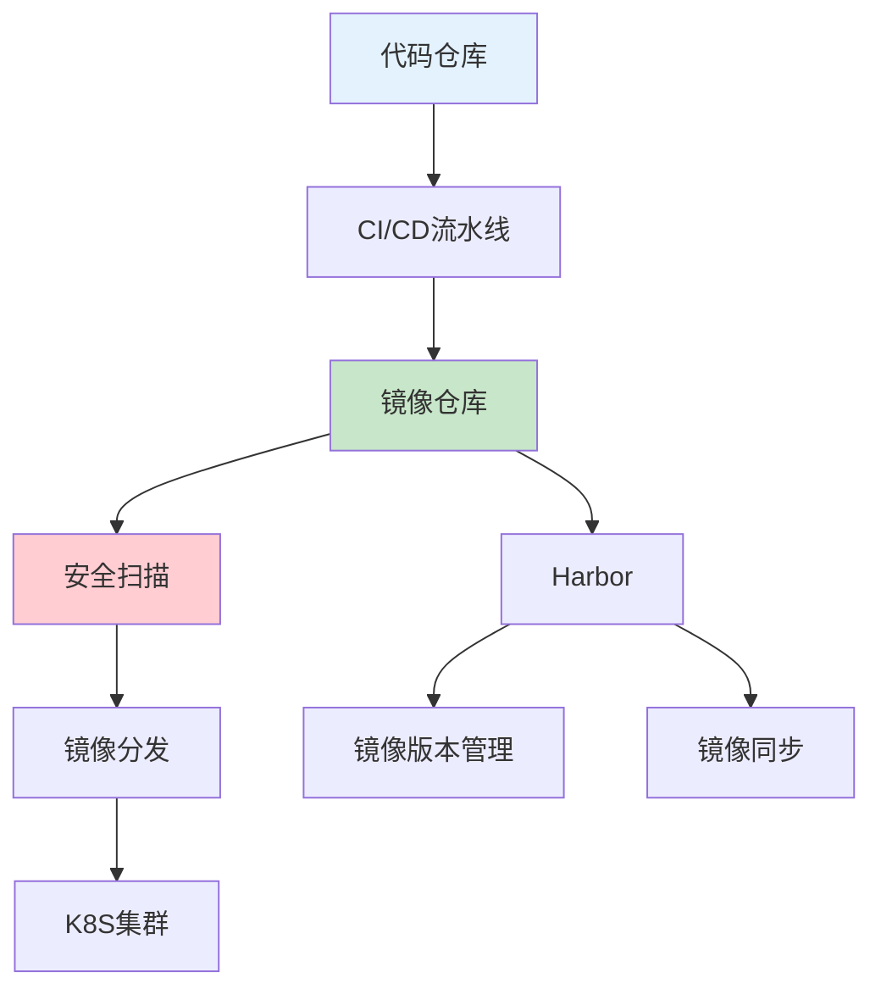

# 微服务镜像管理体系：构建、安全与分发最佳实践

## 情境与背景

在微服务架构和Kubernetes环境中，镜像管理是DevOps流水线的核心环节。作为高级DevOps/SRE工程师，需要掌握镜像构建、基础镜像管理、镜像安全等全流程最佳实践。本文从DevOps/SRE视角，详细讲解微服务镜像管理体系的设计与实现。

## 一、镜像管理体系架构

### 1.1 体系架构

**架构设计**：



### 1.2 组件组成

**组件清单**：

| 组件 | 功能 | 工具 |
|:----:|------|------|
| **代码仓库** | 代码存储 | GitLab/GitHub |
| **CI/CD** | 镜像构建 | Jenkins/ArgoCD |
| **镜像仓库** | 镜像存储 | Harbor |
| **安全扫描** | 漏洞检测 | Trivy/Grype |
| **镜像分发** | 集群同步 | ChartMuseum |

## 二、镜像构建管理

### 2.1 Dockerfile最佳实践

**标准化Dockerfile模板**：
```dockerfile
# 多阶段构建示例
FROM eclipse-temurin:11-jre-jammy AS builder
WORKDIR /build
COPY pom.xml .
COPY src ./src
RUN apt-get update && apt-get install -y maven
RUN mvn package -DskipTests

FROM eclipse-temurin:11-jre-jammy
# 设置非root用户
RUN groupadd -r appgroup && useradd -r -g appgroup appuser
# 复制文件
COPY --from=builder /build/target/*.jar /app/app.jar
# 设置权限
RUN chown -R appuser:appgroup /app
# 切换用户
USER appuser
WORKDIR /app
# 健康检查
HEALTHCHECK --interval=30s --timeout=3s CMD curl -f http://localhost:8080/health || exit 1
EXPOSE 8080
ENTRYPOINT ["java", "-jar", "app.jar"]
```

### 2.2 CI/CD流水线配置

**Jenkins流水线**：
```groovy
// Jenkinsfile
pipeline {
    agent any
    
    environment {
        REGISTRY = 'harbor.example.com'
        PROJECT = 'microservices'
        DOCKER_IMAGE = "${REGISTRY}/${PROJECT}/${SERVICE_NAME}"
    }
    
    stages {
        stage('Build') {
            steps {
                script {
                    def imageTag = "${DOCKER_IMAGE}:${BUILD_NUMBER}-${GIT_COMMIT[0..7]}"
                    sh """
                        docker build -t ${imageTag} .
                        docker tag ${imageTag} ${DOCKER_IMAGE}:latest
                    """
                }
            }
        }
        
        stage('Security Scan') {
            steps {
                sh """
                    trivy image --severity HIGH,CRITICAL ${DOCKER_IMAGE}:${BUILD_NUMBER} || true
                """
            }
        }
        
        stage('Push') {
            steps {
                sh """
                    docker push ${DOCKER_IMAGE}:${BUILD_NUMBER}
                    docker push ${DOCKER_IMAGE}:latest
                """
            }
        }
        
        stage('Deploy to K8S') {
            steps {
                sh """
                    kubectl set image deployment/${SERVICE_NAME} ${SERVICE_NAME}=${DOCKER_IMAGE}:${BUILD_NUMBER}
                """
            }
        }
    }
}
```

## 三、基础镜像管理

### 3.1 基础镜像版本策略

**版本命名规范**：
```yaml
# 镜像标签策略
image_tags:
  major: "11"           # 主版本号（重大变更）
  minor: "11.0"         # 次版本号（功能变更）
  patch: "11.0.0"       # 补丁版本号（Bug修复）
  date: "20240508"      # 日期标签
  commit: "a1b2c3d"     # 提交哈希
```

**镜像更新策略**：
```yaml
# 基础镜像更新策略
update_policy:
  frequency: "monthly"  # 每月更新
  severity: "HIGH,CRITICAL"  # 紧急修复立即更新
  testing: "staging验证"  # 验证后发布
```

### 3.2 基础镜像仓库配置

**Harbor配置**：
```yaml
# Harbor项目配置
harbor:
  projects:
    - name: "base-images"
      visibility: "public"
      storage_quota: "5Ti"
      
  repositories:
    - name: "base-images/java"
      tags: ["11-jre", "11-jre-alpine", "17-jre", "17-jre-alpine"]
      
    - name: "base-images/python"
      tags: ["3.10", "3.10-alpine", "3.11", "3.11-alpine"]
      
    - name: "base-images/node"
      tags: ["18", "18-alpine", "20", "20-alpine"]
```

### 3.3 自动化更新流程

**自动化更新配置**：
```yaml
# Renovate配置
renovate:
  enabled: true
  schedule: "on the 1st and 15th day of the month"
  
  packageRules:
    - matchDatasources: ["docker"]
      matchPackageNames: ["eclipse-temurin", "python", "node"]
      automerge: false
      versioning: "semver"
```

## 四、镜像安全

### 4.1 安全扫描配置

**Trivy扫描配置**：
```yaml
# Trivy配置
trivy:
  enabled: true
  
  scan:
    severity: "HIGH,CRITICAL"
    ignore_unfixed: false
    format: "json"
    
  actions:
    on_high:
      block_deployment: true
      notify: ["slack", "email"]
      
    on_critical:
      block_deployment: true
      notify: ["pagerduty", "slack", "email"]
```

### 4.2 镜像签名与验证

**Cosign签名配置**：
```bash
# 签名镜像
cosign sign --key cosign.key harbor.example.com/base-images/java:11

# 验证镜像
cosign verify --key cosign.pub harbor.example.com/base-images/java:11
```

### 4.3 安全策略配置

**Harbor策略配置**：
```yaml
# Harbor安全策略
security:
  prevent_vulnerable_images:
    enabled: true
    severity: "HIGH"
    
  prevent_non_official_images:
    enabled: false
    
  scan_on_push:
    enabled: true
    severity: "HIGH,CRITICAL"
```

## 五、镜像分发

### 5.1 多集群镜像同步

**镜像同步配置**：
```yaml
# 镜像同步配置
sync:
  source:
    registry: "harbor.example.com"
    project: "microservices"
    
  targets:
    - registry: "harbor-prod.example.com"
      project: "microservices"
      
    - registry: "harbor-dr.example.com"
      project: "microservices"
      
  schedule: "0 0 * * *"  # 每日同步
  tags:
    - "latest"
    - "v*"
```

### 5.2 离线镜像分发

**离线导出脚本**：
```bash
#!/bin/bash
# 离线镜像导出脚本

IMAGES=(
    "harbor.example.com/base-images/java:11-jre"
    "harbor.example.com/base-images/python:3.10"
    "harbor.example.com/microservices/api-gateway:latest"
)

OUTPUT_DIR="/mnt/offline-images"

for image in "${IMAGES[@]}"; do
    echo "Exporting $image..."
    docker pull $image
    docker save -o "${OUTPUT_DIR}/$(echo $image | tr '/:' '-').tar" $image
done

echo "Creating tarball..."
tar -czvf images.tar.gz -C $OUTPUT_DIR .
```

## 六、最佳实践

### 6.1 镜像构建最佳实践

**实践清单**：
```yaml
# Dockerfile最佳实践清单
best_practices:
  - "使用官方基础镜像"
  - "使用特定版本标签，不用latest"
  - "使用多阶段构建减少镜像大小"
  - "使用非root用户运行"
  - "添加健康检查"
  - "清理不必要的文件"
  - "使用.dockerignore"
  - "利用构建缓存"
```

### 6.2 镜像版本管理

**版本管理策略**：
```yaml
# 版本管理策略
version_management:
  naming: "{service}-{version}-{commit}"
  
  tags:
    latest: "最新稳定版本"
    stable: "经过验证的版本"
    commit: "特定提交版本"
    
  retention:
    keep_last: 10
    keep_days: 90
    keep_tags: ["latest", "stable"]
```

### 6.3 团队分工

**职责分工表**：

| 团队 | 职责 | 权限 |
|:----:|------|------|
| **开发团队** | 业务代码、Dockerfile | 读写项目镜像 |
| **DevOps团队** | CI/CD流水线、基础镜像 | 读写所有镜像 |
| **运维团队** | 安全扫描、策略配置 | 管理策略、审计日志 |

## 七、实战案例分析

### 7.1 案例1：基础镜像安全漏洞处理

**场景描述**：
- 安全扫描发现OpenSSL漏洞
- 影响所有使用该基础镜像的服务

**处理流程**：
```bash
# 1. 扫描受影响镜像
trivy image --severity HIGH,CRITICAL harbor.example.com/base-images/java:11

# 2. 更新基础镜像
docker build -t harbor.example.com/base-images/java:11.0.1 .

# 3. 重新构建受影响服务
jenkins build job=service-rebuild

# 4. 验证并推送
docker push harbor.example.com/base-images/java:11.0.1
```

### 7.2 案例2：多集群镜像同步

**场景描述**：
- 需要将镜像同步到3个K8S集群
- 跨地域同步

**配置方案**：
```yaml
# 多集群同步配置
sync:
  clusters:
    - name: "prod-us"
      registry: "harbor-us.example.com"
      
    - name: "prod-eu"
      registry: "harbor-eu.example.com"
      
    - name: "prod-asia"
      registry: "harbor-asia.example.com"
```

## 八、面试1分钟精简版（直接背）

**完整版**：

微服务镜像的分工是这样的：开发团队负责业务代码编写，DevOps团队负责Dockerfile编写和CI/CD流水线配置，运维团队负责基础镜像的维护和管理。基础镜像我们采用Harbor进行统一管理，配置了镜像版本标签策略，每个基础镜像都有版本号和安全补丁日期标签。镜像安全方面，我们使用Trivy进行漏洞扫描，发现高危漏洞会自动告警并阻止部署。基础镜像每月更新一次，确保包含最新的安全补丁。

**30秒超短版**：

开发写代码，DevOps写Dockerfile和CI/CD，运维维护基础镜像。Harbor统一管理，Trivy扫描漏洞，基础镜像每月更新。

## 九、总结

### 9.1 核心要点

1. **分层构建**：多阶段构建减少镜像大小
2. **版本管理**：规范化版本标签策略
3. **安全扫描**：Trivy/Grype漏洞扫描
4. **镜像签名**：Cosign签名验证
5. **自动同步**：多集群镜像同步

### 9.2 管理原则

| 原则 | 说明 |
|:----:|------|
| **安全第一** | 漏洞扫描、签名验证 |
| **版本规范** | 规范化命名和标签 |
| **自动化** | CI/CD流水线自动构建 |
| **可追溯** | 完整的审计日志 |

### 9.3 记忆口诀

```
开发写代码，DevOps写Dockerfile，
运维维护基础镜像，Harbor统一管理，
Trivy扫描漏洞，版本管理用Tag，
镜像签名要验证，多集群同步分发。
```

> **参考链接**：[SRE运维面试题全解析：从理论到实践（第二部分）]()