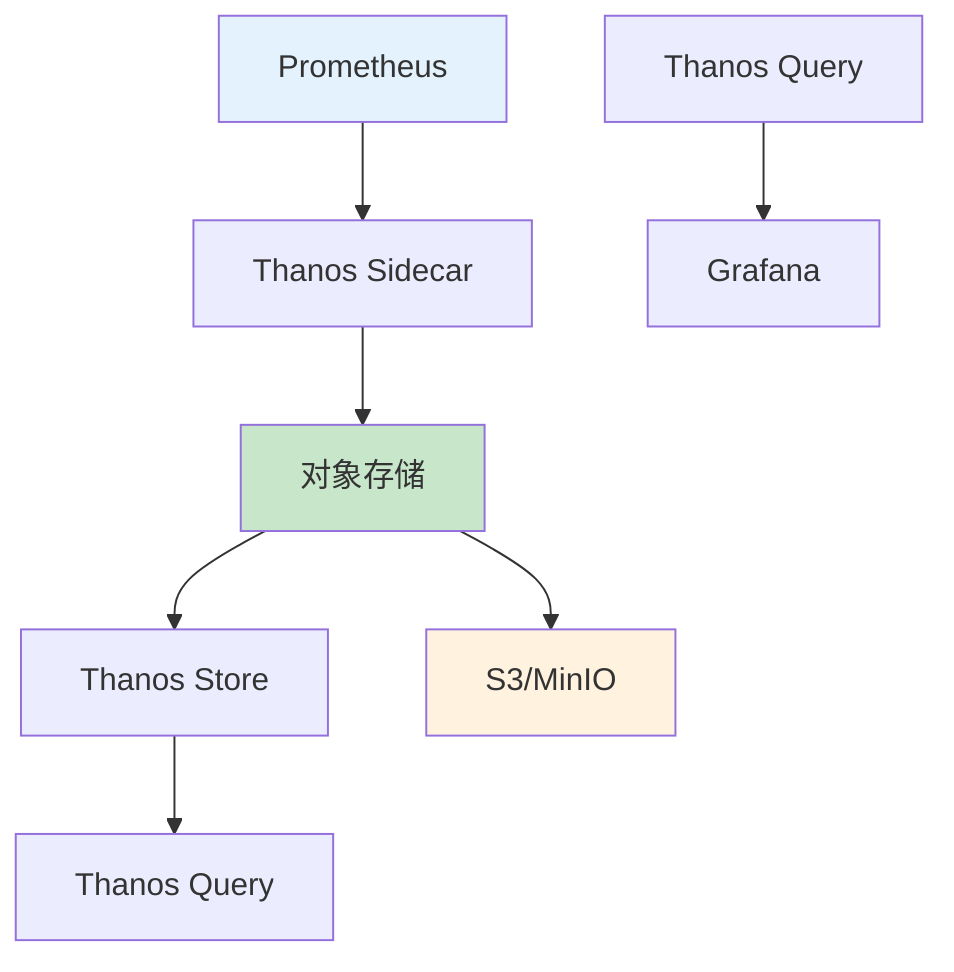

# K8S监控存储方案：从本地到Thanos全解析

## 情境与背景

监控数据是企业运维的重要资产，数据量大、增长快、查询频繁是监控存储的主要特点。作为高级DevOps/SRE工程师，需要深入理解各种监控存储方案的优缺点，选择适合业务场景的方案。本文从实战角度详细讲解K8S监控存储的完整方案。

## 一、监控存储需求分析

### 1.1 数据特点

**监控数据特征**：

```yaml
# 监控数据特征
data_characteristics:
  volume:
    per_pod: "约100MB/天"
    cluster_100_pods: "约10GB/天"
    retention_90d: "约900GB"
    
  velocity:
    scrape_interval: "15秒"
    samples_per_minute: "4"
    per_metric_per_hour: "240"
    
  variety:
    metrics: "基础设施+应用+业务"
    cardinality: "高基数问题"
```

### 1.2 存储需求

**存储需求分类**：

| 需求类型 | 说明 | 时间范围 |
|:--------:|------|----------|
| **热数据** | 高频查询 | 0-2天 |
| **温数据** | 中频查询 | 2-30天 |
| **冷数据** | 低频查询 | 30-90天 |

## 二、存储方案对比

### 2.1 本地存储

**HostPath/EmptyDir**：
```yaml
# HostPath存储配置
apiVersion: v1
kind: Pod
metadata:
  name: prometheus
spec:
  containers:
    - name: prometheus
      volumeMounts:
        - name: prometheus-storage
          mountPath: /data
  volumes:
    - name: prometheus-storage
      hostPath:
        path: /data/prometheus
        type: DirectoryOrCreate
```

**适用场景**：
- 开发/测试环境
- 单节点集群
- 临时监控需求

### 2.2 PV/PVC存储

**持久化存储配置**：
```yaml
# PVC配置
apiVersion: v1
kind: PersistentVolumeClaim
metadata:
  name: prometheus-data
  namespace: monitoring
spec:
  accessModes:
    - ReadWriteOnce
  resources:
    requests:
      storage: 100Gi
  storageClassName: fast
---
# Prometheus配置使用PVC
apiVersion: apps/v1
kind: Deployment
metadata:
  name: prometheus
  namespace: monitoring
spec:
  template:
    spec:
      containers:
        - name: prometheus
          volumeMounts:
            - name: prometheus-data
              mountPath: /data
      volumes:
        - name: prometheus-data
          persistentVolumeClaim:
            claimName: prometheus-data
```

### 2.3 Thanos存储架构

**Thanos架构**：



**Thanos组件**：

| 组件 | 功能 | 说明 |
|:----:|------|------|
| **Sidecar** | 数据上传 | 将Prometheus数据上传到对象存储 |
| **Store** | 数据查询 | 从对象存储读取历史数据 |
| **Query** | 统一查询 | 聚合多个数据源的查询 |
| **Receive** | 接收数据 | 接收远程写入的数据 |
| **Rule** | 告警规则 | 分布式告警 |

### 2.4 存储方案对比表

**方案对比**：

| 方案 | 存储容量 | 查询性能 | 成本 | 适用场景 |
|:----:|:--------:|:--------:|:----:|----------|
| **本地存储** | 受限单节点 | 最高 | 低 | 开发测试 |
| **PV/PVC** | 可扩展 | 高 | 中 | 中小规模 |
| **Thanos+S3** | 无限扩展 | 中 | 低 | 大规模生产 |
| **InfluxDB** | 可扩展 | 高 | 高 | 时序数据专用 |

## 三、Thanos部署配置

### 3.1 Prometheus配置

**Prometheus配置**：
```yaml
# prometheus.yaml
global:
  scrape_interval: 15s
  evaluation_interval: 15s
  external_labels:
    cluster: 'prod'
    replica: '$(HOSTNAME)'

storage:
  tsdb:
    path: /data
    retention.time: 15d

alerting:
  alertmanagers:
    - static_configs:
        - targets:
            - alertmanager.monitoring:9093
```

### 3.2 Thanos Sidecar配置

**Sidecar配置**：
```yaml
# Thanos Sidecar
apiVersion: apps/v1
kind: Deployment
metadata:
  name: prometheus
  namespace: monitoring
spec:
  replicas: 1
  selector:
    matchLabels:
      app: prometheus
  template:
    metadata:
      labels:
        app: prometheus
    spec:
      containers:
        - name: prometheus
          image: prom/prometheus:latest
          args:
            - '--config.file=/etc/prometheus/prometheus.yml'
            - '--storage.tsdb.path=/data'
            - '--storage.tsdb.retention.time=15d'
            - '--web.enable-lifecycle'
          volumeMounts:
            - name: config
              mountPath: /etc/prometheus
            - name: data
              mountPath: /data
        - name: thanos-sidecar
          image: quay.io/thanos/thanos:v0.34.0
          args:
            - sidecar
            - '--prometheus.url=http://localhost:9090'
            - '--objstore.config-file=/etc/thanos/object-storage.yaml'
            - '--tsdb.path=/data'
          volumeMounts:
            - name: data
              mountPath: /data
            - name: object-storage
              mountPath: /etc/thanos
      volumes:
        - name: config
          configMap:
            name: prometheus-config
        - name: data
          persistentVolumeClaim:
            claimName: prometheus-data
        - name: object-storage
          secret:
            secretName: thanos-object-storage
```

### 3.3 对象存储配置

**MinIO配置**：
```yaml
# object-storage.yaml
type: S3
config:
  bucket: "thanos"
  endpoint: "minio.monitoring:9000"
  access_key: "minioadmin"
  secret_key: "minioadmin"
  insecure: false
  signature_version2: false
```

**MinIO部署**：
```yaml
apiVersion: apps/v1
kind: StatefulSet
metadata:
  name: minio
  namespace: monitoring
spec:
  serviceName: minio
  replicas: 4
  selector:
    matchLabels:
      app: minio
  template:
    metadata:
      labels:
        app: minio
    spec:
      containers:
        - name: minio
          image: minio/minio:latest
          args:
            - server
            - http://minio-{0...3}.minio.monitoring:9000/data
            - --console-address
            - ":9001"
          env:
            - name: MINIO_ROOT_USER
              value: "minioadmin"
            - name: MINIO_ROOT_PASSWORD
              value: "minioadmin"
          ports:
            - containerPort: 9000
            - containerPort: 9001
          volumeMounts:
            - name: data
              mountPath: /data
  volumeClaimTemplates:
    - metadata:
        name: data
      spec:
        accessModes: ["ReadWriteOnce"]
        resources:
          requests:
            storage: 100Gi
```

### 3.4 Thanos Query配置

**Query配置**：
```yaml
apiVersion: apps/v1
kind: Deployment
metadata:
  name: thanos-query
  namespace: monitoring
spec:
  replicas: 2
  selector:
    matchLabels:
      app: thanos-query
  template:
    metadata:
      labels:
        app: thanos-query
    spec:
      containers:
        - name: thanos
          image: quay.io/thanos/thanos:v0.34.0
          args:
            - query
            - '--store=prometheus:10901'
            - '--store=thanos-store:10901'
            - '--grpc-grpc-server.tls-enabled=false'
          ports:
            - containerPort: 10901
            - containerPort: 10902
          resources:
            requests:
              cpu: 100m
              memory: 256Mi
            limits:
              cpu: 1000m
              memory: 1Gi
```

## 四、数据生命周期管理

### 4.1 降采样配置

**降采样策略**：
```yaml
# 降采样配置
downsampling:
  enabled: true
  
  rules:
    - name: "5m"
      duration: "5m"  # 保留5分钟原始数据
      resolution: "raw"
      
    - name: "1h"
      duration: "90d"  # 90天后降为1小时
      resolution: "5m"
      
    - name: "1d"
      duration: "365d"  # 1年后降为1天
      resolution: "1h"
```

### 4.2 数据压缩

**压缩配置**：
```yaml
# Thanos Compactor
apiVersion: apps/v1
kind: Deployment
metadata:
  name: thanos-compactor
  namespace: monitoring
spec:
  selector:
    matchLabels:
      app: thanos-compactor
  template:
    metadata:
      labels:
        app: thanos-compactor
    spec:
      containers:
        - name: thanos
          image: quay.io/thanos/thanos:v0.34.0
          args:
            - compact
            - '--data-dir=/data'
            - '--objstore.config-file=/etc/thanos/object-storage.yaml'
            - '--wait'
            - '--downsampling.disable'
          volumeMounts:
            - name: data
              mountPath: /data
            - name: object-storage
              mountPath: /etc/thanos
          resources:
            requests:
              cpu: 500m
              memory: 1Gi
            limits:
              cpu: 2000m
              memory: 2Gi
```

## 五、最佳实践

### 5.1 存储容量规划

**容量计算公式**：
```yaml
# 容量计算
capacity_calculation:
  # 单个指标每天大小
  per_metric_daily: "约100bytes * 4 samples/min * 60 min * 24h = 5.76MB"
  
  # 指标数量估算
  metrics_per_pod: 500
  pods: 100
  
  # 存储需求
  daily_total: "5.76MB * 500 * 100 = 288GB/天"
  
  # 90天存储
  retention_90d: "288GB * 90 = 25.9TB"
  
  # 预留余量
  buffer: 1.3
  total_storage: "25.9TB * 1.3 = 33.7TB"
```

### 5.2 性能优化

**性能优化配置**：
```yaml
# Prometheus性能优化
prometheus:
  resources:
    requests:
      cpu: "2"
      memory: "4Gi"
    limits:
      cpu: "4"
      memory: "8Gi"
      
  storage:
    tsdb:
      path: "/data"
      retention:
        time: "15d"
        
  query:
    max_samples: 10000000
    timeout: "2m"
```

### 5.3 监控告警

**存储监控配置**：
```yaml
# Prometheus告警规则
groups:
  - name: monitoring-storage-alerts
    rules:
      - alert: PrometheusStorageRunningOut
        expr: |
          (prometheus_tsdb_storage_blocks_bytes / 1024 / 1024 / 1024) < 10
        for: 5m
        labels:
          severity: critical
        annotations:
          summary: "Prometheus存储空间不足"
          
      - alert: ThanosObjectStorageLatency
        expr: |
          thanos_objstore_bucket_operation_duration_seconds > 2
        for: 5m
        labels:
          severity: warning
```

## 六、故障排查

### 6.1 常见问题

**问题与解决方案**：

| 问题 | 原因 | 解决 |
|------|------|------|
| **存储满** | 数据保留过长 | 调整保留策略 |
| **查询慢** | 数据量大 | 启用降采样 |
| **上传失败** | 网络问题 | 检查网络 |
| **数据丢失** | PV问题 | 启用备份 |

### 6.2 排查命令

**排查方法**：
```bash
# 检查存储使用
kubectl exec -it prometheus-0 -n monitoring -- df -h /data

# 检查Prometheus存储
curl -s http://prometheus:9090/api/v1/status/tsdb | jq

# 检查Thanos状态
thanos tools bucket verify --objstore.config-file=/etc/thanos/object-storage.yaml

# 检查上传状态
curl -s http://thanos-sidecar:10902/metrics | grep thanos
```

## 七、面试1分钟精简版（直接背）

**完整版**：

监控存储我们采用Thanos加对象存储的方案。Prometheus本地存储监控数据，通过Sidecar将数据定期上传到S3兼容存储（MinIO），实现长期存储和高可用。热数据保留在本地SSD上保障查询性能，温数据存储在对象存储降低成本。这套方案支持90天数据存储，同时通过压缩和降采样优化存储成本。查询时通过Thanos Query进行统一查询，对应用透明。

**30秒超短版**：

Thanos加对象存储，本地存热数据，S3存温数据，压缩降采样优化成本。

## 八、总结

### 8.1 方案选择指南

| 场景 | 推荐方案 |
|------|----------|
| 开发测试 | 本地存储 |
| 中小生产 | PV/PVC |
| 大规模生产 | Thanos+S3 |
| 超大规模 | Thanos+对象存储+CDN |

### 8.2 配置原则

| 原则 | 说明 |
|:----:|------|
| **分层存储** | 热数据本地，温数据对象存储 |
| **容量规划** | 根据指标数量和保留期计算 |
| **性能优先** | SSD优先，本地存储优先 |
| **成本优化** | 降采样+压缩 |

### 8.3 记忆口诀

```
开发用本地，生产用PV，
大规模用Thanos，冷热数据分层存，
压缩降采样，成本最优控。
```

> **参考链接**：[SRE运维面试题全解析：从理论到实践（第二部分）]()