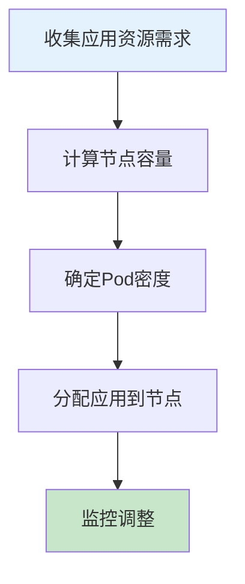

# K8S节点Pod数量规划：从原理到生产环境实践

## 情境与背景

在Kubernetes生产环境中，合理规划每个节点运行的Pod数量是保障集群稳定性和优化资源利用率的关键。作为高级DevOps/SRE工程师，需要深入理解影响Pod数量的因素，掌握科学的规划方法。本文从实战角度详细讲解K8S节点Pod数量规划的完整方案。

## 一、Kubelet Pod数量限制

### 1.1 默认限制

**Kubelet默认配置**：

```yaml
# Kubelet默认Pod数量限制
kubelet_config:
  max_pods: 110  # 默认最大110个Pod
  
  # 可以通过配置修改
  # --max-pods=250
```

**系统预留**：

```yaml
# Node Allocatable配置
apiVersion: node.k8s.io/v1
kind: RuntimeClass
metadata:
  name: general
handler: runc
scheduling:
  nodeSelector:
    node.kubernetes.io/workload: general
  tolerations:
    - operator: Exists
```

### 1.2 计算公式

**Pod数量计算公式**：

```yaml
# 计算公式
# 可用Pod数 = min(节点CPU/2, 节点内存/4Gi, 110)

# 示例：8核16G节点
# 可用CPU Pod = 8/2 = 4
# 可用内存 Pod = 16/4 = 4
# 默认限制 = 110
# 实际可用 = min(4, 4, 110) = 4  ❌ 这是错误的理解

# 正确理解：
# 110是硬限制，实际规划需要考虑资源利用率
```

## 二、节点资源规划

### 2.1 资源配置与Pod数量参考

**推荐Pod数量表**：

| 节点配置 | CPU | 内存 | 推荐Pod数 | 说明 |
|:--------:|:---:|:----:|:---------:|------|
| **基础型** | 4核 | 8G | 40-60 | 轻量级工作节点 |
| **标准型** | 8核 | 16G | 80-120 | 中等配置 |
| **高性能** | 16核 | 32G | 150-200 | 高配工作节点 |
| **超强型** | 32核 | 64G | 300-400 | 超高配节点 |
| **巨型型** | 64核 | 128G | 500-600 | 大规模计算 |

### 2.2 资源预留

**系统组件预留**：

```yaml
# Node Allocatable预留
apiVersion: v1
kind: Node
metadata:
  name: worker-1
spec:
  allocatable:
    cpu: "7.5"  # 8核预留0.5
    memory: "28Gi"  # 32G预留4G
    pods: "110"
```

**预留比例建议**：

| 预留类型 | 建议比例 | 说明 |
|:--------:|:--------:|------|
| **系统组件** | 0.5核 | kubelet、systemd |
| **操作系统** | 1核+2G | 内核、SSH等 |
| **安全余量** | 10-15% | 应对突发情况 |

## 三、应用类型影响

### 3.1 无状态应用

**无状态应用规划**：

```yaml
# 无状态应用特点
stateless_apps:
  - "Web服务/API服务"
  - "微服务"
  - "后台任务"
  
  resource_profile:
    cpu: "500m-2000m"
    memory: "512Mi-2Gi"
    
  pod_density:
    per_core: "10-15个Pod"
    per_8core: "80-120个Pod"
```

### 3.2 有状态应用

**有状态应用规划**：

```yaml
# 有状态应用特点
stateful_apps:
  - "数据库"
  - "消息队列"
  - "缓存服务"
  
  resource_profile:
    cpu: "1000m-4000m"
    memory: "1Gi-8Gi"
    
  pod_density:
    per_node: "5-10个"
    reason: "资源占用大、稳定性要求高"
```

### 3.3 混合部署策略

**混合部署原则**：

```yaml
# 混合部署策略
mixed_deployment:
  # 原则1：资源互补应用放一起
  strategy:
    - "CPU密集 + 内存密集"
    - "高负载 + 低负载"
    
  # 原则2：避免资源竞争
  avoid:
    - "多个大内存应用放同节点"
    - "多个高CPU应用放同节点"
```

## 四、生产环境规划

### 4.1 规划流程

**标准化规划流程**：



### 4.2 实际规划示例

**场景：200个微服务部署**

```yaml
# 应用资源需求统计
app_requirements:
  total_services: 200
  avg_cpu: "500m"
  avg_memory: "512Mi"
  
  # 分类
  stateless: 150  # 无状态服务
  stateful: 50    # 有状态服务
  
# 节点规划
node_planning:
  # 选择16核32G节点
  node_count: 4
  pods_per_node: 50
  
  # 计算
  total_pods: 200
  cpu_per_node: "6.25核"
  memory_per_node: "25.6G"
  utilization: "约80%"
```

### 4.3 资源配置

**Node资源配额配置**：

```yaml
# ResourceQuota
apiVersion: v1
kind: ResourceQuota
metadata:
  name: pods-quota
  namespace: default
spec:
  hard:
    requests.cpu: "32"
    requests.memory: "64Gi"
    limits.cpu: "64"
    limits.memory: "128Gi"
    pods: "200"
---
# LimitRange
apiVersion: v1
kind: LimitRange
metadata:
  name: default-limits
  namespace: default
spec:
  limits:
    - max:
        cpu: "4"
        memory: "8Gi"
      min:
        cpu: "100m"
        memory: "128Mi"
      default:
        cpu: "500m"
        memory: "512Mi"
      defaultRequest:
        cpu: "250m"
        memory: "256Mi"
      type: Container
```

## 五、最佳实践

### 5.1 规划原则

**Pod数量规划原则**：

```yaml
# 规划原则
planning_principles:
  - "资源利用率控制在70-80%"
  - "预留20-30%余量应对突发"
  - "有状态应用单独节点部署"
  - "监控节点负载指标"
  - "定期评估和调整"
```

### 5.2 监控配置

**节点负载监控**：

```yaml
# Prometheus告警规则
groups:
  - name: node-load-alerts
    rules:
      - alert: NodeHighCPU
        expr: |
          (1 - rate(node_cpu_seconds_total{mode="idle"}[5m])) > 0.8
        for: 10m
        labels:
          severity: warning
        annotations:
          summary: "节点CPU使用率过高"
          
      - alert: NodeHighMemory
        expr: |
          (1 - node_memory_MemAvailable_bytes / node_memory_MemTotal_bytes) > 0.85
        for: 10m
        labels:
          severity: warning
        annotations:
          summary: "节点内存使用率过高"
          
      - alert: TooManyPods
        expr: |
          kubelet_running_pods > 100
        for: 5m
        labels:
          severity: warning
        annotations:
          summary: "节点Pod数量过多"
```

### 5.3 容量规划检查清单

**规划前检查**：

```yaml
# 检查清单
pre_planning_check:
  - "应用资源需求统计完成"
  - "节点类型确定"
  - "Pod密度目标明确"
  - "监控系统已部署"
  - "告警规则已配置"
```

## 六、故障排查

### 6.1 常见问题

**问题与解决方案**：

| 问题 | 原因 | 解决 |
|------|------|------|
| **Pod调度失败** | 节点资源不足 | 增加节点 |
| **节点负载高** | Pod过多 | 迁移Pod |
| **网络延迟高** | 同节点竞争 | 分散部署 |
| **OOMKilled** | 内存不足 | 降低Pod密度 |

### 6.2 排查命令

**排查方法**：

```bash
# 查看节点Pod数量
kubectl get pods -o wide --all-namespaces | grep <node-name> | wc -l

# 查看节点资源使用
kubectl describe node <node-name> | grep -A 5 "Allocated resources"

# 查看Kubelet日志
journalctl -u kubelet --no-pager | grep "max pods"

# 查看调度失败原因
kubectl describe pod <pod-name> | grep -A 10 "Events"
```

## 七、面试1分钟精简版（直接背）

**完整版**：

我们通常根据节点资源配置来规划Pod数量，一般遵循"100个Pod/节点"的经验值，但实际会更保守。通常8核16G的节点跑80-120个Pod，16核32G跑150-200个。规划时主要考虑：CPU和内存资源的实际使用率、有状态和无状态应用的比例、系统组件预留资源（约10-15%）。同时要预留20%左右的余量应对突发流量，避免节点负载过高影响稳定性。

**30秒超短版**：

8核16G节点跑80-120个Pod，16核32G跑150-200个，资源预留20%余量，有状态应用单独节点。

## 八、总结

### 8.1 推荐配置速查

| 节点配置 | 推荐Pod数 | CPU利用率 | 内存利用率 |
|:--------:|:---------:|:---------:|:----------:|
| **4核8G** | 40-60 | 70-80% | 70-80% |
| **8核16G** | 80-120 | 70-80% | 70-80% |
| **16核32G** | 150-200 | 70-80% | 70-80% |
| **32核64G** | 300-400 | 70-80% | 70-80% |

### 8.2 规划原则

| 原则 | 说明 |
|:----:|------|
| **资源预留** | 预留10-15%给系统 |
| **负载控制** | 资源利用率70-80% |
| **类型分离** | 有状态单独部署 |
| **持续监控** | 及时发现调整 |

### 8.3 记忆口诀

```
Pod数量看资源，CPU为主60核，
内存为辅按比例，系统预留10-15%。
无状态可以多跑，有状态要单独，
资源预留20%，稳定运行保平安。
```

> **参考链接**：[SRE运维面试题全解析：从理论到实践（第二部分）]()