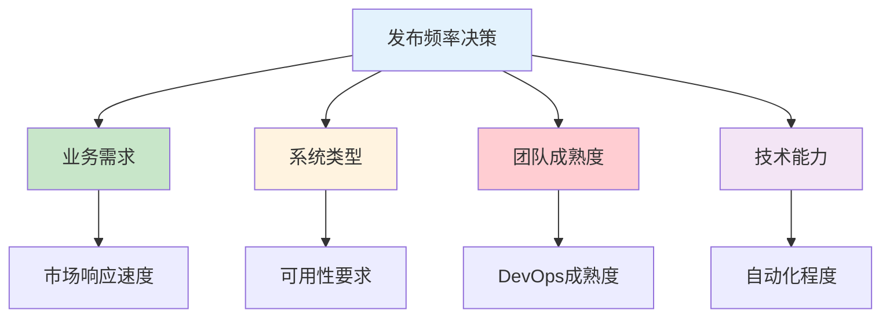

# 平台版本迭代与运维支撑体系：DevOps/SRE视角的发布管理

## 情境与背景

在现代软件开发中，发布频率直接影响业务响应速度和用户体验。作为高级DevOps/SRE工程师，需要建立完善的发布管理体系，在快速迭代和系统稳定之间找到平衡。本文从DevOps/SRE视角，深入讲解发布频率策略、运维支撑体系和最佳实践。

## 一、发布频率策略

### 1.1 发布频率分类

| 发布类型 | 频率 | 适用场景 | 风险等级 |
|:--------:|------|----------|:--------:|
| **快速迭代** | 每日多次 | 互联网产品、SaaS服务 | 中 |
| **常规迭代** | 每周1-2次 | 企业内部系统 | 低 |
| **稳定迭代** | 每月1次 | 核心业务系统、金融系统 | 高 |

### 1.2 发布频率决策因素



### 1.3 发布频率对比

**快速迭代（每日多次）**：
- 优势：快速响应市场、快速修复问题、持续交付价值
- 挑战：需要完善的自动化、监控和回滚机制
- 适用：互联网产品、移动应用、SaaS服务

**常规迭代（每周1-2次）**：
- 优势：平衡速度和稳定性、有足够测试时间
- 挑战：需要协调多个功能发布
- 适用：企业内部系统、B端产品

**稳定迭代（每月1次）**：
- 优势：充分测试、风险可控、变更影响小
- 挑战：响应速度慢、问题修复周期长
- 适用：核心业务系统、金融系统

## 二、运维支撑体系

### 2.1 CI/CD流水线

**流水线架构**：

```yaml
# CI/CD流水线配置
pipeline:
  stages:
    - name: build
      steps:
        - checkout
        - build_image
        - unit_test
    - name: test
      steps:
        - integration_test
        - security_scan
        - performance_test
    - name: deploy
      steps:
        - deploy_staging
        - smoke_test
        - deploy_production
```

**关键指标**：
| 指标 | 目标值 |
|:----:|--------|
| 构建成功率 | >95% |
| 部署成功率 | >99% |
| 构建时间 | <10分钟 |
| 部署时间 | <5分钟 |

### 2.2 发布策略

**灰度发布（Canary）**：

```yaml
# 灰度发布配置
canary:
  strategy: canary
  steps:
    - percentage: 10
      duration: 10m
    - percentage: 30
      duration: 10m
    - percentage: 100
  rollback:
    automatic: true
    threshold: 5%  # 错误率超过5%自动回滚
```

**滚动发布（Rolling）**：

```yaml
# 滚动发布配置
rolling:
  strategy: rolling
  max_unavailable: 25%
  max_surge: 25%
  batch_size: 1
```

**蓝绿发布（Blue-Green）**：

```yaml
# 蓝绿发布配置
blue_green:
  strategy: blue_green
  active: blue
  preview: green
  switch_timeout: 30s
  rollback_timeout: 5m
```

### 2.3 监控告警

**发布监控指标**：

```yaml
# 发布监控配置
monitoring:
  metrics:
    - name: error_rate
      threshold: 1%
      action: alert
    - name: latency_p99
      threshold: 500ms
      action: alert
    - name: success_rate
      threshold: 99%
      action: rollback
  alerting:
    channels:
      - slack
      - pagerduty
    response_time: 5m
```

### 2.4 回滚机制

**自动回滚配置**：

```yaml
# 自动回滚配置
rollback:
  automatic: true
  triggers:
    - error_rate: 5%
    - latency_p99: 1000ms
    - success_rate: 95%
  steps:
    - notify_team
    - execute_rollback
    - verify_rollback
    - post_mortem
```

## 三、发布流程规范

### 3.1 发布前准备

**检查清单**：
- [ ] 代码审查完成
- [ ] 单元测试通过
- [ ] 集成测试通过
- [ ] 性能测试通过
- [ ] 安全扫描通过
- [ ] 变更文档更新
- [ ] 回滚预案准备

### 3.2 发布中监控

**监控指标**：

| 指标 | 正常范围 | 异常处理 |
|:----:|----------|----------|
| 错误率 | <1% | 立即告警 |
| 响应时间 | <300ms | 持续观察 |
| CPU使用率 | <70% | 扩容或回滚 |
| 内存使用率 | <80% | 扩容或回滚 |

### 3.3 发布后验证

**验证步骤**：
1. 烟雾测试（Smoke Test）
2. 功能验证
3. 性能验证
4. 监控观察（30分钟）

## 四、实战案例分析

### 4.1 案例1：客户系统快速迭代

**场景**：
- 日均发布2-3次
- 用户量百万级
- 业务响应要求高

**运维支撑**：
```yaml
# 快速迭代支撑配置
release:
  frequency: "daily"
  strategy: "canary"
  
automation:
  ci_cd: "full_automation"
  testing: "automated"
  rollback: "automatic"
  
monitoring:
  real_time: true
  alerting: "instant"
  response_time: "5m"
```

**关键措施**：
- 完全自动化CI/CD流水线
- 灰度发布降低风险
- 实时监控快速响应
- 自动回滚保障安全

### 4.2 案例2：内部系统常规迭代

**场景**：
- 每周发布1-2次
- 用户量千级
- 稳定性优先

**运维支撑**：
```yaml
# 常规迭代支撑配置
release:
  frequency: "weekly"
  strategy: "rolling"
  
automation:
  ci_cd: "semi_automation"
  testing: "automated+manual"
  rollback: "manual"
  
monitoring:
  real_time: true
  alerting: "normal"
  response_time: "30m"
```

**关键措施**：
- 半自动化CI/CD流水线
- 滚动发布平滑升级
- 变更审批流程
- 手动回滚控制

### 4.3 案例3：核心系统稳定迭代

**场景**：
- 每月发布1次
- 用户量亿级
- 可用性要求极高

**运维支撑**：
```yaml
# 稳定迭代支撑配置
release:
  frequency: "monthly"
  strategy: "blue_green"
  
automation:
  ci_cd: "full_automation"
  testing: "comprehensive"
  rollback: "automatic"
  
monitoring:
  real_time: true
  alerting: "critical"
  response_time: "immediate"
```

**关键措施**：
- 全链路测试验证
- 蓝绿发布零停机
- 演练验证预案
- 全程监控保障

## 五、发布风险管理

### 5.1 风险识别

| 风险类型 | 影响 | 预防措施 |
|:--------:|------|----------|
| **代码缺陷** | 功能异常 | 代码审查、自动化测试 |
| **性能下降** | 用户体验差 | 性能测试、容量规划 |
| **兼容性问题** | 功能不可用 | 兼容性测试、版本管理 |
| **配置错误** | 系统故障 | 配置管理、变更审批 |

### 5.2 风险缓解

**技术手段**：
- 灰度发布降低影响范围
- 自动回滚快速恢复
- 监控告警及时发现问题
- 混沌工程提前暴露风险

**流程手段**：
- 变更审批流程
- 发布窗口限制
- 发布前演练
- 发布后复盘

## 六、面试1分钟精简版（直接背）

**完整版**：

我们维护的两套平台发布频率不同。客户系统迭代较快，平均每日发布1-3次，采用灰度发布和自动回滚机制，确保发布安全；内部系统相对稳定，每周发布1-2次，采用滚动更新和变更审批流程。运维支撑方面，我负责建设CI/CD流水线实现自动化构建部署，配置监控告警实时发现问题，制定发布规范和回滚预案，同时通过混沌工程和故障演练提前发现风险，保障系统在快速迭代下的稳定性。

**30秒超短版**：

客户系统每日发布，灰度+自动回滚；内部系统每周发布，滚动+变更审批。运维支撑：CI/CD自动化、监控告警、回滚预案、故障演练。

## 七、总结

### 7.1 核心要点

1. **发布频率**：根据业务需求和系统类型确定
2. **自动化**：CI/CD流水线是快速迭代的基础
3. **监控**：实时监控是发布安全的保障
4. **回滚**：完善的回滚机制是最后一道防线

### 7.2 关键原则

| 原则 | 说明 |
|:----:|------|
| **自动化优先** | 减少人工操作，降低错误率 |
| **小步快跑** | 频繁发布小版本，降低风险 |
| **监控驱动** | 实时监控，快速响应 |
| **预案先行** | 提前准备回滚和应急预案 |

### 7.3 记忆口诀

```
发布频率看业务，快速迭代自动化，
灰度发布降风险，监控告警保安全，
回滚预案是底线，演练验证不可少。
```

> **参考链接**：[SRE运维面试题全解析：从理论到实践（第二部分）]()