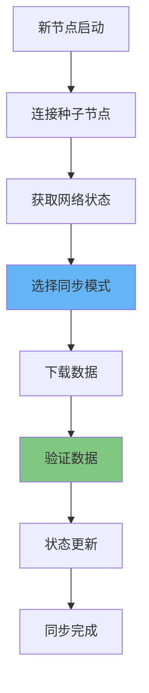

# 区块链节点同步方式详解：全量/快速/轻量同步实践指南

## 情境与背景

区块链节点同步是新节点加入网络后获取完整账本数据的过程，是区块链去中心化的核心机制。本指南详细讲解区块链节点同步的三种主要方式、工作原理、配置方法及生产环境最佳实践。

## 一、节点同步概述

### 1.1 同步机制的重要性

**同步的意义**：

```yaml
node_sync:
  importance:
    - "数据一致性保障"
    - "网络去中心化"
    - "交易验证基础"
    - "安全防护"
    
  challenges:
    - "数据量大"
    - "网络带宽"
    - "存储需求"
    - "时间成本"
```

**同步流程**：



### 1.2 节点类型与同步需求

**节点类型**：

```yaml
node_types:
  full_node:
    description: "全节点"
    sync_requirement: "完整账本"
    use_case: "挖矿、验证"
    
  light_node:
    description: "轻节点"
    sync_requirement: "区块头"
    use_case: "轻钱包、客户端"
    
  archive_node:
    description: "归档节点"
    sync_requirement: "完整历史"
    use_case: "数据分析、审计"
```

## 二、全量同步（Full Sync）

### 2.1 工作原理

**全量同步流程**：

```markdown
## 全量同步（Full Sync）

### 工作原理

**同步流程**：

```yaml
full_sync:
  definition: "下载并验证所有区块"
  
  process:
    1: "连接网络"
    2: "获取创世块"
    3: "依次下载区块"
    4: "执行每个交易"
    5: "验证状态转换"
    6: "构建状态树"
    
  characteristics:
    data_size: "最大"
    speed: "最慢"
    security: "最高"
    storage: "最高"
```

**验证机制**：

```yaml
validation:
  block_validation:
    - "验证区块哈希"
    - "验证交易签名"
    - "验证状态转换"
    
  consensus_validation:
    - "验证工作量证明"
    - "验证权益证明"
    - "验证共识规则"
```

### 2.2 配置示例

**比特币全节点配置**：

```yaml
# bitcoin.conf
server=1
daemon=1
txindex=1
prune=0  # 不修剪数据
maxconnections=100
```

**以太坊全节点配置**：

```yaml
# geth启动命令
geth --syncmode "full" \
     --datadir /data/ethereum \
     --rpc \
     --rpcaddr 0.0.0.0 \
     --rpcport 8545 \
     --networkid 1
```

## 三、快速同步（Fast Sync）

### 3.1 工作原理

**快速同步流程**：

```yaml
fast_sync:
  definition: "只同步状态数据"
  
  process:
    1: "下载区块头"
    2: "获取最新状态"
    3: "验证状态根"
    4: "同步最近区块"
    5: "追赶最新高度"
    
  characteristics:
    data_size: "中等"
    speed: "较快"
    security: "高"
    storage: "中等"
```

**状态同步原理**：

```yaml
state_sync:
  merkle_proof:
    description: "默克尔证明"
    
  state_root:
    description: "状态根验证"
    
  snapshot:
    description: "状态快照"
```

### 3.2 配置示例

**以太坊快速同步**：

```yaml
# geth快速同步
geth --syncmode "fast" \
     --datadir /data/ethereum \
     --rpc \
     --rpcaddr 0.0.0.0 \
     --gcmode "archive"
```

**以太坊快照同步**：

```yaml
# geth快照同步
geth --syncmode "snapshot" \
     --datadir /data/ethereum
```

## 四、轻量级同步（Light Sync）

### 4.1 工作原理

**轻量级同步流程**：

```markdown
## 轻量级同步（Light Sync）

### 工作原理

**SPV验证**：

```yaml
light_sync:
  definition: "只同步区块头"
  
  process:
    1: "下载区块头"
    2: "构建区块链结构"
    3: "验证区块哈希链"
    4: "SPV交易验证"
    5: "查询特定交易"
    
  characteristics:
    data_size: "最小"
    speed: "最快"
    security: "中"
    storage: "最小"
```

**SPV验证原理**：

```yaml
spv_validation:
  full_name: "Simplified Payment Verification"
  
  mechanism:
    - "获取交易所在区块"
    - "验证区块在主链上"
    - "验证交易存在于区块中"
    - "无需完整账本"
```

### 4.2 配置示例

**比特币轻钱包同步**：

```yaml
# 轻钱包配置
network: mainnet
sync_mode: light
peers:
  - seed.bitcoin.sipa.be
  - dnsseed.bitcoinstats.com
```

**以太坊轻客户端**：

```yaml
# geth轻同步
geth --syncmode "light" \
     --datadir /data/ethereum-light \
     --rpc
```

## 五、同步方式对比

### 5.1 详细对比表

**对比分析**：

```yaml
sync_comparison:
  full_sync:
    data: "完整账本(数百GB)"
    speed: "数天"
    security: "最高"
    storage: "高(>1TB)"
    use_case: "全节点、矿工"
    
  fast_sync:
    data: "状态+区块头(数十GB)"
    speed: "数小时"
    security: "高"
    storage: "中(数百GB)"
    use_case: "验证节点、RPC节点"
    
  light_sync:
    data: "区块头(数百MB)"
    speed: "数分钟"
    security: "中"
    storage: "低(GB级)"
    use_case: "轻钱包、移动端"
```

### 5.2 选择建议

**选择策略**：

```yaml
selection_strategy:
  full_node:
    recommend: "全量同步"
    reason: "需要完整验证能力"
    
  rpc_node:
    recommend: "快速同步"
    reason: "平衡速度与安全性"
    
  mobile_app:
    recommend: "轻量同步"
    reason: "资源受限"
    
  archive_node:
    recommend: "全量同步+归档"
    reason: "需要历史数据查询"
```

## 六、生产环境最佳实践

### 6.1 节点部署策略

**部署架构**：

```markdown
## 生产环境最佳实践

### 节点部署策略

**架构设计**：

```yaml
deployment_architecture:
  network_topology:
    - "多区域部署"
    - "负载均衡"
    - "故障切换"
    
  node_clusters:
    - "验证节点集群"
    - "RPC节点集群"
    - "归档节点"
    
  security:
    - "防火墙"
    - "VPN连接"
    - "SSL加密"
```

**硬件配置建议**：

```yaml
hardware_requirements:
  full_node:
    cpu: "8核+"
    memory: "16GB+"
    storage: "2TB SSD"
    network: "1Gbps+"
    
  rpc_node:
    cpu: "16核+"
    memory: "32GB+"
    storage: "1TB SSD"
    network: "1Gbps+"
    
  light_node:
    cpu: "2核+"
    memory: "4GB+"
    storage: "10GB+"
    network: "100Mbps+"
```

### 6.2 同步优化策略

**优化方法**：

```yaml
optimization_strategies:
  network:
    - "选择近邻节点"
    - "增加连接数"
    - "使用CDN加速"
    
  storage:
    - "使用SSD"
    - "RAID配置"
    - "定期清理"
    
  software:
    - "更新客户端版本"
    - "启用压缩"
    - "优化参数"
```

### 6.3 监控与维护

**监控指标**：

```yaml
monitoring_metrics:
  sync_progress:
    - "区块高度"
    - "同步速度"
    - "剩余时间"
    
  node_health:
    - "连接数"
    - "CPU使用率"
    - "内存使用率"
    - "磁盘IO"
    
  alerts:
    - "同步停滞"
    - "连接异常"
    - "存储不足"
```

## 七、常见问题与故障排查

### 7.1 同步停滞

**排查步骤**：

```yaml
sync_stuck_troubleshooting:
  check_network:
    - "验证网络连接"
    - "检查防火墙规则"
    - "测试节点连通性"
    
  check_logs:
    - "查看错误日志"
    - "识别失败原因"
    - "搜索解决方案"
    
  restart_sync:
    - "清理缓存"
    - "重新启动节点"
    - "尝试不同同步模式"
```

### 7.2 存储不足

**解决方案**：

```yaml
storage_issues:
  prune_mode:
    description: "启用修剪模式"
    command: "--prune"
    
  external_storage:
    description: "使用外部存储"
    options:
      - "NAS"
      - "云存储"
      - "SSD阵列"
    
  archive_separate:
    description: "分离归档数据"
```

## 八、面试1分钟精简版（直接背）

**完整版**：

区块链节点同步方式：1. 全量同步（Full Sync）：下载完整账本，从创世块开始验证每个区块和交易，安全性最高但速度最慢，适合全节点和矿工；2. 快速同步（Fast Sync）：只下载最新状态数据和区块头，跳过历史交易执行，速度快，安全性高，适合验证节点和RPC节点；3. 轻量级同步（Light Sync）：只下载区块头，通过SPV验证交易，数据量最小速度最快，适合轻钱包和移动端。选择建议：全节点用全量同步，RPC节点用快速同步，轻客户端用轻量同步。

**30秒超短版**：

节点同步三种方式：全量完整慢而稳，快速状态同步快，轻量区块头验证，根据节点角色选择。

## 九、总结

### 9.1 同步方式选择

```yaml
sync_selection:
  full_node_mining:
    recommend: "全量同步"
    
  rpc_service:
    recommend: "快速同步"
    
  mobile_wallet:
    recommend: "轻量同步"
    
  data_analysis:
    recommend: "全量同步+归档"
```

### 9.2 最佳实践清单

```yaml
best_practices_checklist:
  deployment:
    - "根据角色选择同步方式"
    - "使用SSD存储"
    - "配置足够带宽"
    
  monitoring:
    - "监控同步进度"
    - "设置告警阈值"
    - "定期健康检查"
    
  maintenance:
    - "定期更新客户端"
    - "备份数据"
    - "测试容灾方案"
```

### 9.3 记忆口诀

```
节点同步三种方式，全量完整慢而稳，
快速状态同步快，轻量区块头验证，
全节点用全量同步，RPC节点用快速，
轻客户端用轻量，安全速度要权衡。
```

> **参考链接**：[SRE运维面试题全解析：从理论到实践（第二部分）]()