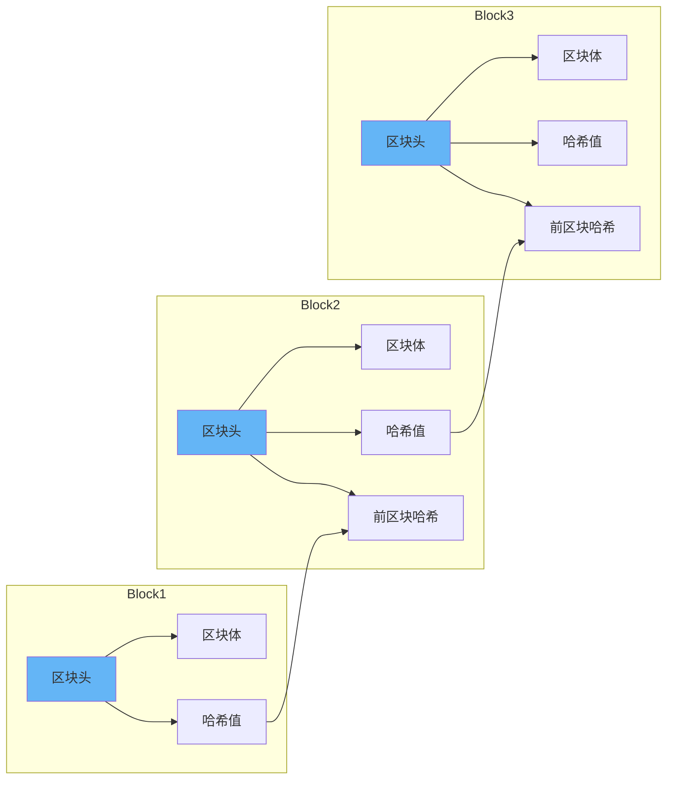

# 区块链协议详解：原理、主流协议与企业级应用实践

## 情境与背景

区块链技术自比特币诞生以来，已经从单纯的加密货币底层技术发展成为一种通用的分布式账本技术。本指南详细讲解区块链的核心原理、主流协议、共识机制、以及企业级应用的最佳实践。

## 一、区块链核心原理

### 1.1 什么是区块链

**定义与特点**：

```yaml
blockchain:
  definition: "分布式、去中心化的数字账本"
  
  core_features:
    decentralization: "去中心化"
    transparency: "透明可追溯"
    immutability: "不可篡改"
    security: "安全可靠"
    
  key_elements:
    blocks: "区块"
    chain: "链式结构"
    consensus: "共识机制"
    cryptography: "密码学"
```

**区块链结构**：



### 1.2 核心技术组件

**技术架构**：

```yaml
blockchain_tech_stack:
  data_structure:
    - "区块链式存储"
    - "默克尔树"
    
  cryptography:
    - "哈希函数(SHA-256)"
    - "非对称加密(ECC)"
    - "数字签名"
    
  consensus:
    - "PoW(工作量证明)"
    - "PoS(权益证明)"
    - "PBFT(拜占庭容错)"
    
  smart_contracts:
    - "自动执行代码"
    - "状态机"
```

## 二、共识机制详解

### 2.1 PoW（工作量证明）

**原理与特点**：

```markdown
## 共识机制详解

### PoW（工作量证明）

**工作原理**：

```yaml
pow:
  full_name: "Proof of Work"
  
  mechanism:
    - "节点竞争计算哈希"
    - "找到满足条件的随机数"
    - "第一个完成的节点打包区块"
    
  characteristics:
    security: "高"
    decentralization: "高"
    energy_efficiency: "低"
    scalability: "低"
    
  examples:
    - "比特币"
    - "以太坊(旧版)"
```

**挖矿过程**：

```yaml
mining_process:
  1: "接收交易"
  2: "验证交易合法性"
  3: "构建区块"
  4: "计算哈希值"
  5: "寻找nonce"
  6: "广播区块"
  7: "其他节点验证"
  8: "区块确认"
```

### 2.2 PoS（权益证明）

**原理与特点**：

```yaml
pos:
  full_name: "Proof of Stake"
  
  mechanism:
    - "节点质押一定数量代币"
    - "根据质押量和时间选择验证者"
    - "验证者打包区块获得奖励"
    
  characteristics:
    security: "中高"
    decentralization: "中"
    energy_efficiency: "高"
    scalability: "中高"
    
  examples:
    - "以太坊(新版)"
    - "Cardano"
    - "Solana"
```

### 2.3 PBFT（实用拜占庭容错）

**原理与特点**：

```yaml
pbft:
  full_name: "Practical Byzantine Fault Tolerance"
  
  mechanism:
    - "节点之间交换消息"
    - "三阶段共识(pre-prepare/prepare/commit)"
    - "容忍1/3恶意节点"
    
  characteristics:
    security: "高"
    decentralization: "低(联盟链)"
    energy_efficiency: "高"
    scalability: "中"
    
  examples:
    - "Hyperledger Fabric"
    - "Ripple"
```

### 2.4 其他共识机制

**其他机制**：

```yaml
other_consensus:
  PoA:
    full_name: "Proof of Authority"
    description: "权威证明，由授权节点验证"
    
  PoH:
    full_name: "Proof of History"
    description: "历史证明，Solana使用"
    
  DPoS:
    full_name: "Delegated Proof of Stake"
    description: "委托权益证明"
    
  PoC:
    full_name: "Proof of Capacity"
    description: "容量证明"
```

## 三、主流区块链协议

### 3.1 比特币（Bitcoin）

**协议特性**：

```markdown
## 主流区块链协议

### 比特币（Bitcoin）

**协议特性**：

```yaml
bitcoin:
  launch_year: 2009
  creator: "中本聪"
  
  consensus:
    type: "PoW"
    algorithm: "SHA-256"
    
  key_features:
    - "去中心化程度高"
    - "安全性强"
    - "总量固定(2100万)"
    
  use_cases:
    - "价值存储"
    - "跨境支付"
    - "数字黄金"
    
  challenges:
    - "交易吞吐量低(7TPS)"
    - "能耗高"
```

### 3.2 以太坊（Ethereum）

**协议特性**：

```yaml
ethereum:
  launch_year: 2015
  creator: "Vitalik Buterin"
  
  consensus:
    type: "PoS(2022年后)"
    previous: "PoW"
    
  key_features:
    - "智能合约支持"
    - "EVM虚拟机"
    - "DeFi生态"
    
  use_cases:
    - "DApp开发"
    - "DeFi"
    - "NFT"
    - "DAO"
    
  challenges:
    - "Gas费用波动"
    - "扩容问题"
```

### 3.3 Hyperledger Fabric

**协议特性**：

```yaml
hyperledger_fabric:
  launch_year: 2016
  creator: "Linux Foundation"
  
  consensus:
    type: "PBFT/Raft"
    
  key_features:
    - "联盟链"
    - "权限管理"
    - "通道隔离"
    
  use_cases:
    - "供应链溯源"
    - "金融结算"
    - "数字身份"
    
  challenges:
    - "去中心化程度低"
    - "节点准入控制"
```

### 3.4 Solana

**协议特性**：

```yaml
solana:
  launch_year: 2020
  creator: "Anatoly Yakovenko"
  
  consensus:
    type: "PoH + PoS"
    
  key_features:
    - "高性能(65000TPS)"
    - "低延迟"
    - "低成本"
    
  use_cases:
    - "高频交易"
    - "NFT市场"
    - "DeFi"
    
  challenges:
    - "中心化风险"
    - "稳定性问题"
```

## 四、密码学基础

### 4.1 哈希函数

**哈希函数特性**：

```markdown
## 密码学基础

### 哈希函数

**特性**：

```yaml
hash_function:
  properties:
    deterministic: "确定性"
    fast: "快速计算"
    collision_resistant: "抗碰撞"
    preimage_resistant: "抗原像攻击"
    avalanche_effect: "雪崩效应"
    
  algorithms:
    SHA-256:
      description: "比特币使用"
      output_size: "256位"
      
    Keccak-256:
      description: "以太坊使用"
      output_size: "256位"
```

**哈希应用**：

```yaml
hash_applications:
  - "区块标识"
  - "交易验证"
  - "默克尔树"
  - "数据完整性校验"
```

### 4.2 非对称加密

**原理**：

```yaml
asymmetric_crypto:
  public_key:
    description: "公开密钥"
    usage: "加密、验证签名"
    
  private_key:
    description: "私有密钥"
    usage: "解密、生成签名"
    
  algorithms:
    ECC:
      description: "椭圆曲线加密"
      usage: "比特币、以太坊"
      
    RSA:
      description: "RSA加密"
      usage: "传统加密"
```

### 4.3 数字签名

**签名流程**：

```yaml
digital_signature:
  signing:
    - "用私钥对数据哈希签名"
    - "生成签名数据"
    
  verification:
    - "用公钥验证签名"
    - "确认数据完整性"
    - "确认发送者身份"
```

## 五、智能合约

### 5.1 智能合约概述

**定义与特点**：

```markdown
## 智能合约

### 智能合约概述

**定义**：

```yaml
smart_contract:
  definition: "自动执行的计算机程序"
  
  characteristics:
    self_executing: "自动执行"
    immutable: "不可篡改"
    transparent: "透明"
    trustless: "无需信任"
    
  execution_environment:
    EVM: "以太坊虚拟机"
    WASM: "WebAssembly"
```

**应用场景**：

```yaml
smart_contract_use_cases:
  finance:
    - "DeFi借贷"
    - "去中心化交易所"
    - "稳定币"
    
  governance:
    - "DAO投票"
    - "去中心化治理"
    
  nft:
    - "数字资产确权"
    - "版权保护"
    
  supply_chain:
    - "溯源追踪"
    - "自动结算"
```

### 5.2 智能合约安全

**安全风险**：

```yaml
smart_contract_security:
  vulnerabilities:
    reentrancy: "重入攻击"
    overflow: "整数溢出"
    access_control: "权限控制"
    front_running: "抢跑攻击"
    
  best_practices:
    - "代码审计"
    - "形式化验证"
    - "测试覆盖"
    - "多签机制"
```

## 六、企业级应用实践

### 6.1 供应链溯源

**应用架构**：

```markdown
## 企业级应用实践

### 供应链溯源

**架构设计**：

```yaml
supply_chain_tracking:
  architecture:
    participants:
      - "供应商"
      - "制造商"
      - "分销商"
      - "零售商"
      - "消费者"
      
    data_points:
      - "原材料来源"
      - "生产过程"
      - "质检信息"
      - "物流轨迹"
      - "最终交付"
      
    benefits:
      - "透明可追溯"
      - "防伪防窜货"
      - "责任明确"
```

### 6.2 数字身份认证

**身份管理**：

```yaml
digital_identity:
  features:
    - "去中心化身份(DID)"
    - "自我主权身份"
    - "可验证凭证"
    
  benefits:
    - "隐私保护"
    - "跨平台认证"
    - "防身份盗用"
    
  use_cases:
    - "金融开户"
    - "跨境旅行"
    - "医疗健康"
```

### 6.3 跨组织数据共享

**数据协作**：

```yaml
cross_organization_data_share:
  challenges:
    - "数据隐私"
    - "信任问题"
    - "合规要求"
    
  solutions:
    - "零知识证明"
    - "安全多方计算"
    - "数据脱敏"
    
  benefits:
    - "打破数据孤岛"
    - "合规共享"
    - "业务创新"
```

## 七、生产环境最佳实践

### 7.1 节点部署

**部署策略**：

```markdown
## 生产环境最佳实践

### 节点部署

**部署策略**：

```yaml
node_deployment:
  infrastructure:
    - "云服务器"
    - "边缘节点"
    - "混合云"
    
  high_availability:
    - "多区域部署"
    - "负载均衡"
    - "故障切换"
    
  monitoring:
    - "节点健康检查"
    - "性能监控"
    - "告警通知"
```

### 7.2 安全配置

**安全措施**：

```yaml
security_config:
  key_management:
    - "硬件安全模块(HSM)"
    - "密钥轮换"
    - "多签机制"
    
  network_security:
    - "防火墙"
    - "VPN"
    - "加密传输"
    
  access_control:
    - "RBAC"
    - "最小权限原则"
    - "审计日志"
```

### 7.3 性能优化

**优化策略**：

```yaml
performance_optimization:
  scaling:
    - "分片技术"
    - "Layer 2解决方案"
    - "状态通道"
    
  caching:
    - "本地缓存"
    - "CDN加速"
    
  tuning:
    - "区块大小优化"
    - "交易池管理"
    - "垃圾回收"
```

## 八、面试1分钟精简版（直接背）

**完整版**：

区块链协议核心要素：1. 分布式账本：数据存储在多个节点，去中心化，不可篡改；2. 共识机制：PoW（比特币，安全性高但耗能）、PoS（以太坊，高效环保）、PBFT（联盟链，适合企业）；3. 密码学：哈希函数保证完整性（SHA-256），非对称加密保证安全（ECC），数字签名验证身份；4. 智能合约：自动执行的程序，以太坊EVM支持。主流协议：比特币（价值存储）、以太坊（智能合约）、Hyperledger（企业联盟链）、Solana（高性能）。企业应用：供应链溯源、数字身份、跨组织数据共享。

**30秒超短版**：

区块链去中心化，共识机制是核心，PoW安全耗能，PoS高效环保，智能合约自动执行，企业级用联盟链。

## 九、总结

### 9.1 协议选择指南

```yaml
protocol_selection:
  public_blockchain:
    recommend: "以太坊/Solana"
    use_case: "公开DApp/DeFi"
    
  consortium_blockchain:
    recommend: "Hyperledger Fabric"
    use_case: "企业级应用"
    
  value_storage:
    recommend: "比特币"
    use_case: "数字资产"
```

### 9.2 最佳实践清单

```yaml
best_practices_checklist:
  security:
    - "代码审计"
    - "密钥安全管理"
    - "多签机制"
    
  deployment:
    - "高可用部署"
    - "监控告警"
    - "灾备方案"
    
  governance:
    - "明确治理规则"
    - "合规要求"
    - "风险评估"
```

### 9.3 记忆口诀

```
区块链去中心，共识机制是核心，
PoW安全但耗能，PoS高效且环保，
哈希加密保安全，智能合约自动行，
企业应用选联盟，供应链上可溯源。
```

> **参考链接**：[SRE运维面试题全解析：从理论到实践（第二部分）]()