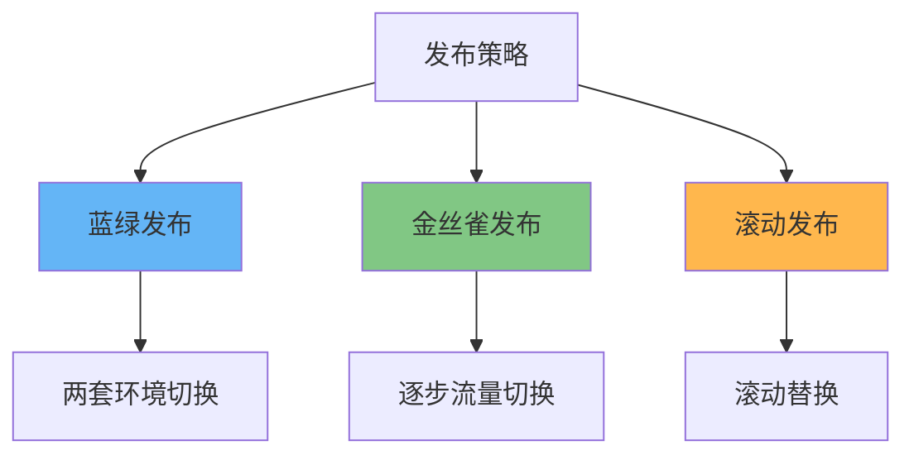
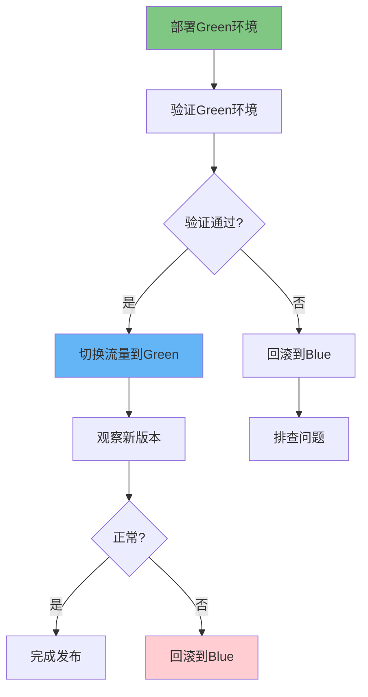
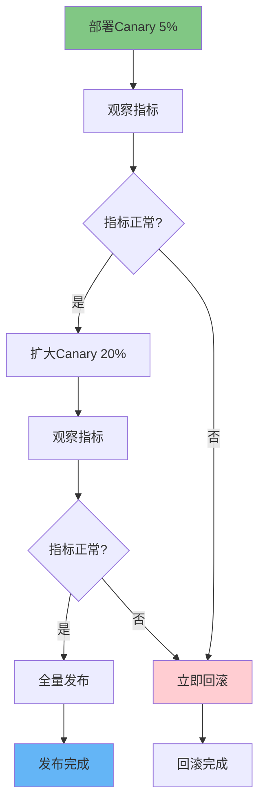
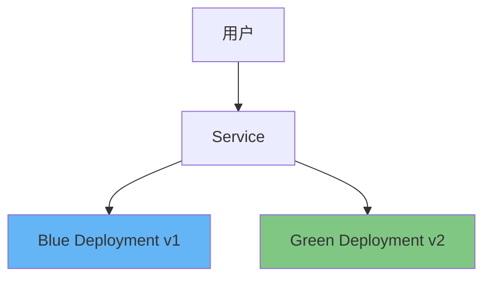

# 蓝绿发布与金丝雀发布：K8s环境下的完整实现指南

## 情境与背景

蓝绿发布和金丝雀发布是现代云原生应用部署的重要策略。本指南详细讲解这两种发布策略的原理、K8s实现方式以及生产环境最佳实践。

## 一、发布策略概述

### 1.1 常见发布策略

**发布策略对比**：

```markdown
## 发布策略概述

### 发布策略分类

**三大发布策略**：



**策略对比表**：

```yaml
deployment_strategies:
  blue_green:
    name: "蓝绿发布"
    downtime: "0秒"
    rollback_time: "< 1分钟"
    resource_cost: "2倍"
    risk: "低"
    
  canary:
    name: "金丝雀发布"
    downtime: "0秒"
    rollback_time: "< 5分钟"
    resource_cost: "1.2倍"
    risk: "中低"
    
  rolling:
    name: "滚动发布"
    downtime: "可能有"
    rollback_time: "< 10分钟"
    resource_cost: "1倍"
    risk: "中"
```
```

### 1.2 蓝绿发布原理

**蓝绿发布架构**：

```markdown
### 蓝绿发布原理

**核心概念**：

```yaml
blue_green_concepts:
  blue_environment:
    description: "当前生产环境"
    color: "蓝色"
    version: "当前运行版本"
    
  green_environment:
    description: "新版本环境"
    color: "绿色"
    version: "待发布版本"
    
  switching:
    description: "流量切换"
    method: "通过负载均衡器切换"
    time: "秒级切换"
```

**发布流程**：



### 1.3 金丝雀发布原理

**金丝雀发布架构**：

```markdown
### 金丝雀发布原理

**核心概念**：

```yaml
canary_concepts:
  canary_version:
    description: "新版本"
    traffic_percentage: "5%-20%"
    purpose: "在小范围验证"
    
  stable_version:
    description: "稳定版本"
    traffic_percentage: "80%-95%"
    purpose: "保证服务可用"
    
  analysis:
    description: "分析验证"
    metrics: ["错误率", "延迟", "业务指标"]
```

**发布流程**：



## 二、K8s实现方式

### 2.1 Service + Deployment实现

**蓝绿发布实现**：

```markdown
## K8s实现方式

### Service + Deployment实现蓝绿

**架构图**：



**部署示例**：

```yaml
# Blue Deployment (当前版本)
apiVersion: apps/v1
kind: Deployment
metadata:
  name: app-blue
  labels:
    app: app
    version: v1
spec:
  replicas: 3
  selector:
    matchLabels:
      app: app
      slot: blue
  template:
    metadata:
      labels:
        app: app
        version: v1
        slot: blue
    spec:
      containers:
      - name: app
        image: app:v1
        ports:
        - containerPort: 8080
---
# Green Deployment (新版本)
apiVersion: apps/v1
kind: Deployment
metadata:
  name: app-green
  labels:
    app: app
    version: v2
spec:
  replicas: 3
  selector:
    matchLabels:
      app: app
      slot: green
  template:
    metadata:
      labels:
        app: app
        version: v2
        slot: green
    spec:
      containers:
      - name: app
        image: app:v2
        ports:
        - containerPort: 8080
---
# Service (选择器切换)
apiVersion: v1
kind: Service
metadata:
  name: app-service
spec:
  selector:
    app: app
    slot: blue  # 切换为green实现蓝绿
  ports:
  - port: 80
    targetPort: 8080
```

**切换脚本**：

```bash
#!/bin/bash
# 切换到Green环境
kubectl patch service app-service -p '{"spec":{"selector":{"slot":"green"}}}'

# 验证切换
kubectl get endpoints app-service

# 观察片刻
sleep 30

# 如果需要回滚
kubectl patch service app-service -p '{"spec":{"selector":{"slot":"blue"}}}'
```
```

### 2.2 Ingress实现

**Ingress权重切换**：

```markdown
### Ingress实现权重切换

**Nginx Ingress配置**：

```yaml
# Blue Version
apiVersion: apps/v1
kind: Deployment
metadata:
  name: app-blue
spec:
  replicas: 3
  selector:
    matchLabels:
      app: app
      color: blue
  template:
    metadata:
      labels:
        app: app
        color: blue
        version: v1
    spec:
      containers:
      - name: app
        image: app:v1

---
# Green Version
apiVersion: apps/v1
kind: Deployment
metadata:
  name: app-green
spec:
  replicas: 3
  selector:
    matchLabels:
      app: app
      color: green
  template:
    metadata:
      labels:
        app: app
        color: green
        version: v2
    spec:
      containers:
      - name: app
        image: app:v2

---
# Ingress with canary
apiVersion: networking.k8s.io/v1
kind: Ingress
metadata:
  name: app-ingress
  annotations:
    nginx.ingress.kubernetes.io/canary: "true"
    nginx.ingress.kubernetes.io/canary-weight: "10"  # 10%到Green
spec:
  ingressClassName: nginx
  rules:
  - host: app.example.com
    http:
      paths:
      - path: /
        pathType: Prefix
        backend:
          service:
            name: app-green
            port:
              number: 80
```

**权重切换**：

```bash
# 切换到Green 10%
kubectl patch ingress app-ingress -p '{"metadata":{"annotations":{"nginx.ingress.kubernetes.io/canary-weight":"10"}}}'

# 切换到Green 50%
kubectl patch ingress app-ingress -p '{"metadata":{"annotations":{"nginx.ingress.kubernetes.io/canary-weight":"50"}}}'

# 完全切换到Green
kubectl patch ingress app-ingress -p '{"metadata":{"annotations":{"nginx.ingress.kubernetes.io/canary-weight":"100"}}}'

# 关闭canary，切回Blue
kubectl patch ingress app-ingress -p '{"metadata":{"annotations":{"nginx.ingress.kubernetes.io/canary":"false"}}}'
```
```

### 2.3 Argo Rollouts实现

**Argo Rollouts安装**：

```markdown
### Argo Rollouts实现

**安装Argo Rollouts**：

```bash
# 安装Argo Rollouts
kubectl create namespace argo-rollouts
kubectl apply -n argo-rollouts -f https://github.com/argoproj/argo-rollouts/releases/latest/download/install.yaml

# 安装kubectl插件
brew install argoproj/tap/kubectl-argo-rollouts

# 验证安装
kubectl get pods -n argo-rollouts
```

**蓝绿发布配置**：

```yaml
# Rollout配置
apiVersion: argoproj.io/v1alpha1
kind: Rollout
metadata:
  name: app-rollout
spec:
  replicas: 3
  strategy:
    blueGreen:
      # 主动模式下自动切换
      activeService: app-active
      previewService: app-preview
      # 自动切换前的等待时间
      prePromotionPause:
        duration: 5m
      # 发布后暂停时间
      postPromotionPause:
        duration: 5m
      # 自动回滚阈值
      autoPromotionEnabled: false
  selector:
    matchLabels:
      app: app
  template:
    metadata:
      labels:
        app: app
    spec:
      containers:
      - name: app
        image: app:v2
---
# Active Service (生产流量)
apiVersion: v1
kind: Service
metadata:
  name: app-active
spec:
  ports:
  - port: 80
    targetPort: 8080
  selector:
    app: app
    rollouts-pod-template-hash: active
---
# Preview Service (预览)
apiVersion: v1
kind: Service
metadata:
  name: app-preview
spec:
  ports:
  - port: 80
    targetPort: 8080
  selector:
    app: app
    rollouts-pod-template-hash: preview
```

**金丝雀发布配置**：

```yaml
# 金丝雀策略
apiVersion: argoproj.io/v1alpha1
kind: Rollout
metadata:
  name: app-rollout
spec:
  replicas: 3
  strategy:
    canary:
      # 步进式发布
      steps:
      - setWeight: 5
      - pause: {}
      - setWeight: 20
      - pause: {}
      - setWeight: 50
      - pause: {}
      - setWeight: 100
      # 金丝雀Service
      canaryService: app-canary
      # 稳定版Service
      stableService: app-stable
      # 流量分析
      analysis:
        templates:
        - templateName: success-rate
        startingStep: 1
        args:
        - name: service-name
          value: app-canary
---
# 分析模板
apiVersion: argoproj.io/v1alpha1
kind: AnalysisTemplate
metadata:
  name: success-rate
spec:
  args:
  - name: service-name
  metrics:
  - name: success-rate
    interval: 1m
    successCondition: result[0] >= 0.95
    failureLimit: 3
    provider:
      prometheus:
        address: http://prometheus:9090
        query: |
          sum(rate(http_requests_total{service="{{args.service-name}}",code=~"2.."}[5m])) /
          sum(rate(http_requests_total{service="{{args.service-name}}"}[5m]))
```

**Argo Rollouts命令**：

```bash
# 查看rollout状态
kubectl argo rollouts get rollout app-rollout -n default

# 暂停发布
kubectl argo rollouts pause app-rollout -n default

# 恢复发布
kubectl argo rollouts promote app-rollout -n default

# 完全暂停
kubectl argo rollouts abort app-rollout -n default

# 回滚到上一个版本
kubectl argo rollouts undo app-rollout -n default

# 观察发布过程
kubectl argo rollouts get rollout app-rollout -n default --watch
```
```

## 三、生产环境最佳实践

### 3.1 发布前检查

**发布检查清单**：

```markdown
## 生产环境最佳实践

### 发布前检查

**检查清单**：

```yaml
pre_deployment_checklist:
  code:
    - "代码review通过"
    - "单元测试通过"
    - "集成测试通过"
    
  build:
    - "镜像构建成功"
    - "镜像扫描无漏洞"
    - "配置检查通过"
    
  environment:
    - "环境资源充足"
    - "依赖服务正常"
    - "配置已同步"
    
  rollback:
    - "回滚方案已准备"
    - "回滚脚本已测试"
    - "相关人员已通知"
```
```

**自动化检查**：

```yaml
# Jenkinsfile发布前检查
pipeline {
    stages {
        stage('Pre-Check') {
            steps {
                script {
                    // 代码检查
                    sh 'sonar-scanner'
                    
                    // 安全扫描
                    sh 'trivy image app:${IMAGE_TAG}'
                    
                    // 配置检查
                    sh './scripts/validate-config.sh'
                    
                    // 资源检查
                    sh './scripts/check-resources.sh'
                }
            }
        }
    }
}
```
```

### 3.2 发布过程监控

**关键监控指标**：

```markdown
### 发布过程监控

**监控指标**：

```yaml
deployment_monitoring:
  availability:
    - "5XX错误率"
    - "服务可用性"
    - "健康检查成功率"
    
  performance:
    - "响应时间 P99"
    - "QPS"
    - "错误率趋势"
    
  resources:
    - "CPU使用率"
    - "内存使用率"
    - "Pod状态"
```

**Prometheus告警规则**：

```yaml
# Prometheus告警规则
groups:
- name: deployment
  rules:
  - alert: HighErrorRateDuringDeployment
    expr: |
      sum(rate(http_requests_total{status=~"5.."}[5m])) /
      sum(rate(http_requests_total[5m])) > 0.05
    for: 2m
    labels:
      severity: critical
    annotations:
      summary: "部署期间错误率过高"
      description: "当前5XX错误率为 {{ $value | humanizePercentage }}"
      
  - alert: HighLatencyDuringDeployment
    expr: |
      histogram_quantile(0.99, sum(rate(http_request_duration_seconds_bucket[5m])) by (le)) > 2
    for: 5m
    labels:
      severity: warning
    annotations:
      summary: "部署期间延迟过高"
      description: "P99延迟为 {{ $value }}秒"
```
```

### 3.3 自动回滚

**自动回滚配置**：

```yaml
# Argo Rollouts自动回滚
apiVersion: argoproj.io/v1alpha1
kind: Rollout
metadata:
  name: app-rollout
spec:
  strategy:
    canary:
      analysis:
        templates:
        - templateName: success-rate
        startingStep: 1
        args:
        - name: service-name
          value: app-canary
      metrics:
      - name: success-rate
        interval: 1m
        successCondition: result[0] >= 0.95
        failureLimit: 3
        treatment:
          inBound: "abort"
---
# 自动回滚触发条件
auto_rollback_conditions:
  - "5XX错误率 > 5%，持续2分钟"
  - "P99延迟 > 5秒，持续5分钟"
  - "服务不可用 > 1分钟"
  - "健康检查失败 > 3次"
```

**手动回滚流程**：

```bash
#!/bin/bash
# 回滚脚本

ROLLBACK_VERSION=${1:-"v1"}
NAMESPACE=${2:-"default"}

echo "开始回滚到版本: $ROLLBACK_VERSION"

# 方式1: 使用kubectl回滚
kubectl rollout undo deployment/app-deployment -n $NAMESPACE

# 方式2: 使用Argo Rollouts回滚
kubectl argo rollouts undo app-rollout -n $NAMESPACE

# 验证回滚状态
kubectl rollout status deployment/app-deployment -n $NAMESPACE

echo "回滚完成"
```
```

### 3.4 发布流程规范

**发布流程SOP**：

```markdown
### 发布流程规范

**标准发布流程**：

```yaml
deployment_sop:
  planning:
    - "制定发布计划"
    - "确定发布时间窗口"
    - "通知相关人员"
    - "准备回滚方案"
    
  preparation:
    - "代码冻结"
    - "测试环境验证"
    - "预发布环境验证"
    - "配置检查"
    
  deployment:
    - "部署到灰度/预览环境"
    - "观察指标"
    - "逐步放量或切换"
    - "全量发布"
    
  verification:
    - "功能验证"
    - "监控指标验证"
    - "日志检查"
    
  completion:
    - "观察稳定后关闭旧版本"
    - "更新文档"
    - "发布总结"
```

**发布审批流程**：

```yaml
deployment_approval:
  P0:
    approvers: ["技术VP", "运维负责人"]
    notice_period: "24小时"
    
  P1:
    approvers: ["运维负责人", "开发负责人"]
    notice_period: "4小时"
    
  P2:
    approvers: ["开发负责人"]
    notice_period: "1小时"
```
```

## 四、工具对比

### 4.1 工具选型

**工具对比表**：

```markdown
## 工具对比

### 发布工具对比

| 工具 | 类型 | 蓝绿 | 金丝雀 | 自动回滚 | 学习成本 |
|:----:|------|:----:|:------:|:--------:|:--------:|
| **kubectl** | K8s原生 | ✅ | ❌ | ❌ | 低 |
| **Service切换** | K8s原生 | ✅ | ❌ | ❌ | 低 |
| **Ingress** | K8s原生 | ✅ | ✅ | ❌ | 中 |
| **Argo Rollouts** | 专业工具 | ✅ | ✅ | ✅ | 中高 |
| **Flagger** | 专业工具 | ✅ | ✅ | ✅ | 中高 |
| **Spinnaker** | 专业平台 | ✅ | ✅ | ✅ | 高 |
| **Jenkins X** | CI/CD平台 | ✅ | ✅ | ✅ | 高 |
```
```

### 4.2 工具选择建议

**选型建议**：

```yaml
tool_selection:
  small_team:
    recommendation: "kubectl + Ingress"
    reason: "简单，K8s原生"
    
  medium_team:
    recommendation: "Argo Rollouts"
    reason: "功能丰富，易上手"
    
  large_team:
    recommendation: "Spinnaker"
    reason: "企业级，功能最全"
    
  gitops_team:
    recommendation: "Flagger + Flux"
    reason: "GitOps原生支持"
```
```

## 五、面试1分钟精简版（直接背）

**完整版**：

蓝绿发布通过两套环境（蓝=当前版本，绿=新版本）实现不停机发布。K8s中实现方式：1. Service + Deployment：两套Deployment，Service选择器切换；2. Ingress：使用annotations配置权重切换；3. Argo Rollouts：专业渐进式发布工具，支持蓝绿和金丝雀。生产环境推荐Argo Rollouts，功能丰富支持自动分析和回滚。我们使用Argo Rollouts实现蓝绿发布，配合监控告警实现自动回滚。

**30秒超短版**：

蓝绿发布靠两套环境切换，K8s用Service选择器或Ingress实现，生产推荐Argo Rollouts，功能全支持自动回滚。

## 六、总结

### 6.1 发布策略总结

```yaml
deployment_summary:
  blue_green:
    advantage: "快速回滚，零宕机"
    disadvantage: "资源成本高"
    suitable: "关键业务，高风险变更"
    
  canary:
    advantage: "风险可控，资源利用率高"
    disadvantage: "回滚相对慢"
    suitable: "一般业务，中等风险变更"
    
  rolling:
    advantage: "资源利用率高"
    disadvantage: "回滚慢，可能有短暂不可用"
    suitable: "非关键业务，低风险变更"
```

### 6.2 最佳实践清单

```yaml
best_practices:
  before_deployment:
    - "发布前充分测试"
    - "准备回滚方案"
    - "通知相关人员"
    - "检查资源配置"
    
  during_deployment:
    - "实时监控指标"
    - "设置自动回滚"
    - "渐进式放量"
    
  after_deployment:
    - "观察稳定后再离开"
    - "更新文档"
    - "发布总结"
```

### 6.3 记忆口诀

```
蓝绿发布靠切换，两套环境保安全，
蓝是当前绿是新，秒级切换回滚快，
金丝雀先试小量，渐进放量风险低，
滚动发布滚动换，资源利用效率高，
生产发布用Argo，功能丰富自动回滚。
```

> **参考链接**：[SRE运维面试题全解析：从理论到实践（第二部分）]()