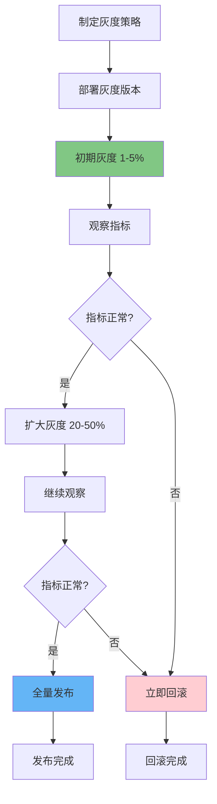
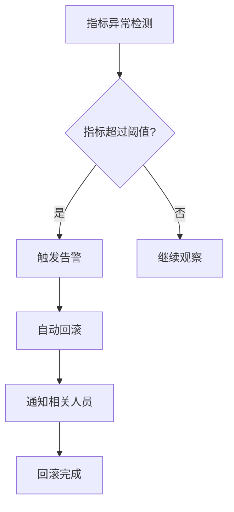

# 灰度发布策略：多维度划分与生产环境实践指南

## 情境与背景

灰度发布是现代软件发布的核心策略，通过逐步放量降低风险。本指南详细讲解灰度发布的各种划分维度、技术实现方式以及生产环境最佳实践。

## 一、灰度发布概述

### 1.1 灰度发布概念

**灰度发布定义**：

```markdown
## 灰度发布概述

### 灰度发布概念

**核心思想**：

```yaml
canary_deployment_concept:
  origin:
    description: "金丝雀矿工"
    story: "矿工用金丝雀检测有毒气体"
    apply_to: "软件发布中用小部分流量验证新版本"
    
  goal:
    - "降低发布风险"
    - "验证新版本稳定性"
    - "收集真实用户反馈"
    - "实现平滑过渡"
```

**灰度发布价值**：

```yaml
canary_value:
  risk_reduction:
    - "新版本只在少量实例上运行"
    - "问题影响范围可控"
    - "可以快速回滚"
    
  validation:
    - "真实环境验证"
    - "真实用户反馈"
    - "性能指标收集"
    
  business:
    - "减少用户投诉"
    - "提升发布信心"
    - "支持数据驱动决策"
```
```

### 1.2 灰度发布流程

**完整灰度流程**：



**灰度阶段**：

```yaml
canary_stages:
  stage_1:
    name: "内部测试"
    percentage: "1-5%"
    target: "内部员工"
    duration: "1-2小时"
    
  stage_2:
    name: "小范围用户"
    percentage: "5-20%"
    target: "白名单用户"
    duration: "4-8小时"
    
  stage_3:
    name: "扩大范围"
    percentage: "20-50%"
    target: "普通用户"
    duration: "4-8小时"
    
  stage_4:
    name: "全量发布"
    percentage: "100%"
    target: "所有用户"
```

## 二、灰度划分维度

### 2.1 用户维度

**用户维度划分**：

```markdown
## 灰度划分维度

### 用户维度

**用户维度划分方式**：

```yaml
user_dimension:
  user_id:
    description: "按用户ID划分"
    method: "用户ID哈希取模"
    example: "hash(user_id) % 100 < 5"
    advantage: "用户稳定，结果可复现"
    
  user_tags:
    description: "按用户标签划分"
    method: "标签匹配"
    example: "tags包含'beta-tester'"
    advantage: "灵活精准"
    
  member_level:
    description: "按会员等级划分"
    method: "等级筛选"
    example: "level >= VIP3"
    advantage: "高价值用户优先体验"
    
  user_region:
    description: "按用户地域划分"
    method: "地域匹配"
    example: "region in ['北京', '上海']"
    advantage: "便于问题定位"
```

**用户ID哈希实现**：

```yaml
# 用户ID哈希灰度
apiVersion: v1
kind: ConfigMap
metadata:
  name: canary-config
data:
  canary-rules.yaml: |
    rules:
      - name: user-hash
        type: user_hash
        percentage: 5
        condition: |
          hash(request.headers["X-User-ID"]) % 100 < 5
```

**用户标签配置**：

```yaml
# 用户标签灰度
apiVersion: v1
kind: ConfigMap
metadata:
  name: canary-config
data:
  canary-rules.yaml: |
    rules:
      - name: beta-users
        type: user_tag
        tags:
          - "beta-tester"
          - "internal-employee"
          - "vip-user"
```

**会员等级灰度**：

```yaml
# 会员等级灰度
canary_rules:
  - name: vip-canary
    priority: 1
    conditions:
      - "member.level >= 3"
    percentage: 100
    version: "v2.0.0"
```
```

### 2.2 流量维度

**流量维度划分**：

```markdown
### 流量维度

**流量维度划分方式**：

```yaml
traffic_dimension:
  percentage:
    description: "按流量比例划分"
    method: "随机采样"
    example: "随机5%流量"
    advantage: "简单直接"
    
  source:
    description: "按请求来源划分"
    method: "来源匹配"
    example: "source == 'mobile'"
    advantage: "按设备类型灰度"
    
  header:
    description: "按请求头划分"
    method: "Header匹配"
    example: "X-Canary: true"
    advantage: "灵活控制"
    
  weight:
    description: "按权重划分"
    method: "配置权重"
    example: "weight: 10"
    advantage: "精确控制"
```

**流量比例配置**：

```yaml
# Nginx Ingress流量比例
apiVersion: networking.k8s.io/v1
kind: Ingress
metadata:
  name: app-ingress
  annotations:
    nginx.ingress.kubernetes.io/canary: "true"
    nginx.ingress.kubernetes.io/canary-weight: "10"
spec:
  ingressClassName: nginx
  rules:
  - host: app.example.com
    http:
      paths:
      - path: /
        pathType: Prefix
        backend:
          service:
            name: app-canary
            port:
              number: 80
```

**Header灰度配置**：

```yaml
# Header灰度规则
apiVersion: v1
kind: ConfigMap
metadata:
  name: canary-config
data:
  canary-rules.yaml: |
    rules:
      - name: header-canary
        type: header
        headerName: "X-Canary"
        headerValue: "true"
        percentage: 100
        version: "v2.0.0"
```

**流量来源配置**：

```yaml
# 来源灰度规则
canary_rules:
  - name: mobile-canary
    conditions:
      - "request.source == 'mobile-app'"
      - "request.header['X-Platform'] == 'iOS'"
    percentage: 100
    version: "v2.0.0"
```
```

### 2.3 地域维度

**地域维度划分**：

```markdown
### 地域维度

**地域维度划分方式**：

```yaml
region_dimension:
  datacenter:
    description: "按机房划分"
    method: "流量调度到特定机房"
    example: "只在北京机房灰度"
    advantage: "故障隔离"
    
  city:
    description: "按城市划分"
    method: "按用户IP匹配城市"
    example: "只在上海用户灰度"
    advantage: "精准地域"
    
  isp:
    description: "按运营商划分"
    method: "按用户ISP匹配"
    example: "只在电信用户灰度"
    advantage: "网络质量验证"
```

**地域灰度配置**：

```yaml
# 地域灰度配置
canary_rules:
  - name: beijing-canary
    conditions:
      - "request.geo.region == 'Beijing'"
      - "request.geo.city == 'Beijing'"
    percentage: 100
    version: "v2.0.0"
    
  - name: shanghai-canary
    conditions:
      - "request.geo.region == 'Shanghai'"
      - "request.geo.city == 'Shanghai'"
    percentage: 50
    version: "v2.0.0"
```

**多地域灰度策略**：

```yaml
# 多地域灰度策略
multi_region_strategy:
  phase_1:
    regions: ["Beijing"]
    percentage: 100
    duration: "24小时"
    
  phase_2:
    regions: ["Beijing", "Shanghai"]
    percentage: 50
    duration: "12小时"
    
  phase_3:
    regions: ["All"]
    percentage: 100
```
```

### 2.4 功能维度

**功能维度划分**：

```markdown
### 功能维度

**功能开关灰度**：

```yaml
feature_dimension:
  feature_flag:
    description: "功能开关"
    method: "配置开关控制"
    example: "new_feature_enabled = true"
    advantage: "精确控制功能"
    
  ab_test:
    description: "A/B测试"
    method: "分流实验"
    example: "实验组A/B"
    advantage: "数据驱动"
    
  dark_launch:
    description: "暗发布"
    method: "功能代码已部署但未启用"
    example: "代码存在但开关关闭"
    advantage: "提前验证"
```

**功能开关实现**：

```yaml
# 功能开关配置
apiVersion: v1
kind: ConfigMap
metadata:
  name: feature-flags
data:
  flags.yaml: |
    features:
      - name: new-payment-flow
        enabled: true
        percentage: 20
        target_users:
          - "beta-tester"
          - "vip-user"
          
      - name: new-search-algorithm
        enabled: true
        percentage: 10
        conditions:
          - "request.header['X-App-Version'] >= '2.0.0'"
```

**A/B测试配置**：

```yaml
# A/B测试配置
ab_test_config:
  experiments:
    - name: "checkout-button-color"
      variants:
        - name: "A"
          weight: 50
          config:
            button_color: "blue"
        - name: "B"
          weight: 50
          config:
            button_color: "green"
      metrics:
        - "conversion_rate"
        - "click_through_rate"
```
```

### 2.5 组合维度

**多维度组合**：

```markdown
### 组合维度

**多维度组合策略**：

```yaml
combined_strategy:
  user_plus_traffic:
    description: "用户维度 + 流量维度"
    method: "白名单用户 + 流量比例"
    example: "白名单用户走新版本，其他用户1%"
    
  user_plus_region:
    description: "用户维度 + 地域维度"
    method: "特定地域白名单用户"
    example: "北京VIP用户优先"
    
  feature_plus_user:
    description: "功能维度 + 用户维度"
    method: "高价值用户试用新功能"
    example: "VIP用户试用新支付流程"
```

**组合灰度配置**：

```yaml
# 组合灰度规则
canary_rules:
  - name: combined-canary
    conditions:
      - "member.level >= 3"
      - "request.geo.region in ['Beijing', 'Shanghai']"
      - "request.header['X-App-Version'] >= '2.0.0'"
    percentage: 100
    version: "v2.0.0"
    
  - name: normal-canary
    conditions:
      - "hash(request.headers['X-User-ID']) % 100 < 10"
    percentage: 10
    version: "v2.0.0"
```

## 三、技术实现

### 3.1 Nginx/Ingress实现

**Nginx Ingress灰度配置**：

```markdown
## 技术实现

### Nginx/Ingress实现

**基础灰度配置**：

```yaml
# 稳定版本Service
apiVersion: v1
kind: Service
metadata:
  name: app-stable
spec:
  selector:
    app: app
    version: stable
  ports:
  - port: 80
    targetPort: 8080

---
# 灰度版本Service
apiVersion: v1
kind: Service
metadata:
  name: app-canary
spec:
  selector:
    app: app
    version: canary
  ports:
  - port: 80
    targetPort: 8080

---
# Ingress灰度规则
apiVersion: networking.k8s.io/v1
kind: Ingress
metadata:
  name: app-ingress
  annotations:
    nginx.ingress.kubernetes.io/canary: "true"
    nginx.ingress.kubernetes.io/canary-weight: "10"
spec:
  ingressClassName: nginx
  rules:
  - host: app.example.com
    http:
      paths:
      - path: /
        pathType: Prefix
        backend:
          service:
            name: app-canary
            port:
              number: 80
```

**基于Header的灰度**：

```yaml
# Header灰度
apiVersion: networking.k8s.io/v1
kind: Ingress
metadata:
  name: app-ingress
  annotations:
    nginx.ingress.kubernetes.io/canary: "true"
    nginx.ingress.kubernetes.io/canary-by-header: "X-Canary"
    nginx.ingress.kubernetes.io/canary-by-header-value: "true"
spec:
  ingressClassName: nginx
  rules:
  - host: app.example.com
    http:
      paths:
      - path: /
        pathType: Prefix
        backend:
          service:
            name: app-canary
            port:
              number: 80
```
```

### 3.2 Argo Rollouts实现

**Argo Rollouts灰度策略**：

```markdown
### Argo Rollouts实现

**步进式灰度**：

```yaml
# Argo Rollouts配置
apiVersion: argoproj.io/v1alpha1
kind: Rollout
metadata:
  name: app-rollout
spec:
  replicas: 10
  strategy:
    canary:
      steps:
      - setWeight: 5
      - pause: {duration: 10m}
      - setWeight: 20
      - pause: {duration: 30m}
      - setWeight: 50
      - pause: {duration: 1h}
      - setWeight: 100
      canaryService: app-canary
      stableService: app-stable
```

**基于指标的自动灰度**：

```yaml
# 自动分析灰度
apiVersion: argoproj.io/v1alpha1
kind: Rollout
metadata:
  name: app-rollout
spec:
  strategy:
    canary:
      analysis:
        templates:
        - templateName: success-rate
        startingStep: 1
        args:
        - name: service-name
          value: app-canary
---
apiVersion: argoproj.io/v1alpha1
kind: AnalysisTemplate
metadata:
  name: success-rate
spec:
  args:
  - name: service-name
  metrics:
  - name: success-rate
    interval: 2m
    successCondition: result[0] >= 0.95
    failureLimit: 3
    provider:
      prometheus:
        address: http://prometheus:9090
        query: |
          sum(rate(http_requests_total{service="{{args.service-name}}",code=~"2.."}[5m])) /
          sum(rate(http_requests_total{service="{{args.service-name}}"}[5m]))
```

**用户维度灰度**：

```yaml
# 用户维度灰度
apiVersion: argoproj.io/v1alpha1
kind: Rollout
metadata:
  name: app-rollout
spec:
  strategy:
    canary:
      trafficRouting:
        nginx:
          stableIngress: app-stable
          additionalIngressAnnotations:
            canary-by-header: "X-Canary"
      steps:
      - analysis:
          templates:
          - templateName: user-canary
      - setWeight: 20
```
```

### 3.3 服务网格实现

**Istio实现灰度**：

```markdown
### 服务网格实现

**Istio VirtualService配置**：

```yaml
# DestinationRule
apiVersion: networking.istio.io/v1beta1
kind: DestinationRule
metadata:
  name: app-destination
spec:
  host: app
  subsets:
  - name: stable
    labels:
      version: v1
  - name: canary
    labels:
      version: v2

---
# VirtualService权重路由
apiVersion: networking.istio.io/v1beta1
kind: VirtualService
metadata:
  name: app-virtual-service
spec:
  hosts:
  - app
  http:
  - route:
    - destination:
        host: app
        subset: stable
      weight: 90
    - destination:
        host: app
        subset: canary
      weight: 10
```

**基于用户的Istio灰度**：

```yaml
# 用户维度灰度
apiVersion: networking.istio.io/v1beta1
kind: VirtualService
metadata:
  name: app-virtual-service
spec:
  hosts:
  - app
  http:
  - match:
    - headers:
        x-user-tag:
          exact: "beta-tester"
    route:
    - destination:
        host: app
        subset: canary
  - route:
    - destination:
        host: app
        subset: stable
      weight: 100
```

**阿里云MSE灰度配置**：

```yaml
# MSE灰度配置
apiVersion: mse.alibabacloud.com/v1
kind: Ingress
metadata:
  name: app-ingress
spec:
  rules:
  - host: app.example.com
    http:
      paths:
      - path: /
        backend:
          serviceName: app-stable
          servicePort: 80
  annotations:
    mseingress: |
      canary:
        enabled: true
        rules:
        - weight: 10
          match:
            header:
              X-Canary: true
```
```

## 四、生产环境最佳实践

### 4.1 灰度策略设计

**灰度策略设计原则**：

```markdown
## 生产环境最佳实践

### 灰度策略设计

**设计原则**：

```yaml
canary_design_principles:
  safety_first:
    - "新版本只在少量实例运行"
    - "设置自动回滚阈值"
    - "灰度期间监控加强"
    
  data_driven:
    - "基于数据决策放量"
    - "设置明确的成功指标"
    - "记录每个阶段数据"
    
  gradual:
    - "从小范围开始"
    - "逐步扩大"
    - "观察稳定后再继续"
    
  controllable:
    - "随时可以暂停"
    - "随时可以回滚"
    - "随时可以终止"
```

**灰度策略模板**：

```yaml
# 标准灰度策略
standard_canary_strategy:
  name: "标准灰度发布"
  
  phase_1:
    name: "内部测试"
    percentage: 1
    duration: "2小时"
    criteria:
      error_rate: "< 1%"
      latency_p99: "< 500ms"
    audience: "内部员工"
    
  phase_2:
    name: "白名单用户"
    percentage: 5
    duration: "4小时"
    criteria:
      error_rate: "< 0.5%"
      latency_p99: "< 300ms"
    audience: "Beta测试用户"
    
  phase_3:
    name: "小范围公测"
    percentage: 20
    duration: "8小时"
    criteria:
      error_rate: "< 0.1%"
      latency_p99: "< 200ms"
    audience: "随机用户"
    
  phase_4:
    name: "扩大范围"
    percentage: 50
    duration: "8小时"
    criteria:
      error_rate: "< 0.05%"
      latency_p99: "< 200ms"
    audience: "随机用户"
    
  phase_5:
    name: "全量发布"
    percentage: 100
```
```

### 4.2 灰度监控

**灰度监控指标**：

```markdown
### 灰度监控

**核心监控指标**：

```yaml
canary_monitoring:
  availability:
    - "请求成功率"
    - "5XX错误率"
    - "健康检查成功率"
    
  performance:
    - "响应时间 P50/P95/P99"
    - "吞吐量 QPS"
    - "延迟分布"
    
  business:
    - "转化率"
    - "下单成功率"
    - "活跃用户数"
    
  resource:
    - "CPU使用率"
    - "内存使用率"
    - "Pod数量"
```

**Prometheus告警配置**：

```yaml
# 灰度监控告警
groups:
- name: canary-monitoring
  rules:
  - alert: CanaryHighErrorRate
    expr: |
      sum(rate(http_requests_total{service=~".*-canary",code=~"5.."}[5m])) /
      sum(rate(http_requests_total{service=~".*-canary"}[5m])) > 0.01
    for: 3m
    labels:
      severity: critical
    annotations:
      summary: "灰度版本错误率过高"
      description: "灰度版本5XX错误率为 {{ $value | humanizePercentage }}"
      
  - alert: CanaryHighLatency
    expr: |
      histogram_quantile(0.99, sum(rate(http_request_duration_seconds_bucket{service=~".*-canary"}[5m])) by (le)) > 1
    for: 5m
    labels:
      severity: warning
    annotations:
      summary: "灰度版本延迟过高"
      description: "灰度版本P99延迟为 {{ $value }}秒"
```
```

### 4.3 自动回滚

**自动回滚配置**：

```yaml
# 自动回滚规则
auto_rollback_rules:
  error_rate:
    condition: "error_rate > 1%"
    duration: "3分钟"
    action: "自动回滚"
    
  latency:
    condition: "p99_latency > 2秒"
    duration: "5分钟"
    action: "自动回滚"
    
  availability:
    condition: "success_rate < 99%"
    duration: "2分钟"
    action: "自动回滚"
```

**回滚触发流程**：


```

### 4.4 灰度流程规范

**灰度发布流程**：

```yaml
# 灰度发布流程
canary_release_process:
  pre_release:
    - "灰度方案评审"
    - "灰度策略配置"
    - "监控告警配置"
    - "回滚方案准备"
    - "相关人员通知"
    
  during_release:
    - "按阶段执行"
    - "实时监控指标"
    - "记录关键数据"
    - "异常及时处理"
    
  post_release:
    - "确认服务稳定"
    - "关闭旧版本"
    - "发布总结"
    - "更新文档"
```

**灰度审批流程**：

```yaml
# 灰度审批
canary_approval:
  P0:
    approvers: ["技术VP", "业务VP"]
    notice: "24小时前"
    
  P1:
    approvers: ["运维负责人", "开发负责人"]
    notice: "4小时前"
    
  P2:
    approvers: ["开发负责人"]
    notice: "1小时前"
```

## 五、面试1分钟精简版（直接背）

**完整版**：

灰度发布划分维度主要有四种：1. 用户维度：按用户ID、标签、会员等级划分，适合精准触达特定用户；2. 流量维度：按流量比例或来源划分，适合通用验证；3. 地域维度：按机房或地域节点划分，适合局部验证；4. 功能维度：通过功能开关或A/B测试划分，适合单个功能验证。我们生产环境主要用用户维度+流量维度组合，按用户标签选取5%白名单用户先跑，配合流量比例逐步放量。

**30秒超短版**：

灰度四维度：用户维度精准触达、流量维度按比例、地区维度按地域、功能维度按开关，生产用用户+流量组合。

## 六、总结

### 6.1 灰度维度总结

```yaml
canary_dimension_summary:
  user:
    advantage: "精准触达"
    use_case: "高价值用户优先"
    
  traffic:
    advantage: "简单直接"
    use_case: "通用验证"
    
  region:
    advantage: "故障隔离"
    use_case: "局部验证"
    
  feature:
    advantage: "精确控制"
    use_case: "单个功能验证"
```

### 6.2 最佳实践清单

```yaml
best_practices:
  strategy:
    - "从小范围开始"
    - "逐步放量"
    - "设置明确的成功指标"
    
  monitoring:
    - "监控核心指标"
    - "设置自动告警"
    - "配置自动回滚"
    
  process:
    - "制定灰度方案"
    - "准备回滚方案"
    - "通知相关人员"
```

### 6.3 记忆口诀

```
灰度发布四维度，用户流量地域功能，
用户维度精准触达，流量维度按比例，
地域维度按机房，功能维度按开关，
组合策略最灵活，生产实践最常用。
```

> **参考链接**：[SRE运维面试题全解析：从理论到实践（第二部分）]()