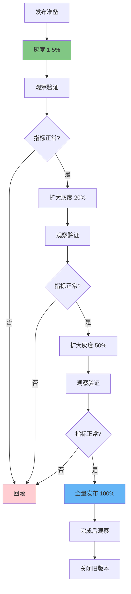
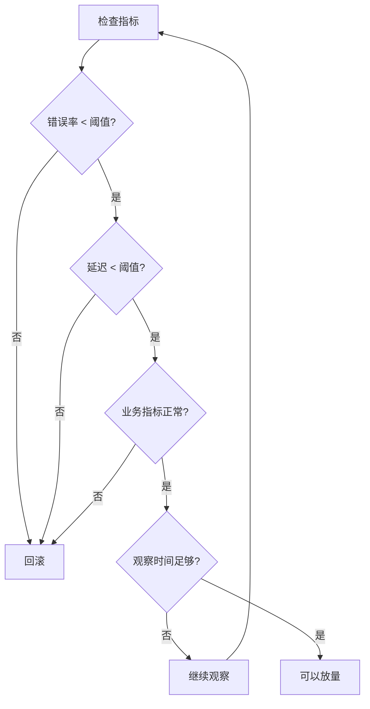
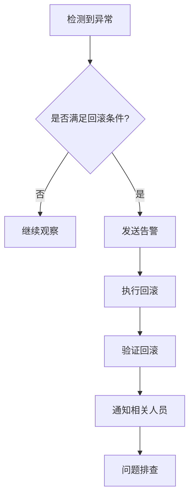

# 灰度到全量：渐进式发布转换与生产环境实践指南

## 情境与背景

灰度发布是保障业务稳定性的关键策略，而从部分灰度到全量发布的转换是整个灰度流程中最关键的环节。本指南详细讲解灰度到全量发布的转换流程、决策依据、技术实现以及生产环境最佳实践。

## 一、灰度发布流程概述

### 1.1 完整灰度发布生命周期

**灰度发布生命周期**：

```markdown
## 灰度发布流程概述

### 完整灰度生命周期

**灰度发布阶段**：



**各阶段说明**：

```yaml
canary_lifecycle:
  preparation:
    description: "发布准备"
    duration: "1-2小时"
    activities:
      - "灰度策略配置"
      - "监控告警设置"
      - "回滚方案准备"
      - "相关人员通知"
      
  phase_1:
    description: "初期灰度"
    percentage: "1-5%"
    duration: "4-8小时"
    purpose: "内部/Beta用户验证"
    
  phase_2:
    description: "小范围验证"
    percentage: "20%"
    duration: "4-8小时"
    purpose: "扩大用户范围"
    
  phase_3:
    description: "扩大范围"
    percentage: "50%"
    duration: "4-8小时"
    purpose: "更大范围验证"
    
  full_release:
    description: "全量发布"
    percentage: "100%"
    duration: "完成"
    purpose: "所有用户"
```
```

### 1.2 灰度到全量的核心问题

**关键决策点**：

```markdown
### 核心问题

**何时可以放量**：

```yaml
promotion_decision:
  criteria:
    - "错误率保持在低水平"
    - "响应时间稳定"
    - "业务指标正常"
    - "无异常告警"
    
  risks:
    - "过早放量增加风险"
    - "过晚放量影响进度"
    - "缺乏数据支撑决策"
```

**转换的核心挑战**：

```yaml
challenges:
  timing:
    problem: "何时扩大灰度比例"
    solution: "基于指标的自动化判断"
    
  rollback:
    problem: "何时需要回滚"
    solution: "设置明确的回滚阈值"
    
  automation:
    problem: "手动操作繁琐易错"
    solution: "使用专业发布工具"
```
```

## 二、转换决策体系

### 2.1 监控指标体系

**核心监控指标**：

```markdown
## 转换决策体系

### 核心监控指标

**四类关键指标**：

```yaml
monitoring_metrics:
  availability:
    name: "可用性指标"
    metrics:
      - "请求成功率"
      - "5XX错误率"
      - "健康检查成功率"
      - "服务可用时间"
    threshold:
      warning: "> 0.5%"
      critical: "> 1%"
      
  performance:
    name: "性能指标"
    metrics:
      - "响应时间 P50"
      - "响应时间 P95"
      - "响应时间 P99"
      - "吞吐量 QPS"
    threshold:
      warning: "> 300ms (P99)"
      critical: "> 500ms (P99)"
      
  business:
    name: "业务指标"
    metrics:
      - "转化率"
      - "下单成功率"
      - "活跃用户数"
      - "用户留存率"
    threshold:
      warning: "下降 > 5%"
      critical: "下降 > 10%"
      
  resource:
    name: "资源指标"
    metrics:
      - "CPU使用率"
      - "内存使用率"
      - "Pod重启次数"
      - "OOM频率"
    threshold:
      warning: "> 70%"
      critical: "> 85%"
```
```

### 2.2 阶段转换条件

**各阶段转换条件**：

```markdown
### 阶段转换条件

**标准转换条件表**：

```yaml
stage_transition_criteria:
  phase_1_to_2:
    from: "1-5%"
    to: "20%"
    criteria:
      duration: "至少4小时"
      error_rate: "< 0.5%"
      p99_latency: "< 500ms"
      success_rate: "> 99.5%"
      business_metrics: "无明显下降"
      
  phase_2_to_3:
    from: "20%"
    to: "50%"
    criteria:
      duration: "至少4小时"
      error_rate: "< 0.2%"
      p99_latency: "< 300ms"
      success_rate: "> 99.8%"
      business_metrics: "无明显下降"
      
  phase_3_to_full:
    from: "50%"
    to: "100%"
    criteria:
      duration: "至少4小时"
      error_rate: "< 0.1%"
      p99_latency: "< 200ms"
      success_rate: "> 99.9%"
      business_metrics: "保持稳定"
```

**决策流程**：


```

### 2.3 自动判断与人工确认

**混合决策模式**：

```markdown
### 自动判断与人工确认

**自动化判断流程**：

```yaml
automated_decision:
  enabled: true
  conditions:
    - "所有指标达标"
    - "持续时间满足"
    - "无人工暂停"
    
  actions:
    auto_promote: true
    auto_rollback: true
    notification: true
```

**人工确认流程**：

```yaml
manual_approval:
  required_for:
    - "P0/P1级别发布"
    - "重大功能变更"
    - "首次使用新版本"
    
  approval_steps:
    - "值班SRE确认"
    - "开发负责人确认"
    - "如有需要业务确认"
```

## 三、技术实现

### 3.1 Argo Rollouts自动放量

**Argo Rollouts配置**：

```markdown
## 技术实现

### Argo Rollouts自动放量

**步进式自动放量**：

```yaml
# Argo Rollouts完整配置
apiVersion: argoproj.io/v1alpha1
kind: Rollout
metadata:
  name: app-rollout
spec:
  replicas: 10
  strategy:
    canary:
      # 步进式放量配置
      steps:
      - setWeight: 5
      - pause: {duration: 10m}      # 第一阶段暂停
      - setWeight: 20
      - pause: {duration: 30m}      # 第二阶段暂停
      - setWeight: 50
      - pause: {duration: 1h}       # 第三阶段暂停
      - setWeight: 100             # 全量
      
      canaryService: app-canary
      stableService: app-stable
      
      # 分析模板
      analysis:
        templates:
        - templateName: success-rate
        - templateName: latency
        startingStep: 1
        args:
        - name: service-name
          value: app-canary
```

**分析模板配置**：

```yaml
# 成功率和延迟分析模板
apiVersion: argoproj.io/v1alpha1
kind: AnalysisTemplate
metadata:
  name: success-rate
spec:
  args:
  - name: service-name
  metrics:
  - name: success-rate
    interval: 2m
    successCondition: result[0] >= 0.99
    failureLimit: 3
    provider:
      prometheus:
        address: http://prometheus:9090
        query: |
          sum(rate(http_requests_total{service="{{args.service-name}}",code=~"2.."}[5m])) /
          sum(rate(http_requests_total{service="{{args.service-name}}"}[5m]))
---
apiVersion: argoproj.io/v1alpha1
kind: AnalysisTemplate
metadata:
  name: latency
spec:
  args:
  - name: service-name
  metrics:
  - name: latency
    interval: 2m
    successCondition: result[0] <= 0.5
    failureLimit: 3
    provider:
      prometheus:
        address: http://prometheus:9090
        query: |
          histogram_quantile(0.99, sum(rate(http_request_duration_seconds_bucket{service="{{args.service-name}}"}[5m])) by (le))
```

**Argo Rollouts命令**：

```bash
# 查看当前状态
kubectl argo rollouts get rollout app-rollout -n default

# 手动暂停
kubectl argo rollouts pause app-rollout -n default

# 手动恢复并继续
kubectl argo rollouts promote app-rollout -n default

# 跳过当前步骤
kubectl argo rollouts skip app-rollout -n default

# 中止并回滚
kubectl argo rollouts abort app-rollout -n default

# 回滚到上一版本
kubectl argo rollouts undo app-rollout -n default

# 观察发布过程
kubectl argo rollouts get rollout app-rollout -n default --watch
```
```

### 3.2 Flagger实现

**Flagger配置**：

```markdown
### Flagger实现

**Flagger安装**：

```bash
# 安装Flagger
helm repo add flagger https://flagger.io
helm install flagger flagger/flagger \
  --namespace=istio-system \
  --set metricsServer=http://prometheus:9090

# 为Istio安装
helm install flagger flagger/flagger \
  --namespace=istio-system \
  --set isc_provider=istio \
  --set metricsServer=http://prometheus:9090
```

**Flagger Canary配置**：

```yaml
# Flagger Canary配置
apiVersion: flagger.app/v1beta1
kind: Canary
metadata:
  name: app-canary
  namespace: default
spec:
  # 目标Deployment
  targetRef:
    apiVersion: apps/v1
    kind: Deployment
    name: app
  # 策略
  strategy:
    type:渐进式
   渐进式:
      stepWeight: 20
      maxWeight: 100
      metricsThreshold:
        successRate: 99
        latencyP99: 500
  # 自动分析
  analysis:
    interval: 1m
    threshold: 3
    maxWeight: 100
    stepWeight: 20
    metrics:
    - name: request-success-rate
      query: |
        sum(rate(istio_requests_total{
          destination="{{target.Name}}",
          status!~"5.*"}[1m]))
        /
        sum(rate(istio_requests_total{
          destination="{{target.Name}}"}[1m]))
      thresholdRange:
        min: 99
    - name: request-duration
      query: |
        histogram_quantile(0.99,
          sum(rate(istio_request_duration_milliseconds_bucket{
            destination="{{target.Name}}"}[1m])) by (le))
      thresholdRange:
        max: 500
```

**Flagger命令**：

```bash
# 查看状态
kubectl get canary -n default

# 手动暂停
kubectl annotate canary app-canary flagger.app/paused=true -n default

# 手动恢复
kubectl annotate canary app-canary flagger.app/paused=false -n default

# 触发分析
kubectl annotate canary app-canary flagger.app/sync=true -n default
```
```

### 3.3 自定义脚本实现

**自定义放量脚本**：

```markdown
### 自定义脚本实现

**灰度放量脚本**：

```bash
#!/bin/bash
# canary-promote.sh

set -e

NAMESPACE=${NAMESPACE:-default}
SERVICE=${SERVICE:-app}
INGRESS=${INGRESS:-app-ingress}
CURRENT_WEIGHT=${1:-10}

echo "开始灰度放量，当前比例: ${CURRENT_WEIGHT}%"

# 更新Ingress权重
kubectl patch ingress ${INGRESS} -n ${NAMESPACE} \
  -p "{\"metadata\":{\"annotations\":{\"nginx.ingress.kubernetes.io/canary-weight\":\"${CURRENT_WEIGHT}\"}}}"

echo "灰度比例已更新为: ${CURRENT_WEIGHT}%"

# 等待观察
echo "等待30分钟观察..."
sleep 1800

# 检查指标
echo "检查指标..."

# 获取错误率
ERROR_RATE=$(kubectl exec -n monitoring prometheus-0 -- \
  wget -qO- "http://localhost:9090/api/v1/query?query=sum(rate(http_requests_total{service=\"${SERVICE}\",code=~\"5..\"}[5m])) / sum(rate(http_requests_total{service=\"${SERVICE}\"}[5m]))" | jq -r '.data.result[0].value[1]' 2>/dev/null || echo "0")

# 获取P99延迟
LATENCY=$(kubectl exec -n monitoring prometheus-0 -- \
  wget -qO- "http://localhost:9090/api/v1/query?query=histogram_quantile(0.99, sum(rate(http_request_duration_seconds_bucket{service=\"${SERVICE}\"}[5m])) by (le))" | jq -r '.data.result[0].value[1]' 2>/dev/null || echo "0")

echo "当前错误率: ${ERROR_RATE}, P99延迟: ${LATENCY}"

# 判断是否可以继续放量
if (( $(echo "${ERROR_RATE} < 0.001" | bc -l) )) && (( $(echo "${LATENCY} < 0.5" | bc -l) )); then
    echo "指标正常，可以继续放量"
    exit 0
else
    echo "指标异常，请检查后手动处理"
    exit 1
fi
```

**自动放量脚本**：

```bash
#!/bin/bash
# auto-promote.sh

set -e

NAMESPACE=${NAMESPACE:-default}
SERVICE=${SERVICE:-app}

# 灰度阶段
STAGES=(5 20 50 100)

for WEIGHT in "${STAGES[@]}"; do
    echo "========== 开始阶段: ${WEIGHT}% =========="
    
    # 更新权重
    kubectl patch ingress app-ingress -n ${NAMESPACE} \
      -p "{\"metadata\":{\"annotations\":{\"nginx.ingress.kubernetes.io/canary-weight\":\"${WEIGHT}\"}}}"
    
    echo "灰度比例设置为: ${WEIGHT}%"
    
    # 观察时间（根据阶段调整）
    if [ ${WEIGHT} -eq 5 ]; then
        OBSERVE_TIME=2400  # 40分钟
    elif [ ${WEIGHT} -eq 20 ]; then
        OBSERVE_TIME=3600  # 60分钟
    else
        OBSERVE_TIME=1800  # 30分钟
    fi
    
    echo "观察${OBSERVE_TIME}秒..."
    sleep ${OBSERVE_TIME}
    
    # 检查指标
    if ! check_metrics; then
        echo "指标检查失败，停止放量"
        exit 1
    fi
    
    echo "阶段 ${WEIGHT}% 完成，继续下一阶段"
done

echo "========== 全量发布完成 =========="
```
```

## 四、生产环境最佳实践

### 4.1 放量节奏控制

**放量节奏最佳实践**：

```markdown
## 生产环境最佳实践

### 放量节奏控制

**标准放量节奏**：

```yaml
promotion_timeline:
  recommended:
    phase_1: "5% 持续 4-8小时"
    phase_2: "20% 持续 4-8小时"
    phase_3: "50% 持续 4-8小时"
    full: "100% 完成"
    
  minimum:
    phase_1: "5% 持续 2小时"
    phase_2: "20% 持续 2小时"
    phase_3: "50% 持续 2小时"
    full: "100% 完成"
    
  aggressive:
    phase_1: "10% 持续 1小时"
    phase_2: "30% 持续 1小时"
    phase_3: "100% 完成"
```

**影响因素**：

```yaml
promotion_factors:
  increase_pace:
    - "新版本经过充分测试"
    - "变更范围小"
    - "历史发布稳定"
    - "非高峰期发布"
    
  decrease_pace:
    - "新版本首次发布"
    - "变更范围大"
    - "历史发布有风险"
    - "高峰期发布"
```
```

### 4.2 回滚策略

**回滚机制**：

```markdown
### 回滚策略

**回滚触发条件**：

```yaml
rollback_conditions:
  immediate:
    - "错误率 > 5%"
    - "服务完全不可用"
    - "核心功能完全失效"
    
  urgent:
    - "错误率 > 2%"
    - "P99延迟 > 2秒"
    - "错误率持续上升"
      
  warning:
    - "错误率 > 1%"
    - "P99延迟 > 1秒"
    - "需要密切关注"
```

**回滚流程**：



**快速回滚脚本**：

```bash
#!/bin/bash
# rollback.sh

set -e

NAMESPACE=${NAMESPACE:-default}
SERVICE=${SERVICE:-app}

echo "开始回滚..."

# 方式1: Ingress回滚
kubectl patch ingress app-ingress -n ${NAMESPACE} \
  -p '{"metadata":{"annotations":{"nginx.ingress.kubernetes.io/canary":"false"}}}'

# 方式2: Service切换
kubectl patch service app-service -n ${NAMESPACE} \
  -p '{"spec":{"selector":{"version":"stable"}}}'

# 方式3: Argo Rollouts回滚
kubectl argo rollouts undo app-rollout -n ${NAMESPACE}

echo "回滚完成"
```
```

### 4.3 监控告警配置

**告警规则配置**：

```yaml
# Prometheus告警规则
groups:
- name: canary-monitoring
  rules:
  - alert: CanaryHighErrorRate
    expr: |
      sum(rate(http_requests_total{service=~".*-canary",code=~"5.."}[5m])) /
      sum(rate(http_requests_total{service=~".*-canary"}[5m])) > 0.02
    for: 3m
    labels:
      severity: critical
    annotations:
      summary: "灰度版本错误率过高"
      description: "灰度版本5XX错误率为 {{ $value | humanizePercentage }}"
      
  - alert: CanaryHighLatency
    expr: |
      histogram_quantile(0.99, sum(rate(http_request_duration_seconds_bucket{service=~".*-canary"}[5m])) by (le)) > 1
    for: 5m
    labels:
      severity: warning
    annotations:
      summary: "灰度版本延迟过高"
      description: "灰度版本P99延迟为 {{ $value }}秒"
      
  - alert: CanarySuccessRate
    expr: |
      sum(rate(http_requests_total{service=~".*-canary",code=~"2.."}[5m])) /
      sum(rate(http_requests_total{service=~".*-canary"}[5m])) < 0.98
    for: 5m
    labels:
      severity: warning
    annotations:
      summary: "灰度版本成功率低"
      description: "灰度版本成功率为 {{ $value | humanizePercentage }}"
```
```

### 4.4 发布流程规范

**完整发布SOP**：

```yaml
# 灰度发布SOP
canary_release_sop:
  pre_release:
    - "制定灰度方案，确定各阶段比例和时间"
    - "配置监控告警，设置回滚阈值"
    - "准备回滚脚本，测试回滚流程"
    - "通知相关人员（开发、测试、运维、业务）"
    - "选择发布时间窗口（非高峰期）"
    
  during_release:
    - "按阶段执行，观察各阶段指标"
    - "每阶段至少观察4小时"
    - "指标异常立即暂停并分析"
    - "每个阶段需要人工确认后才继续"
    - "记录每个阶段的指标数据"
    
  post_release:
    - "全量后继续观察2-4小时"
    - "确认稳定后关闭旧版本"
    - "更新版本文档"
    - "发布总结，记录问题和经验"
```
```

**审批流程**：

```yaml
# 发布审批
release_approval:
  phase_promotion:
    P0: "技术VP + 业务VP审批"
    P1: "运维负责人 + 开发负责人审批"
    P2: "开发负责人审批"
    
  emergency_rollback:
    - "值班SRE可以直接执行"
    - "执行后立即通知"
    - "事后补写故障报告"
```
```

## 五、面试1分钟精简版（直接背）

**完整版**：

灰度到全量是渐进过程：1. 阶段验证：每阶段观察4-8小时，监控错误率、延迟、可用性等核心指标；2. 指标达标：错误率<0.1%、P99<200ms等；3. 手动触发：指标稳定后手动执行全量，或配置Argo Rollouts自动放量；4. 完成切换：全量后保留旧版本Pod一段时间，确认稳定后下线。核心原则是观察-判断-决策，小步快跑发现问题立即回滚。

**30秒超短版**：

灰度转全量分阶段，5%→20%→50%→100%，每阶段观察4-8小时，指标达标才能放量，问题立即回滚。

## 六、总结

### 6.1 转换流程总结

```yaml
conversion_summary:
  phases:
    - "5% 灰度 4-8小时"
    - "20% 灰度 4-8小时"
    - "50% 灰度 4-8小时"
    - "100% 全量"
    
  criteria:
    - "错误率 < 0.1%"
    - "P99 < 200ms"
    - "成功率 > 99.9%"
    
  principle:
    - "小步快跑"
    - "观察验证"
    - "指标说话"
    - "快速回滚"
```

### 6.2 最佳实践清单

```yaml
best_practices:
  preparation:
    - "制定详细的灰度方案"
    - "配置完善的监控告警"
    - "准备回滚方案"
    
  execution:
    - "每阶段充分观察"
    - "指标达标才放量"
    - "异常立即暂停"
    
  completion:
    - "持续观察稳定后离开"
    - "保留旧版本一段时间"
    - "及时关闭旧版本"
```

### 6.3 记忆口诀

```
灰度转全量分阶段，5%到20%再到50%，
观察验证要充分，指标正常才放量，
错误回滚要及时，小步快跑是原则，
放量节奏要控制，稳步推进保安全。
```

> **参考链接**：[SRE运维面试题全解析：从理论到实践（第二部分）]()