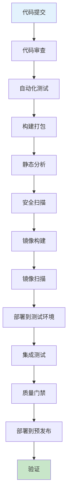
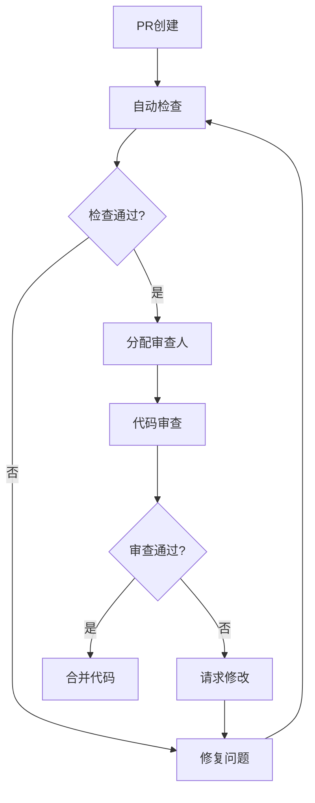

# CI Pipeline设计实战：从代码提交到部署的完整流程

## 情境与背景

持续集成（CI）是DevOps的核心实践，设计一个高效的CI Pipeline能够显著提高开发效率和代码质量。作为高级DevOps/SRE工程师，设计和优化CI Pipeline是必备技能。本博客详细介绍CI Pipeline的设计方法和最佳实践。

## 一、CI Pipeline架构设计

### 1.1 Pipeline架构图

**完整CI Pipeline流程**：



### 1.2 Pipeline阶段详解

**阶段设计**：

```yaml
pipeline_stages:
  stage_1:
    name: "代码审查"
    description: "代码质量检查和人工审查"
    steps:
      - "自动CI触发"
      - "代码格式检查"
      - "PR审查流程"
      - "审查通过后合并"
      
  stage_2:
    name: "自动化测试"
    description: "代码质量验证"
    steps:
      - "单元测试"
      - "集成测试"
      - "代码覆盖率检查"
      
  stage_3:
    name: "构建打包"
    description: "编译代码并打包"
    steps:
      - "依赖安装"
      - "代码编译"
      - "产物打包"
      
  stage_4:
    name: "静态分析"
    description: "代码质量深度分析"
    steps:
      - "代码质量扫描"
      - "代码复杂度分析"
      - "重复代码检测"
      - "依赖版本检查"
      
  stage_5:
    name: "安全扫描"
    description: "安全漏洞检测"
    steps:
      - "依赖漏洞扫描"
      - "代码安全检查"
      - "敏感信息检测"
      
  stage_6:
    name: "镜像构建"
    description: "构建Docker镜像"
    steps:
      - "Dockerfile构建"
      - "镜像标签管理"
      - "镜像推送"
      
  stage_7:
    name: "镜像扫描"
    description: "镜像安全扫描"
    steps:
      - "漏洞扫描"
      - "合规检查"
      
  stage_8:
    name: "部署验证"
    description: "部署到测试环境并验证"
    steps:
      - "部署到测试环境"
      - "集成测试"
      - "功能验证"
```

## 二、代码审查阶段

### 2.1 自动检查

**自动检查配置**：

```yaml
automated_checks:
  linting:
    - "ESLint"
    - "Prettier"
    - "Black"
    - "Flake8"
    
  code_formatting:
    - "自动格式化"
    - "代码风格统一"
    
  branch_protection:
    - "需要PR审查"
    - "至少1人批准"
    - "状态检查通过"
```

### 2.2 PR审查流程

**审查流程**：



## 三、自动化测试阶段

### 3.1 测试分层

**测试分层策略**：

```yaml
test_layers:
  unit_tests:
    description: "单元级别测试"
    coverage_target: "80%"
    tools:
      - "JUnit"
      - "pytest"
      - "Jest"
      
  integration_tests:
    description: "模块集成测试"
    coverage_target: "60%"
    tools:
      - "TestNG"
      - "pytest"
      
  e2e_tests:
    description: "端到端测试"
    coverage_target: "关键路径"
    tools:
      - "Selenium"
      - "Cypress"
      - "Playwright"
      
  performance_tests:
    description: "性能测试"
    tools:
      - "JMeter"
      - "k6"
```

### 3.2 测试执行策略

**测试执行配置**：

```yaml
test_execution:
  parallel_execution: true
  timeout: "30分钟"
  retry_strategy:
    max_retries: 2
    retry_on: ["flaky_tests"]
    
  coverage_thresholds:
    unit: 80%
    integration: 60%
    overall: 70%
```

## 四、构建打包阶段

### 4.1 构建配置

**构建流程**：

```yaml
build_process:
  dependencies:
    - "使用缓存加速"
    - "版本锁定"
    - "安全镜像源"
    
  compilation:
    - "编译优化"
    - "增量构建"
    - "构建缓存"
    
  artifacts:
    - "产物存储"
    - "版本管理"
    - "可追溯性"
```

### 4.2 Docker镜像构建

**镜像构建最佳实践**：

```yaml
docker_build:
  multi_stage: true
  base_image: "alpine:latest"
  build_args:
    - "BUILD_ENV=production"
    
  image_tagging:
    - "git_commit_hash"
    - "semantic_version"
    - "latest"
    
  security:
    - "非root用户"
    - "最小镜像"
    - "清理构建缓存"
```

**Dockerfile示例**：

```dockerfile
# 多阶段构建
FROM node:18-alpine AS builder
WORKDIR /app
COPY package*.json ./
RUN npm ci --only=production
COPY . .
RUN npm run build

FROM node:18-alpine
WORKDIR /app
COPY --from=builder /app/dist ./dist
COPY --from=builder /app/node_modules ./node_modules
USER node
EXPOSE 3000
CMD ["node", "dist/main.js"]
```

## 五、静态分析阶段

### 5.1 代码质量扫描

**静态分析工具**：

```yaml
static_analysis:
  sonarqube:
    enabled: true
    quality_gate:
      - "代码覆盖率≥80%"
      - "重复代码<5%"
      - "代码异味<10"
      - "安全漏洞=0"
      
  checkstyle:
    enabled: true
    config: "google_checks.xml"
    
  eslint:
    enabled: true
    config: "airbnb-base"
```

### 5.2 依赖检查

**依赖管理**：

```yaml
dependency_check:
  vulnerability_scanning:
    - "Snyk"
    - "OWASP Dependency-Check"
    
  license_checking:
    - "合规许可证"
    - "禁止GPL"
    
  version_policy:
    - "定期更新"
    - "安全补丁优先"
    - "版本锁定"
```

## 六、安全扫描阶段

### 6.1 安全检查项目

**安全扫描配置**：

```yaml
security_scanning:
  secrets_detection:
    - "git-secrets"
    - "detect-secrets"
    - "truffleHog"
    
  code_security:
    - "Bandit"
    - "safety"
    - "semgrep"
    
  container_security:
    - "Trivy"
    - "Clair"
    - "Snyk Container"
```

### 6.2 安全门禁

**安全检查规则**：

```yaml
security_gate:
  critical_vulnerabilities: 0
  high_vulnerabilities: 0
  medium_vulnerabilities:
    max: 5
    must_fix: true
    
  secrets_found: 0
  
  allowed_licenses:
    - "MIT"
    - "Apache-2.0"
    - "BSD"
```

## 七、部署验证阶段

### 7.1 环境部署

**部署策略**：

```yaml
deployment_strategy:
  testing:
    environment: "测试环境"
    strategy: "滚动更新"
    replicas: 2
    
  staging:
    environment: "预发布环境"
    strategy: "蓝绿部署"
    replicas: 3
    
  production:
    environment: "生产环境"
    strategy: "灰度发布"
    canary_percentage: 10
```

### 7.2 验证流程

**验证步骤**：

```yaml
validation_process:
  health_check:
    - "服务健康检查"
    - "API可用性"
    - "响应时间"
    
  functional_test:
    - "核心功能验证"
    - "回归测试"
    - "数据完整性"
    
  performance_test:
    - "响应时间"
    - "吞吐量"
    - "错误率"
```

## 八、CI工具链选择

### 8.1 CI平台对比

**平台对比**：

| 平台 | 特点 | 适用场景 |
|:----:|------|----------|
| **Jenkins** | 高度可定制 | 复杂场景 |
| **GitLab CI** | 集成GitLab | 统一平台 |
| **GitHub Actions** | 集成GitHub | GitHub项目 |
| **CircleCI** | 易用性强 | 快速上手 |
| **Travis CI** | 开源友好 | 开源项目 |

### 8.2 工具链推荐

**推荐工具栈**：

```yaml
toolchain:
  ci_platform: "GitLab CI"
  code_review: "GitHub/GitLab PR"
  testing: "pytest/JUnit"
  static_analysis: "SonarQube"
  security: "Snyk/Trivy"
  container: "Docker/BuildKit"
  orchestration: "Kubernetes"
```

## 九、最佳实践

### 9.1 Pipeline优化策略

**优化技巧**：

```yaml
optimization_strategies:
  caching:
    - "依赖缓存"
    - "构建缓存"
    - "测试缓存"
    
  parallelization:
    - "并行测试"
    - "并行构建"
    - "阶段并行"
    
  incremental_build:
    - "仅构建变更"
    - "增量测试"
    - "条件执行"
    
  fast_failure:
    - "早期失败"
    - "快速反馈"
    - "质量门禁"
```

### 9.2 安全最佳实践

**安全建议**：

```yaml
security_best_practices:
  - "最小权限原则"
  - "安全凭证管理"
  - "加密传输"
  - "审计日志"
  - "定期安全扫描"
```

## 十、实战案例

### 10.1 案例：Java项目CI Pipeline

**Jenkins Pipeline示例**：

```groovy
pipeline {
    agent any
    
    stages {
        stage('Checkout') {
            steps {
                checkout scm
            }
        }
        
        stage('Build') {
            steps {
                sh 'mvn clean compile'
            }
        }
        
        stage('Test') {
            steps {
                sh 'mvn test'
            }
            post {
                always {
                    junit 'target/surefire-reports/*.xml'
                }
            }
        }
        
        stage('SonarQube') {
            steps {
                withSonarQubeEnv('SonarQube') {
                    sh 'mvn sonar:sonar'
                }
            }
        }
        
        stage('Build Docker') {
            steps {
                script {
                    docker.build("my-app:${BUILD_NUMBER}")
                }
            }
        }
        
        stage('Deploy') {
            steps {
                sh 'kubectl apply -f deployment.yaml'
            }
        }
    }
}
```

### 10.2 案例：Node.js项目CI Pipeline

**GitHub Actions示例**：

```yaml
name: CI/CD

on:
  push:
    branches: [ main ]
  pull_request:
    branches: [ main ]

jobs:
  build:
    runs-on: ubuntu-latest
    
    steps:
    - uses: actions/checkout@v4
    
    - name: Use Node.js
      uses: actions/setup-node@v4
      with:
        node-version: '18'
        cache: 'npm'
    
    - run: npm ci
    - run: npm run lint
    - run: npm test
    - run: npm run build
    
    - name: Build Docker image
      run: docker build -t my-app:${{ github.sha }} .
    
    - name: Deploy to Kubernetes
      uses: steebchen/kubectl@v2
      with:
        config: ${{ secrets.KUBE_CONFIG }}
        command: apply -f deployment.yaml
```

## 十一、面试1分钟精简版（直接背）

**完整版**：

CI pipeline设计包括以下阶段：代码审查（PR审查、代码质量检查）、构建阶段（编译代码、构建Docker镜像）、测试阶段（单元测试、集成测试、E2E测试）、静态分析（代码质量扫描、依赖检查）、安全扫描（漏洞扫描、依赖安全检查）、部署阶段（部署到测试/预发布环境）。关键要点：自动化、快速反馈、质量门禁、可追溯性。

**30秒超短版**：

代码审查、测试、构建、静态分析、安全扫描、部署验证。

## 十二、总结

### 12.1 Pipeline设计要点

```yaml
design_principles:
  - "自动化"
  - "快速反馈"
  - "质量门禁"
  - "可追溯性"
  - "安全性"
  - "可扩展性"
```

### 12.2 最佳实践清单

```yaml
best_practices:
  - "使用缓存加速构建"
  - "并行执行测试"
  - "设置质量门禁"
  - "安全扫描集成"
  - "镜像标签规范"
  - "部署策略选择"
```

### 12.3 记忆口诀

```
CI Pipeline设计好，代码审查第一道，
测试覆盖要达标，构建打包效率高，
静态分析找问题，安全扫描不可少，
镜像构建标准化，部署验证质量保。
```

> **参考链接**：[SRE运维面试题全解析：从理论到实践（第二部分）]()