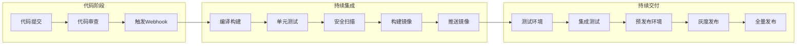
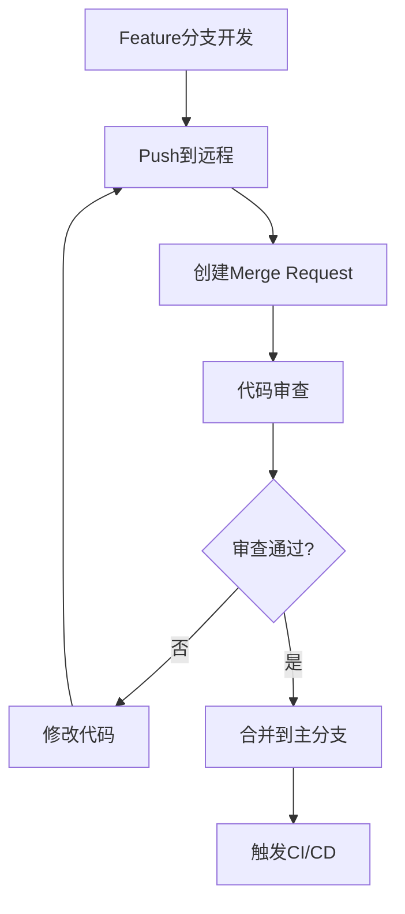

# CI/CD全流程详解：从代码提交到生产发布的完整实践指南

## 情境与背景

CI/CD（持续集成/持续交付）是现代软件交付的核心实践。本指南详细讲解从代码提交到生产发布的完整CI/CD流程，包括各阶段的核心概念、工具选型、以及生产环境最佳实践。

## 一、CI/CD整体架构

### 1.1 整体流程图

**CI/CD全流程架构**：

```markdown
## CI/CD整体架构

### 整体流程图

**完整流水线图**：



**核心概念**：

```yaml
cicd_concepts:
  CI:
    full_name: "Continuous Integration"
    meaning: "持续集成"
    goal: "频繁集成代码，快速发现错误"
    
  CD:
    full_name: "Continuous Delivery/Deployment"
    meaning: "持续交付/部署"
    goal: "自动化交付流程，快速发布"
    
  GitOps:
    full_name: "GitOps"
    meaning: "Git运维"
    goal: "以Git为唯一真相源"
```
```

### 1.2 工具链概览

**常见工具栈**：

```yaml
toolchain_overview:
  source_code:
    - "GitLab"
    - "GitHub"
    - "Gitea"
    
  ci_cd:
    - "Jenkins"
    - "GitLab CI"
    - "GitHub Actions"
    - "ArgoCD"
    - "Tekton"
    
  container:
    - "Docker"
    - "BuildKit"
    - "Kaniko"
    
  registry:
    - "Harbor"
    - "ACR"
    - "ECR"
    - "GCR"
    
  security:
    - "Trivy"
    - "Snyk"
    - "Clair"
    - "Falco"
    
  orchestration:
    - "Kubernetes"
    - "Helm"
    - "Kustomize"
```
```

## 二、代码阶段

### 2.1 代码提交流程

**代码提交管理**：

```markdown
## 代码阶段

### 代码提交流程

**代码管理流程**：



**分支策略**：

```yaml
branch_strategy:
  gitflow:
    branches:
      - "main/master: 生产分支"
      - "release: 发布分支"
      - "develop: 开发分支"
      - "feature: 功能分支"
      - "hotfix: 热修复分支"
      
  trunk_based:
    branches:
      - "main: 唯一主干"
      - "feature/*: 短期功能分支"
      
  choosing:
    recommendation: "小团队用trunk-based，大团队用gitflow"
```

**Commit规范**：

```yaml
commit_convention:
  format: "<type>(<scope>): <subject>"
  
  types:
    - "feat: 新功能"
    - "fix: 修复bug"
    - "docs: 文档更新"
    - "style: 代码格式"
    - "refactor: 重构"
    - "test: 测试"
    - "chore: 构建/工具"
    
  example:
    - "feat(auth): add OAuth2 login support"
    - "fix(payment): resolve double charge issue"
```
```

### 2.2 Webhook触发

**Webhook配置**：

```yaml
webhook_trigger:
  gitlab:
    url: "https://jenkins.example.com/gitlab-webhook"
    triggers:
      - "Push events"
      - "Merge request events"
      - "Tag push events"
      
  github:
    url: "https://jenkins.example.com/github-webhook"
    triggers:
      - "push"
      - "pull_request"
      
  auth:
    - "Secret token"
    - "SSL certificate"
```
```

## 三、持续集成阶段

### 3.1 编译构建

**构建策略**：

```markdown
## 持续集成阶段

### 编译构建

**多语言构建**：

```yaml
language_build:
  java:
    build_tool: "Maven/Gradle"
    command: "mvn clean package"
    output: "target/*.jar"
    
  nodejs:
    build_tool: "npm/yarn/pnpm"
    command: "npm ci && npm run build"
    output: "dist/"
    
  python:
    build_tool: "pip/poetry"
    command: "poetry install && poetry build"
    output: "dist/"
    
  golang:
    build_tool: "go build"
    command: "go build -o app"
    output: "app"
```

**构建优化**：

```yaml
build_optimization:
  cache:
    - "依赖缓存（maven/npm/go mod）"
    - "构建产物缓存"
    - "分布式缓存（Redis）"
    
  parallel:
    - "多阶段并行"
    - "多容器并行"
    
  incremental:
    - "增量构建"
    - "仅构建变更模块"
```
```

### 3.2 单元测试

**测试策略**：

```yaml
test_strategy:
  unit_test:
    coverage_target: "> 80%"
    framework:
      java: "JUnit/Mockito"
      nodejs: "Jest/Mocha"
      python: "pytest/unittest"
      
  integration_test:
    purpose: "验证组件间交互"
    framework:
      java: "TestNG"
      nodejs: "Supertest"
      
  e2e_test:
    purpose: "端到端验证"
    framework: "Cypress/Playwright"
```

**测试报告**：

```yaml
test_report:
  format:
    - "JUnit XML"
    - "Cobertura XML"
    - "SonarQube"
    
  metrics:
    - "代码覆盖率"
    - "测试通过率"
    - "测试执行时间"
```
```

### 3.3 安全扫描

**安全扫描工具**：

```markdown
### 安全扫描

**SAST静态分析**：

```yaml
sast_tools:
  trivy:
    type: "容器/代码扫描"
    scan: "漏洞、配置错误、密钥"
    
  sonarqube:
    type: "代码质量/安全"
    scan: "代码异味、安全热点"
    
  snyk:
    type: "依赖漏洞"
    scan: "已知CVE"
```

**DAST动态扫描**：

```yaml
dast_tools:
  owasp_zap:
    type: "动态应用安全测试"
    scan: "OWASP Top 10"
    
  burp_suite:
    type: "Web漏洞扫描"
    scan: "SQL注入、XSS等"
```

**密钥扫描**：

```yaml
secret_detection:
  tools:
    - "Gitleaks"
    - "TruffleHog"
    - "git-secrets"
    
  scan_target:
    - "API密钥"
    - "密码凭证"
    - "私钥文件"
```
```

## 四、镜像构建阶段

### 4.1 Dockerfile优化

**镜像构建策略**：

```markdown
## 镜像构建阶段

### Dockerfile优化

**多阶段构建**：

```dockerfile
# 构建阶段
FROM maven:3.8-openjdk-11 AS builder
WORKDIR /app
COPY pom.xml .
RUN mvn dependency:go-offline
COPY src ./src
RUN mvn clean package -DskipTests

# 运行阶段
FROM openjdk:11-jre-slim
WORKDIR /app
COPY --from=builder /app/target/*.jar app.jar
EXPOSE 8080
ENTRYPOINT ["java", "-jar", "app.jar"]
```

**镜像优化原则**：

```yaml
image_optimization:
  small_base:
    - "使用Alpine等轻量镜像"
    - "scratch用于静态语言"
    
  layer_order:
    - "不常变化层放前面"
    - "变化频繁层放后面"
    
  cache:
    - "利用构建缓存"
    - "依赖安装先于代码复制"
```
```

**BuildKit优化**：

```yaml
buildkit_optimization:
  features:
    - "并行构建"
    - "增量快照"
    - "自动垃圾回收"
    
  config:
    - "DOCKER_BUILDKIT=1"
    - "docker buildx"
```
```

### 4.2 镜像推送

**镜像标签策略**：

```yaml
image_tagging:
  git_hash:
    format: "git-{short_hash}"
    example: "git-a1b2c3d"
    
  semver:
    format: "v{major}.{minor}.{patch}"
    example: "v1.2.3"
    
  datetime:
    format: "YYYYMMDD-HHmmss"
    example: "20260509-143000"
    
  latest:
    usage: "仅用于latest标签"
```

**Registry配置**：

```yaml
registry_config:
  push:
    command: "docker push registry.example.com/app:v1"
    
  auth:
    - "kubectl create secret docker-registry"
    - "imagePullSecrets"
    
  policy:
    - "定期清理旧镜像"
    - "保留策略（保留最近N个版本）"
```
```

## 五、持续交付阶段

### 5.1 环境管理

**多环境架构**：

```markdown
## 持续交付阶段

### 环境管理

**环境划分**：

```yaml
environment_structure:
  dev:
    name: "开发环境"
    purpose: "日常开发测试"
    data: "Mock数据"
    
  test:
    name: "测试环境"
    purpose: "功能/集成测试"
    data: "脱敏生产数据"
    
  staging:
    name: "预发布环境"
    purpose: "生产镜像验证"
    data: "生产数据副本"
    
  prod:
    name: "生产环境"
    purpose: "正式服务"
    data: "真实数据"
```

**环境一致性**：

```yaml
consistency:
  k8s:
    - "使用相同版本K8s"
    - "相同CNI/存储方案"
    
  config:
    - "ConfigMap/Secret差异化"
    - "Kustomize/Helm overlay"
```
```

### 5.2 部署策略

**部署方式对比**：

```yaml
deployment_strategies:
  rolling_update:
    description: "滚动更新"
    downtime: "无"
    rollback: "快速"
    risk: "低"
    
  blue_green:
    description: "蓝绿部署"
    downtime: "无"
    rollback: "即时"
    risk: "低"
    
  canary:
    description: "灰度发布"
    downtime: "无"
    rollback: "渐进"
    risk: "极低"
    
  recreate:
    description: "重建部署"
    downtime: "有"
    rollback: "慢"
    risk: "高"
```
```

### 5.3 灰度发布

**灰度策略**：

```yaml
canary_strategy:
  traffic_weight:
    - "初始: 5%"
    - "验证通过: 20%"
    - "验证通过: 50%"
    - "全量: 100%"
    
  dimension:
    - "Header: X-Canary"
    - "Cookie: canary_weight"
    - "IP Hash: 地域"
    - "用户ID: 特定用户群"
```

**Flagger配置**：

```yaml
flagger_config:
  apiVersion: flagger.app/v1beta1
  kind: Canary
  spec:
    targetRef:
      apiVersion: apps/v1
      kind: Deployment
      name: app
    analysis:
      interval: 1m
      threshold: 5
      stepWeight: 10
      metrics:
        - name: request-success-rate
        - name: request-duration
```
```

## 六、生产环境最佳实践

### 6.1 流水线设计

**Jenkinsfile示例**：

```yaml
# Jenkinsfile示例
pipeline {
  agent {
    kubernetes {
      label 'jenkins-agent'
      defaultContainer 'jnlp'
    }
  }
  
  environment {
    REGISTRY = 'harbor.example.com'
    APP_NAME = 'myapp'
  }
  
  stages {
    stage('Checkout') {
      steps {
        checkout scm
      }
    }
    
    stage('Build') {
      steps {
        container('maven') {
          sh 'mvn clean package -DskipTests'
        }
      }
    }
    
    stage('Test') {
      steps {
        container('maven') {
          sh 'mvn test'
        }
        junit 'target/surefire-reports/*.xml'
      }
    }
    
    stage('Security Scan') {
      steps {
        container('trivy') {
          sh 'trivy image --exit-code 1 --severity HIGH,CRITICAL ${REGISTRY}/${APP_NAME}:${BUILD_NUMBER}'
        }
      }
    }
    
    stage('Build Image') {
      steps {
        container('docker') {
          sh """
            docker build -t ${REGISTRY}/${APP_NAME}:${BUILD_NUMBER} .
            docker push ${REGISTRY}/${APP_NAME}:${BUILD_NUMBER}
          """
        }
      }
    }
    
    stage('Deploy to Test') {
      steps {
        sh """
          kubectl set image deployment/${APP_NAME} \
            ${APP_NAME}=${REGISTRY}/${APP_NAME}:${BUILD_NUMBER} \
            -n test
        """
      }
    }
    
    stage('Deploy to Staging') {
      steps {
        input message: 'Deploy to Staging?', ok: 'Deploy'
        sh """
          kubectl set image deployment/${APP_NAME} \
            ${APP_NAME}=${REGISTRY}/${APP_NAME}:${BUILD_NUMBER} \
            -n staging
        """
      }
    }
  }
  
  post {
    always {
      cleanWs()
    }
  }
}
```
```

### 6.2 GitOps实践

**ArgoCD配置**：

```yaml
# ArgoCD Application
apiVersion: argoproj.io/v1alpha1
kind: Application
metadata:
  name: myapp
  namespace: argocd
spec:
  project: default
  source:
    repoURL: https://github.com/example/k8s-config.git
    targetRevision: HEAD
    path: production
  destination:
    server: https://kubernetes.default.svc
    namespace: production
  syncPolicy:
    automated:
      prune: true
      selfHeal: true
    syncOptions:
      - CreateNamespace=true
```
```

### 6.3 回滚策略

**回滚方法**：

```yaml
rollback_strategies:
  kubectl:
    command: "kubectl rollout undo deployment/app"
    
  helm:
    command: "helm rollback app 1"
    
  argocd:
    action: "点击Rollback按钮"
    
  image:
    previous_tag: "使用上一版本镜像"
```

**自动回滚配置**：

```yaml
auto_rollback:
  metrics:
    - "错误率 > 5%"
    - "延迟 > 500ms"
    
  action:
    - "自动触发回滚"
    - "发送告警通知"
```
```

### 6.4 监控与质量门禁

**质量门禁**：

```yaml
quality_gates:
  test:
    - "单元测试通过率 > 90%"
    - "代码覆盖率 > 80%"
    
  security:
    - "高危漏洞数 = 0"
    - "密钥泄露检查通过"
    
  performance:
    - "构建时间 < 10分钟"
    - "镜像大小 < 500MB"
    
  deployment:
    - "健康检查通过"
    - "无严重告警"
```

**Prometheus指标**：

```yaml
cicd_metrics:
  build_duration_seconds:
    description: "构建耗时"
    
  deployment_frequency:
    description: "部署频率"
    
  change_failure_rate:
    description: "变更失败率"
    
  lead_time:
    description: "代码提交到部署时间"
```
```

## 七、面试1分钟精简版（直接背）

**完整版**：

CI/CD全流程：1. 代码阶段：Git提交触发Webhook，代码审查通过后触发流水线；2. 构建阶段：Maven/npm编译代码，执行单元测试生成测试报告；3. 镜像阶段：Dockerfile构建镜像，Trivy安全扫描，推送到Registry；4. 部署阶段：通过ArgoCD/Helm部署到测试环境，执行集成测试；5. 发布阶段：预发布环境验证，灰度发布（如5%流量），逐步放量到全量。核心工具链：GitLab/GitHub管理代码，Jenkins/ArgoCD做流水线，Harbor/ACR存储镜像，K8s运行服务。

**30秒超短版**：

CI/CD流程：代码提交触发构建，编译测试后打包镜像，安全扫描推送到仓库，通过GitOps部署到K8s，灰度验证后全量发布。

## 八、总结

### 8.1 流程总结

```yaml
cicd_flow_summary:
  code: "代码提交 → MR审查 → 合并"
  build: "编译构建 → 单元测试 → 安全扫描"
  image: "Dockerfile → 构建镜像 → 推送仓库"
  deploy: "测试环境 → 预发布 → 灰度 → 全量"
  operate: "监控 → 告警 → 回滚"
```

### 8.2 工具选型总结

```yaml
tool_selection:
  small_team:
    - "GitHub Actions + GitHub Container Registry"
    - "简单快速"
    
  medium_team:
    - "GitLab + GitLab CI + Harbor"
    - "功能完整"
    
  large_team:
    - "GitLab + Jenkins + ArgoCD + Harbor"
    - "高度定制"
```

### 8.3 记忆口诀

```
CI/CD流程记得牢，代码提交是起点，
编译构建不能少，单元测试要达标，
安全扫描查漏洞，镜像构建推送好，
测试环境先部署，集成测试要通过，
预发布来验证，灰度发布风险小，
全量上线稳又准，监控告警保运行。
```

> **参考链接**：[SRE运维面试题全解析：从理论到实践（第二部分）]()