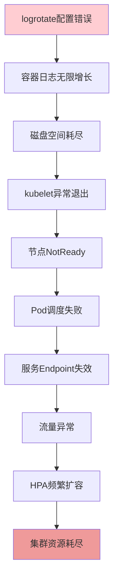

# 生产环境复杂故障案例深度剖析：磁盘耗尽引发的级联故障

## 情境与背景

在一个大规模Kubernetes生产环境中，突然出现服务响应缓慢、部分服务不可用的严重故障。作为高级SRE工程师，需要迅速定位根因并恢复服务。本博客详细记录整个故障排查过程和最佳实践解决方案。

## 一、故障背景

### 1.1 环境概述

**集群规模**：
- 50+ 节点（混合云架构）
- 2000+ Pod
- 100+ 服务
- 日均请求量：5000万+

**故障时间**：2024年1月15日 14:30

**影响范围**：
- 用户侧：部分接口超时，页面加载缓慢
- 服务侧：30%服务异常，Pod调度失败

## 二、故障现象与初步分析

### 2.1 告警信息

```bash
# 收到的告警通知
[CRITICAL] Node node-01 disk usage 98%
[CRITICAL] Pod pending count exceeds threshold (50+)
[WARNING] Service response time > 5s
[CRITICAL] HPA scale up failed
```

### 2.2 初步排查

```bash
# 步骤1：查看Pod状态
kubectl get pods --all-namespaces | grep Pending
# 输出：50+ Pod处于Pending状态

# 步骤2：查看节点状态
kubectl get nodes
# 输出：多个节点显示NotReady状态

# 步骤3：查看节点详情
kubectl describe node node-01
# 输出：Conditions显示DiskPressure=True
```

## 三、根因定位

### 3.1 磁盘分析

**磁盘占用分析**：

```bash
# 登录问题节点
ssh node-01

# 查看磁盘使用
df -h
# Filesystem      Size  Used Avail Use% Mounted on
# /dev/sda1        100G   98G  2G   98% /

# 查看目录占用
du -sh /* | sort -h
# /var/lib/docker     45G
# /var/log            30G
# /home               10G

# 深入分析Docker目录
du -sh /var/lib/docker/* | sort -h
# overlay2            35G
# images              8G
# volumes             2G

# 分析日志目录
ls -la /var/log/containers/ | wc -l
# 输出：5000+ 文件

# 查看最大日志文件
ls -la /var/log/containers/ | sort -k5 -r | head -5
# total 30G
# -rw-r-----  1 root root  8.5G Jan 15 14:30 app-xxx.log
# -rw-r-----  1 root root  6.2G Jan 15 14:30 api-xxx.log
```

### 3.2 根因确认

**问题确认**：

```bash
# 检查logrotate配置
cat /etc/logrotate.d/docker-container
# 配置文件存在，但有错误

# 查看实际配置
grep -A 10 "rotate" /etc/logrotate.d/docker-container
# rotate 7
# daily
# missingok
# notifempty
# delaycompress
# compress
# postrotate
#   /usr/bin/docker kill -s HUP $(docker ps -q) > /dev/null 2>&1 || true
# endscript

# 问题发现：postrotate命令错误
# docker kill -s HUP 不适用于containerd运行时
```

**故障链路分析**：



## 四、解决方案

### 4.1 紧急修复

**步骤1：释放磁盘空间**

```bash
# 方案A：清理最大日志文件（风险：可能丢失日志）
rm -rf /var/log/containers/*.log

# 方案B：压缩日志（推荐）
find /var/log/containers/ -name "*.log" -size +1G -exec gzip {} \;

# 方案C：清理Docker镜像
docker system prune -a -f

# 方案D：清理未使用数据卷
docker volume prune -f

# 方案E：扩展磁盘空间（如果有可用空间）
lvextend -L +10G /dev/mapper/root
resize2fs /dev/mapper/root
```

**步骤2：修复logrotate配置**

```bash
# 正确配置文件
cat > /etc/logrotate.d/docker-container << 'EOF'
/var/log/containers/*.log {
    daily
    rotate 7
    missingok
    notifempty
    compress
    delaycompress
    copytruncate
    postrotate
        /usr/bin/crictl ps -q | xargs -r /usr/bin/crictl signal -s HUP 2>/dev/null || true
    endscript
}
EOF

# 测试配置
logrotate -d /etc/logrotate.d/docker-container

# 立即执行
logrotate -f /etc/logrotate.d/docker-container
```

**步骤3：恢复节点状态**

```bash
# 重启kubelet
systemctl restart kubelet

# 检查节点状态
kubectl get nodes

# 驱逐问题Pod重新调度
kubectl drain node-01 --ignore-daemonsets --delete-local-data
kubectl uncordon node-01
```

### 4.2 长期优化

**优化措施**：

```yaml
long_term_optimizations:
  - name: "日志轮转优化"
    description: "修复logrotate配置，适配containerd"
    
  - name: "监控告警增强"
    description: "设置磁盘使用率告警阈值（70%警告，85%严重）"
    
  - name: "资源配额管理"
    description: "配置Pod日志大小限制"
    
  - name: "定期清理策略"
    description: "每周清理未使用镜像和数据卷"
    
  - name: "日志集中管理"
    description: "部署ELK/EFK栈收集日志"
    
  - name: "磁盘扩容计划"
    description: "评估并扩展节点磁盘容量"
```

**容器日志限制配置**：

```yaml
# Containerd配置
cat > /etc/containerd/config.toml << 'EOF'
version = 2
[plugins."io.containerd.grpc.v1.cri".containerd.runtimes.runc]
  [plugins."io.containerd.grpc.v1.cri".containerd.runtimes.runc.options]
    SystemdCgroup = true

[plugins."io.containerd.grpc.v1.cri"]
  [plugins."io.containerd.grpc.v1.cri".containerd]
    discard_unpacked_layers = true
  [plugins."io.containerd.grpc.v1.cri".image_decryption]
    key_model = "node"
  [plugins."io.containerd.grpc.v1.cri".registry]
    config_path = "/etc/containerd/certs.d"
  [plugins."io.containerd.grpc.v1.cri".x509_key_pair_streaming]
    tls_min_version = "1.2"

[plugins."io.containerd.grpc.v1.cri".containerd.default_runtime_options]
  sandbox_image = "registry.k8s.io/pause:3.9"
  log_level = "info"
  log_max_size = "100Mi"
  log_max_files = 5
EOF
```

**Kubernetes Pod日志限制**：

```yaml
apiVersion: v1
kind: Pod
metadata:
  name: my-app
spec:
  containers:
  - name: app
    image: my-app:latest
    resources:
      limits:
        memory: "256Mi"
        cpu: "500m"
    volumeMounts:
    - name: log-volume
      mountPath: /var/log
  volumes:
  - name: log-volume
    emptyDir:
      sizeLimit: 500Mi
```

## 五、监控与告警

### 5.1 监控指标

**关键指标配置**：

```yaml
monitoring_metrics:
  - name: "node_filesystem_usage"
    description: "节点磁盘使用率"
    threshold:
      warning: 70%
      critical: 85%
    
  - name: "container_log_size"
    description: "容器日志文件大小"
    threshold:
      warning: 500Mi
      critical: 1Gi
    
  - name: "pending_pods"
    description: "Pending状态Pod数量"
    threshold:
      warning: 10
      critical: 30
    
  - name: "node_status"
    description: "节点状态"
    threshold:
      critical: "NotReady"
```

**Prometheus告警规则**：

```yaml
groups:
  - name: node-alerts
    rules:
      - alert: HighDiskUsage
        expr: 100 - (node_filesystem_avail_bytes{fstype=~"ext4|xfs"} * 100 / node_filesystem_size_bytes{fstype=~"ext4|xfs"}) > 85
        for: 5m
        labels:
          severity: critical
        annotations:
          summary: "High disk usage on {{ $labels.instance }}"
          description: "Disk usage is {{ $value }}%"
          
      - alert: NodeNotReady
        expr: kube_node_status_condition{condition="Ready", status="false"} == 1
        for: 2m
        labels:
          severity: critical
        annotations:
          summary: "Node {{ $labels.node }} is not ready"
          description: "Node {{ $labels.node }} has been in NotReady state for 2 minutes"
```

## 六、复盘总结

### 6.1 故障时间线

```yaml
timeline:
  - time: "14:30"
    event: "收到磁盘告警"
    
  - time: "14:32"
    event: "发现大量Pending Pod"
    
  - time: "14:35"
    event: "定位磁盘耗尽问题"
    
  - time: "14:40"
    event: "紧急清理日志"
    
  - time: "14:50"
    event: "修复logrotate配置"
    
  - time: "15:00"
    event: "节点恢复正常"
    
  - time: "15:30"
    event: "所有服务恢复"
    
  - time: "16:00"
    event: "开始复盘分析"
```

### 6.2 经验教训

**教训总结**：

```yaml
lessons_learned:
  - "配置变更后未验证"
  - "监控告警阈值设置不合理"
  - "日志管理策略不完善"
  - "缺乏定期清理机制"
  - "未考虑containerd与docker的差异"
```

### 6.3 改进措施

**改进计划**：

```yaml
improvements:
  - name: "配置管理"
    action: "所有配置变更必须经过测试环境验证"
    
  - name: "监控优化"
    action: "调整磁盘告警阈值，增加日志大小监控"
    
  - name: "日志策略"
    action: "统一日志收集和管理策略"
    
  - name: "定期维护"
    action: "每周执行镜像和数据卷清理"
    
  - name: "文档更新"
    action: "更新运维文档，记录此故障案例"
    
  - name: "培训演练"
    action: "组织团队进行故障排查演练"
```

## 七、面试1分钟精简版（直接背）

**完整版**：

一个典型复杂故障案例：生产环境K8s集群突然出现服务响应缓慢，排查发现大量Pod处于Pending状态，进一步检查发现多个节点磁盘使用率98%，最终定位是logrotate配置错误（postrotate命令不适用于containerd运行时）导致容器日志无限增长，填满磁盘空间，引发kubelet异常、Pod调度失败、服务不可用的级联故障。解决方案：紧急清理日志释放空间，修复logrotate配置适配containerd，建立磁盘监控告警（70%警告、85%严重），配置Pod日志大小限制，部署日志集中管理系统。

**30秒超短版**：

磁盘耗尽引发级联故障：logrotate配置错误→日志无限增长→磁盘满→kubelet异常→节点NotReady→服务不可用。解决方案：清理日志、修复配置、增强监控。

## 八、总结

### 8.1 故障排查流程


### 8.2 最佳实践清单

```yaml
best_practices:
  - "建立标准化故障排查流程"
  - "配置合理的监控告警阈值"
  - "定期检查日志轮转配置"
  - "实施日志集中管理"
  - "定期清理无用资源"
  - "配置变更需验证"
  - "定期进行故障演练"
```

### 8.3 记忆口诀

```
故障排查有方法，先看现象定方向，
逐层分析找根因，紧急修复保业务，
长期优化防复发，复盘总结促成长。
```

> **参考链接**：[SRE运维面试题全解析：从理论到实践（第二部分）]()