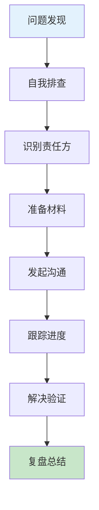

# DevOps跨部门协作：复杂问题推动解决的最佳实践

## 情境与背景

在大型企业中，系统架构日益复杂，一个问题往往涉及多个团队。作为高级DevOps/SRE工程师，不仅需要技术能力，更需要具备跨部门协作和问题推动能力。本博客分享跨部门协作的方法论和最佳实践。

## 一、问题推动方法论

### 1.1 标准化流程

**跨部门问题推动六步法**：



### 1.2 流程详细说明

**步骤详解**：

```yaml
process_steps:
  step_1:
    name: "问题发现"
    description: "通过监控告警、用户反馈或日志发现问题"
    actions:
      - "确认问题真实性"
      - "记录问题时间和现象"
      
  step_2:
    name: "自我排查"
    description: "在自己职责范围内进行排查"
    actions:
      - "收集日志和监控数据"
      - "尝试复现问题"
      - "定位问题范围"
      
  step_3:
    name: "识别责任方"
    description: "根据系统架构确定相关团队"
    actions:
      - "查看架构文档"
      - "识别上下游依赖"
      - "确定主要责任团队"
      
  step_4:
    name: "准备材料"
    description: "整理问题相关信息"
    actions:
      - "问题描述"
      - "影响范围和严重程度"
      - "复现步骤"
      - "已收集的证据"
      
  step_5:
    name: "发起沟通"
    description: "与相关团队建立沟通"
    actions:
      - "选择合适的沟通渠道"
      - "清晰说明问题"
      - "请求协助"
      
  step_6:
    name: "跟踪进度"
    description: "持续跟进问题解决进度"
    actions:
      - "定期检查状态"
      - "保持沟通透明度"
      - "协调资源"
      
  step_7:
    name: "解决验证"
    description: "验证问题是否解决"
    actions:
      - "执行验证测试"
      - "确认问题解决"
      - "通知相关方"
      
  step_8:
    name: "复盘总结"
    description: "总结经验教训"
    actions:
      - "记录问题和解决方案"
      - "提出改进建议"
      - "分享经验"
```

## 二、自我排查技巧

### 2.1 信息收集清单

**必须收集的信息**：

```yaml
information_checklist:
  - "问题发生时间点"
  - "影响范围（用户、服务、区域）"
  - "错误日志和堆栈信息"
  - "监控指标（CPU、内存、网络、磁盘）"
  - "相关配置变更记录"
  - "依赖服务状态"
  - "问题复现步骤"
```

### 2.2 排查工具

**常用排查工具**：

```bash
# 日志查看
kubectl logs <pod>
journalctl -u <service>
grep -r "error" /var/log/

# 监控查询
kubectl top nodes
kubectl top pods
curl http://prometheus:9090/api/v1/query

# 网络诊断
kubectl exec -it <pod> -- ping <host>
kubectl exec -it <pod> -- curl <service>

# 配置检查
kubectl get configmap <name> -o yaml
kubectl get secret <name> -o yaml
```

## 三、识别责任方

### 3.1 系统架构分析

**架构分析方法**：

```yaml
architecture_analysis:
  - "查看系统架构图"
  - "识别服务依赖关系"
  - "确定数据流向"
  - "划分责任边界"
```

**常见责任划分**：

| 组件 | 责任团队 |
|:----:|----------|
| **前端** | 前端开发团队 |
| **API网关** | 架构/平台团队 |
| **微服务** | 业务开发团队 |
| **数据库** | DBA团队 |
| **消息队列** | 中间件团队 |
| **基础设施** | DevOps/SRE团队 |

### 3.2 责任边界确认

**责任边界示例**：

```yaml
responsibility_boundaries:
  frontend_team:
    - "前端代码开发和维护"
    - "前端性能优化"
    - "UI bug修复"
    
  backend_team:
    - "API开发和维护"
    - "业务逻辑实现"
    - "数据库交互"
    
  devops_team:
    - "基础设施部署"
    - "监控告警配置"
    - "CI/CD流程"
    
  dba_team:
    - "数据库配置和优化"
    - "数据备份和恢复"
    - "性能调优"
```

## 四、准备材料

### 4.1 问题描述模板

**问题描述模板**：

```markdown
## 问题描述

**问题标题**：[简洁描述问题]

**问题类型**：[故障/性能/功能/安全]

**严重程度**：[P0-P4]

**影响范围**：
- 用户：[受影响用户数/比例]
- 服务：[受影响服务列表]
- 区域：[受影响区域]

**问题时间线**：
- 发现时间：YYYY-MM-DD HH:MM:SS
- 首次出现：YYYY-MM-DD HH:MM:SS（如果已知）

**问题现象**：
- [详细描述问题现象]
- [错误信息截图或日志片段]

**已排查步骤**：
- [步骤1]：[结果]
- [步骤2]：[结果]
- [步骤3]：[结果]

**怀疑原因**：
- [原因1]
- [原因2]

**复现步骤**：
1. [步骤1]
2. [步骤2]
3. [步骤3]

**相关日志**：
```
[日志片段]
```

**相关监控截图**：
- [截图链接或描述]
```

### 4.2 沟通材料示例

**沟通材料示例**：

```markdown
## 紧急问题：API响应超时

**严重程度**：P1 - 高

**影响范围**：
- 用户：约30%用户受影响
- 服务：订单服务、支付服务
- 区域：华北区

**问题现象**：
- API响应时间超过5秒
- 部分请求超时失败
- 错误率约15%

**已排查**：
- 检查Pod状态：正常
- 检查节点资源：CPU 40%，内存 60%
- 检查数据库连接：正常
- 检查网络：无异常

**怀疑原因**：
- 上游服务响应慢
- 数据库查询慢

**请求协助**：
- 需要后端团队检查订单服务逻辑
- 需要DBA团队检查数据库性能

**联系人**：张三 <zhangsan@example.com>
```

## 五、发起沟通

### 5.1 沟通渠道选择

**沟通渠道对比**：

| 渠道 | 特点 | 适用场景 |
|:----:|------|----------|
| **即时通讯** | 快速响应 | 紧急问题、简单沟通 |
| **邮件** | 正式、可追溯 | 非紧急问题、需要记录 |
| **工单系统** | 流程化、可跟踪 | 需要审批、复杂问题 |
| **会议** | 高效沟通 | 需要多人协作、复杂问题 |
| **电话/视频** | 实时沟通 | 紧急问题、复杂讨论 |

### 5.2 沟通技巧

**有效沟通原则**：

```yaml
communication_principles:
  - "保持专业态度"
  - "数据驱动，不主观臆断"
  - "清晰表达，避免歧义"
  - "尊重对方，换位思考"
  - "保持耐心，持续跟进"
```

**沟通话术示例**：

```markdown
Hi [姓名/团队],

希望你能协助排查一个问题：

[问题简要描述]

影响范围：[用户/服务/区域]

我已经做了以下排查：
- [排查步骤1]
- [排查步骤2]

根据系统架构，这个问题可能涉及到你们负责的[组件]。

能否请你帮忙检查一下？如果需要更多信息，请随时告诉我。

谢谢！
[你的姓名]
```

## 六、跟踪进度

### 6.1 进度跟踪方法

**进度跟踪策略**：

```yaml
progress_tracking:
  - "创建问题跟踪单"
  - "设置优先级和截止时间"
  - "定期更新状态"
  - "每日同步进度"
  - "升级机制"
```

**状态更新模板**：

```markdown
## 问题跟踪：API响应超时

**状态**：[待处理/进行中/已解决]

**负责人**：[姓名]

**截止时间**：YYYY-MM-DD HH:MM:SS

**进度更新**：
- [时间]：[更新内容]
- [时间]：[更新内容]

**下一步计划**：
- [计划1]
- [计划2]

**阻塞问题**：
- [阻塞项1]
- [阻塞项2]
```

### 6.2 升级机制

**升级流程**：

```yaml
escalation_process:
  level_1:
    description: "直接联系负责人"
    time_limit: "2小时"
    
  level_2:
    description: "联系团队负责人"
    time_limit: "4小时"
    
  level_3:
    description: "联系部门领导"
    time_limit: "8小时"
    
  level_4:
    description: "启动应急响应"
    time_limit: "12小时"
```

## 七、解决验证

### 7.1 验证步骤

**验证流程**：

```yaml
validation_process:
  - "执行回归测试"
  - "检查监控指标"
  - "验证用户反馈"
  - "确认问题解决"
```

**验证清单**：

```yaml
validation_checklist:
  - "问题是否复现？"
  - "监控指标是否恢复正常？"
  - "用户反馈是否改善？"
  - "是否有其他副作用？"
```

### 7.2 通知相关方

**通知模板**：

```markdown
## 问题已解决

**问题标题**：[问题名称]

**解决时间**：YYYY-MM-DD HH:MM:SS

**解决方案**：
- [措施1]
- [措施2]

**验证结果**：
- [验证1]：通过
- [验证2]：通过

**影响评估**：
- 用户影响：已恢复
- 服务影响：已恢复

**后续跟进**：
- [跟进项1]
- [跟进项2]

感谢大家的协作！
```

## 八、复盘总结

### 8.1 复盘模板

**复盘报告结构**：

```markdown
## 问题复盘报告

### 一、问题概述
- 问题名称：[名称]
- 发生时间：YYYY-MM-DD HH:MM:SS
- 持续时间：[时长]
- 影响范围：[范围]

### 二、问题原因
- 根因分析：[详细分析]
- 直接原因：[原因]
- 间接原因：[原因]

### 三、处理过程
- 时间线：
  - [时间]：[事件]
  - [时间]：[事件]
  
- 参与团队：
  - [团队1]
  - [团队2]
  
- 解决措施：
  - [措施1]
  - [措施2]

### 四、影响评估
- 用户影响：[描述]
- 业务影响：[描述]
- 财务影响：[描述]

### 五、经验教训
- [教训1]
- [教训2]

### 六、改进措施
- [措施1]：[负责人]，[截止日期]
- [措施2]：[负责人]，[截止日期]

### 七、后续跟进
- [跟进项1]
- [跟进项2]
```

### 8.2 经验分享

**分享机制**：

```yaml
knowledge_sharing:
  - "团队内部分享"
  - "跨团队分享会"
  - "文档更新"
  - "案例库建设"
```

## 九、实战案例

### 9.1 案例：数据库性能问题

**案例背景**：

```markdown
## 案例：订单服务响应慢

**问题描述**：
订单服务API响应时间超过5秒，用户无法正常下单。

**排查过程**：
1. DevOps团队检查Pod状态：正常
2. 检查监控：数据库CPU使用率95%
3. 识别责任方：DBA团队
4. 准备材料：问题描述、监控截图、慢查询日志

**沟通过程**：
1. 通过即时通讯联系DBA负责人
2. 发送问题描述和材料
3. DBA团队开始排查

**解决过程**：
1. DBA发现慢查询语句
2. 添加索引优化
3. 数据库CPU使用率下降到30%
4. API响应时间恢复到100ms以内

**复盘总结**：
- 根因：缺少索引导致慢查询
- 改进措施：定期审查慢查询日志，优化索引
```

### 9.2 案例：网络连通性问题

**案例背景**：

```markdown
## 案例：服务间通信失败

**问题描述**：
支付服务无法连接到订单服务，导致支付失败。

**排查过程**：
1. 检查网络策略：发现新配置的网络策略阻止了访问
2. 识别责任方：安全团队
3. 准备材料：网络策略配置、服务间通信需求

**沟通过程**：
1. 创建工单提交给安全团队
2. 说明业务影响和紧急程度
3. 安全团队审查网络策略

**解决过程**：
1. 安全团队调整网络策略
2. 添加支付服务到允许列表
3. 服务间通信恢复正常

**复盘总结**：
- 根因：网络策略配置错误
- 改进措施：网络策略变更需要经过业务团队确认
```

## 十、面试1分钟精简版（直接背）

**完整版**：

跨部门推动问题解决的关键步骤：首先进行自我排查，收集日志和监控数据，定位问题范围；然后根据系统架构识别责任团队；准备问题描述、复现步骤、影响范围等材料；通过合适的渠道（IM、会议、工单）发起沟通，清晰说明问题；持续跟踪进度，保持透明度；问题解决后验证效果并复盘。过程中注意保持专业态度，数据驱动，明确责任边界。

**30秒超短版**：

先自查，找对人，备材料，善沟通，跟进度，验效果，复盘总结。

## 十一、总结

### 11.1 最佳实践清单

```yaml
best_practices:
  - "建立标准化问题推动流程"
  - "收集充分证据再沟通"
  - "选择合适的沟通渠道"
  - "保持专业和耐心"
  - "建立升级机制"
  - "重视复盘和经验分享"
```

### 11.2 跨部门协作原则

```yaml
collaboration_principles:
  - "数据驱动，不主观臆断"
  - "尊重对方，换位思考"
  - "清晰表达，避免歧义"
  - "及时沟通，保持透明"
  - "共同目标，协作共赢"
```

### 11.3 记忆口诀

```
跨部门协作有方法，自我排查第一步，
识别责任找对人，准备材料要充分，
沟通渠道选得当，跟踪进度不松懈，
问题解决要验证，复盘总结促成长。
```

> **参考链接**：[SRE运维面试题全解析：从理论到实践（第二部分）]()