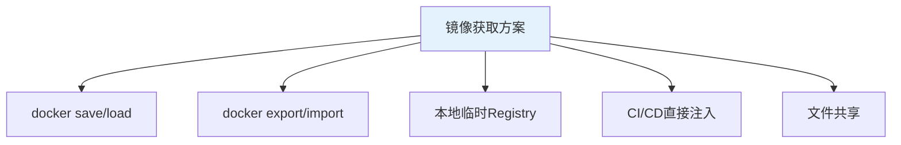
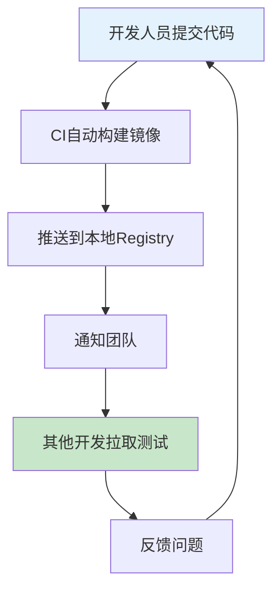

# 开发阶段镜像获取与共享：不推仓库的最佳实践

## 情境与背景

在开发阶段，频繁构建容器镜像但不需要推送到正式镜像仓库是常见场景。如何高效获取和共享这些临时镜像，是开发团队面临的实际问题。本博客介绍多种镜像获取方法和最佳实践。

## 一、镜像获取方案对比

### 1.1 方案概览

**常用获取方法**：



### 1.2 方案对比表

**方案对比**：

| 方法 | 优点 | 缺点 | 适用场景 |
|:----:|------|------|----------|
| **docker save/load** | 完整保留镜像，支持多层 | 文件大，传输慢 | 离线环境，少量镜像 |
| **docker export/import** | 文件小 | 丢失历史和元数据 | 快速传输，简单场景 |
| **本地Registry** | 方便共享，版本管理 | 需要额外部署 | 团队协作，频繁构建 |
| **CI/CD注入** | 自动化，无需手动操作 | 需要CI/CD配置 | 持续集成流程 |
| **文件共享** | 简单直接 | 管理混乱 | 个人开发，临时使用 |

## 二、docker save/load 方法

### 2.1 基本用法

**导出镜像**：

```bash
# 导出单个镜像
docker save my-app:latest -o my-app.tar

# 导出多个镜像
docker save -o images.tar my-app:v1.0 my-app:v2.0

# 导出并压缩
docker save my-app:latest | gzip > my-app.tar.gz
```

**导入镜像**：

```bash
# 导入镜像
docker load -i my-app.tar

# 从压缩文件导入
gunzip -c my-app.tar.gz | docker load
```

### 2.2 传输方法

**跨机器传输**：

```bash
# 使用scp传输
scp my-app.tar user@target-host:/path/

# 使用rsync传输（适合大文件）
rsync -avz my-app.tar user@target-host:/path/

# 使用curl传输
curl -X POST -T my-app.tar http://target-host:8080/upload

# 使用kubectl传输到K8s节点
kubectl cp my-app.tar node-name:/path/
```

### 2.3 脚本示例

**自动化脚本**：

```bash
#!/bin/bash
# 构建并导出镜像

APP_NAME="my-app"
VERSION="latest"
TARGET_HOST="dev-server"
TARGET_PATH="/opt/images"

# 构建镜像
docker build -t ${APP_NAME}:${VERSION} .

# 导出镜像
docker save ${APP_NAME}:${VERSION} -o ${APP_NAME}.tar

# 传输到目标主机
scp ${APP_NAME}.tar ${TARGET_HOST}:${TARGET_PATH}/

# 在目标主机导入
ssh ${TARGET_HOST} "docker load -i ${TARGET_PATH}/${APP_NAME}.tar"

echo "镜像已传输并导入到 ${TARGET_HOST}"
```

## 三、docker export/import 方法

### 3.1 基本用法

**导出容器**：

```bash
# 先启动容器
docker run -d --name temp-container my-app:latest

# 导出容器
docker export temp-container -o my-app-container.tar

# 停止并删除临时容器
docker stop temp-container
docker rm temp-container
```

**导入为镜像**：

```bash
# 导入为镜像
docker import my-app-container.tar my-app:imported

# 查看导入的镜像
docker images my-app:imported
```

### 3.2 save vs export 对比

**关键区别**：

| 特性 | docker save | docker export |
|:----:|-------------|---------------|
| **对象** | 镜像 | 容器 |
| **层信息** | 保留 | 丢失 |
| **历史记录** | 保留 | 丢失 |
| **元数据** | 保留 | 丢失 |
| **文件大小** | 较大 | 较小 |
| **用途** | 备份迁移 | 快速传输 |

## 四、本地临时Registry

### 4.1 启动本地Registry

**快速启动**：

```bash
# 启动临时Registry
docker run -d -p 5000:5000 --name registry registry:2

# 持久化存储
docker run -d -p 5000:5000 \
  -v /data/registry:/var/lib/registry \
  --name registry \
  registry:2

# 带认证的Registry
docker run -d -p 5000:5000 \
  -v /data/registry:/var/lib/registry \
  -v /data/auth:/auth \
  -e "REGISTRY_AUTH=htpasswd" \
  -e "REGISTRY_AUTH_HTPASSWD_REALM=Registry Realm" \
  -e "REGISTRY_AUTH_HTPASSWD_PATH=/auth/htpasswd" \
  --name registry \
  registry:2
```

### 4.2 使用本地Registry

**推送和拉取**：

```bash
# 为镜像打标签
docker tag my-app:latest localhost:5000/my-app:latest

# 推送到本地Registry
docker push localhost:5000/my-app:latest

# 从本地Registry拉取
docker pull localhost:5000/my-app:latest

# 跨网络访问
docker tag my-app:latest 192.168.1.100:5000/my-app:latest
docker push 192.168.1.100:5000/my-app:latest
```

### 4.3 配置不安全Registry

**允许HTTP访问**：

```bash
# Linux配置
echo '{"insecure-registries": ["192.168.1.100:5000"]}' > /etc/docker/daemon.json
systemctl restart docker

# Windows配置
# 在Docker Desktop设置中添加不安全Registry

# macOS配置
# 在Docker Desktop设置中添加不安全Registry
```

## 五、CI/CD直接注入

### 5.1 GitHub Actions 示例

**构建并传输到远程主机**：

```yaml
name: Build and Deploy to Dev

on:
  push:
    branches: [ feature-* ]

jobs:
  deploy:
    runs-on: ubuntu-latest
    
    steps:
    - uses: actions/checkout@v4
    
    - name: Build Docker image
      run: docker build -t my-app:${{ github.sha }} .
      
    - name: Save image to tar
      run: docker save my-app:${{ github.sha }} -o my-app.tar
      
    - name: Transfer to dev server
      uses: appleboy/scp-action@v0.1.7
      with:
        host: ${{ secrets.DEV_HOST }}
        username: ${{ secrets.DEV_USER }}
        key: ${{ secrets.DEV_SSH_KEY }}
        source: "my-app.tar"
        target: "/opt/images/"
        
    - name: Load and run on dev server
      uses: appleboy/ssh-action@v1.0.3
      with:
        host: ${{ secrets.DEV_HOST }}
        username: ${{ secrets.DEV_USER }}
        key: ${{ secrets.DEV_SSH_KEY }}
        script: |
          docker load -i /opt/images/my-app.tar
          docker stop my-app || true
          docker rm my-app || true
          docker run -d --name my-app -p 8080:8080 my-app:${{ github.sha }}
```

### 5.2 GitLab CI 示例

**GitLab CI配置**：

```yaml
stages:
  - build
  - deploy

build:
  stage: build
  script:
    - docker build -t my-app:$CI_COMMIT_SHORT_SHA .
    - docker save my-app:$CI_COMMIT_SHORT_SHA -o my-app.tar
    
deploy:
  stage: deploy
  script:
    - scp my-app.tar $DEV_USER@$DEV_HOST:/opt/images/
    - ssh $DEV_USER@$DEV_HOST "docker load -i /opt/images/my-app.tar"
    - ssh $DEV_USER@$DEV_HOST "docker stop my-app || true && docker rm my-app || true"
    - ssh $DEV_USER@$DEV_HOST "docker run -d --name my-app -p 8080:8080 my-app:$CI_COMMIT_SHORT_SHA"
```

## 六、Kubernetes 环境注入

### 6.1 使用kubectl cp

**复制镜像到节点**：

```bash
# 复制镜像到节点
kubectl cp my-app.tar node-01:/tmp/

# 在节点上导入
kubectl exec node-01 -- docker load -i /tmp/my-app.tar
```

### 6.2 使用Job导入镜像

**Kubernetes Job配置**：

```yaml
apiVersion: batch/v1
kind: Job
metadata:
  name: load-image
spec:
  template:
    spec:
      containers:
      - name: loader
        image: docker:latest
        command:
        - sh
        - -c
        - |
          docker load -i /images/my-app.tar
        volumeMounts:
        - name: image-volume
          mountPath: /images
        - name: docker-sock
          mountPath: /var/run/docker.sock
      volumes:
      - name: image-volume
        hostPath:
          path: /opt/images
      - name: docker-sock
        hostPath:
          path: /var/run/docker.sock
      restartPolicy: OnFailure
```

### 6.3 使用私有镜像仓库

**临时Registry在K8s中**：

```yaml
apiVersion: v1
kind: Service
metadata:
  name: registry
spec:
  type: NodePort
  ports:
  - port: 5000
    nodePort: 30500
  selector:
    app: registry

---

apiVersion: apps/v1
kind: Deployment
metadata:
  name: registry
spec:
  replicas: 1
  selector:
    matchLabels:
      app: registry
  template:
    metadata:
      labels:
        app: registry
    spec:
      containers:
      - name: registry
        image: registry:2
        ports:
        - containerPort: 5000
        volumeMounts:
        - name: registry-storage
          mountPath: /var/lib/registry
      volumes:
      - name: registry-storage
        emptyDir: {}
```

## 七、开发环境最佳实践

### 7.1 镜像管理策略

**开发阶段策略**：

```yaml
dev_image_strategy:
  build_frequency: "每次代码变更"
  retention: "保留最近5个构建"
  cleanup: "自动清理旧镜像"
  
  tagging:
    - "commit_hash"
    - "branch_name"
    - "timestamp"
  
  sharing:
    method: "local_registry"
    access: "团队内部"
```

### 7.2 自动化脚本

**开发镜像管理脚本**：

```bash
#!/bin/bash
# 开发镜像管理工具

ACTION=$1
APP_NAME="my-app"
REGISTRY="localhost:5000"

case $ACTION in
  build)
    COMMIT_HASH=$(git rev-parse --short HEAD)
    BRANCH_NAME=$(git rev-parse --abbrev-ref HEAD)
    
    docker build -t ${APP_NAME}:${COMMIT_HASH} .
    docker tag ${APP_NAME}:${COMMIT_HASH} ${REGISTRY}/${APP_NAME}:${BRANCH_NAME}
    docker push ${REGISTRY}/${APP_NAME}:${BRANCH_NAME}
    
    echo "镜像已构建并推送到 ${REGISTRY}/${APP_NAME}:${BRANCH_NAME}"
    ;;
    
  pull)
    BRANCH_NAME=$(git rev-parse --abbrev-ref HEAD)
    docker pull ${REGISTRY}/${APP_NAME}:${BRANCH_NAME}
    docker tag ${REGISTRY}/${APP_NAME}:${BRANCH_NAME} ${APP_NAME}:latest
    ;;
    
  clean)
    # 清理旧镜像（保留最近5个）
    OLD_IMAGES=$(docker images ${APP_NAME} --format "{{.Tag}}" | grep -v "latest" | sort | head -n -5)
    for TAG in $OLD_IMAGES; do
      docker rmi ${APP_NAME}:$TAG
    done
    ;;
    
  *)
    echo "Usage: $0 {build|pull|clean}"
    exit 1
    ;;
esac
```

### 7.3 团队协作流程

**协作流程**：



## 八、安全注意事项

### 8.1 安全建议

**安全最佳实践**：

```yaml
security_best_practices:
  - "不要在开发镜像中包含敏感信息"
  - "本地Registry设置访问控制"
  - "传输时使用加密通道"
  - "定期清理临时镜像"
  - "镜像扫描后再使用"
```

### 8.2 镜像扫描

**扫描开发镜像**：

```bash
# 使用Trivy扫描
trivy image my-app:latest

# 使用Snyk扫描
snyk container test my-app:latest

# 集成到CI
docker build -t my-app:test .
trivy image --exit-code 1 --severity HIGH,CRITICAL my-app:test
```

## 九、实战案例

### 9.1 案例：开发团队镜像共享

**场景描述**：

```markdown
## 案例：开发团队镜像共享

**问题**：
开发团队需要频繁测试新功能，每次构建后需要共享镜像给其他成员测试。

**解决方案**：
1. 在开发环境部署本地Registry
2. CI构建后自动推送到本地Registry
3. 团队成员从本地Registry拉取镜像测试

**效果**：
- 镜像共享效率提升
- 测试环境保持一致
- 减少重复构建
```

### 9.2 案例：CI/CD自动部署到开发环境

**场景描述**：

```markdown
## 案例：自动部署到开发环境

**问题**：
每次代码提交后需要手动部署到开发环境，效率低下。

**解决方案**：
1. GitHub Actions构建镜像
2. 自动传输到开发服务器
3. 自动加载并运行容器

**效果**：
- 部署时间从30分钟缩短到5分钟
- 减少人为错误
- 快速反馈开发效果
```

## 十、面试1分钟精简版（直接背）

**完整版**：

开发分支镜像获取方法：1. docker save导出为tar文件，scp复制到目标机器后docker load导入；2. 启动本地临时Registry（如registry:2），推送镜像后在目标机器拉取；3. docker export导出容器，docker import导入为镜像。推荐使用本地Registry方式，方便团队共享，也可通过CI/CD工具直接将镜像注入到测试环境。

**30秒超短版**：

docker save/load导出导入，本地Registry共享，CI/CD自动注入。

## 十一、总结

### 11.1 方法选择建议

```yaml
method_selection:
  single_developer: "docker save/load"
  small_team: "本地Registry"
  large_team: "CI/CD自动注入"
  offline_environment: "docker save + 文件传输"
```

### 11.2 最佳实践清单

```yaml
best_practices:
  - "使用commit hash作为镜像标签"
  - "定期清理旧镜像"
  - "本地Registry设置访问控制"
  - "镜像传输使用加密"
  - "集成安全扫描"
  - "自动化构建和部署流程"
```

### 11.3 记忆口诀

```
开发镜像不推仓，获取方法有多样，
save导出tar包，load导入本地用，
临时Registry共享，团队协作更顺畅，
CI/CD自动传，开发效率大提升。
```

> **参考链接**：[SRE运维面试题全解析：从理论到实践（第二部分）]()