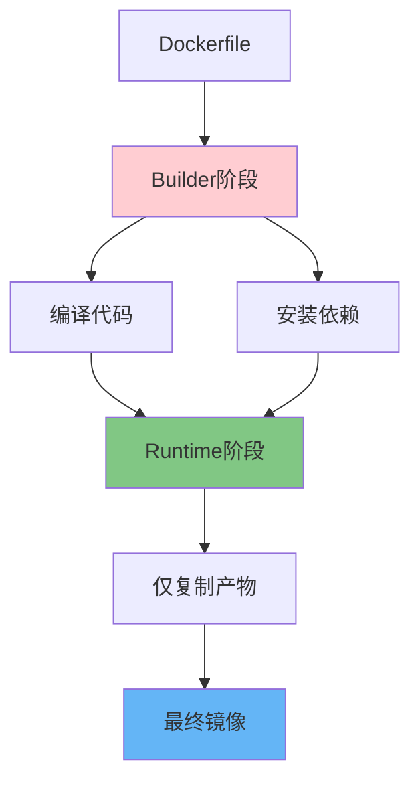

# Dockerfile多阶段构建：生产环境镜像优化最佳实践

## 情境与背景

Docker镜像体积直接影响容器启动速度、存储成本和安全风险。本指南详细讲解Dockerfile多阶段构建技术，通过实战案例展示如何将镜像体积从数百MB优化到几十MB。

## 一、多阶段构建概述

### 1.1 为什么需要多阶段构建

**问题分析**：

```markdown
## 多阶段构建概述

### 为什么需要多阶段构建

**单阶段构建问题**：

```yaml
single_stage_problems:
  large_size:
    - "包含编译器（gcc/maven/node）"
    - "包含构建工具链"
    - "包含源码目录"
    example_size: "500MB - 2GB"
    
  security_risk:
    - "攻击面大"
    - "存在已知CVE"
    - "敏感信息泄露风险"
    
  slow_deploy:
    - "拉取时间长"
    - "占用带宽"
    - "启动延迟"
```

**多阶段构建优势**：

```yaml
multi_stage_benefits:
  small_size:
    - "仅包含运行时"
    - "丢弃构建工具"
    example_size: "50MB - 200MB"
    reduction: "70-90%"
    
  security:
    - "攻击面小"
    - "最小化基础镜像"
    - "无敏感信息"
    
  fast_deploy:
    - "拉取快"
    - "启动快"
    - "节省带宽"
```
```

### 1.2 多阶段构建原理

**构建流程**：



## 二、多语言实战案例

### 2.1 Go语言多阶段构建

**Go应用优化**：

```dockerfile
# 构建阶段
FROM golang:1.21-alpine AS builder

# 安装构建依赖
RUN apk add --no-cache git make

# 设置工作目录
WORKDIR /app

# 复制依赖清单
COPY go.mod go.sum ./
RUN go mod download

# 复制源码
COPY . .

# 编译静态二进制文件
RUN CGO_ENABLED=0 GOOS=linux go build -a -installsuffix cgo -o main .

# 运行阶段
FROM alpine:3.19

# 安装CA证书和时区数据
RUN apk --no-cache add ca-certificates tzdata

# 创建非root用户
RUN addgroup -g 1000 appgroup && adduser -u 1000 -G appgroup -s /bin/sh -D appuser

# 设置工作目录
WORKDIR /home/appuser

# 从builder复制编译产物
COPY --from=builder /app/main .

# 复制配置文件（可选）
# COPY config/ /etc/app/

# 切换用户
USER appuser

# 暴露端口
EXPOSE 8080

# 健康检查
HEALTHCHECK --interval=30s --timeout=3s --start-period=5s --retries=3 \
    CMD wget --no-verbose --tries=1 --spider http://localhost:8080/health || exit 1

# 启动命令
ENTRYPOINT ["./main"]
```

**体积对比**：

```yaml
go_image_comparison:
  single_stage:
    base: "golang:1.21-alpine"
    size: "~800MB"
    
  multi_stage:
    base: "alpine:3.19"
    size: "~15MB"
    
  reduction: "~98%"
```
```

### 2.2 Java多阶段构建

**Java应用优化**：

```dockerfile
# 构建阶段
FROM maven:3.9-eclipse-temurin-11 AS builder

WORKDIR /app

# 先复制pom.xml下载依赖
COPY pom.xml .
RUN mvn dependency:go-offline -B

# 复制源码
COPY src ./src

# 构建JAR包
RUN mvn clean package -DskipTests -B

# 运行阶段
FROM eclipse-temurin:11-jre-alpine

# 安装字体（避免Java字体问题）
RUN apk add --no-cache fontconfig ttf-dejavu

# 创建应用用户
RUN addgroup -g 1000 appgroup && adduser -u 1000 -G appgroup -s /bin/sh -D appuser

WORKDIR /app

# 从builder复制JAR包
COPY --from=builder /app/target/*.jar app.jar

# 设置权限
RUN chown -R appuser:appgroup /app

# 切换用户
USER appuser

# JVM优化参数
ENV JAVA_OPTS="-Xms256m -Xmx512m -XX:+UseG1GC"

EXPOSE 8080

HEALTHCHECK --interval=30s --timeout=3s --start-period=10s --retries=3 \
    CMD nc -z localhost 8080 || exit 1

ENTRYPOINT ["sh", "-c", "java $JAVA_OPTS -jar app.jar"]
```

**Maven镜像优化技巧**：

```dockerfile
# 利用构建缓存
COPY pom.xml .
RUN mvn dependency:go-offline

# 单独复制源码（利用缓存）
COPY src ./src
```
```

### 2.3 Node.js多阶段构建

**Node.js应用优化**：

```dockerfile
# 构建阶段
FROM node:20-alpine AS builder

WORKDIR /app

# 复制package文件
COPY package*.json ./

# 安装依赖
RUN npm ci --only=production && \
    npm cache clean --force

# 复制源码
COPY . .

# 构建应用（如有构建步骤）
RUN npm run build || true

# 生产阶段
FROM node:20-alpine AS runtime

# 创建app用户
RUN addgroup -g 1000 appgroup && adduser -u 1000 -G appgroup -s /bin/sh -D appuser

WORKDIR /app

# 只复制生产依赖和构建产物
COPY --from=builder --chown=appuser:appgroup /app/node_modules ./node_modules
COPY --from=builder --chown=appuser:appgroup /app/dist ./dist
COPY --from=builder --chown=appuser:appgroup /app/package*.json ./

# 切换用户
USER appuser

EXPOSE 3000

ENV NODE_ENV=production

HEALTHCHECK --interval=30s --timeout=3s --start-period=5s --retries=3 \
    CMD wget --no-verbose --tries=1 --spider http://localhost:3000/health || exit 1

CMD ["node", "dist/main.js"]
```

**pnpm优化**：

```dockerfile
# 使用pnpm减小依赖体积
FROM node:20-alpine AS builder

RUN npm install -g pnpm

WORKDIR /app

COPY package.json pnpm-lock.yaml ./
RUN pnpm install --frozen-lockfile --prod

COPY . .

RUN pnpm build
```
```

### 2.4 Python多阶段构建

**Python应用优化**：

```dockerfile
# 构建阶段
FROM python:3.11-slim AS builder

WORKDIR /app

# 安装编译依赖
RUN apt-get update && apt-get install -y --no-install-recommends \
    gcc \
    libpq-dev \
    && rm -rf /var/lib/apt/lists/*

# 虚拟环境
RUN python -m venv /opt/venv
ENV PATH="/opt/venv/bin:$PATH"

# 安装依赖
COPY requirements.txt .
RUN pip install --no-cache-dir -r requirements.txt

# 运行阶段
FROM python:3.11-slim

# 安装运行时依赖
RUN apt-get update && apt-get install -y --no-install-recommends \
    libpq5 \
    && rm -rf /var/lib/apt/lists/*

# 复制虚拟环境
COPY --from=builder /opt/venv /opt/venv
ENV PATH="/opt/venv/bin:$PATH"

# 创建用户
RUN useradd -m -u 1000 appuser

WORKDIR /home/appuser

# 复制应用
COPY --chown=appuser:appgroup . .

USER appuser

EXPOSE 8000

ENV PYTHONUNBUFFERED=1

CMD ["python", "main.py"]
```

## 三、高级技巧

### 3.1 BuildKit优化

**BuildKit特性**：

```dockerfile
# 启用BuildKit
# DOCKER_BUILDKIT=1 docker build .

# 语法
# syntax = docker/dockerfile:1.4

# 并行构建
# RUN --mount=type=cache,target=/var/cache/apt

# 秘密挂载（不暴露密钥）
# RUN --mount=type=secret,id=npmrc ...
```

**缓存优化**：

```dockerfile
# 利用构建缓存
FROM python:3.11-slim AS builder

WORKDIR /app

# 分离依赖安装（利用缓存）
COPY requirements.txt .
RUN pip install --no-cache-dir -r requirements.txt

# 代码变更不会导致依赖重新安装
COPY . .

# npm缓存
RUN --mount=type=cache,target=/root/.npm \
    npm ci
```
```

### 3.2 最小化基础镜像

**镜像选择策略**：

```yaml
base_image_strategy:
  distroless:
    - "gcr.io/distroless/static"
    - "仅包含运行时"
    - "无shell无包管理器"
    size: "2-10MB"
    
  alpine:
    - "alpine:3.19"
    - "轻量级Linux"
    - " apk包管理器"
    size: "5-10MB"
    
  scratch:
    - "scratch"
    - "空镜像"
    - "仅静态编译程序"
    size: "0MB"
    
  distroless_java:
    - "gcr.io/distroless/java"
    - "Java运行时"
    - "无shell"
    size: "100-200MB"
```
```

### 3.3 运行时用户安全

**非root运行**：

```dockerfile
# 创建用户组和用户
RUN addgroup -g 1000 appgroup && \
    adduser -u 1000 -G appgroup -s /bin/sh -D appuser

# 复制文件并设置权限
COPY --chown=appuser:appgroup . .

# 切换用户
USER appuser
```
```

### 3.4 健康检查配置

**HEALTHCHECK指令**：

```dockerfile
# HTTP健康检查
HEALTHCHECK --interval=30s --timeout=3s --start-period=10s --retries=3 \
    CMD curl -f http://localhost:8080/health || exit 1

# TCP健康检查
HEALTHCHECK --interval=30s --timeout=3s --start-period=5s --retries=3 \
    CMD nc -z localhost 8080 || exit 1

# 命令健康检查
HEALTHCHECK --interval=30s --timeout=3s --start-period=10s --retries=3 \
    CMD python /app/health.py
```
```

## 四、生产环境最佳实践

### 4.1 .dockerignore配置

**.dockerignore示例**：

```yaml
.dockerignore:
  - ".git"
  - ".gitignore"
  - "*.md"
  - "docs/"
  - "tests/"
  - "*.test.js"
  - "coverage/"
  - "node_modules/"  # 构建时重新安装
  - ".env"  # 不包含密钥
  - "*.log"
  - ".DS_Store"
  - "tmp/"
```

### 4.2 镜像大小监控

**CI/CD中监控镜像大小**：

```yaml
# Jenkinsfile中检查镜像大小
stage('Build Image') {
    steps {
        script {
            def imageSize = sh(
                script: "docker build -t ${IMAGE_NAME}:${BUILD_NUMBER} . && docker inspect ${IMAGE_NAME}:${BUILD_NUMBER} | jq '.[0].Size'",
                returnStdout: true
            ).trim()
            
            def sizeMB = imageSize.toLong() / 1024 / 1024
            echo "Image size: ${sizeMB}MB"
            
            if (sizeMB > 500) {
                error "Image too large: ${sizeMB}MB (max: 500MB)"
            }
        }
    }
}
```

### 4.3 安全扫描集成

**Trivy扫描**：

```yaml
# Dockerfile中集成Trivy
RUN apk add --no-cache curl
RUN curl -sfL https://raw.githubusercontent.com/aquasecurity/trivy/main/contrib/install.sh | sh -s -- -b /usr/local/bin

# 或在CI/CD中扫描
# trivy image --exit-code 1 --severity HIGH,CRITICAL ${IMAGE_NAME}:${BUILD_NUMBER}
```

### 4.4 多平台构建

**Buildx多平台构建**：

```bash
# 启用buildx
docker buildx create --use

# 构建多平台镜像
docker buildx build \
    --platform linux/amd64,linux/arm64 \
    -t registry.example.com/app:latest \
    --push .
```
```

## 五、面试1分钟精简版（直接背）

**完整版**：

Dockerfile多阶段构建通过多个FROM语句实现：1. 第一阶段（builder）安装编译工具、依赖，编译代码；2. 第二阶段（runtime）用COPY --from=builder只复制编译产物，丢弃所有构建工具；3. 最终镜像只包含运行时最小依赖。优势：镜像体积减小70-90%、攻击面小、构建加速。适用场景：Go/Java/C++等编译型语言，或需要分离构建和运行环境的场景。优化技巧：使用最小化基础镜像（alpine/distroless/scratch）、创建非root用户、配置健康检查。

**30秒超短版**：

多阶段构建：builder阶段编译打包，runtime阶段只COPY产物，最终镜像丢弃构建工具，体积小、安全高、部署快。

## 六、总结

### 6.1 优化效果总结

```yaml
optimization_results:
  golang:
    before: "~800MB"
    after: "~15MB"
    reduction: "98%"
    
  java:
    before: "~500MB"
    after: "~200MB"
    reduction: "60%"
    
  nodejs:
    before: "~900MB"
    after: "~150MB"
    reduction: "83%"
    
  python:
    before: "~400MB"
    after: "~150MB"
    reduction: "62%"
```

### 6.2 最佳实践清单

```yaml
best_practices_checklist:
  multi_stage:
    - "使用多阶段构建分离构建和运行环境"
    - "builder阶段用完整工具链"
    - "runtime阶段用最小镜像"
    
  optimization:
    - "利用构建缓存优化顺序"
    - "使用--chown设置正确权限"
    - "合理使用.dockerignore"
    
  security:
    - "创建非root用户"
    - "使用最小化基础镜像"
    - "集成安全扫描"
    
  production:
    - "配置健康检查"
    - "监控镜像大小"
    - "设置合理EXPOSE端口"
```

### 6.3 记忆口诀

```
Docker多阶段构建，构建阶段全丢弃，
只留运行时必要，最终镜像最小化。
Go语言用alpine，Java用jre镜像，
Node用distroless，安全高效部署快。
```

> **参考链接**：[SRE运维面试题全解析：从理论到实践（第二部分）]()