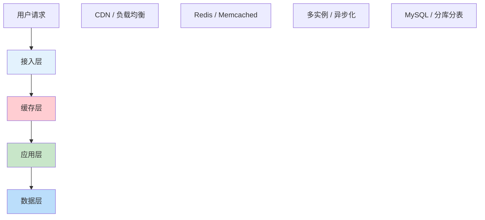
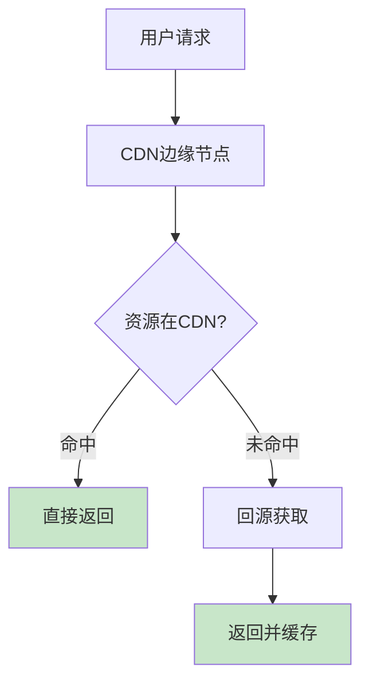
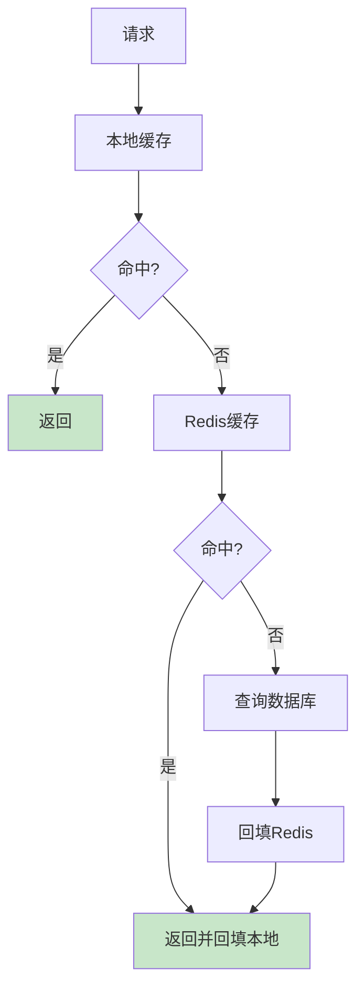
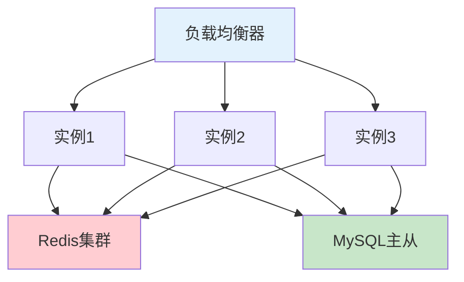
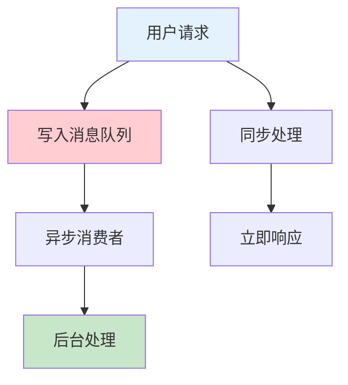
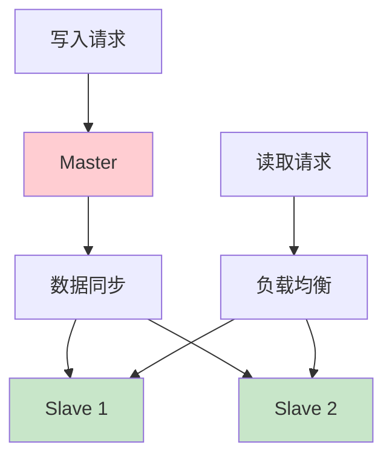

# 生产环境高并发优化：从架构到实战的完整指南

## 情境与背景

高并发系统设计是高级DevOps工程师和架构师的核心能力。本指南从接入层、缓存层、应用层、数据层四个维度详细讲解高并发优化策略，并提供实战案例。

## 一、高并发指标与优化层次

### 1.1 常见并发指标

**性能指标定义**：

```markdown
## 高并发指标与优化层次

### 性能指标

**核心指标**：

```yaml
performance_metrics:
  QPS:
    full_name: "Queries Per Second"
    description: "每秒查询数"
    typical_value: "单实例1000-5000"
    
  TPS:
    full_name: "Transactions Per Second"
    description: "每秒事务数"
    typical_value: "单实例500-2000"
    
  RT:
    full_name: "Response Time"
    description: "平均响应时间"
    typical_value: "P99 < 200ms"
    
  Concurrency:
    description: "并发用户数"
    typical_value: "根据业务定"
    
  Throughput:
    description: "吞吐量"
    typical_value: "MB/s或GB/s"
```

**性能指标关系**：

```yaml
metrics_relationship:
  formula: "QPS = Concurrency / RT"
  
  example:
    concurrency: 1000
    avg_rt: 100ms
    qps: "1000 / 0.1 = 10000"
```

**互联网行业QPS参考**：

```yaml
qps_reference:
  small_website:
    qps: "< 1000"
    example: "个人博客、小型系统"
    
  medium_website:
    qps: "1000 - 10000"
    example: "企业官网、中型电商"
    
  large_website:
    qps: "10000 - 100000"
    example: "大型电商、双十一"
    
  extreme:
    qps: "> 100000"
    example: "12306、微信红包"
```
```

### 1.2 优化分层架构

**四层优化架构**：

```markdown
### 优化分层架构

**四层优化模型**：



**各层优化重点**：

```yaml
optimization_layers:
  edge_layer:
    name: "接入层"
    focus: "减少请求、静态资源加速"
    tools: ["CDN", "Nginx", "SLB"]
    
  cache_layer:
    name: "缓存层"
    focus: "抗读压力、减少数据库压力"
    tools: ["Redis", "Memcached", "本地缓存"]
    
  app_layer:
    name: "应用层"
    focus: "提升吞吐、异步处理"
    tools: ["多实例", "消息队列", "连接池"]
    
  data_layer:
    name: "数据层"
    focus: "抗写压力、数据水平扩展"
    tools: ["读写分离", "分库分表", "NoSQL"]
```
```

## 二、接入层优化

### 2.1 CDN加速

**CDN原理与配置**：

```markdown
## 接入层优化

### CDN加速

**CDN工作原理**：



**CDN配置示例**：

```yaml
cdn_configuration:
  static_resources:
    - "*.js"
    - "*.css"
    - "*.png"
    - "*.jpg"
    - "*.svg"
    
  cache_policy:
    js_css: "1年"
    images: "1个月"
    html: "no-cache"
    
  cdn_domain:
    origin: "www.example.com"
    cdn: "cdn.example.com"
```

**CDN优化策略**：

```yaml
cdn_optimization:
  resource_merge:
    description: "资源合并"
    example: "多个JS合并为一个，减少请求数"
    
  minification:
    description: "压缩"
    example: "JS/CSS压缩，去除注释"
    
  cache_busting:
    description: "缓存更新"
    example: "文件名加hash版本号"
```
```

### 2.2 负载均衡

**负载均衡策略**：

```markdown
### 负载均衡

**Nginx负载均衡配置**：

```nginx
# upstream配置
upstream backend {
    least_conn;  # 最少连接
    server 192.168.1.10:8080 weight=5;
    server 192.168.1.11:8080 weight=3;
    server 192.168.1.12:8080 backup;
    keepalive 32;
}

server {
    listen 80;
    location / {
        proxy_pass http://backend;
        proxy_set_header Host $host;
        proxy_set_header X-Real-IP $remote_addr;
        proxy_connect_timeout 5s;
        proxy_read_timeout 30s;
    }
}
```

**负载均衡算法**：

```yaml
lb_algorithms:
  round_robin:
    description: "轮询"
    advantage: "简单、均匀"
    usage: "默认"
    
  least_conn:
    description: "最少连接"
    advantage: "动态均衡"
    usage: "长连接服务"
    
  ip_hash:
    description: "IP哈希"
    advantage: "会话保持"
    usage: "有状态服务"
    
  url_hash:
    description: "URL哈希"
    advantage: "缓存友好"
    usage: "CDN场景"
```

**健康检查配置**：

```nginx
upstream backend {
    server 192.168.1.10:8080 max_fails=3 fail_timeout=30s;
    server 192.168.1.11:8080 max_fails=3 fail_timeout=30s;
}
```
```

## 三、缓存层优化

### 3.1 缓存架构

**多级缓存架构**：

```markdown
## 缓存层优化

### 多级缓存架构

**缓存层次**：

```yaml
cache_hierarchy:
  local_cache:
    name: "本地缓存"
    tools: ["Caffeine", "Guava Cache", "HashMap"]
    capacity: "MB级别"
    latency: "<1μs"
    
  distributed_cache:
    name: "分布式缓存"
    tools: ["Redis", "Memcached"]
    capacity: "GB-TB级别"
    latency: "<1ms"
    
  cdn_cache:
    name: "CDN缓存"
    location: "边缘节点"
    capacity: "TB级别"
    latency: "<10ms"
```

**缓存架构图**：


```

### 3.2 Redis缓存策略

**缓存读写模式**：

```markdown
### Redis缓存策略

**Cache Aside模式**：

```yaml
cache_aside:
  read_flow:
    - "先查缓存"
    - "缓存命中直接返回"
    - "缓存未命中查数据库"
    - "结果写入缓存"
    
  write_flow:
    - "先更新数据库"
    - "再删除缓存"
    
  advantage: "读多写少场景最优"
  disadvantage: "数据一致性需要处理"
```

**Read Through模式**：

```yaml
read_through:
  read_flow:
    - "查询缓存"
    - "缓存未命中，由缓存层查数据库"
    - "写入缓存并返回"
    
  advantage: "应用层代码简单"
  disadvantage: "缓存层实现复杂"
```

**Write Through模式**：

```yaml
write_through:
  write_flow:
    - "先写缓存"
    - "缓存同步写数据库"
    
  advantage: "数据一致性强"
  disadvantage: "写入性能差"
```

**配置示例**：

```yaml
# Redis集群配置
redis_cluster:
  nodes:
    - host: 192.168.1.10
      port: 6379
    - host: 192.168.1.11
      port: 6379
    - host: 192.168.1.12
      port: 6379
      
  maxmemory: 10gb
  maxmemory_policy: allkeys-lru
  
  key_pattern:
    user_info: "user:info:{userId}"
    session: "session:{sessionId}"
    hot_data: "hot:data:{dataId}"
```
```

### 3.3 缓存问题与解决方案

**缓存经典问题**：

```markdown
### 缓存问题与解决方案

**缓存穿透**：

```yaml
cache_penetration:
  problem: "大量请求查询不存在的数据"
  impact: "绕过缓存直接打到数据库"
  
  solutions:
    - "布隆过滤器：存在则一定存在，不存在则可能不存在"
    - "缓存空值：NULL值也缓存，设置短过期时间"
    - "参数校验：拦截非法参数"
    
  implementation:
    bloom_filter: |
      // 使用Guava BloomFilter
      BloomFilter<User> filter = BloomFilter.create(...);
      if (!filter.mightContain(userId)) {
          return null; // 直接返回
      }
    
    cache_null: |
      // 缓存空值
      if (user == null) {
          cache.set(key, "NULL", Duration.ofMinutes(5));
      }
```

**缓存击穿**：

```yaml
cache_breaker:
  problem: "热点key失效瞬间，大量请求击穿到数据库"
  impact: "数据库压力剧增"
  
  solutions:
    - "互斥锁：只允许一个请求查数据库"
    - "永不过期：热点数据不设置过期时间"
    - "逻辑过期：过期时间作为value，异步更新"
    
  implementation:
    mutex: |
      // Redis分布式锁
      String lock = redis.set(key, "1", "NX", "EX", 10);
      if ("OK".equals(lock)) {
          // 查询数据库
          User user = db.getUser(userId);
          redis.setex(key, 3600, user);
          redis.del(key);
      } else {
          // 等待重试
          Thread.sleep(50);
          return cache.get(key);
      }
```

**缓存雪崩**：

```yaml
cache_avalanche:
  problem: "大量缓存同时过期或缓存服务宕机"
  impact: "数据库压力骤增，甚至宕机"
  
  solutions:
    - "过期时间随机化：+随机秒数"
    - "多级缓存：本地+Redis"
    - "服务降级：限流、熔断"
    - "高可用架构：Redis Cluster"
    
  implementation:
    random_ttl: |
      // 过期时间加随机
      int ttl = 3600 + RandomUtils.nextInt(600);
      cache.setex(key, ttl, value);
```
```

## 四、应用层优化

### 4.1 水平扩展

**多实例部署**：

```markdown
## 应用层优化

### 水平扩展

**多实例部署架构**：



**K8s多实例部署**：

```yaml
# Deployment多副本配置
apiVersion: apps/v1
kind: Deployment
metadata:
  name: web-app
spec:
  replicas: 10
  selector:
    matchLabels:
      app: web
  template:
    spec:
      containers:
      - name: web
        image: web-app:v1
        resources:
          requests:
            cpu: 500m
            memory: 512Mi
          limits:
            cpu: 2000m
            memory: 2Gi
        env:
        - name: SPRING_PROFILES_ACTIVE
          value: "production"
```

**HPA自动扩缩容**：

```yaml
# HorizontalPodAutoscaler配置
apiVersion: autoscaling/v2
kind: HorizontalPodAutoscaler
metadata:
  name: web-app-hpa
spec:
  scaleTargetRef:
    apiVersion: apps/v1
    kind: Deployment
    name: web-app
  minReplicas: 3
  maxReplicas: 50
  metrics:
  - type: Resource
    resource:
      name: cpu
      target:
        type: Utilization
        averageUtilization: 70
  - type: Resource
    resource:
      name: memory
      target:
        type: Utilization
        averageUtilization: 80
```
```

### 4.2 异步处理

**消息队列削峰**：

```markdown
### 异步处理

**消息队列架构**：



**Kafka配置示例**：

```yaml
# Kafka生产者配置
kafka_producer:
  bootstrap.servers: "kafka1:9092,kafka2:9092,kafka3:9092"
  acks: "1"
  retries: 3
  batch.size: 16384
  linger.ms: 10
  compression.type: "snappy"
  
# Kafka消费者配置
kafka_consumer:
  bootstrap.servers: "kafka1:9092,kafka2:9092,kafka3:9092"
  group.id: "consumer-group-1"
  auto.offset.reset: "earliest"
  enable.auto.commit: true
  max.poll.records: 500
```

**异步场景**：

```yaml
async_scenarios:
  order_processing:
    description: "订单处理"
    async_steps:
      - "库存扣减"
      - "积分发放"
      - "短信通知"
      - "日志记录"
      
  data_analytics:
    description: "数据分析"
    async_steps:
      - "数据统计"
      - "报表生成"
      - "数据同步"
```
```

### 4.3 连接池优化

**连接池配置**：

```markdown
### 连接池优化

**数据库连接池配置**：

```yaml
# HikariCP配置
hikaricp:
  maximum-pool-size: 20
  minimum-idle: 5
  connection-timeout: 30000
  idle-timeout: 600000
  max-lifetime: 1800000
  connection-test-query: SELECT 1
  
# Redis连接池配置
redis_pool:
  max-total: 50
  max-idle: 20
  min-idle: 5
  max-wait-millis: 3000
  test-on-borrow: true
  test-while-idle: true
```

**连接池监控**：

```yaml
pool_monitoring:
  metrics:
    - "active connections"
    - "idle connections"
    - "wait threads"
    - "connection timeout"
    
  alarm_rules:
    - "active > 80% of max"
    - "wait threads > 10"
    - "connection timeout > 100/min"
```
```

## 五、数据层优化

### 5.1 读写分离

**主从复制架构**：

```markdown
## 数据层优化

### 读写分离

**读写分离架构**：



**读写分离配置**：

```yaml
# 读写分离中间件配置（ShardingSphere）
shardingsphere:
  dataSources:
    ds_master:
      url: jdbc:mysql://master:3306/db
      username: root
      password: password
      
    ds_slave_0:
      url: jdbc:mysql://slave1:3306/db
      username: root
      password: password
      
    ds_slave_1:
      url: jdbc:mysql://slave2:3306/db
      username: root
      password: password
      
  rules:
    - !readwrite_splitting
      dataSources:
        readwrite:
          type: Static
          props:
            write_ds: ds_master
            read_ds: ds_slave_0,ds_slave_1
```

**延迟问题处理**：

```yaml
replication_lag_handling:
  problem: "主从延迟导致读取旧数据"
  
  solutions:
    - "强制读主库：对一致性要求高的读请求"
    - "延迟读取：等待延迟窗口后再读"
    - "业务优化：避免写后立即读"
```
```

### 5.2 分库分表

**分库分表策略**：

```markdown
### 分库分表

**分片策略**：

```yaml
sharding_strategies:
  horizontal_sharding:
    description: "水平分表"
    method: "按数据量分表"
    example: "orders_202401, orders_202402"
    
  vertical_sharding:
    description: "垂直分库"
    method: "按业务模块分库"
    example: "user_db, order_db, product_db"
    
  hash_sharding:
    description: "哈希分片"
    method: "按ID哈希取模"
    example: "user_id % 4"
    
  range_sharding:
    description: "范围分片"
    method: "按ID范围分片"
    example: "0-1000万、1000-2000万"
```

**分片中间件配置**：

```yaml
# ShardingSphere分表配置
shardingsphere:
  rules:
    - !sharding
      tables:
        t_order:
          actualDataNodes: ds_${0..1}.t_order_${0..15}
          tableStrategy:
            standard:
              shardingColumn: order_id
              shardingAlgorithmName: t_order_inline
          keyGenerateStrategy:
            column: order_id
            keyGeneratorName: snowflake
```

**分库分表带来的问题**：

```yaml
sharding_challenges:
  cross_shard_query:
    description: "跨分片查询"
    solution: "ES搜索引擎、聚合查询"
    
  distributed_transaction:
    description: "分布式事务"
    solution: "Seata、TCC"
    
  join_operations:
    description: "跨表JOIN"
    solution: "应用层多次查询后合并"
```
```

## 六、生产环境最佳实践

### 6.1 压测与容量规划

**压测流程**：

```markdown
## 生产环境最佳实践

### 压测与容量规划

**压测流程**：

```yaml
load_testing_flow:
  step_1: "单接口压测"
    purpose: "找出性能瓶颈"
    
  step_2: "混合场景压测"
    purpose: "模拟真实业务"
    
  step_3: "容量规划"
    purpose: "确定扩容阈值"
    
  step_4: "制定预案"
    purpose: "应对突发流量"
```

**压测工具**：

```yaml
load_testing_tools:
  ab:
    description: "Apache Bench"
    usage: "简单压测"
    
  wrk:
    description: "wrk"
    usage: "高性能压测"
    
  jmeter:
    description: "JMeter"
    usage: "复杂场景压测"
    
  locust:
    description: "Locust"
    usage: "Python压测"
```

**容量规划公式**：

```yaml
capacity_planning:
  formula: |
    实例数 = 目标QPS / 单实例QPS × 安全系数
    
  example:
    target_qps: 50000
    single_instance_qps: 2000
    safety_factor: 1.5
    result: "50000 / 2000 × 1.5 = 37.5 ≈ 40个实例"
```
```

### 6.2 限流与熔断

**限流策略**：

```markdown
### 限流与熔断

**限流算法**：

```yaml
rate_limiting_algorithms:
  token_bucket:
    description: "令牌桶"
    advantage: "允许突发流量"
    implementation: "Guava RateLimiter"
    
  leaky_bucket:
    description: "漏桶"
    advantage: "流量平滑"
    disadvantage: "不支持突发"
    
  sliding_window:
    description: "滑动窗口"
    advantage: "精度高"
    implementation: "Redis ZSET"
    
  counter:
    description: "计数器"
    advantage: "简单"
    disadvantage: "有边界突刺"
```

**Sentinel配置**：

```yaml
# Sentinel限流配置
sentinel:
  rules:
    - resource: "/api/order"
      grade: 1  # QPS
      count: 10000
      limitApp: "default"
      
    - resource: "/api/order"
      grade: 0  #并发线程数
      count: 500
      limitApp: "default"
```

**熔断配置**：

```yaml
# Sentinel熔断配置
sentinel:
  degrade:
    - resource: "/api/order"
      grade: 3  # 异常比例
      count: 0.3
      timeWindow: 10  # 10秒后尝试恢复
```
```

### 6.3 监控与告警

**核心监控指标**：

```markdown
### 监控与告警

**监控指标体系**：

```yaml
monitoring_metrics:
  infrastructure:
    - "CPU使用率"
    - "内存使用率"
    - "磁盘IO"
    - "网络带宽"
    
  application:
    - "QPS/TPS"
    - "响应时间P99"
    - "错误率"
    - "在线人数"
    
  database:
    - "连接数"
    - "慢查询"
    - "主从延迟"
    - "缓冲池命中率"
    
  cache:
    - "命中率"
    - "内存使用"
    - "QPS"
```

**告警策略**：

```yaml
alerting_strategy:
  critical:
    - "服务不可用"
    - "错误率 > 5%"
    - "响应时间P99 > 2s"
    
  warning:
    - "CPU > 80%"
    - "内存 > 85%"
    - "错误率 > 1%"
    - "响应时间P99 > 1s"
```
```

## 七、面试1分钟精简版（直接背）

**完整版**：

我们线上QPS最高达到5万+，主要优化手段：1. 接入层：使用CDN加速静态资源，Nginx做负载均衡；2. 缓存层：Redis集群抗读请求，热点数据缓存；3. 应用层：多实例部署，消息队列削峰，异步处理非核心流程；4. 数据层：MySQL主从读写分离，分库分表，连接池优化。整体遵循CacheAside模式，读多写少场景下缓存命中率能到95%以上。

**30秒超短版**：

高并发优化四层：接入层CDN+负载均衡、缓存层Redis、应用层多实例+异步、数据层读写分离+分库分表。核心是缓存前置+水平扩展。

## 八、总结

### 8.1 优化层次总结

```yaml
optimization_summary:
  edge_layer:
    - "CDN加速静态资源"
    - "负载均衡分发请求"
    - "DNS负载均衡"
    
  cache_layer:
    - "多级缓存架构"
    - "缓存策略选择"
    - "缓存问题处理"
    
  app_layer:
    - "水平扩展"
    - "异步处理"
    - "连接池优化"
    
  data_layer:
    - "读写分离"
    - "分库分表"
    - "NoSQL补充"
```

### 8.2 最佳实践清单

```yaml
best_practices:
  design:
    - "遵循分层架构"
    - "缓存前置"
    - "异步为常态"
    - "水平扩展优先"
    
  operation:
    - "容量规划先行"
    - "限流熔断必备"
    - "监控告警完善"
    - "定期压测验证"
    
  optimization:
    - "先优化缓存"
    - "再优化SQL"
    - "最后考虑架构"
```

### 8.3 记忆口诀

```
高并发优化分四层，接入缓存应用数据层，
CDN加速静态资源，负载均衡分发流量，
缓存层用Redis，热点数据前置抗压力，
应用层多实例部署，消息队列削峰谷，
数据层读写分离，分库分表水平扩展，
限流熔断是保险，监控告警是眼睛。
```

> **参考链接**：[SRE运维面试题全解析：从理论到实践（第二部分）]()