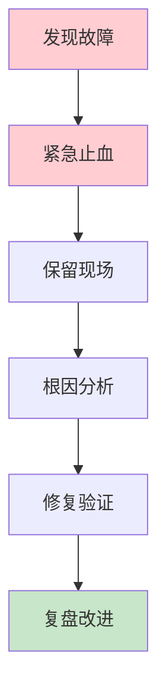
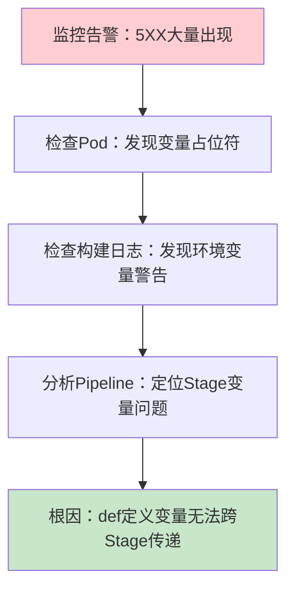

# 生产环境故障处理：从紧急止血到复盘改进的完整指南

## 情境与背景

生产环境故障是每个DevOps工程师、SRE和架构师都必须面对的挑战。本指南以一个真实的Jenkins热更新故障为案例，详细讲解从故障发现、紧急止血、根因分析到复盘改进的完整处理流程。

## 一、故障处理概述

### 1.1 故障分级

**故障等级定义**：

```markdown
## 故障处理概述

### 故障分级

**四级故障分类**：

```yaml
incident_levels:
  P0:
    name: "严重故障"
    description: "核心业务完全不可用"
    examples:
      - "支付系统宕机"
      - "用户无法登录"
      - "数据库服务中断"
    response_time: "< 5分钟"
    resolution_time: "< 1小时"
    
  P1:
    name: "重大故障"
    description: "核心业务部分受损"
    examples:
      - "部分用户无法下单"
      - "部分接口响应超时"
      - "部分功能不可用"
    response_time: "< 15分钟"
    resolution_time: "< 4小时"
    
  P2:
    name: "一般故障"
    description: "非核心业务受损"
    examples:
      - "非核心功能异常"
      - "部分用户受影响"
      - "性能明显下降"
    response_time: "< 1小时"
    resolution_time: "< 8小时"
    
  P3:
    name: "轻微故障"
    description: "轻微影响，可延迟处理"
    examples:
      - "非核心功能异常"
      - "少量用户受影响"
      - "UI显示问题"
    response_time: "< 4小时"
    resolution_time: "< 24小时"
```
```

### 1.2 故障处理流程

**四步处理流程**：

```markdown
### 故障处理流程

**故障处理四步法**：



**四步详解**：

```yaml
incident_handling_steps:
  step_1:
    name: "紧急止血"
    goal: "快速恢复服务，减少影响"
    actions:
      - "回滚变更"
      - "切换流量"
      - "降级服务"
      - "启用备用方案"
      
  step_2:
    name: "保留现场"
    goal: "保留证据，便于分析"
    actions:
      - "不删除问题Pod"
      - "保存日志"
      - "保存错误截图"
      - "记录时间线"
      
  step_3:
    name: "根因分析"
    goal: "找出真正原因"
    actions:
      - "查看监控指标"
      - "查看应用日志"
      - "查看系统日志"
      - "查看变更记录"
      
  step_4:
    name: "复盘改进"
    goal: "避免再次发生"
    actions:
      - "分析故障根因"
      - "制定改进措施"
      - "更新流程规范"
      - "完善自动化检查"
```
```

## 二、真实故障案例分析

### 2.1 故障背景

**故障场景描述**：

```markdown
## 真实故障案例分析

### 故障背景

**故障发生环境**：

```yaml
incident_environment:
  system: "用户下单系统"
  component: "Jenkins热更新发布"
  before_incident:
    - "Jenkins构建未优化"
    - "构建时间15分钟"
    - "人工检查为主"
    
  incident_time: "2024-03-15 14:30"
  discovery: "监控告警"
  severity: "P1"
```
```

### 2.2 故障现象

**故障表现**：

```markdown
### 故障现象

**告警信息**：

```yaml
incident_symptoms:
  alert:
    - "5XX错误率 > 10%"
    - "响应时间 P99 > 5秒"
    - "下单成功率下降至 60%"
    
  user_impact:
    - "大量用户无法完成下单"
    - "用户反馈页面报错"
    - "客服接到投诉"
    
  duration: "持续约15分钟"
```
```

### 2.3 紧急止血

**止血操作**：

```markdown
### 紧急止血

**止血步骤**：

```yaml
emergency_actions:
  action_1:
    name: "调整Ingress权重"
    description: "将故障版本流量权重降为0，切换到稳定版本"
    command: |
      kubectl patch ingress xxx-ingress -p '{
        "spec": {
          "rules": [{
            "http": {
              "paths": [{
                "backend": {
                  "service": {
                    "name": "xxx-service-stable"
                  }
                }
              }]
            }
          }]
        }
      }'
      
  action_2:
    name: "保留事故现场"
    description: "保留故障Deployment，不做删除操作"
    command: |
      # 查看当前Deployment
      kubectl get deployment xxx-app
      # 查看故障Pod
      kubectl get pods -l version=broken
      # 保留Deployment用于分析
```

**止血效果**：

```yaml
hemostasis_effect:
  before: "5XX错误率 15%，下单成功率 60%"
  after: "5XX错误率 < 1%，下单成功率恢复至 99%+"
  time: "约3分钟恢复服务"
```
```

### 2.4 根因分析

**分析过程**：

```markdown
### 根因分析

**分析步骤**：

```yaml
root_cause_analysis:
  step_1:
    name: "检查Pod状态"
    action: "查看故障Pod配置"
    command: |
      kubectl describe pod <broken-pod-name>
    finding: "发现yaml中存在${}变量占位符"
    
  step_2:
    name: "检查构建日志"
    action: "查看Jenkins构建日志"
    finding: "发现环境变量未找到的警告日志"
    
  step_3:
    name: "检查Pipeline"
    action: "分析Jenkinsfile"
    finding: "定位到Stage中用def定义的变量无法跨Stage传递"
    
  step_4:
    name: "定位根因"
    conclusion: "Stage中定义的变量无法传递给后续Stage，导致镜像构建时变量为空"
```

**问题代码**：

```groovy
// 错误的写法（问题代码）
pipeline {
    agent any
    
    stages {
        stage('Build') {
            steps {
                // Stage内部定义变量（无法跨Stage传递）
                def IMAGE_TAG = "${BUILD_NUMBER}"
                sh "echo $IMAGE_TAG"
            }
        }
        
        stage('Deploy') {
            steps {
                // 这里使用IMAGE_TAG会失败
                sh "kubectl set image deployment/xxx xxx=\${IMAGE_TAG}"
            }
        }
    }
}
```

**问题定位过程图**：


```

### 2.5 修复方案

**修复措施**：

```markdown
### 修复方案

**修复代码**：

```groovy
// 正确的写法（修复后）
pipeline {
    agent any
    
    // 统一在environment块定义（正确方式）
    environment {
        IMAGE_TAG = "${BUILD_NUMBER}"
        REGISTRY = "registry.example.com"
        APP_NAME = "xxx-app"
    }
    
    stages {
        stage('Build') {
            steps {
                script {
                    // 检查关键环境变量
                    if (!env.IMAGE_TAG) {
                        error("IMAGE_TAG环境变量未设置，中断构建")
                    }
                    if (!env.REGISTRY) {
                        error("REGISTRY环境变量未设置，中断构建")
                    }
                }
                sh "echo Building \${APP_NAME}:\${IMAGE_TAG}"
            }
        }
        
        stage('Deploy') {
            steps {
                // 这里可以正常使用IMAGE_TAG
                sh "kubectl set image deployment/\${APP_NAME} \${APP_NAME}=\${REGISTRY}/\${APP_NAME}:\${IMAGE_TAG}"
            }
        }
    }
}
```

**新增检查机制**：

```groovy
// 关键环境变量检查函数
def validateEnvironment() {
    def requiredVars = ['IMAGE_TAG', 'REGISTRY', 'APP_NAME', 'KUBECONFIG']
    def missing = []
    
    requiredVars.each { var ->
        if (!env.get(var)) {
            missing.add(var)
        }
    }
    
    if (missing.size() > 0) {
        error("缺少关键环境变量: \${missing.join(', ')}，请检查配置后重试")
    }
}
```
```

### 2.6 复盘与改进

**改进措施**：

```markdown
### 复盘与改进

**改进措施**：

```yaml
improvements:
  process:
    - "制定Pipeline变量声明规范"
    - "统一使用environment{}块定义变量"
    - "禁止在Stage中使用def定义关键变量"
    
  automation:
    - "增加关键变量校验"
    - "构建前自动检查环境变量"
    - "变量缺失直接中断构建"
    
  monitoring:
    - "增加构建过程监控"
    - "告警构建过程中的警告日志"
    - "发布后自动验证接口可用性"
    
  documentation:
    - "编写Pipeline编写规范"
    - "记录常见错误及解决方案"
    - "分享故障处理经验"
```
```

**Pipeline编写规范**：

```yaml
# Pipeline变量规范
pipeline_variable_rules:
  must_use_environment:
    - "镜像标签"
    - "仓库地址"
    - "应用名称"
    - "环境配置"
    
  avoid_in_stage_def:
    - "禁止在stage中用def定义需要跨stage使用的变量"
    - "禁止在steps中定义复杂对象"
    
  validation:
    - "构建前必须检查关键变量"
    - "变量为空必须中断构建"
    - "打印关键变量供审计"
```
```

## 三、故障排查方法论

### 3.1 排查思路

**系统性排查流程**：

```markdown
## 故障排查方法论

### 排查思路

**五问法排查**：

```yaml
five_why_method:
  question_1: "发生了什么问题？"
  answer_1: "5XX错误大量出现"
  
  question_2: "什么时候开始出现的？"
  answer_2: "热更新发布之后"
  
  question_3: "发布了什么变更？"
  answer_3: "Jenkins构建了新版本镜像"
  
  question_4: "构建过程有什么异常？"
  answer_4: "构建日志有环境变量未找到警告"
  
  question_5: "为什么变量未传递？"
  answer_5: "Stage中def定义的变量无法跨Stage传递"
```

**排查优先级**：

```yaml
troubleshooting_priority:
  priority_1:
    name: "快速恢复"
    actions: ["回滚", "切换流量", "降级"]
    
  priority_2:
    name: "收集证据"
    actions: ["保存日志", "保存配置", "记录时间线"]
    
  priority_3:
    name: "定位根因"
    actions: ["对比变更", "分析日志", "复现问题"]
    
  priority_4:
    name: "修复验证"
    actions: ["修复代码", "重新构建", "验证功能"]
```
```

### 3.2 常用排查命令

**K8s排查命令**：

```markdown
### 常用排查命令

**Pod状态排查**：

```bash
# 查看Pod状态
kubectl get pods -n <namespace> -o wide

# 查看Pod详情
kubectl describe pod <pod-name> -n <namespace>

# 查看Pod日志
kubectl logs <pod-name> -n <namespace> --previous

# 进入Pod调试
kubectl exec -it <pod-name> -n <namespace> -- /bin/sh

# 查看Pod资源使用
kubectl top pod -n <namespace>
```

**Ingress排查**：

```bash
# 查看Ingress配置
kubectl get ingress -n <namespace>

# 查看Ingress详情
kubectl describe ingress <ingress-name> -n <namespace>

# 查看Endpoints
kubectl get endpoints -n <namespace>

# 查看Service
kubectl get svc -n <namespace>
```

**Jenkins排查**：

```bash
# 查看构建日志
jenkins-cli build <job-name> -s -v

# 查看Console Output
# 访问: Jenkins URL/job/<job-name>/<build-number>/console

# 检查环境变量
sh 'printenv | sort'

# 检查变量传递
echo "IMAGE_TAG: ${IMAGE_TAG}"
```
```

## 四、生产环境最佳实践

### 4.1 紧急响应流程

**紧急响应SOP**：

```markdown
## 生产环境最佳实践

### 紧急响应流程

**紧急响应SOP**：

```yaml
emergency_response_sop:
  step_1:
    name: "发现与确认"
    time_limit: "5分钟"
    actions:
      - "确认告警真实性"
      - "评估影响范围"
      - "确定故障等级"
      
  step_2:
    name: "通知与升级"
    time_limit: "10分钟"
    actions:
      - "通知相关人员"
      - "升级到负责人"
      - "启动应急群"
      
  step_3:
    name: "紧急止血"
    time_limit: "30分钟"
    actions:
      - "回滚变更"
      - "切换流量"
      - "降级服务"
      
  step_4:
    name: "根因分析"
    time_limit: "2小时"
    actions:
      - "收集证据"
      - "分析日志"
      - "定位根因"
      
  step_5:
    name: "修复验证"
    time_limit: "根据情况"
    actions:
      - "修复问题"
      - "验证功能"
      - "灰度发布"
      
  step_6:
    name: "复盘改进"
    time_limit: "3天内"
    actions:
      - "编写复盘报告"
      - "制定改进措施"
      - "更新流程规范"
```
```

### 4.2 变更管理

**变更管理流程**：

```markdown
### 变更管理

**变更前检查清单**：

```yaml
change_checklist:
  before_change:
    - "确认变更方案"
    - "准备回滚方案"
    - "通知相关方"
    - "选择变更窗口"
    - "确认监控告警"
    
  during_change:
    - "按步骤执行"
    - "实时检查状态"
    - "记录变更过程"
    - "保留变更证据"
    
  after_change:
    - "验证功能正常"
    - "检查监控指标"
    - "确认无异常告警"
    - "通知相关方完成"
```
```

**发布前检查**：

```groovy
// Jenkins发布前检查
pipeline {
    stages {
        stage('Pre-Check') {
            steps {
                script {
                    // 检查环境变量
                    validateEnvironment()
                    
                    // 检查镜像
                    validateImage()
                    
                    // 检查配置
                    validateConfig()
                }
            }
        }
        
        stage('Deploy') {
            steps {
                script {
                    // 灰度发布
                    deployToCanary()
                    
                    // 验证
                    verifyCanary()
                    
                    // 全量发布
                    deployToProduction()
                }
            }
        }
    }
}
```
```

### 4.3 监控与告警

**关键监控指标**：

```markdown
### 监控与告警

**核心监控指标**：

```yaml
monitoring_metrics:
  availability:
    - "5XX错误率"
    - "服务可用性"
    - "健康检查成功率"
    
  performance:
    - "响应时间 P99"
    - "吞吐量 QPS"
    - "错误率"
    
  resources:
    - "CPU使用率"
    - "内存使用率"
    - "磁盘使用率"
```

**告警规则**：

```yaml
alert_rules:
  critical:
    - "5XX错误率 > 5%"
    - "服务不可用"
    - "P99响应时间 > 10秒"
      
  warning:
    - "5XX错误率 > 1%"
    - "P99响应时间 > 5秒"
    - "CPU使用率 > 80%"
```
```

## 五、面试1分钟精简版（直接背）

**完整版**：

我分享一个Jenkins热更新发布导致5XX故障的处理案例。现象是发布后5XX错误大量出现。处理：先调整Ingress权重将流量切走，保留Deployment事故现场。排查：检查Pod发现yaml中存在${}变量占位，检查构建日志发现有环境变量未找到的警告，定位到Stage中用def定义的变量无法跨Stage传递，导致镜像中变量为空。修复：将变量统一在pipeline顶层environment{}块定义，添加变量检测，关键环境变量缺失直接中断构建，并推动了Pipeline变量声明规范的统一。

**30秒超短版**：

故障处理四步：止血（切流量）、保留现场（保持Deployment）、根因分析（查日志定位问题）、复盘改进（制定规范防止再犯。

## 六、总结

### 6.1 故障处理要点

```yaml
incident_handling_summary:
  discovery:
    - "监控告警发现"
    - "用户反馈"
    - "定期巡检"
    
  hemostasis:
    - "回滚变更"
    - "切换流量"
    - "降级服务"
    
  analysis:
    - "保留现场"
    - "收集证据"
    - "五问法定位根因"
    
  improvement:
    - "制定规范"
    - "自动化检查"
    - "完善监控"
```

### 6.2 最佳实践清单

```yaml
best_practices:
  prevention:
    - "变更前充分测试"
    - "灰度发布验证"
    - "关键变量检查"
    
  response:
    - "快速止血优先"
    - "保留现场证据"
    - "系统性分析"
    
  improvement:
    - "复盘总结"
    - "规范制定"
    - "自动化加固"
```

### 6.3 记忆口诀

```
故障处理四步走，止血保留现场先，
分析根因找问题，五问法定位根因，
修复验证要彻底，复盘改进防再犯，
监控告警是眼睛，规范流程是保障。
```

> **参考链接**：[SRE运维面试题全解析：从理论到实践（第二部分）]()