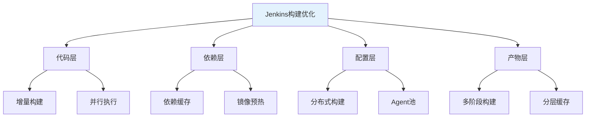
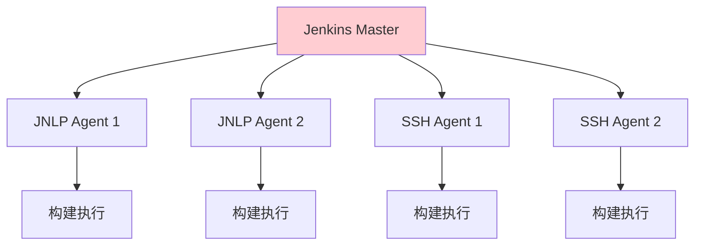

# Jenkins构建优化：从流水线到产物的完整实践指南

## 情境与背景

Jenkins是企业中常用的CI/CD工具，构建效率直接影响交付速度。本指南从代码层、依赖层、配置层、产物层四个维度详细讲解Jenkins构建优化策略，并提供实战案例。

## 一、Jenkins构建优化概述

### 1.1 构建性能指标

**构建性能指标**：

```markdown
## Jenkins构建优化概述

### 构建性能指标

**核心指标定义**：

```yaml
build_metrics:
  build_duration:
    description: "构建耗时"
    unit: "分钟或秒"
    good: "< 5分钟"
    acceptable: "5-15分钟"
    need_optimization: "> 15分钟"
    
  build_success_rate:
    description: "构建成功率"
    target: "> 95%"
    acceptable: "> 90%"
    
  queue_time:
    description: "排队等待时间"
    unit: "秒"
    good: "< 30秒"
    
  concurrent_builds:
    description: "并发构建数"
    depends_on: "Agent数量和资源"
```

**优化收益估算**：

```yaml
optimization_benefits:
  before: "15分钟/次构建"
  after: "5分钟/次构建"
  time_saved_per_build: "10分钟"
  daily_builds: 20
  daily_time_saved: "200分钟 ≈ 3.3小时"
  yearly_time_saved: "20000分钟 ≈ 333小时"
```
```

### 1.2 优化维度总览

**四大优化维度**：

```markdown
### 优化维度总览

**优化层次结构**：



**各层优化重点**：

```yaml
optimization_layers:
  code_layer:
    focus: "减少构建范围"
    techniques: ["增量构建", "并行执行", "阶段拆分"]
    
  dependency_layer:
    focus: "加速依赖下载"
    techniques: ["本地缓存", "镜像缓存", "私有仓库"]
    
  configuration_layer:
    focus: "提升并发能力"
    techniques: ["分布式构建", "Agent池", "资源调度"]
    
  artifact_layer:
    focus: "减少产物大小"
    techniques: ["多阶段构建", "分层缓存", "压缩优化"]
```
```

## 二、代码层优化

### 2.1 增量构建

**增量构建原理**：

```markdown
## 代码层优化

### 增量构建

**增量构建原理**：

```yaml
incremental_build_principle:
  description: "只构建变更的模块"
  trigger: "代码提交或文件变更"
  scope: "变更模块及其依赖"
  benefit: "减少80%+构建时间"
```

**Git变更检测**：

```groovy
// Jenkinsfile增量构建示例
pipeline {
    agent any
    
    environment {
        CHANGED_MODULES = ''
    }
    
    stages {
        stage('Detect Changes') {
            steps {
                script {
                    def changedFiles = getGitChanges()
                    env.CHANGED_MODULES = detectChangedModules(changedFiles)
                    echo "Changed modules: ${env.CHANGED_MODULES}"
                }
            }
        }
        
        stage('Build Changed Modules') {
            steps {
                script {
                    buildModules(env.CHANGED_MODULES)
                }
            }
        }
    }
}

def getGitChanges() {
    def changes = []
    def gitLog = sh(
        script: "git diff --name-only HEAD~1 HEAD",
        returnStdout: true
    ).trim()
    return gitLog.split('\n')
}

def detectChangedModules(changedFiles) {
    def modules = []
    changedFiles.each { file ->
        def module = getModuleFromPath(file)
        if (module && !modules.contains(module)) {
            modules.add(module)
        }
    }
    return modules.join(',')
}
```

**多分支流水线增量**：

```groovy
// GitHub Organization分支增量构建
organizationFolder('my-org') {
    description = 'My Organization Folder'
    
    displayName = 'My Organization'
    
    triggers {
        cron('H/15 * * * *')
    }
    
    sandbox = true
    
    buildStrategies {
        changesets {
            ignoreCommitPriorities = false
            ignoreUnknownChildren = false
        }
    }
    
    workflowLibs {
        reference('libs@main')
    }
}
```
```

### 2.2 并行执行

**Pipeline并行阶段**：

```markdown
### 并行执行

**Parallel阶段配置**：

```groovy
// Jenkinsfile并行执行示例
pipeline {
    agent any
    
    stages {
        stage('Build & Test') {
            parallel {
                stage('Build Backend') {
                    steps {
                        echo 'Building backend...'
                        sh './gradlew backend:build -x test'
                    }
                }
                
                stage('Build Frontend') {
                    steps {
                        echo 'Building frontend...'
                        sh './npm run build'
                    }
                }
                
                stage('Build Infrastructure') {
                    steps {
                        echo 'Building infrastructure...'
                        sh 'terraform plan'
                    }
                }
            }
        }
        
        stage('Integration Test') {
            steps {
                echo 'Running integration tests...'
            }
        }
    }
}
```

**矩阵式并行构建**：

```groovy
// 矩阵式构建示例 - 多版本测试
pipeline {
    agent any
    
    stages {
        stage('Matrix Build') {
            matrix {
                axes {
                    axis {
                        name 'JDK_VERSION'
                        values '8', '11', '17'
                    }
                    axis {
                        name 'DATABASE'
                        values 'mysql', 'postgres', 'mariadb'
                    }
                }
                
                stages {
                    stage('Test') {
                        steps {
                            echo "Testing with JDK ${JDK_VERSION} and ${DATABASE}"
                            sh "./gradlew test -Djdk.version=${JDK_VERSION} -Ddatabase=${DATABASE}"
                        }
                    }
                }
            }
        }
    }
}
```

## 三、依赖层优化

### 3.1 构建缓存配置

**Maven缓存配置**：

```markdown
## 依赖层优化

### Maven缓存配置

**settings.xml配置**：

```xml
<!-- ~/.m2/settings.xml -->
<settings>
    <localRepository>/var/jenkins_home/.m2/repository</localRepository>
    
    <mirrors>
        <mirror>
            <id>aliyun-maven</id>
            <name>Aliyun Maven Mirror</name>
            <url>https://maven.aliyun.com/repository/public</url>
            <mirrorOf>central</mirrorOf>
        </mirror>
    </mirrors>
</settings>
```

**Jenkins Maven配置**：

```groovy
// Jenkinsfile Maven缓存
pipeline {
    agent {
        docker {
            image 'maven:3.8-openjdk-11'
            args '-v $HOME/.m2:/root/.m2'
        }
    }
    
    stages {
        stage('Build') {
            steps {
                sh 'mvn clean package -DskipTests'
            }
        }
    }
}
```

**分布式缓存**：

```yaml
# JCasC配置
unclassified:
  globalLibraries:
    - name: "shared-libs"
      defaultVersion: "main"
      retriever:
        modernSCM:
          scm:
            git:
              remote: "https://github.com/org/jenkins-shared-library.git"
```
```

### 3.2 npm缓存配置

**npm缓存配置**：

```markdown
### npm缓存配置

**npm镜像配置**：

```bash
# .npmrc配置
registry=https://registry.npmmirror.com
cache=/var/jenkins_home/.npm
prefix=/var/jenkins_home/.npm-global
```

**Jenkins npm配置**：

```groovy
// Jenkinsfile npm缓存
pipeline {
    agent {
        docker {
            image 'node:18-alpine'
            args '-v $HOME/.npm:/root/.npm'
        }
    }
    
    stages {
        stage('Install') {
            steps {
                sh '''
                    npm config set registry https://registry.npmmirror.com
                    npm install --legacy-peer-deps
                '''
            }
        }
        
        stage('Build') {
            steps {
                sh 'npm run build'
            }
        }
    }
}
```

**Yarn缓存配置**：

```groovy
// Yarn缓存
pipeline {
    agent {
        docker {
            image 'node:18-alpine'
            args '-v $HOME/.yarn:/root/.yarn'
        }
    }
    
    stages {
        stage('Install') {
            steps {
                sh 'yarn install --frozen-lockfile'
            }
        }
    }
}
```
```

### 3.3 镜像预热

**构建镜像预热**：

```markdown
### 镜像预热

**Docker镜像预热策略**：

```yaml
image_preheat_strategy:
  base_image:
    description: "基础镜像预热"
    schedule: "每日凌晨"
    images:
      - "maven:3.8-openjdk-11"
      - "node:18-alpine"
      - "python:3.10-slim"
      
  dependency_cache:
    description: "依赖缓存镜像"
    strategy: "定期更新"
```

**预热Job配置**：

```groovy
// 镜像预热流水线
pipeline {
    agent any
    
    triggers {
        cron('0 2 * * *')  // 每天凌晨2点
    }
    
    stages {
        stage('Pull Base Images') {
            steps {
                script {
                    def images = [
                        'maven:3.8-openjdk-11',
                        'node:18-alpine',
                        'python:3.10-slim',
                        'gradle:8.0-jdk-11'
                    ]
                    
                    images.each { image ->
                        sh "docker pull ${image}"
                    }
                }
            }
        }
        
        stage('Pre-warm Dependencies') {
            steps {
                script {
                    // Maven依赖预热
                    sh '''
                        docker run --rm maven:3.8-openjdk-11 \
                        mvn dependency:go-offline -B
                    '''
                    
                    // npm依赖预热
                    sh '''
                        docker run --rm -v $HOME/.npm:/root/.npm \
                        node:18-alpine \
                        npm install -g typescript eslint
                    '''
                }
            }
        }
    }
}
```
```

## 四、配置层优化

### 4.1 分布式构建

**Agent架构**：

```markdown
## 配置层优化

### 分布式构建

**分布式架构**：



**JNLP Agent配置**：

```yaml
# JNLP Agent配置
jenkins_agent:
  name: "build-agent-1"
  labels: ["docker", "maven", "java"]
  numExecutors: 4
  mode: "EXCLUSIVE"
  remoteFS: "/var/jenkins_home/agent"
```

**Kubernetes Agent配置**：

```yaml
# Kubernetes Agent配置
apiVersion: v1
kind: Pod
metadata:
  name: jenkins-agent
  labels:
    app: jenkins-agent
spec:
  serviceAccountName: jenkins
  containers:
  - name: maven
    image: maven:3.8-openjdk-11
    command: ["sleep"]
    args: ["99d"]
    volumeMounts:
    - name: maven-cache
      mountPath: /root/.m2
  volumes:
  - name: maven-cache
    persistentVolumeClaim:
      claimName: maven-cache-pvc
```

**Jenkins配置Kubernetes插件**：

```yaml
# Configure Global Security - Kubernetes
jenkins:
  clouds:
    - kubernetes:
        name: "kubernetes"
        serverUrl: "https://kubernetes.default"
        namespace: "jenkins"
        jenkinsUrl: "http://jenkins:8080"
        jenkinsTunnel: "jenkins-agent:50000"
        connectTimeout: 5
        readTimeout: 15
        containerCap: 100
        maxRequestsPerHostStr: 32
        retentionTimeout: 5
```
```

### 4.2 Agent池管理

**Agent池策略**：

```markdown
### Agent池管理

**Agent标签策略**：

```yaml
agent_labels:
  by_language:
    - "java"
    - "nodejs"
    - "python"
    - "golang"
    
  by_resource:
    - "high-memory"
    - "high-cpu"
    - "gpu"
    
  by_capability:
    - "docker"
    - "kubectl"
    - "terraform"
```

**Agent分配策略**：

```groovy
// Jenkinsfile指定Agent
pipeline {
    agent {
        label 'docker && maven'
    }
    
    stages {
        stage('Build') {
            steps {
                echo 'Building with Docker and Maven agent...'
            }
        }
    }
}
```

**云原生Agent配置**：

```yaml
# Kubernetes Agent Template
cloud: "kubernetes"
label: "jenkins-agent-docker-maven"
name: "docker-maven-template"
containers:
  - name: "maven"
    image: "maven:3.8-openjdk-11"
    command: ""
    args: ""
    ttyEnabled: true
    workingDir: "/home/jenkins/agent"
volumes:
  - hostPathVolume:
      hostPath: "/var/run/docker.sock"
      mountPath: "/var/run/docker.sock"
yaml: |
  apiVersion: v1
  kind: Pod
  spec:
    securityContext:
      runAsUser: 1000
```
```

### 4.3 资源调度优化

**资源配额配置**：

```markdown
### 资源调度优化

**Kubernetes资源限制**：

```yaml
# Agent Pod资源限制
resources:
  limits:
    cpu: "4"
    memory: "8Gi"
  requests:
    cpu: "1"
    memory: "2Gi"
```

**构建并发控制**：

```groovy
// Jenkinsfile限制并发
pipeline {
    options {
        disableConcurrentBuilds()  // 禁用同一Job并发
        buildDiscarder(logRotator(numToKeepStr: '10'))
    }
    
    stages {
        stage('Build') {
            options {
                timeout(time: 30, unit: 'MINUTES')
            }
            steps {
                echo 'Building...'
            }
        }
    }
}
```

**全局并发配置**：

```yaml
# Jenkins配置
jenkins:
  numExecutors: 0  # Master不执行构建
  mode: EXCLUSIVE

  # Executor设置
  executors:
    - name: "java-build"
      labels: ["java"]
      numExecutors: 4
    - name: "node-build"
      labels: ["nodejs"]
      numExecutors: 4
```

## 五、产物层优化

### 5.1 多阶段构建

**多阶段构建原理**：

```markdown
## 产物层优化

### 多阶段构建

**多阶段构建示例**：

```dockerfile
# 构建阶段
FROM maven:3.8-openjdk-11 AS builder
WORKDIR /app
COPY pom.xml .
COPY src ./src
RUN mvn clean package -DskipTests

# 运行阶段
FROM openjdk:11-jre-slim
WORKDIR /app
COPY --from=builder /app/target/app.jar ./app.jar

# 创建非root用户
RUN addgroup -S appgroup && adduser -S appuser -G appgroup
USER appuser

ENTRYPOINT ["java", "-jar", "app.jar"]
```

**前端多阶段构建**：

```dockerfile
# 构建阶段
FROM node:18-alpine AS builder
WORKDIR /app
COPY package*.json ./
RUN npm ci --only=production
COPY . .
RUN npm run build

# 运行阶段
FROM nginx:alpine
COPY --from=builder /app/dist /usr/share/nginx/html
COPY nginx.conf /etc/nginx/nginx.conf
EXPOSE 80
CMD ["nginx", "-g", "daemon off;"]
```
```

**Go多阶段构建**：

```dockerfile
# 构建阶段
FROM golang:1.21-alpine AS builder
WORKDIR /app
COPY go.mod go.sum ./
RUN go mod download
COPY . .
RUN CGO_ENABLED=0 GOOS=linux go build -a -installsuffix cgo -o main .

# 运行阶段
FROM alpine:latest
RUN apk --no-cache add ca-certificates
WORKDIR /app
COPY --from=builder /app/main .
EXPOSE 8080
CMD ["./main"]
```
```

### 5.2 分层缓存

**Docker分层策略**：

```markdown
### 分层缓存

**优化分层顺序**：

```yaml
dockerfile_layers:
  optimal_order:
    - "系统依赖（apt/yum/apk）"
    - "项目依赖（package.json/pom.xml/go.mod）"
    - "源代码"
    - "构建产物"
    
  bad_order:
    - "频繁变更放最后"
    - "稳定依赖放前面"
```

**优化后的Dockerfile**：

```dockerfile
# 优化：依赖层单独提取
FROM maven:3.8-openjdk-11 AS builder

# 先复制依赖文件（变化少）
WORKDIR /app
COPY pom.xml .
RUN mvn dependency:go-offline -B

# 再复制源代码（变化多）
COPY src ./src
RUN mvn clean package -DskipTests
```

**缓存失效优化**：

```dockerfile
# 使用buildkit缓存
# syntax=docker/dockerfile:1.4

# 依赖层
FROM maven:3.8-openjdk-11 AS deps
WORKDIR /app
COPY pom.xml .
RUN --mount=type=cache,target=/root/.m2/repository \
    mvn dependency:go-offline -B

# 构建层
FROM deps AS builder
COPY src ./src
RUN --mount=type=cache,target=/root/.m2/repository \
    mvn clean package -DskipTests

# 运行层
FROM openjdk:11-jre-slim
WORKDIR /app
COPY --from=builder /app/target/app.jar ./app.jar
ENTRYPOINT ["java", "-jar", "app.jar"]
```
```

### 5.3 镜像压缩优化

**镜像压缩策略**：

```markdown
### 镜像压缩优化

**压缩工具使用**：

```bash
# 使用docker-squash压缩
docker-squash -f from=builder -t myapp:squashed myapp:original

# 使用buildpack压缩
pack build myapp:compressed --builder heroku/builder:22

# 使用dive分析镜像
dive myapp:latest
```

**小型基础镜像选择**：

```yaml
image_size_comparison:
  ubuntu: "77MB+"
  debian_slim: "30MB+"
  alpine: "3MB+"
  
  openjdk: "200MB+"
  openjdk:11-slim: "80MB+"
  openjdk:11-jre-slim: "40MB+"
  
  golang: "800MB+"
  golang:alpine: "5MB+"
```

**最佳实践总结**：

```yaml
image_optimization_best_practices:
  - "使用alpine作为基础镜像"
  - "多阶段构建分离构建工具"
  - "减少层数，合并RUN命令"
  - "使用.dockerignore排除无关文件"
  - "清理缓存和临时文件"
```
```

## 六、生产环境最佳实践

### 6.1 流水线设计最佳实践

**Pipeline设计模式**：

```markdown
## 生产环境最佳实践

### 流水线设计最佳实践

**模块化Pipeline**：

```groovy
// Jenkinsfile - 模块化设计
@Library('shared-library') _

pipeline {
    agent any
    
    options {
        buildDiscarder(logRotator(numToKeepStr: '30'))
        disableConcurrentBuilds()
        timeout(time: 30, unit: 'MINUTES')
    }
    
    stages {
        stage('Init') {
            steps {
                script {
                    env.BUILD_VERSION = getVersion()
                }
            }
        }
        
        stage('Build') {
            steps {
                parallel(
                    backend: { buildBackend() },
                    frontend: { buildFrontend() }
                )
            }
        }
        
        stage('Test') {
            steps {
                parallel(
                    unit: { runUnitTests() },
                    integration: { runIntegrationTests() },
                    security: { runSecurityScan() }
                )
            }
        }
        
        stage('Deploy') {
            when {
                branch 'main'
            }
            steps {
                deployTo(env.BUILD_VERSION)
            }
        }
    }
    
    post {
        always {
            cleanWs()
        }
        success {
            dingtalk notification: 'success'
        }
        failure {
            dingtalk notification: 'failure'
        }
    }
}
```

**共享库结构**：

```yaml
# 共享库结构
vars/
  buildBackend.groovy
  buildFrontend.groovy
  deployTo.groovy
  runTests.groovy
  notification.groovy
  dockerBuild.groovy
```
```

### 6.2 构建监控

**构建指标监控**：

```markdown
### 构建监控

**监控指标**：

```yaml
build_monitoring:
  duration:
    - "平均构建时长"
    - "P90构建时长"
    - "构建时长趋势"
    
  success_rate:
    - "构建成功率"
    - "失败率趋势"
    
  queue:
    - "排队等待时间"
    - "排队Job数量"
    
  resources:
    - "Executor使用率"
    - "Agent CPU/内存使用"
```

**Prometheus配置**：

```yaml
# Prometheus抓取Jenkins指标
- job_name: 'jenkins'
  metrics_path: '/prometheus/'
  static_configs:
    - targets: ['jenkins.example.com:8080']
```

**Grafana Dashboard**：

```json
{
  "dashboard": {
    "title": "Jenkins Build Metrics",
    "panels": [
      {
        "title": "Build Duration",
        "type": "graph",
        "targets": [
          {
            "expr": "jenkins_build_duration_seconds"
          }
        ]
      },
      {
        "title": "Build Success Rate",
        "type": "gauge",
        "targets": [
          {
            "expr": "rate(jenkins_builds_success_total[5m]) / rate(jenkins_builds_total[5m])"
          }
        ]
      }
    ]
  }
}
```
```

### 6.3 故障排查

**常见构建问题与解决**：

```markdown
### 故障排查

**常见问题**：

```yaml
build_issues:
  timeout:
    cause: "构建超时"
    solution: "增加timeout、优化慢步骤"
    
  disk_space:
    cause: "磁盘空间不足"
    solution: "配置构建后清理、扩展磁盘"
    
  agent_offline:
    cause: "Agent离线"
    solution: "检查Agent状态、重启Agent"
    
  dependency_resolution:
    cause: "依赖下载失败"
    solution: "配置镜像仓库、检查网络"
    
  permission:
    cause: "权限问题"
    solution: "配置正确用户和权限"
```

**排查命令**：

```bash
# 查看构建日志
jenkins-cli build <job-name> -s -v

# 检查Agent状态
jenkins-cli list-channels

# 清理构建缓存
jenkins-cli groovy = 'Jenkins.instance.allItems.each { it.doDoDelete() }'

# 重启Jenkins
jenkins-cli safe-restart
```
```

## 七、面试1分钟精简版（直接背）

**完整版**：

Jenkins构建优化主要从四方面入手：1. 代码层：增量构建只构建变更模块，Pipeline并行阶段加速；2. 依赖层：Maven/Gradle本地缓存、npm缓存、构建镜像预热；3. 配置层：分布式构建增加Agent节点，配置JNLP或SSH Agent；4. 产物层：Docker多阶段构建减少镜像体积，分层缓存提高复用。我们项目通过这些优化，单次构建时间从15分钟降到5分钟。

**30秒超短版**：

Jenkins优化：增量构建减少范围、并行执行加速、缓存依赖加速、分布式构建提升并发、多阶段构建减少体积。

## 八、总结

### 8.1 优化维度总结

```yaml
optimization_summary:
  code_layer:
    - "增量构建"
    - "并行执行"
    - "阶段拆分"
    
  dependency_layer:
    - "Maven缓存"
    - "npm缓存"
    - "镜像预热"
    
  configuration_layer:
    - "分布式构建"
    - "Agent池管理"
    - "资源调度"
    
  artifact_layer:
    - "多阶段构建"
    - "分层缓存"
    - "镜像压缩"
```

### 8.2 最佳实践清单

```yaml
best_practices:
  design:
    - "模块化Pipeline"
    - "使用共享库"
    - "合理使用并行"
    
  performance:
    - "增量构建优先"
    - "缓存依赖"
    - "分布式构建"
    
  monitoring:
    - "监控构建指标"
    - "设置告警"
    - "定期分析瓶颈"
    
  maintenance:
    - "定期清理缓存"
    - "更新基础镜像"
    - "优化Dockerfile"
```

### 8.3 记忆口诀

```
Jenkins优化有四维，代码层，增量并行，
依赖层，缓存加速，配置层，分布式，
产物层，多阶段构建，减少体积记心间，
优化效果很明显，构建时间减大半。
```

> **参考链接**：[SRE运维面试题全解析：从理论到实践（第二部分）]()