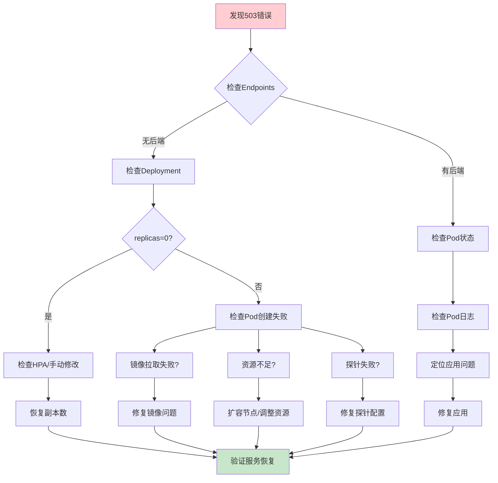

# Kubernetes 503错误与副本消失：实战故障排查指南

## 情境与背景

生产环境中突然出现Web应用返回503错误，Kubernetes Service后端replicas变为0，日志显示"no upstream"。这是典型的服务不可用场景，需要系统性排查和快速恢复。

## 一、故障现象分析

### 1.1 现象汇总

**故障特征**：

```yaml
symptoms:
  - "HTTP 503 Service Unavailable"
  - "Deployment replicas = 0"
  - "no upstream" in logs
  - "latency存在→latency消失"
  - "服务完全不可用"
```

### 1.2 可能原因

**常见根因**：

```yaml
possible_causes:
  hpa_scaling:
    description: "HPA自动缩容到0"
    indicator: "HPA目标指标异常"
    
  deployment_issue:
    description: "副本数被手动设置为0"
    indicator: "replicas字段为0"
    
  pod_failure:
    description: "所有Pod启动失败"
    indicator: "Pod状态为CrashLoopBackOff"
    
  image_pull_failure:
    description: "镜像拉取失败"
    indicator: "ImagePullBackOff"
    
  probe_failure:
    description: "健康检查失败"
    indicator: "Readiness probe failed"
    
  resource_exhaustion:
    description: "资源不足被驱逐"
    indicator: "Evicted状态"
    
  rolling_update_failure:
    description: "滚动更新失败"
    indicator: "更新卡住"
```

## 二、故障排查流程

### 2.1 排查流程图

**系统性排查步骤**：



### 2.2 快速排查命令

**必备命令清单**：

```bash
# 1. 检查Service和Endpoints
kubectl get svc
kubectl get endpoints

# 2. 检查Deployment状态
kubectl get deployment
kubectl describe deployment <name>

# 3. 检查Pod状态
kubectl get pods -o wide
kubectl describe pod <name>

# 4. 查看集群事件
kubectl get events --sort-by='.lastTimestamp'

# 5. 查看Pod日志
kubectl logs <pod-name>
kubectl logs <pod-name> -p  # 查看已终止容器日志

# 6. 检查HPA状态
kubectl get hpa
kubectl describe hpa <name>

# 7. 检查节点资源
kubectl describe nodes
```

## 三、常见根因深度分析

### 3.1 HPA自动缩容到0

**问题分析**：

```markdown
## 根因1：HPA自动缩容到0

**现象**：
- HPA目标指标（如CPU使用率）接近0
- 副本数被自动缩容到0

**排查命令**：
```bash
kubectl get hpa
kubectl describe hpa <name>
```

**原因**：
- 流量突然下降到接近0
- HPA配置的minReplicas=0
- 指标采集异常

**解决方案**：
```bash
# 临时恢复副本数
kubectl scale deployment <name> --replicas=5

# 修改HPA配置，设置最小副本数
kubectl patch hpa <name> -p '{"spec":{"minReplicas":2}}'
```
```

### 3.2 镜像拉取失败

**问题分析**：

```markdown
## 根因2：镜像拉取失败

**现象**：
- Pod状态为ImagePullBackOff或ErrImagePull
- 事件日志显示镜像拉取失败

**排查命令**：
```bash
kubectl get pods -o wide
kubectl describe pod <name> | grep -A 5 "Events"
```

**原因**：
- 镜像标签不存在
- 镜像仓库认证失败
- 网络问题无法访问仓库

**解决方案**：
```bash
# 检查镜像是否存在
docker pull <image-name>:<tag>

# 检查imagePullSecrets配置
kubectl get secret

# 修复镜像标签
kubectl set image deployment <name> <container>=<correct-image>
```
```

### 3.3 健康检查失败

**问题分析**：

```markdown
## 根因3：健康检查失败

**现象**：
- Pod状态为Running但未就绪
- Readiness probe失败
- Endpoints中无该Pod

**排查命令**：
```bash
kubectl describe pod <name> | grep -A 10 "Readiness"
kubectl logs <name> -c <container>
```

**原因**：
- Readiness探针配置错误
- 应用启动时间过长
- 应用内部错误导致探针失败

**解决方案**：
```bash
# 查看探针配置
kubectl get deployment <name> -o yaml | grep -A 15 "readinessProbe"

# 调整探针配置
kubectl patch deployment <name> -p '{
  "spec": {
    "template": {
      "spec": {
        "containers": [{
          "name": "<container>",
          "readinessProbe": {
            "httpGet": {"path": "/health", "port": 8080},
            "initialDelaySeconds": 30,
            "timeoutSeconds": 5
          }
        }]
      }
    }
  }
}'
```
```

### 3.4 资源不足被驱逐

**问题分析**：

```markdown
## 根因4：资源不足被驱逐

**现象**：
- Pod状态为Evicted
- 节点资源使用率接近100%
- 事件日志显示资源压力

**排查命令**：
```bash
kubectl get pods | grep Evicted
kubectl describe node <node-name>

# 检查节点资源使用
kubectl top nodes
kubectl top pods
```

**原因**：
- 节点内存/磁盘不足
- 资源请求配置过高
- 节点故障

**解决方案**：
```bash
# 扩容节点或调整资源配置
kubectl scale deployment <name> --replicas=0
kubectl scale deployment <name> --replicas=5

# 清理Evicted Pod
kubectl get pods | grep Evicted | awk '{print $1}' | xargs kubectl delete pod
```
```

### 3.5 滚动更新失败

**问题分析**：

```markdown
## 根因5：滚动更新失败

**现象**：
- Deployment更新卡住
- 新Pod无法就绪
- 旧Pod已被删除

**排查命令**：
```bash
kubectl describe deployment <name>
kubectl rollout status deployment <name>
```

**原因**：
- 新版本镜像问题
- 滚动更新策略配置不当
- MaxUnavailable设置过高

**解决方案**：
```bash
# 回滚到上一个版本
kubectl rollout undo deployment <name>

# 检查更新状态
kubectl rollout history deployment <name>
```
```

## 四、实战案例分析

### 4.1 案例：HPA缩容导致服务中断

**案例描述**：

```markdown
## 案例1：HPA自动缩容到0

**场景**：
- 夜间流量极低，HPA将副本数缩容到0
- 早晨流量恢复时，服务完全不可用

**排查过程**：
1. `kubectl get hpa` → minReplicas=0，当前副本=0
2. `kubectl get deployment` → replicas=0
3. `kubectl get events` → HPA scaled down to 0

**解决方案**：
```bash
# 设置最小副本数
kubectl patch hpa my-app -p '{"spec":{"minReplicas":2}}'

# 立即恢复副本
kubectl scale deployment my-app --replicas=10
```

**预防措施**：
- 设置合理的minReplicas
- 配置HPA冷却时间
- 添加告警规则
```

### 4.2 案例：镜像拉取失败导致服务中断

**案例描述**：

```markdown
## 案例2：镜像拉取失败

**场景**：
- CI/CD推送了新镜像，但标签错误
- 滚动更新时新Pod无法拉取镜像
- 旧Pod被删除后服务中断

**排查过程**：
1. `kubectl get pods` → ImagePullBackOff状态
2. `kubectl describe pod` → 镜像拉取失败
3. 检查镜像仓库 → 标签不存在

**解决方案**：
```bash
# 回滚到上一个稳定版本
kubectl rollout undo deployment my-app

# 修复镜像标签后重新部署
kubectl set image deployment my-app app=my-app:v1.0.0
```

**预防措施**：
- 镜像标签使用commit hash
- 部署前验证镜像存在
- 设置合理的滚动更新策略
```

### 4.3 案例：健康检查超时导致服务中断

**案例描述**：

```markdown
## 案例3：健康检查失败

**场景**：
- 应用启动时间延长（新增初始化逻辑）
- Readiness探针超时导致Pod无法就绪
- 滚动更新时所有Pod都处于未就绪状态

**排查过程**：
1. `kubectl get pods` → Running但Ready=0/1
2. `kubectl describe pod` → Readiness probe failed
3. `kubectl logs` → 应用还在初始化中

**解决方案**：
```bash
# 调整探针配置
kubectl patch deployment my-app -p '{
  "spec": {
    "template": {
      "spec": {
        "containers": [{
          "name": "app",
          "readinessProbe": {
            "httpGet": {"path": "/health", "port": 8080},
            "initialDelaySeconds": 60,
            "timeoutSeconds": 10,
            "periodSeconds": 10
          }
        }]
      }
    }
  }
}'
```

**预防措施**：
- 合理设置initialDelaySeconds
- 使用Startup探针
- 监控探针失败率
```

## 五、快速恢复指南

### 5.1 紧急恢复步骤

**恢复checklist**：

```yaml
recovery_steps:
  step_1:
    action: "检查当前状态"
    commands:
      - "kubectl get deployment"
      - "kubectl get pods"
      - "kubectl get endpoints"
      
  step_2:
    action: "确认根因"
    commands:
      - "kubectl describe deployment"
      - "kubectl get events"
      - "kubectl logs <pod>"
      
  step_3:
    action: "临时恢复"
    commands:
      - "kubectl scale deployment <name> --replicas=<number>"
      - "kubectl rollout undo deployment <name>"
      
  step_4:
    action: "验证恢复"
    commands:
      - "kubectl get pods -w"
      - "curl <service-endpoint>"
```

### 5.2 恢复命令速查

**常用恢复命令**：

```bash
# 1. 恢复副本数
kubectl scale deployment <name> --replicas=10

# 2. 回滚部署
kubectl rollout undo deployment <name>

# 3. 暂停滚动更新
kubectl rollout pause deployment <name>

# 4. 强制重启Pod
kubectl rollout restart deployment <name>

# 5. 紧急扩容
kubectl scale deployment <name> --replicas=0
kubectl scale deployment <name> --replicas=20
```

## 六、预防措施

### 6.1 监控告警配置

**关键监控指标**：

```yaml
monitoring:
  metrics:
    - "deployment_replicas_available"
    - "deployment_replicas_unavailable"
    - "hpa_current_replicas"
    - "hpa_desired_replicas"
    - "pod_restart_count"
    - "probe_failure_rate"
    
  alerts:
    - name: "ReplicasZero"
      condition: "deployment_replicas_available == 0"
      severity: "critical"
      
    - name: "HPAMinReplicas"
      condition: "hpa_current_replicas == hpa_min_replicas"
      severity: "warning"
      
    - name: "PodCrashLoop"
      condition: "pod_restart_count > 5"
      severity: "critical"
```

### 6.2 最佳实践清单

**生产环境最佳实践**：

```yaml
best_practices:
  hpa:
    - "设置合理的minReplicas（至少2）"
    - "配置冷却时间"
    - "使用多个指标"
    
  deployment:
    - "设置合理的滚动更新策略"
    - "配置MaxSurge和MaxUnavailable"
    - "使用就绪探针"
    
  monitoring:
    - "监控副本数变化"
    - "设置副本数为0的告警"
    - "监控探针失败率"
    
  ci_cd:
    - "部署前验证镜像"
    - "使用蓝绿部署/金丝雀发布"
    - "设置部署门禁"
```

## 七、面试1分钟精简版（直接背）

**完整版**：

这个问题典型原因是Deployment副本数被意外设置为0或副本全部失败。排查步骤：1. 用`kubectl get endpoints`检查后端Pod是否就绪；2. `kubectl get pods`查看Pod状态；3. `kubectl describe deployment`检查副本数配置和滚动更新事件；4. `kubectl get events`获取集群事件；5. 查看容器日志。常见根因：HPA自动缩容到0、镜像拉取失败、探针失败导致副本被kill、资源不足被驱逐。

**30秒超短版**：

503先查Endpoint，副本为0看HPA或手动修改，检查Pod状态和事件日志，常见原因：HPA缩容、镜像拉取失败、探针失败、资源驱逐。

## 八、总结

### 8.1 排查思路总结

```yaml
troubleshooting_flow:
  step_1: "确认现象"
  step_2: "检查Endpoints"
  step_3: "检查Pod状态"
  step_4: "检查Deployment"
  step_5: "查看事件日志"
  step_6: "定位根因"
  step_7: "实施恢复"
  step_8: "验证恢复"
```

### 8.2 关键命令总结

```bash
# 状态检查
kubectl get deployment,pods,endpoints,hpa

# 详细信息
kubectl describe deployment <name>
kubectl describe pod <name>

# 日志和事件
kubectl logs <pod>
kubectl get events --sort-by='.lastTimestamp'

# 恢复操作
kubectl scale deployment <name> --replicas=<n>
kubectl rollout undo deployment <name>
```

### 8.3 记忆口诀

```
503错误别慌张，先查Endpoint看后端，
Pod状态要关注，Running还是CrashLoop，
Deployment描详情，事件日志找原因，
HPA缩容最常见，镜像拉取也常犯，
探针失败会导致，资源不足被驱逐，
scale恢复副本数，rollout undo回滚快。
```

> **参考链接**：[SRE运维面试题全解析：从理论到实践（第二部分）]()