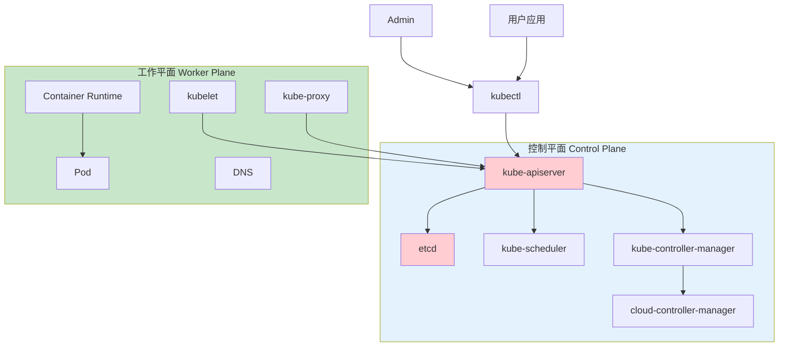
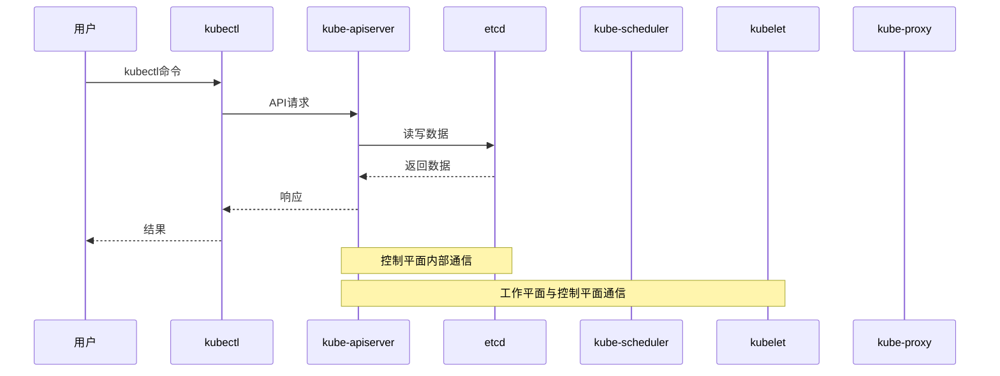
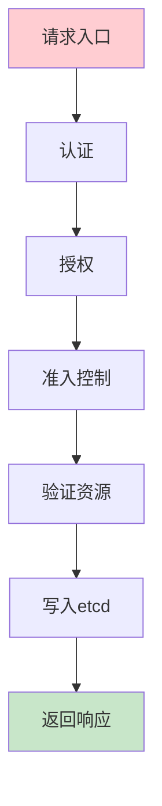
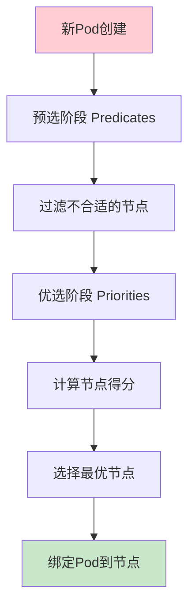
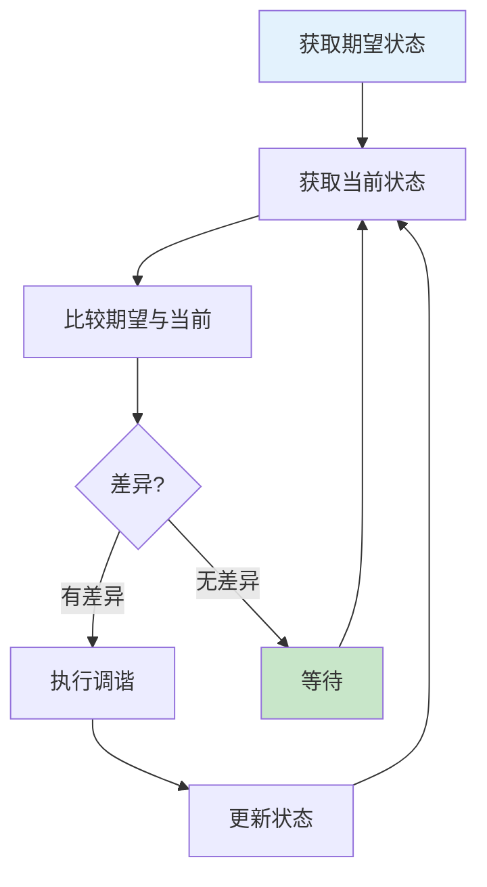
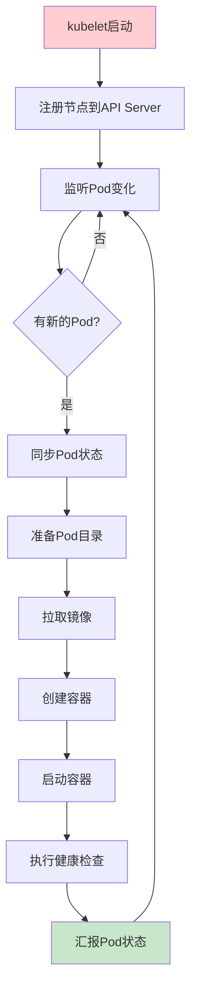
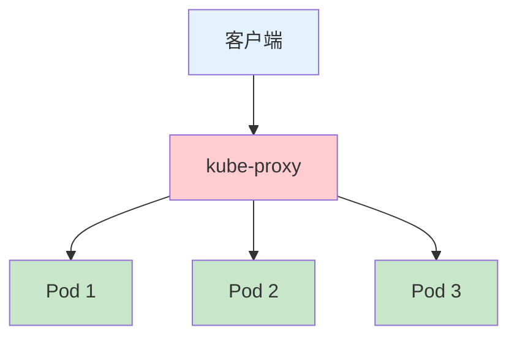
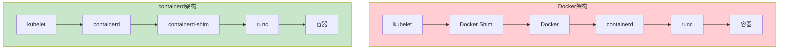
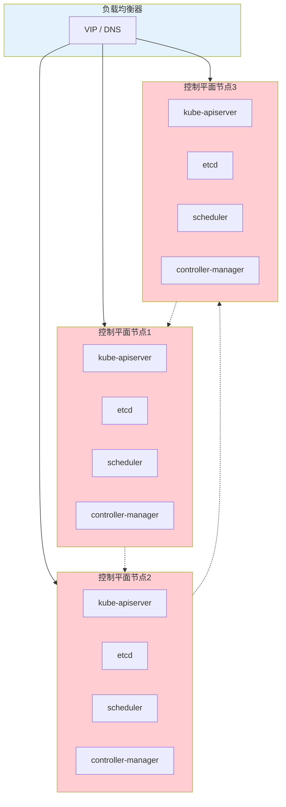

# Kubernetes控制平面与工作平面：架构详解与生产环境最佳实践

## 情境与背景

Kubernetes已成为容器编排的事实标准，深入理解其架构是每个高级DevOps工程师、SRE和架构师的必备技能。本文详细讲解K8s控制平面和工作平面的各组件及其功能，并提供生产环境最佳实践。

## 一、Kubernetes架构概述

### 1.1 核心架构图

**整体架构**：

```markdown
## Kubernetes架构概述

**K8s整体架构**：



**架构分层**：

```yaml
kubernetes_layers:
  management_layer:
    name: "管理层"
    components: ["kubectl", "Dashboard", "API"]
    responsibility: "用户交互、请求处理"
    
  control_plane:
    name: "控制平面"
    components: ["apiserver", "etcd", "scheduler", "controller-manager"]
    responsibility: "集群管理、调度决策"
    
  worker_plane:
    name: "工作平面"
    components: ["kubelet", "kube-proxy", "Container Runtime"]
    responsibility: "运行Pod、管理容器"
```
```

### 1.2 组件通信

**组件通信图**：

```markdown
**组件通信流程**：


```

## 二、控制平面组件详解

### 2.1 kube-apiserver

**功能与原理**：

```markdown
## 控制平面组件

### kube-apiserver

**核心功能**：

```yaml
apiserver_functions:
  api_gateway:
    description: "集群统一入口"
    ports:
      - "6443: HTTPS API"
      - "8080: HTTP API（仅用于调试）"
      
  authentication:
    description: "认证机制"
    methods:
      - "证书认证"
      - "Token认证"
      - "OIDC认证"
      - "Webhook认证"
      
  authorization:
    description: "授权机制"
    modes:
      - "RBAC"
      - "ABAC"
      - "Node授权"
      - "Webhook"
      
  admission_control:
    description: "准入控制"
    examples:
      - "AlwaysPullImages"
      - "LimitRanger"
      - "PodSecurity"
```

**工作原理**：

```markdown
**请求处理流程**：



**启动参数示例**：

```bash
kube-apiserver \
  --etcd-servers=https://127.0.0.1:2379 \
  --service-cluster-ip-range=10.96.0.0/12 \
  --service-node-port-range=30000-32767 \
  --tls-cert-file=/var/run/kubernetes/server.crt \
  --tls-private-key-file=/var/run/kubernetes/server.key \
  --enable-admission-plugins=NodeRestriction,ServiceAccount \
  --runtime-config=api/all=true
```
```

### 2.2 etcd

**功能与原理**：

```markdown
### etcd

**核心功能**：

```yaml
etcd_functions:
  distributed_storage:
    description: "分布式键值存储"
    data_stored:
      - "Pod信息"
      - "Service信息"
      - "ConfigMap"
      - "Secret"
      - "Deployment状态"
      
  high_availability:
    description: "高可用"
    quorum: "2N+1节点"
    examples:
      - "1节点：测试环境"
      - "3节点：生产环境"
      - "5节点：大规模生产"
```

**数据存储结构**：

```yaml
etcd_data_structure:
  /registry/pods/:
    description: "Pod信息"
    
  /registry/services/:
    description: "Service信息"
    
  /registry/deployments/:
    description: "Deployment信息"
    
  /registry/nodes/:
    description: "Node信息"
    
  /registry/configmaps/:
    description: "ConfigMap信息"
```

**配置示例**：

```bash
# etcd启动参数
etcd \
  --name=etcd-1 \
  --data-dir=/var/lib/etcd \
  --listen-peer-urls=https://0.0.0.0:2380 \
  --listen-client-urls=https://0.0.0.0:2379 \
  --initial-cluster=etcd-1=https://192.168.1.1:2380,etcd-2=https://192.168.1.2:2380 \
  --initial-cluster-state=new \
  --cert-file=/etc/kubernetes/pki/etcd/server.crt \
  --key-file=/etc/kubernetes/pki/etcd/server.key \
  --client-cert-auth=true \
  --peer-cert-file=/etc/kubernetes/pki/etcd/peer.crt \
  --peer-key-file=/etc/kubernetes/pki/etcd/peer.key \
  --peer-client-cert-auth=true
```

**备份与恢复**：

```bash
# 备份
ETCDCTL_API=3 etcdctl \
  --endpoints=https://127.0.0.1:2379 \
  --cacert=/etc/kubernetes/pki/etcd/ca.crt \
  --cert=/etc/kubernetes/pki/etcd/server.crt \
  --key=/etc/kubernetes/pki/etcd/server.key \
  snapshot save /backup/etcd-snapshot.db

# 恢复
ETCDCTL_API=3 etcdctl \
  --endpoints=https://127.0.0.1:2379 \
  --data-dir=/var/lib/etcd \
  --cacert=/etc/kubernetes/pki/etcd/ca.crt \
  --cert=/etc/kubernetes/pki/etcd/server.crt \
  --key=/etc/kubernetes/pki/etcd/server.key \
  snapshot restore /backup/etcd-snapshot.db
```
```

### 2.3 kube-scheduler

**功能与原理**：

```markdown
### kube-scheduler

**调度流程**：



**调度策略**：

```yaml
scheduler_policies:
  predicates:
    description: "预选策略"
    examples:
      - "PodFitsResources: 资源是否足够"
      - "PodFitsHostPorts: 端口是否冲突"
      - "HostName: 节点名称匹配"
      - "MatchNodeSelector: 节点选择器匹配"
      - "NoDiskConflict: 磁盘无冲突"
      
  priorities:
    description: "优选策略"
    examples:
      - "LeastRequestedPriority: 最小请求资源"
      - "BalancedResourceAllocation: 资源平衡"
      - "ImageLocalityPriority: 镜像本地性"
      - "NodeAffinityPriority: 节点亲和性"
      - "TaintTolerationPriority: 污点容忍"
```

**配置示例**：

```yaml
# 调度器配置
apiVersion: kubescheduler.config.k8s.io/v1beta2
kind: KubeSchedulerConfiguration
profiles:
  - pluginConfig:
      - name: NodeResourcesFit
        args:
          scoringStrategy:
            resources:
              - name: cpu
                weight: 1
              - name: memory
                weight: 1
            strategy: LeastAllocated
```

**亲和性与反亲和性**：

```yaml
affinity_examples:
  node_affinity:
    description: "节点亲和性"
    example: |
      affinity:
        nodeAffinity:
          requiredDuringSchedulingIgnoredDuringExecution:
            nodeSelectorTerms:
            - matchExpressions:
              - key: disktype
                operator: In
                values:
                - ssd
                
  pod_affinity:
    description: "Pod亲和性"
    example: |
      affinity:
        podAffinity:
          requiredDuringSchedulingIgnoredDuringExecution:
          - labelSelector:
              matchExpressions:
              - key: app
                operator: In
                values:
                - web
            topologyKey: topology.kubernetes.io/zone
            
  pod_anti_affinity:
    description: "Pod反亲和性"
    example: |
      affinity:
        podAntiAffinity:
          preferredDuringSchedulingIgnoredDuringExecution:
          - weight: 100
            podAffinityTerm:
              labelSelector:
                matchExpressions:
                - key: app
                  operator: In
                  values:
                  - redis
              topologyKey: kubernetes.io/hostname
```
```

### 2.4 kube-controller-manager

**控制器类型**：

```markdown
### kube-controller-manager

**控制器类型**：

```yaml
controller_types:
  deployment_controller:
    description: "Deployment控制器"
    function: "维持期望副本数"
    
  replicaSet_controller:
    description: "ReplicaSet控制器"
    function: "管理Pod副本"
    
  statefulset_controller:
    description: "StatefulSet控制器"
    function: "管理有状态应用"
    
  daemonset_controller:
    description: "DaemonSet控制器"
    function: "每个节点运行一个Pod"
    
  job_controller:
    description: "Job控制器"
    function: "管理一次性任务"
    
  cronjob_controller:
    description: "CronJob控制器"
    function: "管理定时任务"
    
  service_controller:
    description: "Service控制器"
    function: "管理Service资源"
    
  endpoint_controller:
    description: "Endpoint控制器"
    function: "管理Endpoint"
    
  namespace_controller:
    description: "Namespace控制器"
    function: "管理Namespace"
    
  persistentvolume_controller:
    description: "PV控制器"
    function: "管理持久化卷"
```

**控制器工作原理**：



**配置示例**：

```bash
kube-controller-manager \
  --controllers=* \
  --service-cluster-ip-range=10.96.0.0/12 \
  --cluster-cidr=10.244.0.0/16 \
  --leader-elect=true \
  --leader-elect-lease-duration=15s \
  --leader-elect-renew-deadline=10s \
  --leader-elect-retry-period=5s
```
```

### 2.5 cloud-controller-manager

**功能与原理**：

```markdown
### cloud-controller-manager

**控制器类型**：

```yaml
cloud_controllers:
  node_controller:
    description: "节点控制器"
    function: "获取节点信息、监控节点状态"
    
  route_controller:
    description: "路由控制器"
    function: "设置云平台路由"
    
  service_controller:
    description: "Service控制器"
    function: "创建负载均衡器"
    
  persistentvolumes_controller:
    description: "PV控制器"
    function: "关联PV和云盘"
```

**云平台支持**：

```yaml
cloud_providers:
  aws:
    name: "AWS"
    controller: "cloud-controller-manager-aws"
    
  gcp:
    name: "Google Cloud"
    controller: "cloud-controller-manager-gcp"
    
  azure:
    name: "Azure"
    controller: "cloud-controller-manager-azure"
    
  aliyun:
    name: "阿里云"
    controller: "cloud-controller-manager-aliyun"
```

## 三、工作平面组件详解

### 3.1 kubelet

**功能与原理**：

```markdown
## 工作平面组件

### kubelet

**核心功能**：

```yaml
kubelet_functions:
  pod_management:
    description: "Pod管理"
    responsibilities:
      - "从API Server获取Pod任务"
      - "创建Pod容器"
      - "监控Pod状态"
      - "健康检查"
      
  container_lifecycle:
    description: "容器生命周期"
    stages:
      - "镜像拉取"
      - "容器创建"
      - "容器启动"
      - "健康检查"
      - "容器停止"
      
  resource_reporting:
    description: "资源上报"
    reported:
      - "CPU使用"
      - "内存使用"
      - "磁盘使用"
      - "网络状态"
```

**工作流程**：



**配置示例**：

```bash
kubelet \
  --kubeconfig=/etc/kubernetes/kubelet.conf \
  --config=/var/lib/kubelet/config.yaml \
  --network-plugin=cni \
  --cni-bin-dir=/opt/cni/bin \
  --cni-conf-dir=/etc/cni/net.d \
  --container-runtime=remote \
  --container-runtime-endpoint=unix:///var/run/containerd/containerd.sock \
  --node-ip=192.168.1.100 \
  --node-labels=node-role.kubernetes.io/worker \
  --pod-infra-container-image=registry.k8s.io/pause:3.9
```

**健康检查配置**：

```yaml
# 存活探针配置
livenessProbe:
  httpGet:
    path: /healthz
    port: 8080
  initialDelaySeconds: 15
  periodSeconds: 10
  timeoutSeconds: 5
  failureThreshold: 3

# 就绪探针配置
readinessProbe:
  httpGet:
    path: /ready
    port: 8080
  initialDelaySeconds: 5
  periodSeconds: 5
  timeoutSeconds: 3
  failureThreshold: 3

# 启动探针配置
startupProbe:
  httpGet:
    path: /startup
    port: 8080
  initialDelaySeconds: 0
  periodSeconds: 5
  timeoutSeconds: 3
  failureThreshold: 30
```
```

### 3.2 kube-proxy

**功能与原理**：

```markdown
### kube-proxy

**网络模型**：

```yaml
kube_proxy_modes:
  iptables:
    description: "iptables模式"
    advantage: "稳定、成熟"
    disadvantage: "规则多时性能下降"
    usage: "默认模式"
    
  ipvs:
    description: "IPVS模式"
    advantage: "高性能、低延迟"
    disadvantage: "需要ipvs内核模块"
    usage: "K8s 1.11+推荐"
    
  userspace:
    description: "userspace模式"
    advantage: "简单"
    disadvantage: "性能差"
    usage: "已废弃"
```

**Service负载均衡**：



**iptables规则示例**：

```bash
# 查看iptables规则
iptables -t nat -L KUBE-SERVICES -n

# 查看KUBE-SVC链
iptables -t nat -L KUBE-SVC-NPX5M46X4JMEFDLR -n

# 查看KUBE-SEP链
iptables -t nat -L KUBE-SEP-XYZ -n
```

**配置示例**：

```yaml
# kube-proxy配置
apiVersion: kubeproxy.config.k8s.io/v1alpha1
kind: KubeProxyConfiguration
mode: "ipvs"
ipvs:
  scheduler: "rr"  # 轮询
  excludeCIDRs:
    - "10.96.0.0/12"
conntrack:
  maxPerCore: 32768
  min: 131072
healthzBindAddress: "0.0.0.0:10256"
metricsBindAddress: "0.0.0.0:10249"
```
```

### 3.3 Container Runtime

**容器运行时对比**：

```markdown
### Container Runtime

**运行时对比**：

```yaml
container_runtimes:
  docker:
    description: "Docker"
    socket: "unix:///var/run/docker.sock"
    status: "Kubernetes 1.24之前默认"
    note: "已弃用，逐渐被containerd取代"
    
  containerd:
    description: "containerd"
    socket: "unix:///var/run/containerd/containerd.sock"
    status: "Kubernetes 1.24+默认"
    advantage: "轻量、稳定、生产级别"
    
  cri-o:
    description: "CRI-O"
    socket: "unix:///var/run/cri.sock"
    status: "OpenShift默认"
    advantage: "纯CRI实现，资源占用低"
    
  podman:
    description: "Podman"
    socket: "unix:///run/podman/podman.sock"
    status: "开发环境"
    advantage: "无守护进程"
```

**架构对比**：



**切换到containerd**：

```bash
# 1. 安装containerd
yum install -y containerd.io

# 2. 配置containerd
cat > /etc/containerd/config.toml << EOF
[plugins."io.containerd.grpc.v1.cri"]
  sandbox_image = "registry.k8s.io/pause:3.9"
  
[plugins."io.containerd.grpc.v1.cri".containerd.runtimes.runc]
  runtime_type = "io.containerd.runc.v2"

[plugins."io.containerd.grpc.v1.cri".registry]
  config_path = "/etc/containerd/certs.d"
EOF

# 3. 重启containerd
systemctl restart containerd

# 4. 配置kubelet使用containerd
cat > /var/lib/kubelet/config.yaml << EOF
apiVersion: kubelet.config.k8s.io/v1beta1
kind: KubeletConfiguration
containerRuntimeEndpoint: unix:///var/run/containerd/containerd.sock
EOF

# 5. 重启kubelet
systemctl restart kubelet
```
```

## 四、生产环境最佳实践

### 4.1 控制平面高可用

**高可用架构**：

```markdown
## 生产环境最佳实践

### 控制平面高可用

**高可用架构**：



**etcd高可用配置**：

```yaml
# etcd集群配置示例
initial-cluster:
  etcd-1: "https://192.168.1.1:2380"
  etcd-2: "https://192.168.1.2:2380"
  etcd-3: "https://192.168.1.3:2380"
  
discovery: ""
initial-cluster-state: "new"
initial-cluster-token: "etcd-cluster"
```

**API Server高可用配置**：

```yaml
# 高可用API Server配置
apiVersion: v1
kind: Pod
metadata:
  name: kube-apiserver
spec:
  containers:
  - name: kube-apiserver
    command:
    - kube-apiserver
    - --etcd-servers=https://192.168.1.1:2379,https://192.168.1.2:2379,https://192.168.1.3:2379
    - --enable-admission-plugins=NodeRestriction
    - --service-cluster-ip-range=10.96.0.0/12
    - --service-node-port-range=30000-32767
```
```

### 4.2 工作平面高可用

**工作平面高可用**：

```markdown
### 工作平面高可用

**节点高可用**：

```yaml
worker_high_availability:
  minimum_nodes:
    description: "最小节点数"
    production: "至少3个worker节点"
    
  node_pool:
    description: "节点池"
    strategy: "使用多个可用区"
    
  pod_distribution:
    description: "Pod分布"
    strategy: "使用Pod反亲和性"
```

**Pod拓扑分布约束**：

```yaml
# Pod拓扑分布约束
apiVersion: apps/v1
kind: Deployment
metadata:
  name: web-app
spec:
  replicas: 3
  selector:
    matchLabels:
      app: web
  template:
    spec:
      affinity:
        podAntiAffinity:
          requiredDuringSchedulingIgnoredDuringExecution:
          - labelSelector:
              matchExpressions:
              - key: app
                operator: In
                values:
                - web
            topologyKey: topology.kubernetes.io/zone
      containers:
      - name: web
        image: nginx:latest
```
```

### 4.3 资源配额管理

**资源配额配置**：

```markdown
### 资源配额管理

**资源配额**：

```yaml
resource_quotas:
  namespace_quota:
    description: "Namespace级配额"
    example: |
      apiVersion: v1
      kind: ResourceQuota
      metadata:
        name: default-quota
      spec:
        hard:
          requests.cpu: "10"
          requests.memory: "20Gi"
          limits.cpu: "20"
          limits.memory: "40Gi"
          pods: "100"
          
  limit_range:
    description: "LimitRange"
    example: |
      apiVersion: v1
      kind: LimitRange
      metadata:
        name: default-limits
      spec:
        limits:
        - type: Container
          default:
            cpu: 500m
            memory: 512Mi
          defaultRequest:
            cpu: 100m
            memory: 128Mi
```

**资源请求与限制**：

```yaml
# Pod资源请求与限制
apiVersion: v1
kind: Pod
metadata:
  name: web-pod
spec:
  containers:
  - name: web
    image: nginx:latest
    resources:
      requests:
        memory: "128Mi"
        cpu: "100m"
      limits:
        memory: "512Mi"
        cpu: "500m"
```
```

## 五、面试1分钟精简版（直接背）

**完整版**：

K8s分为控制平面和工作平面。控制平面组件：1. kube-apiserver是集群统一入口，提供认证授权、API聚合；2. etcd是高可用键值存储，保存集群所有状态；3. kube-scheduler根据资源需求和策略调度Pod到最优节点；4. kube-controller-manager运行各种控制器（Deployment、ReplicaSet等）；5. cloud-controller-manager对接云厂商。工作平面组件：1. kubelet负责管理节点上Pod的生命周期；2. kube-proxy维护网络规则，实现Service通信；3. Container Runtime负责容器运行（Docker/containerd）。

**30秒超短版**：

控制平面：apiserver网关、etcd存储、scheduler调度、controller-manager控制器；工作平面：kubelet管Pod、kube-proxy管网络、container-runtime管容器。

## 六、总结

### 6.1 组件功能总结

```yaml
component_summary:
  control_plane:
    kube-apiserver:
      role: "集群入口"
      key_functions: ["认证", "授权", "准入控制"]
      
    etcd:
      role: "存储"
      key_functions: ["分布式存储", "高可用"]
      
    kube-scheduler:
      role: "调度"
      key_functions: ["预选", "优选", "绑定"]
      
    kube-controller-manager:
      role: "控制"
      key_functions: ["维持期望状态", "各种控制器"]
      
  worker_plane:
    kubelet:
      role: "节点管理"
      key_functions: ["Pod生命周期", "健康检查"]
      
    kube-proxy:
      role: "网络"
      key_functions: ["Service通信", "负载均衡"]
      
    container-runtime:
      role: "容器运行"
      key_functions: ["镜像管理", "容器创建"]
```

### 6.2 最佳实践清单

```yaml
best_practices:
  control_plane:
    - "至少3个控制平面节点"
    - "etcd使用奇数节点（3或5）"
    - "API Server高可用"
    - "定期备份etcd"
    
  worker_plane:
    - "至少3个worker节点"
    - "使用多个可用区"
    - "合理配置资源限制"
    - "定期更新节点组件"
    
  security:
    - "启用RBAC"
    - "使用网络策略"
    - "加密Secret"
    - "限制kubelet权限"
```

### 6.3 记忆口诀

```
K8s架构分两平，控制平面和工作平，
控制平面五组件，apiserver是网关，
etcd存储集群数据，scheduler调度Pod，
controller-manager控制器，cloud-manager云对接，
工作平面三组件，kubelet管Pod生命周期，
kube-proxy管网络，container-runtime管容器，
生产环境高可用，控制平面三节点，
etcd三节点高可用，工作平面多节点。
```

> **参考链接**：[SRE运维面试题全解析：从理论到实践（第二部分）]()