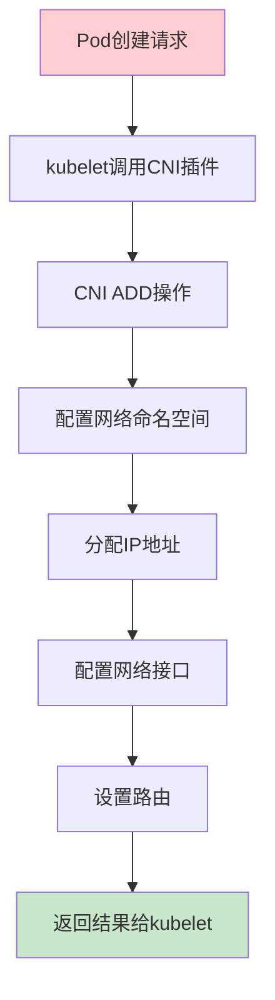
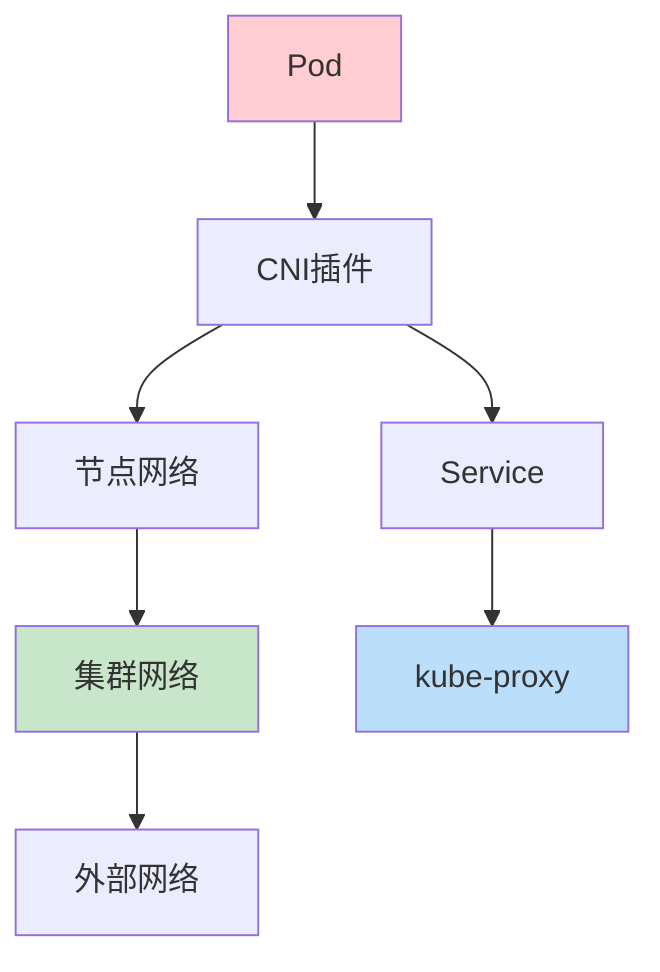
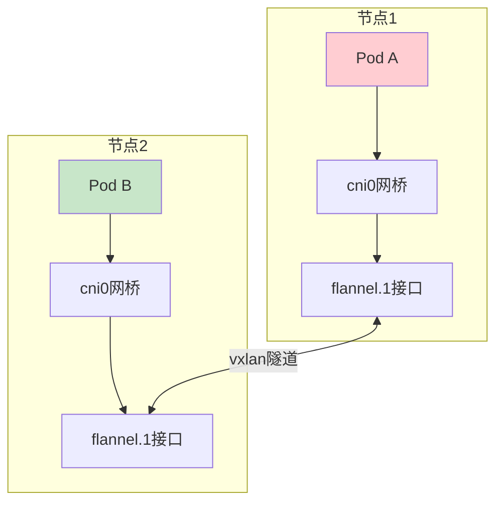
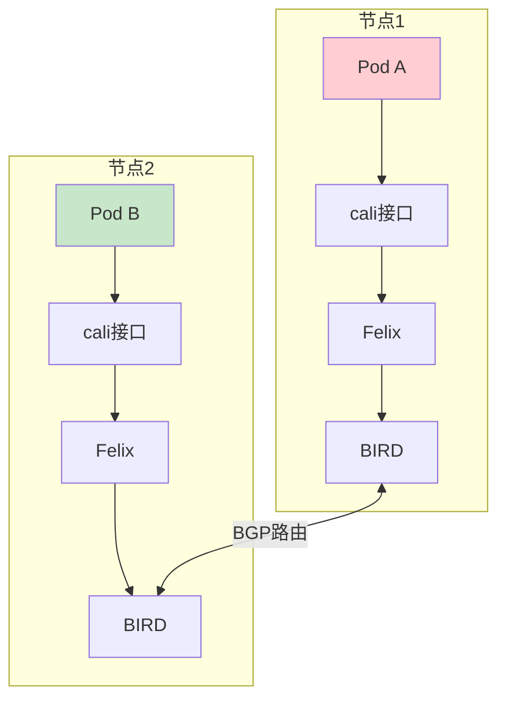
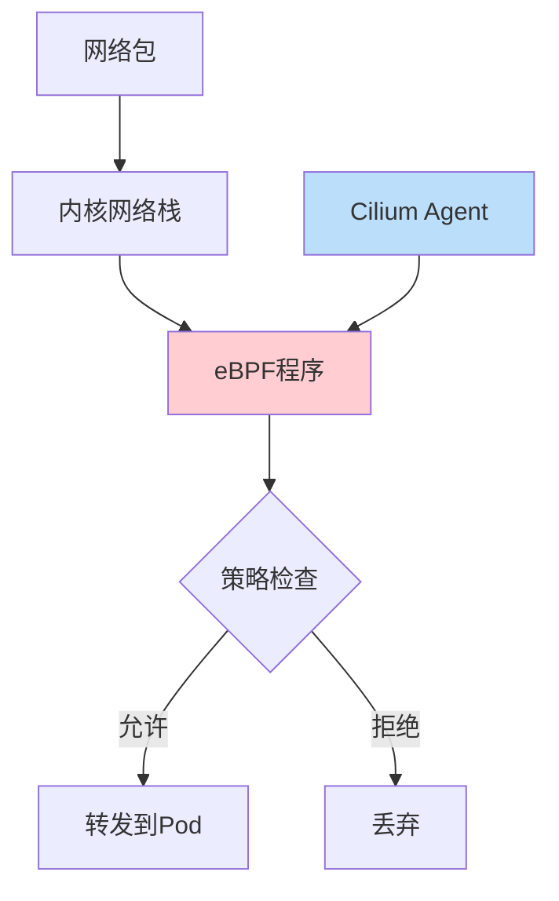
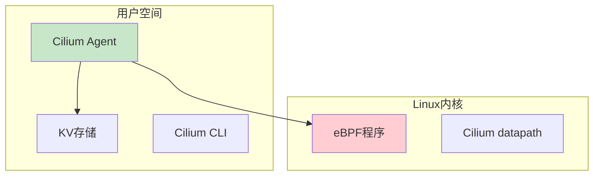
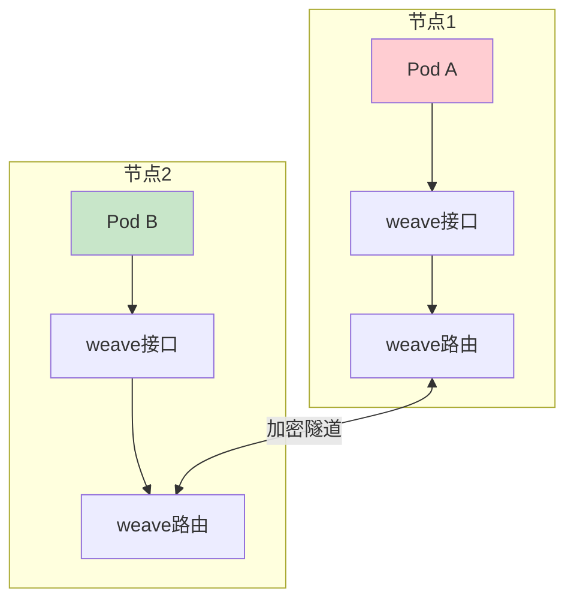

# Kubernetes CNI组件：网络插件对比与生产环境最佳实践

## 情境与背景

CNI（Container Network Interface）是Kubernetes网络模型的核心组件，负责为Pod配置网络。选择合适的CNI插件对集群的网络性能、安全性和可管理性至关重要。

## 一、CNI概述

### 1.1 CNI定义

**CNI概念**：

```markdown
## CNI概述

**什么是CNI**：

```yaml
cni_definition:
  full_name: "Container Network Interface"
  purpose: "容器网络接口标准"
  specification: "CNI规范定义了网络插件的接口"
  responsible_for:
    - "Pod网络配置"
    - "IP地址分配"
    - "网络策略实施"
```

**CNI工作流程**：



**CNI操作类型**：

```yaml
cni_operations:
  ADD:
    description: "添加网络"
    purpose: "Pod创建时配置网络"
    
  DEL:
    description: "删除网络"
    purpose: "Pod删除时清理网络"
    
  CHECK:
    description: "检查网络"
    purpose: "验证网络配置"
    
  VERSION:
    description: "版本查询"
    purpose: "查询插件版本"
```
```

### 1.2 Kubernetes网络模型

**K8s网络原则**：

```markdown
**Kubernetes网络模型**：

```yaml
k8s_network_principles:
  pod_communication:
    description: "Pod间通信"
    requirement: "集群内任意Pod可以直接通信"
    
  pod_ip_unique:
    description: "Pod IP唯一性"
    requirement: "每个Pod有唯一的IP地址"
    
  pod_from_node:
    description: "Pod与节点通信"
    requirement: "Pod可以直接与节点通信"
    
  service_communication:
    description: "Service通信"
    requirement: "通过Service访问Pod"
```

**网络分层架构**：



## 二、主流CNI插件对比

### 2.1 Flannel

**Flannel特点**：

```markdown
## 主流CNI插件

### Flannel

**核心特点**：

```yaml
flannel_features:
  network_type: "overlay（叠加网络）"
  backend: "vxlan / udp / host-gw"
  ipam: "内置IPAM"
  network_cidr: "10.244.0.0/16"
  
  advantages:
    - "简单易用"
    - "部署方便"
    - "社区成熟"
    
  disadvantages:
    - "性能开销（vxlan封装）"
    - "不支持网络策略"
    - "调试困难"
```

**架构图**：



**配置示例**：

```yaml
# flannel配置
apiVersion: v1
kind: ConfigMap
metadata:
  name: kube-flannel-cfg
  namespace: kube-flannel
data:
  cni-conf.json: |
    {
      "name": "cbr0",
      "cniVersion": "0.3.1",
      "plugins": [
        {
          "type": "flannel",
          "delegate": {
            "hairpinMode": true,
            "isDefaultGateway": true
          }
        },
        {
          "type": "portmap",
          "capabilities": {
            "portMappings": true
          }
        }
      ]
    }
  net-conf.json: |
    {
      "Network": "10.244.0.0/16",
      "Backend": {
        "Type": "vxlan"
      }
    }
```

**适用场景**：

```yaml
flannel_use_cases:
  development: "开发测试环境"
  small_scale: "小型集群（<100节点）"
  simple_requirements: "对网络性能要求不高的场景"
  quick_deployment: "需要快速部署的场景"
```
```

### 2.2 Calico

**Calico特点**：

```markdown
### Calico

**核心特点**：

```yaml
calico_features:
  network_type: "路由（Layer 3）"
  protocol: "BGP"
  ipam: "内置IPAM"
  network_cidr: "192.168.0.0/16"
  
  advantages:
    - "高性能（无封装开销）"
    - "支持网络策略"
    - "支持L7层策略"
    - "大规模生产验证"
    - "丰富的可见性"
    
  disadvantages:
    - "配置复杂"
    - "需要BGP知识"
    - "节点需要路由可达"
```

**架构图**：



**组件说明**：

```yaml
calico_components:
  felix:
    description: "守护进程"
    location: "每个节点"
    responsibilities:
      - "接口管理"
      - "路由编程"
      - "ACL编程"
      
  bird:
    description: "BGP守护进程"
    location: "每个节点"
    responsibilities:
      - "BGP路由分发"
      - "路由反射"
      
  confd:
    description: "配置管理"
    location: "每个节点"
    responsibilities:
      - "监听BGP配置变化"
      - "更新Bird配置"
      
  calicoctl:
    description: "CLI工具"
    responsibilities:
      - "管理Calico资源"
      - "查看网络状态"
```

**安装配置**：

```yaml
# Calico安装
kubectl apply -f https://docs.projectcalico.org/manifests/calico.yaml

# calico-node配置
apiVersion: v1
kind: DaemonSet
metadata:
  name: calico-node
  namespace: kube-system
spec:
  template:
    spec:
      containers:
      - name: calico-node
        env:
        - name: CALICO_IPV4POOL_CIDR
          value: "192.168.0.0/16"
        - name: CALICO_NETWORKING_BACKEND
          value: "bird"
        - name: FELIX_DEFAULTENDPOINTTOHOSTACTION
          value: "ACCEPT"
```

**BGP配置**：

```yaml
# Calico BGP配置
apiVersion: projectcalico.org/v3
kind: BGPConfiguration
metadata:
  name: default
spec:
  logSeverityScreen: Info
  nodeToNodeMeshEnabled: true
  asNumber: 64512
---
apiVersion: projectcalico.org/v3
kind: BGPPeer
metadata:
  name: peer-with-router
spec:
  peerIP: 192.168.1.1
  asNumber: 64511
```

**网络策略示例**：

```yaml
# 网络策略示例
apiVersion: networking.k8s.io/v1
kind: NetworkPolicy
metadata:
  name: api-access
  namespace: production
spec:
  podSelector:
    matchLabels:
      app: api
  policyTypes:
  - Ingress
  - Egress
  ingress:
  - from:
    - podSelector:
        matchLabels:
          role: frontend
    ports:
    - protocol: TCP
      port: 8080
  egress:
  - to:
    - podSelector:
        matchLabels:
          role: database
    ports:
    - protocol: TCP
      port: 5432
```

**适用场景**：

```yaml
calico_use_cases:
  production: "生产环境"
  large_scale: "大规模集群（100+节点）"
  high_performance: "对网络性能要求高"
  network_security: "需要网络隔离和策略"
  multi_tenant: "多租户环境"
```
```

### 2.3 Cilium

**Cilium特点**：

```markdown
### Cilium

**核心特点**：

```yaml
cilium_features:
  network_type: "eBPF（内核级）"
  layer: "L3-L7层"
  ipam: "多种模式"
  
  advantages:
    - "最高性能"
    - "L7层可见性"
    - "内核级安全"
    - "动态负载均衡"
    - "零信任安全"
    
  disadvantages:
    - "需要高版本内核（4.19+）"
    - "学习曲线陡峭"
    - "生产经验相对较少"
```

**eBPF工作原理**：



**架构图**：



**Hubble组件**：

```yaml
cilium_components:
  cilium_agent:
    description: "Cilium代理"
    responsibilities:
      - "管理eBPF程序"
      - "网络策略执行"
      - "IPAM管理"
      
  hubble:
    description: "可观测性组件"
    responsibilities:
      - "网络流量监控"
      - "L7层可见性"
      - "分布式追踪"
      
  cilium_cli:
    description: "命令行工具"
    responsibilities:
      - "集群管理"
      - "策略管理"
      - "状态查看"
```

**安装配置**：

```bash
# 安装Cilium CLI
curl -L --remote-name-all https://github.com/cilium/cilium-cli/releases/latest/download/cilium-linux-amd64.tar.gz{,.sha256sum}
sha256sum --check cilium-linux-amd64.tar.gz.sha256sum
sudo tar xzf cilium-linux-amd64.tar.gz -C /usr/local/bin
rm cilium-linux-amd64.tar.gz{,.sha256sum}

# 安装Cilium
cilium install --version 1.14.0

# 验证安装
cilium status
```

**网络策略示例**：

```yaml
# CiliumNetworkPolicy
apiVersion: cilium.io/v2
kind: CiliumNetworkPolicy
metadata:
  name: api-access
spec:
  endpointSelector:
    matchLabels:
      app: api
  ingress:
  - fromEndpoints:
    - matchLabels:
        role: frontend
    toPorts:
    - port: "8080"
      protocol: TCP
      rules:
        http:
        - method: GET
          path: "/api/*"
```

**适用场景**：

```yaml
cilium_use_cases:
  large_scale: "超大规模集群"
  high_performance: "对性能要求极高"
  observability: "需要L7层可见性"
  zero_trust: "零信任安全架构"
  service_mesh: "与Service Mesh集成"
```
```

### 2.4 Weave Net

**Weave特点**：

```markdown
### Weave Net

**核心特点**：

```yaml
weave_features:
  network_type: "overlay（叠加网络）"
  encryption: "自动加密"
  topology: "点对点网络"
  
  advantages:
    - "简单易用"
    - "自动加密"
    - "支持DNS"
    - "快速部署"
    
  disadvantages:
    - "性能一般"
    - "调试困难"
    - "社区活跃度下降"
```

**架构图**：



**适用场景**：

```yaml
weave_use_cases:
  hybrid_cloud: "混合云环境"
  quick_start: "快速启动"
  encryption_required: "需要加密通信"
  simple_requirements: "网络需求简单"
```
```

### 2.5 插件对比总结

**综合对比**：

```markdown
### 插件对比总结

**对比表**：

| 特性 | Flannel | Calico | Cilium | Weave |
|:----:|:-------:|:------:|:------:|:-----:|
| **网络类型** | Overlay | 路由 | eBPF | Overlay |
| **性能** | 中 | 高 | 最高 | 中 |
| **网络策略** | ❌ | ✅ | ✅ | 部分 |
| **L7策略** | ❌ | ✅ | ✅ | ❌ |
| **加密** | ❌ | ❌ | ✅ | ✅ |
| **易用性** | 简单 | 复杂 | 复杂 | 简单 |
| **内核依赖** | 无 | 无 | 4.19+ | 无 |
| **生产验证** | 广泛 | 广泛 | 逐渐增多 | 一般 |
| **社区活跃度** | 中 | 高 | 高 | 低 |
```

**选型建议**：

```yaml
cni_selection_guide:
  production_large_scale:
    recommendation: "Calico或Cilium"
    reason: "高性能、功能丰富"
    
  development_test:
    recommendation: "Flannel"
    reason: "简单易用"
    
  high_performance:
    recommendation: "Cilium"
    reason: "eBPF最高性能"
    
  security_first:
    recommendation: "Calico"
    reason: "成熟的网络策略"
    
  hybrid_cloud:
    recommendation: "Weave"
    reason: "自动加密、快速部署"
```

## 三、CNI插件安装与配置

### 3.1 Flannel安装

**安装步骤**：

```markdown
## 安装与配置

### Flannel安装

**一键安装**：

```bash
# 使用kubectl安装
kubectl apply -f https://raw.githubusercontent.com/flannel-io/flannel/master/Documentation/kube-flannel.yml

# 验证安装
kubectl get pods -n kube-flannel
```

**自定义配置**：

```yaml
# 创建自定义配置
cat > kube-flannel.yml << EOF
---
kind: Namespace
apiVersion: v1
metadata:
  name: kube-flannel
  labels:
    k8s-app: flannel
---
kind: ConfigMap
apiVersion: v1
metadata:
  name: kube-flannel-cfg
  namespace: kube-flannel
data:
  cni-conf.json: |
    {
      "name": "cbr0",
      "cniVersion": "0.3.1",
      "plugins": [
        {
          "type": "flannel",
          "delegate": {
            "hairpinMode": true,
            "isDefaultGateway": true
          }
        },
        {
          "type": "portmap",
          "capabilities": {
            "portMappings": true
          }
        }
      ]
    }
  net-conf.json: |
    {
      "Network": "10.244.0.0/16",
      "Backend": {
        "Type": "vxlan"
      }
    }
EOF
```
```

### 3.2 Calico安装

**安装步骤**：

```markdown
### Calico安装

**使用operator安装**：

```bash
# 安装operator
kubectl create -f https://projectcalico.docs.tigera.io/manifests/tigera-operator.yaml

# 安装Calico
kubectl create -f https://projectcalico.docs.tigera.io/manifests/custom-resources.yaml
```

**自定义配置**：

```yaml
# custom-resources.yaml
apiVersion: operator.tigera.io/v1
kind: Installation
metadata:
  name: default
spec:
  calicoNetwork:
    podCIDR: 192.168.0.0/16
    mtu: 1440
  cni:
    ipam:
      type: CalicoIPAM
```

**启用IPIP模式**：

```yaml
# 切换到IPIP模式
apiVersion: operator.tigera.io/v1
kind: Installation
metadata:
  name: default
spec:
  calicoNetwork:
    bgp: Enabled
    ipPools:
    - name: default-ipv4-ippool
      cidr: 192.168.0.0/16
      encapsulation: IPIP
      natOutgoing: Enabled
```
```

### 3.3 Cilium安装

**安装步骤**：

```markdown
### Cilium安装

**使用Helm安装**：

```bash
# 添加Helm仓库
helm repo add cilium https://helm.cilium.io/

# 安装Cilium
helm install cilium cilium/cilium \
  --namespace kube-system \
  --set kubeProxyReplacement=strict \
  --set k8sServiceHost=api-server-ip \
  --set k8sServicePort=6443
```

**验证安装**：

```bash
# 检查Cilium状态
cilium status

# 检查Hubble状态
cilium hubble enable

# 查看Pod网络
cilium pod list
```
```

## 四、生产环境最佳实践

### 4.1 网络设计

**网络规划**：

```markdown
## 生产环境最佳实践

### 网络规划

**CIDR规划**：

```yaml
network_cidr_planning:
  pod_cidr:
    description: "Pod网络"
    recommendation: "/16或更大"
    example: "10.244.0.0/16"
    
  service_cidr:
    description: "Service网络"
    recommendation: "/12"
    example: "10.96.0.0/12"
    
  node_cidr:
    description: "节点网络"
    recommendation: "使用物理网络"
    
  pod_per_node:
    description: "每个节点的Pod数"
    recommendation: "100-110"
    max: "110"
```

**MTU设置**：

```yaml
mtu_settings:
  flannel_vxlan:
    mtu: "1440"
    reason: "vxlan封装开销50字节"
    
  calico_ipip:
    mtu: "1440"
    reason: "IPIP封装开销20字节"
    
  calico_bgp:
    mtu: "1500"
    reason: "无封装，原生MTU"
    
  cilium:
    mtu: "1500"
    reason: "eBPF无封装"
```
```

### 4.2 高可用配置

**高可用架构**：

```markdown
### 高可用配置

**CNI高可用**：

```yaml
cni_high_availability:
  node_distribution:
    description: "节点分布"
    recommendation: "跨多个可用区"
    
  pod_distribution:
    description: "Pod分布"
    recommendation: "使用拓扑分布约束"
    
  backup_config:
    description: "配置备份"
    recommendation: "定期备份CNI配置"
```

**Pod拓扑分布约束**：

```yaml
# 强制Pod分布在不同节点
apiVersion: apps/v1
kind: Deployment
metadata:
  name: web-app
spec:
  replicas: 3
  selector:
    matchLabels:
      app: web
  template:
    spec:
      affinity:
        podAntiAffinity:
          requiredDuringSchedulingIgnoredDuringExecution:
          - labelSelector:
              matchExpressions:
              - key: app
                operator: In
                values:
                - web
            topologyKey: kubernetes.io/hostname
```
```

### 4.3 网络策略

**网络策略最佳实践**：

```markdown
### 网络策略

**默认拒绝策略**：

```yaml
# 默认拒绝所有入站流量
apiVersion: networking.k8s.io/v1
kind: NetworkPolicy
metadata:
  name: default-deny-ingress
  namespace: production
spec:
  podSelector: {}
  policyTypes:
  - Ingress

---
# 默认拒绝所有出站流量
apiVersion: networking.k8s.io/v1
kind: NetworkPolicy
metadata:
  name: default-deny-egress
  namespace: production
spec:
  podSelector: {}
  policyTypes:
  - Egress
```

**DNS访问策略**：

```yaml
# 允许访问DNS
apiVersion: networking.k8s.io/v1
kind: NetworkPolicy
metadata:
  name: allow-dns
  namespace: production
spec:
  egress:
  - to:
    - namespaceSelector:
        matchLabels:
          kubernetes.io/metadata.name: kube-system
    ports:
    - protocol: UDP
      port: 53
```
```

### 4.4 监控与故障排查

**监控指标**：

```markdown
### 监控与故障排查

**关键监控指标**：

```yaml
monitoring_metrics:
  network_errors:
    - "包丢失率"
    - "重传率"
    - "延迟"
    
  connection_states:
    - "连接数"
    - "连接状态分布"
    
  bandwidth:
    - "带宽使用率"
    - "吞吐量"
```

**故障排查命令**：

```bash
# 查看CNI插件状态
kubectl get pods -n kube-system -l k8s-app=flannel
kubectl get pods -n kube-system -l k8s-app=calico-node

# 查看节点网络接口
ip link show
ip addr show

# 查看路由表
ip route show

# 查看iptables规则
iptables -L -n -v

# 测试Pod连通性
kubectl exec -it <pod-name> -- ping <target-pod-ip>

# 查看CNI日志
kubectl logs -n kube-system <cni-pod-name>
```
```

## 五、面试1分钟精简版（直接背）

**完整版**：

常见CNI插件有：1. Flannel：简单overlay网络，使用vxlan封装，性能一般但易部署；2. Calico：基于BGP的路由网络，支持网络策略，性能高，适合生产环境；3. Cilium：基于eBPF的新一代网络，性能最好，支持L7层可见性，但需要较高内核版本；4. Weave：简单overlay网络，支持自动加密，适合混合云。我们生产环境使用Calico，因为性能高且支持网络策略。

**30秒超短版**：

CNI插件：Flannel简单overlay、Calico路由+BGP高性能、Weave自动加密、Cilium用eBPF性能最高。生产推荐Calico或Cilium。

## 六、总结

### 6.1 各插件总结

```yaml
plugin_summary:
  flannel:
    network_type: "overlay"
    performance: "中"
    network_policy: "❌"
    complexity: "低"
    use_case: "开发测试"
    
  calico:
    network_type: "路由"
    performance: "高"
    network_policy: "✅"
    complexity: "中"
    use_case: "生产环境"
    
  cilium:
    network_type: "eBPF"
    performance: "最高"
    network_policy: "✅"
    complexity: "高"
    use_case: "大规模高性能"
    
  weave:
    network_type: "overlay"
    performance: "中"
    network_policy: "部分"
    complexity: "低"
    use_case: "混合云"
```

### 6.2 最佳实践清单

```yaml
best_practices:
  selection:
    - "生产环境使用Calico或Cilium"
    - "开发测试可用Flannel"
    - "根据性能需求选择"
    
  configuration:
    - "合理规划CIDR"
    - "设置合适的MTU"
    - "启用网络策略"
    
  security:
    - "使用网络隔离"
    - "默认拒绝策略"
    - "定期审计策略"
    
  monitoring:
    - "监控网络指标"
    - "设置告警"
    - "定期检查日志"
```

### 6.3 记忆口诀

```
CNI插件有四类，Flannel简单overlay，
Calico路由+BGP性能高，Cilium用eBPF最高，
Weave自动加密易部署，网络策略很重要，
生产环境用Calico，安全隔离不可少。
```

> **参考链接**：[SRE运维面试题全解析：从理论到实践（第二部分）]()