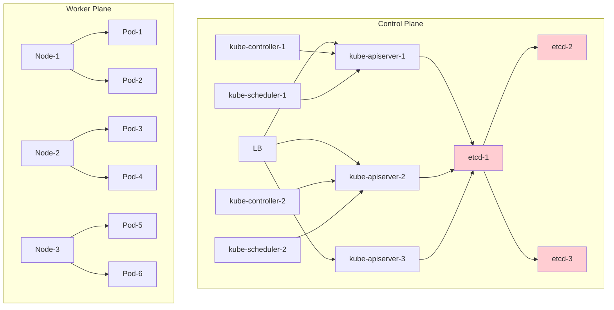
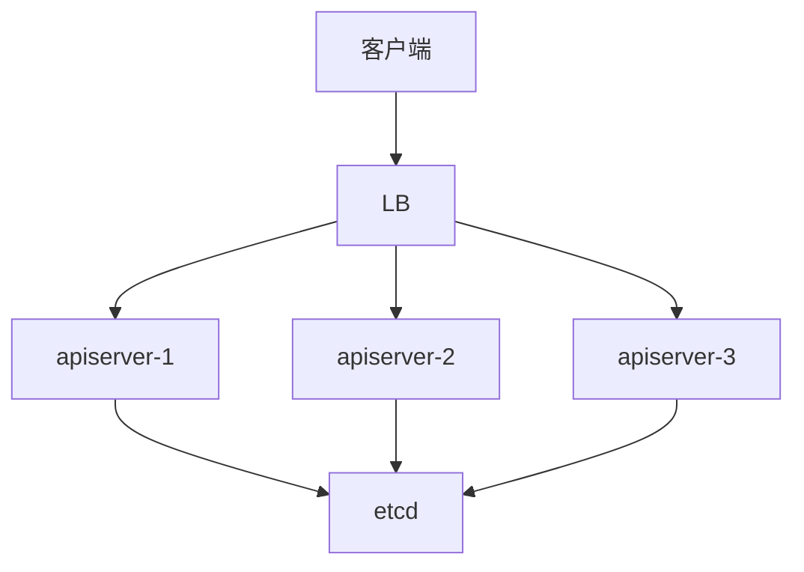

# Kubernetes高可用部署：生产环境架构设计与实践指南

## 情境与背景

Kubernetes高可用部署是生产环境的必备基础，本指南从etcd集群、Control Plane、Worker Plane三个层面详细讲解K8s高可用架构设计、组件配置以及生产环境最佳实践。

## 一、K8s高可用架构概述

### 1.1 高可用分层架构

**三层高可用架构**：

```markdown
## K8s高可用架构概述

### 三层高可用架构

**K8s高可用架构图**：



**高可用层次**：

```yaml
k8s_ha_layers:
  etcd_layer:
    description: "存储层高可用"
    importance: "最高"
    components: ["etcd cluster"]
    
  control_plane_layer:
    description: "控制平面高可用"
    importance: "高"
    components: ["apiserver", "scheduler", "controller"]
    
  worker_plane_layer:
    description: "工作平面高可用"
    importance: "高"
    components: ["nodes", "pods", "services"]
```
```

### 1.2 高可用设计原则

**高可用设计原则**：

```yaml
ha_design_principles:
  elimination_of_single_point:
    - "每个组件都需要高可用"
    - "无单点故障"
    - "冗余部署"
    
  failure_isolation:
    - "故障隔离"
    - "故障域控制"
    - "级联失败防止"
    
  automatic_recovery:
    - "故障自动检测"
    - "故障自动恢复"
    - "服务自动转移"
    
  consistency:
    - "数据一致性保证"
    - "状态同步"
    - "选举机制"
```

## 二、etcd高可用部署

### 2.1 etcd集群原理

**etcd集群架构**：

```markdown
## etcd高可用部署

### etcd集群原理

**etcd核心概念**：

```yaml
etcd_core_concepts:
  raft_consensus:
    description: "Raft共识算法"
    purpose: "保证分布式一致性"
    
  leader_election:
    description: "领导者选举"
    purpose: "保证写入顺序"
    
  quorum:
    description: "多数派原则"
    purpose: "防止脑裂"
    
  write_path:
    description: "写入路径"
    steps:
      - "写入请求到Leader"
      - "Leader复制到Followers"
      - "多数节点确认后提交"
```

**集群规模选择**：

```yaml
etcd_cluster_sizing:
  three_node:
    description: "3节点集群"
    use_case: "生产环境最小规模"
    tolerance: "允许1节点故障"
    write_quorum: "2节点"
    
  five_node:
    description: "5节点集群"
    use_case: "大规模生产环境"
    tolerance: "允许2节点故障"
    write_quorum: "3节点"
```

### 2.2 etcd集群部署

**kubeadm部署etcd**：

```markdown
### etcd集群部署

**使用kubeadm部署**：

```bash
# 在第一个control plane节点生成etcd证书
kubeadm init phase certs etcd-ca
kubeadm init phase certs etcd-server
kubeadm init phase certs etcd-peer
kubeadm init phase certs etcd-client

# 创建etcd静态Pod清单
kubeadm init phase etcd local

# 或者手动创建etcd Pod（3节点示例）
cat > /etc/kubernetes/manifests/etcd.yaml << EOF
apiVersion: v1
kind: Pod
metadata:
  name: etcd
  namespace: kube-system
spec:
  containers:
  - name: etcd
    image: registry.k8s.io/etcd:3.5.9
    command:
    - etcd
    - --data-dir=/var/lib/etcd
    - --name=\${ETCD_NODE_NAME}
    - --cert-file=/etc/kubernetes/pki/etcd/server.crt
    - --key-file=/etc/kubernetes/pki/etcd/server.key
    - --peer-cert-file=/etc/kubernetes/pki/etcd/peer.crt
    - --peer-key-file=/etc/kubernetes/pki/etcd/peer.key
    - --trusted-ca-file=/etc/kubernetes/pki/etcd/ca.crt
    - --peer-trusted-ca-file=/etc/kubernetes/pki/etcd/ca.crt
    - --initial-cluster=\${ETCD_CLUSTER}
    - --initial-cluster-state=\${ETCD_CLUSTER_STATE}
  hostNetwork: true
  volumes:
  - hostPath:
      path: /var/lib/etcd
    name: etcd-data
EOF
```

**3节点etcd集群配置**：

```bash
# 节点1 etcd配置
ETCD_NODE_NAME=etcd-1
ETCD_CLUSTER=etcd-1=https://192.168.1.101:2380,etcd-2=https://192.168.1.102:2380,etcd-3=https://192.168.1.103:2380
ETCD_CLUSTER_STATE=new

# 节点2 etcd配置
ETCD_NODE_NAME=etcd-2
ETCD_CLUSTER=etcd-1=https://192.168.1.101:2380,etcd-2=https://192.168.1.102:2380,etcd-3=https://192.168.1.103:2380
ETCD_CLUSTER_STATE=existing
```

**etcd参数优化**：

```yaml
# etcd核心参数
etcd_optimization:
  snapshot:
    - "--snapshot-count=10000"
    - "--heartbeat-interval=500"
    - "--election-timeout=5000"
    
  storage:
    - "--quota-backend-bytes=8589934592"  # 8GB
    - "--max-request-bytes=1572864"
    
  network:
    - "--max-snapshots=5"
    - "--max-wals=5"
```
```

### 2.3 etcd运维

**etcd备份恢复**：

```markdown
### etcd运维

**etcd备份**：

```bash
#!/bin/bash
# backup-etcd.sh

ETCD_ENDPOINTS=${ETCD_ENDPOINTS:-"https://127.0.0.1:2379"}
BACKUP_DIR=${BACKUP_DIR:-"/var/backups/etcd"}
DATE=$(date +%Y%m%d_%H%M%S)
BACKUP_FILE="${BACKUP_DIR}/etcd-snapshot-${DATE}.db"

# 创建备份目录
mkdir -p ${BACKUP_DIR}

# 执行备份
ETCDCTL_API=3 etcdctl \
  --endpoints=${ETCD_ENDPOINTS} \
  --cacert=/etc/kubernetes/pki/etcd/ca.crt \
  --cert=/etc/kubernetes/pki/etcd/server.crt \
  --key=/etc/kubernetes/pki/etcd/server.key \
  snapshot save ${BACKUP_FILE}

# 压缩备份
gzip ${BACKUP_FILE}

# 保留最近30天备份
find ${BACKUP_DIR} -name "*.db.gz" -mtime +30 -delete

echo "备份完成: ${BACKUP_FILE}.gz"
```

**etcd恢复**：

```bash
#!/bin/bash
# restore-etcd.sh

ETCD_BACKUP=${1}
ETCD_DATA_DIR=/var/lib/etcd

# 停止etcd
systemctl stop etcd

# 备份当前数据
mv ${ETCD_DATA_DIR} ${ETCD_DATA_DIR}-old-$(date +%Y%m%d)

# 恢复数据
ETCDCTL_API=3 etcdctl snapshot restore ${ETCD_BACKUP} \
  --data-dir=${ETCD_DATA_DIR} \
  --name=${ETCD_NODE_NAME} \
  --initial-cluster=${ETCD_CLUSTER} \
  --initial-cluster-token=${ETCD_CLUSTER_TOKEN}

# 设置权限
chown -R root:root ${ETCD_DATA_DIR}
chmod 700 ${ETCD_DATA_DIR}

# 重启etcd
systemctl start etcd
```
```

**etcd健康检查**：

```bash
# 检查etcd集群健康
ETCDCTL_API=3 etcdctl \
  --endpoints=https://192.168.1.101:2379,https://192.168.1.102:2379,https://192.168.1.103:2379 \
  --cacert=/etc/kubernetes/pki/etcd/ca.crt \
  --cert=/etc/kubernetes/pki/etcd/server.crt \
  --key=/etc/kubernetes/pki/etcd/server.key \
  endpoint health

# 检查etcd集群状态
ETCDCTL_API=3 etcdctl \
  --endpoints=https://192.168.1.101:2379,https://192.168.1.102:2379,https://192.168.1.103:2379 \
  --cacert=/etc/kubernetes/pki/etcd/ca.crt \
  --cert=/etc/kubernetes/pki/etcd/server.crt \
  --key=/etc/kubernetes/pki/etcd/server.key \
  endpoint status -w table
```

## 三、Control Plane高可用

### 3.1 apiserver高可用

**apiserver负载均衡**：

```markdown
## Control Plane高可用

### apiserver高可用

**负载均衡架构**：



**负载均衡配置**：

```yaml
# Nginx配置示例（apiserver负载均衡）
upstream kubernetes_apiserver {
    server 192.168.1.101:6443;
    server 192.168.1.102:6443;
    server 192.168.1.103:6443;
}

server {
    listen 6443;
    proxy_pass kubernetes_apiserver;
    proxy_timeout 10s;
    proxy_connect_timeout 1s;
}
```

**kubeadm配置apiserver高可用**：

```bash
# 高可用部署初始化
kubeadm init --control-plane-endpoint="kubernetes.example.com:6443" \
  --upload-certs \
  --apiserver-count=3 \
  --service-cidr=10.96.0.0/12 \
  --pod-network-cidr=10.244.0.0/16

# 添加额外control plane节点
kubeadm join control-plane-endpoint:6443 \
  --control-plane \
  --certificate-key <certificate-key> \
  --discovery-token <discovery-token>
```
```

### 3.2 scheduler高可用

**scheduler选举机制**：

```markdown
### scheduler高可用

**scheduler选举**：

```yaml
scheduler_ha:
  mechanism: "Lease锁竞争"
  leader_election:
    leaseDuration: 15s
    renewDuration: 10s
    retryPeriod: 5s
    retryLimit: 3
  behavior: "只有一个scheduler活跃，其他处于待命状态"
```

**配置scheduler高可用**：

```yaml
# scheduler配置
apiVersion: kubescheduler.config.k8s.io/v1beta3
kind: KubeSchedulerConfiguration
leaderElection:
  leaderElect: true
  leaseDuration: 15s
  renewDuration: 10s
  retryPeriod: 5s
  resourceLock: leases
  resourceName: scheduler
  resourceNamespace: kube-system
```
```

### 3.3 controller-manager高可用

**controller-manager选举**：

```markdown
### controller-manager高可用

**controller-manager选举**：

```yaml
controller_ha:
  mechanism: "Leader锁竞争"
  leader_election:
    leaseDuration: 15s
    renewDuration: 10s
    retryPeriod: 5s
  components:
    - "deployment-controller"
    - "replicaset-controller"
    - "endpoints-controller"
    - "namespace-controller"
    - "serviceaccount-controller"
```

**配置controller-manager高可用**：

```yaml
# controller-manager配置
apiVersion: kubeproxy.config.k8s.io/v1alpha1
kind: KubeProxyConfiguration
mode: "iptables"

# controller-manager配置
apiVersion: kubescheduler.config.k8s.io/v1beta3
kind: KubeSchedulerConfiguration
leaderElection:
  leaderElect: true
  leaseDuration: 15s
  renewDuration: 10s
  retryPeriod: 5s
  resourceLock: leases
  resourceName: controller-manager
  resourceNamespace: kube-system
```
```

## 四、Worker Plane高可用

### 4.1 节点高可用

**节点高可用架构**：

```markdown
## Worker Plane高可用

### 节点高可用

**节点高可用要求**：

```yaml
node_ha_requirements:
  minimum_nodes: 3
  recommended_nodes: 5
  per_az:
    minimum: 1
    recommended: 2
    
  node_pool_design:
    - "按业务类型划分NodePool"
    - "按可用区划分NodePool"
    - "按规格大小划分NodePool"
```

**多可用区部署**：

```yaml
# 多可用区NodePool配置
apiVersion: v1
kind: NodePool
metadata:
  name: worker-pool
spec:
  replicas: 6
  selector:
    matchLabels:
      pool: worker
  template:
    spec:
      topology:
        spreadConstraints:
        - maxSkew: 1
          topologyKey: topology.kubernetes.io/zone
          whenUnsatisfiable: DoNotSchedule
          labelSelector:
            matchLabels:
              pool: worker
```
```

### 4.2 Pod高可用

**Pod高可用策略**：

```markdown
### Pod高可用

**Pod反亲缘性**：

```yaml
# Pod反亲缘性配置
apiVersion: v1
kind: Pod
metadata:
  name: app-pod
spec:
  affinity:
    podAntiAffinity:
      preferredDuringSchedulingIgnoredDuringExecution:
      - weight: 100
        podAffinityTerm:
          labelSelector:
            matchExpressions:
            - key: app
              operator: In
              values:
              - frontend
          topologyKey: kubernetes.io/hostname
  containers:
  - name: app
    image: app:v1
```

**Pod拓扑分布约束**：

```yaml
# 拓扑分布约束
apiVersion: apps/v1
kind: Deployment
metadata:
  name: app
spec:
  replicas: 6
  selector:
    matchLabels:
      app: app
  template:
    spec:
      topologySpreadConstraints:
      - maxSkew: 1
        topologyKey: topology.kubernetes.io/zone
        whenUnsatisfiable: DoNotSchedule
        labelSelector:
          matchLabels:
            app: app
      - maxSkew: 1
        topologyKey: kubernetes.io/hostname
        whenUnsatisfiable: ScheduleAnyway
        labelSelector:
          matchLabels:
            app: app
```

**PodDisruptionBudget**：

```yaml
# PDB配置
apiVersion: policy/v1
kind: PodDisruptionBudget
metadata:
  name: app-pdb
spec:
  maxUnavailable: 1
  selector:
    matchLabels:
      app: app

# 或者使用百分比
apiVersion: policy/v1
kind: PodDisruptionBudget
metadata:
  name: app-pdb
spec:
  minAvailable: 75%
  selector:
    matchLabels:
      app: app
```
```

### 4.3 应用层高可用

**HPA高可用**：

```markdown
### 应用层高可用

**HorizontalPodAutoscaler**：

```yaml
# HPA配置
apiVersion: autoscaling/v2
kind: HorizontalPodAutoscaler
metadata:
  name: app-hpa
spec:
  scaleTargetRef:
    apiVersion: apps/v1
    kind: Deployment
    name: app
  minReplicas: 3
  maxReplicas: 10
  metrics:
  - type: Resource
    resource:
      name: cpu
      target:
        type: Utilization
        averageUtilization: 70
  - type: Resource
    resource:
      name: memory
      target:
        type: Utilization
        averageUtilization: 80
  behavior:
    scaleUp:
      stabilizationWindowSeconds: 0
      policies:
      - type: Percent
        value: 100
        periodSeconds: 15
    scaleDown:
      stabilizationWindowSeconds: 300
      policies:
      - type: Percent
        value: 10
        periodSeconds: 60
```

**垂直扩缩容VPA**：

```yaml
# VPA配置
apiVersion: autoscaling.k8s.io/v1
kind: VerticalPodAutoscaler
metadata:
  name: app-vpa
spec:
  targetRef:
    apiVersion: "apps/v1"
    kind: Deployment
    name: app
  updatePolicy:
    updateMode: "Auto"
  resourcePolicy:
    containerPolicies:
    - containerName: app
      minAllowed:
        cpu: 100m
        memory: 128Mi
      maxAllowed:
        cpu: 4
        memory: 8Gi
```

## 五、生产环境最佳实践

### 5.1 高可用部署方案对比

**部署方案对比**：

```markdown
## 生产环境最佳实践

### 部署方案对比

| 方案 | 复杂度 | 适用场景 | 特点 |
|:----:|:-------:|----------|------|
| **kubeadm** | 高 | 有自建K8s团队 | 高度自定义，运维复杂 |
| **托管方案** | 低 | 一般生产环境 | 云厂商托管，简化运维 |
| **Rancher** | 中 | 多集群管理 | 图形化界面，多集群统一管理 |
| **Kubespray** | 中 | 混合云 | Ansible部署，支持大规模 |

**托管方案对比**：

```yaml
managed_k8s_comparison:
  alibaba_ack:
    description: "阿里云ACK"
    ha_level: "企业级"
    etcd: "托管"
    
  aws_eks:
    description: "AWS EKS"
    ha_level: "企业级"
    etcd: "托管"
    
  azure_aks:
    description: "Azure AKS"
    ha_level: "企业级"
    etcd: "托管"
```
```

### 5.2 网络高可用

**网络高可用配置**：

```markdown
### 网络高可用

**Ingress高可用**：

```yaml
# Ingress高可用配置
apiVersion: networking.k8s.io/v1
kind: Ingress
metadata:
  name: app-ingress
  annotations:
    nginx.ingress.kubernetes.io/affinity: "cookie"
    nginx.ingress.kubernetes.io/session-cookie-name: "route"
    nginx.ingress.kubernetes.io/session-cookie-expires: "172800"
    nginx.ingress.kubernetes.io/session-cookie-max-age: "172800"
spec:
  ingressClassName: nginx
  rules:
  - host: app.example.com
    http:
      paths:
      - path: /
        pathType: Prefix
        backend:
          service:
            name: app-service
            port:
              number: 80
```

**Service高可用**：

```yaml
# Service配置
apiVersion: v1
kind: Service
metadata:
  name: app-service
spec:
  type: ClusterIP
  sessionAffinity: ClientIP
  sessionAffinityConfig:
    clientIP:
      timeoutSeconds: 10800
  ports:
  - port: 80
    targetPort: 8080
  selector:
    app: app
```
```

### 5.3 监控与告警

**高可用监控指标**：

```yaml
# 高可用监控指标
ha_monitoring:
  etcd:
    - "节点健康状态"
    - "Leader是否存在"
    - "磁盘性能"
    - "Raft propose延迟"
    
  apiserver:
    - "请求延迟"
    - "请求错误率"
    - "并发请求数"
    
  scheduler:
    - "调度延迟"
    - "调度失败数"
    
  nodes:
    - "Node Ready状态"
    - "Pod数量分布"
    - "资源使用率"
```

**Prometheus告警规则**：

```yaml
# K8s高可用告警规则
groups:
- name: k8s-ha-alerts
  rules:
  - alert: EtcdDown
    expr: up{job="etcd"} == 0
    for: 1m
    labels:
      severity: critical
    annotations:
      summary: "etcd节点宕机"
      
  - alert: EtcdNoLeader
    expr: etcd_server_has_leader{job="etcd"} == 0
    for: 1m
    labels:
      severity: critical
    annotations:
      summary: "etcd集群无Leader"
      
  - alert: ApiServerDown
    expr: up{job="apiserver"} == 0
    for: 1m
    labels:
      severity: critical
    annotations:
      summary: "apiserver不可用"
      
  - alert: KubeSchedulerDown
    expr: up{job="scheduler"} == 0
    for: 1m
    labels:
      severity: warning
    annotations:
      summary: "scheduler不可用"
      
  - alert: KubeControllerManagerDown
    expr: up{job="controller"} == 0
    for: 1m
    labels:
      severity: warning
    annotations:
      summary: "controller-manager不可用"
```
```

### 5.4 灾备方案

**灾备架构**：

```yaml
# 灾备方案设计
disaster_recovery:
  backup_types:
    - "etcd数据备份"
    - "资源清单备份"
    - "Secrets和ConfigMaps备份"
    
  backup_schedule:
    etcd: "每小时一次"
    resources: "每天一次"
    
  recovery_point_objective: "1小时"
  recovery_time_objective: "30分钟"
```

**Velero备份**：

```bash
# 安装Velero
velero install \
  --provider aws \
  --plugins velero/velero-plugin-for-aws:v1.7.0 \
  --backup-location-config region=us-east-1 \
  --snapshot-location-config region=us-east-1 \
  --secret-file ./credentials-velero

# 定时备份
velero schedule create daily-backup \
  --schedule="0 2 * * *" \
  --include-namespaces default \
  --ttl 720h

# 手动备份
velero backup create backup-$(date +%Y%m%d) \
  --include-namespaces default

# 恢复
velero restore create --from-backup backup-20240101
```

## 六、面试1分钟精简版（直接背）

**完整版**：

K8s高可用从三层部署：1. etcd集群：3或5节点奇数部署，Raft协议保证一致性，允许1-2节点故障；2. Control Plane：apiserver多实例+负载均衡，scheduler和controller通过Leader选举保证只有一个活跃实例；3. Worker Plane：至少3节点部署，Pod使用反亲缘性分散到不同节点，配合PodDisruptionBudget保证滚动更新时可用。生产环境推荐使用云厂商托管方案如ACK/EKS，简化运维且保证高可用。

**30秒超短版**：

K8s高可用三层：etcd奇数节点防脑裂，Control Plane多实例选举，Worker多节点+Pod反亲缘性保可用。

## 七、总结

### 7.1 高可用架构总结

```yaml
ha_architecture_summary:
  etcd:
    nodes: "3或5节点"
    protocol: "Raft共识"
    failure_tolerance: "1-2节点"
    
  control_plane:
    apiserver: "多实例+LB"
    scheduler: "Leader选举"
    controller: "Leader选举"
    
  worker_plane:
    nodes: "3+节点"
    pods: "反亲缘性"
    pdb: "保证可用"
```

### 7.2 最佳实践清单

```yaml
best_practices:
  design:
    - "etcd使用奇数节点"
    - "Control Plane多实例部署"
    - "Worker节点跨可用区"
    
  deployment:
    - "使用托管方案简化运维"
    - "配置Pod反亲缘性"
    - "设置PodDisruptionBudget"
    
  monitoring:
    - "监控etcd健康状态"
    - "监控apiserver延迟"
    - "配置自动告警"
    
  backup:
    - "定期备份etcd"
    - "备份Kubernetes资源"
    - "测试恢复流程"
```

### 7.3 记忆口诀

```
K8s高可用三平面，etcd奇数防脑裂，
Control Plane多实例，apiserver负载均衡，
scheduler选举Leader，controller竞争Leader，
Worker多节点部署，Pod反亲缘性分散，
可用区AZ要跨域，托管方案最省心。
```

> **参考链接**：[SRE运维面试题全解析：从理论到实践（第二部分）]()