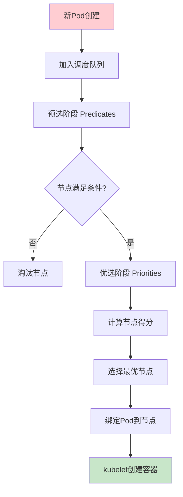
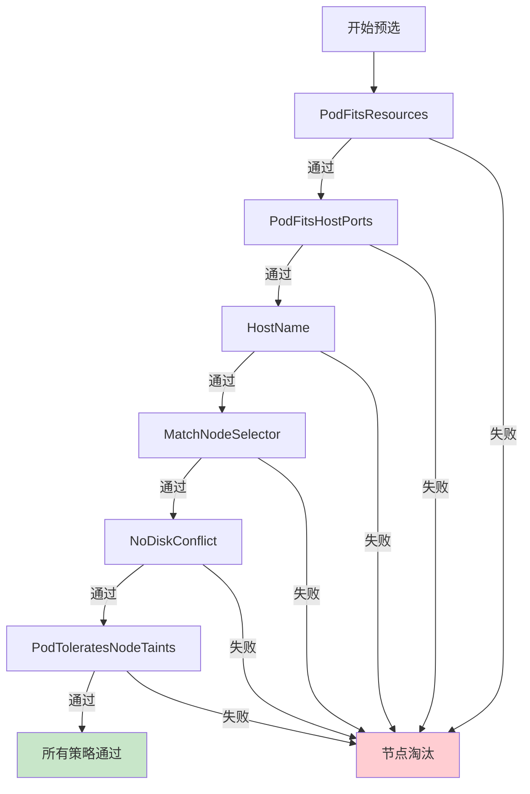
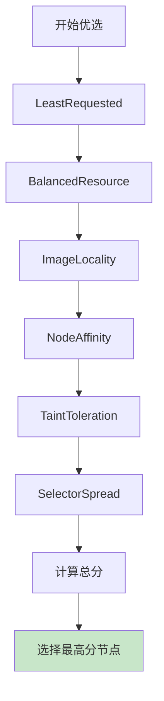
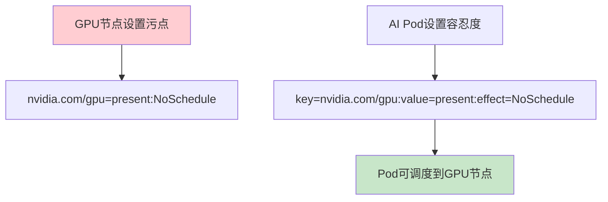

# Kubernetes调度机制：Scheduler工作流程与污点容忍度详解

## 情境与背景

Kubernetes Scheduler是集群的核心组件，负责将Pod调度到最优节点。深入理解调度机制、调度策略以及污点容忍度，是高级DevOps工程师和SRE的必备技能。

## 一、Scheduler工作流程

### 1.1 调度流程概述

**调度流程图**：

```markdown
## Scheduler工作流程

**整体流程**：



**调度队列**：

```yaml
scheduling_queue:
  active_q:
    description: "活跃队列"
    priority: "高"
    content: "等待调度的Pod"
    
  backoff_q:
    description: "退避队列"
    priority: "中"
    content: "调度失败的Pod"
    
  unschedulable_q:
    description: "不可调度队列"
    priority: "低"
    content: "长时间未调度的Pod"
```
```

### 1.2 预选阶段（Predicates）

**预选策略详解**：

```markdown
## 预选阶段

**预选策略**：

```yaml
predicates_strategies:
  PodFitsResources:
    description: "资源是否满足"
    check: "CPU/内存/临时存储"
    
  PodFitsHostPorts:
    description: "端口是否冲突"
    check: "主机端口占用"
    
  HostName:
    description: "节点名称匹配"
    check: "spec.nodeName"
    
  MatchNodeSelector:
    description: "节点选择器匹配"
    check: "spec.nodeSelector"
    
  NoDiskConflict:
    description: "磁盘无冲突"
    check: "PVC卷挂载"
    
  PodToleratesNodeTaints:
    description: "容忍度匹配"
    check: "污点容忍"
    
  CheckNodeMemoryPressure:
    description: "内存压力检查"
    check: "节点内存状态"
    
  CheckNodeDiskPressure:
    description: "磁盘压力检查"
    check: "节点磁盘状态"
    
  CheckNodePIDPressure:
    description: "进程ID压力检查"
    check: "节点PID状态"
```

**预选流程图**：


```

### 1.3 优选阶段（Priorities）

**优选策略详解**：

```markdown
## 优选阶段

**优选策略**：

```yaml
priorities_strategies:
  LeastRequestedPriority:
    description: "最小请求资源优先"
    score: "得分 = (capacity - requested) / capacity"
    favor: "资源使用少的节点"
    
  BalancedResourceAllocation:
    description: "资源平衡分配"
    score: "平衡CPU和内存"
    favor: "资源使用均衡的节点"
    
  ImageLocalityPriority:
    description: "镜像本地性优先"
    score: "基于镜像已下载大小"
    favor: "已有镜像的节点"
    
  NodeAffinityPriority:
    description: "节点亲和性优先"
    score: "基于节点亲和性匹配度"
    favor: "满足亲和性的节点"
    
  TaintTolerationPriority:
    description: "污点容忍优先"
    score: "基于容忍度匹配"
    favor: "容忍度匹配的节点"
    
  SelectorSpreadPriority:
    description: "选择器分散优先"
    score: "基于同一拓扑域的Pod数"
    favor: "Pod分布更分散的节点"
```

**得分计算**：

```yaml
score_calculation:
  step_1: "每个策略计算0-10分"
  step_2: "权重乘以策略得分"
  step_3: "所有策略得分求和"
  formula: "NodeScore = Σ(weight_i × score_i)"
  
  example:
    LeastRequested: "weight=1, score=8"
    BalancedResource: "weight=1, score=6"
    ImageLocality: "weight=1, score=9"
    NodeAffinity: "weight=2, score=7"
    result: "1×8 + 1×6 + 1×9 + 2×7 = 37"
```

**优选流程图**：


```

## 二、调度策略配置

### 2.1 内置调度策略

**调度器配置**：

```markdown
## 调度策略配置

### 内置调度策略

**调度器配置文件**：

```yaml
# kube-scheduler配置文件
apiVersion: kubescheduler.config.k8s.io/v1beta2
kind: KubeSchedulerConfiguration
profiles:
  - pluginConfig:
      - name: NodeResourcesFit
        args:
          scoringStrategy:
            resources:
              - name: cpu
                weight: 1
              - name: memory
                weight: 1
            strategy: LeastAllocated
```

**Predicates配置**：

```yaml
# 启用的Predicates
enabledPredicates:
  - CheckNodeCondition
  - CheckNodeMemoryPressure
  - CheckNodeDiskPressure
  - CheckNodePIDPressure
  - PodToleratesNodeTaints
  - NoDiskConflict
  - PodFitsResources
  - HostName
  - MatchNodeSelector
  - PodFitsHostPorts
```

**Priorities配置**：

```yaml
# 启用的Priorities及权重
enabledPriorities:
  - name: NodeResourcesLeastAllocated
    weight: 1
  - name: NodeResourcesBalancedAllocation
    weight: 1
  - name: ImageLocality
    weight: 1
  - name: InterPodAffinity
    weight: 1
  - name: NodeAffinity
    weight: 1
  - name: TaintToleration
    weight: 1
  - name: SelectorSpread
    weight: 1
```
```

### 2.2 自定义调度策略

**多个调度器**：

```markdown
### 自定义调度器

**创建自定义调度器**：

```yaml
# 部署自定义调度器
apiVersion: v1
kind: Pod
metadata:
  name: my-custom-scheduler
  namespace: kube-system
spec:
  containers:
  - name: my-custom-scheduler
    image: k8s.gcr.io/kube-scheduler:v1.28.0
    command:
    - kube-scheduler
    - --scheduler-name=my-custom-scheduler
    - --leader-elect=false
```

**Pod指定调度器**：

```yaml
# Pod使用自定义调度器
apiVersion: v1
kind: Pod
metadata:
  name: nginx
spec:
  schedulerName: my-custom-scheduler
  containers:
  - name: nginx
    image: nginx:latest
```
```

### 2.3 亲和性与反亲和性

**节点亲和性**：

```markdown
### 亲和性配置

**节点亲和性**：

```yaml
# 节点亲和性示例
apiVersion: v1
kind: Pod
metadata:
  name: with-node-affinity
spec:
  affinity:
    nodeAffinity:
      requiredDuringSchedulingIgnoredDuringExecution:
        nodeSelectorTerms:
        - matchExpressions:
          - key: topology.kubernetes.io/zone
            operator: In
            values:
            - zone-a
      preferredDuringSchedulingIgnoredDuringExecution:
      - weight: 1
        preference:
          matchExpressions:
          - key: disktype
            operator: In
            values:
            - ssd
  containers:
  - name: nginx
    image: nginx:latest
```

**Pod亲和性**：

```yaml
# Pod亲和性示例
apiVersion: v1
kind: Pod
metadata:
  name: with-pod-affinity
spec:
  affinity:
    podAffinity:
      requiredDuringSchedulingIgnoredDuringExecution:
      - labelSelector:
          matchExpressions:
          - key: app
            operator: In
            values:
            - database
        topologyKey: topology.kubernetes.io/zone
  containers:
  - name: nginx
    image: nginx:latest
```

**Pod反亲和性**：

```yaml
# Pod反亲和性示例（高可用部署）
apiVersion: apps/v1
kind: Deployment
metadata:
  name: web-server
spec:
  replicas: 3
  selector:
    matchLabels:
      app: web
  template:
    spec:
      affinity:
        podAntiAffinity:
          requiredDuringSchedulingIgnoredDuringExecution:
          - labelSelector:
              matchExpressions:
              - key: app
                operator: In
                values:
                - web
            topologyKey: kubernetes.io/hostname
      containers:
      - name: nginx
        image: nginx:latest
```
```

## 三、污点与容忍度

### 3.1 污点（Taint）详解

**污点概念**：

```markdown
## 污点与容忍度

### 污点详解

**污点定义**：

```yaml
taint_definition:
  purpose: "排斥Pod调度到特定节点"
  effect_types:
    NoSchedule: "不调度新Pod到该节点"
    PreferNoSchedule: "尽量不调度新Pod到该节点"
    NoExecute: "不调度且驱逐已有Pod"
```

**污点设置**：

```bash
# 添加污点
kubectl taint nodes node1 key=value:NoSchedule

# 添加 PreferNoSchedule 污点
kubectl taint nodes node1 dedicated=gpu:PreferNoSchedule

# 添加 NoExecute 污点
kubectl taint nodes node1 app=monitoring:NoExecute

# 查看污点
kubectl describe node node1 | grep Taints

# 移除污点
kubectl taint nodes node1 key=value:NoSchedule-
```

**常见污点示例**：

```yaml
common_taints:
  master_node:
    key: "node-role.kubernetes.io/master"
    effect: "NoSchedule"
    reason: "master节点不调度普通Pod"
    
  gpu_node:
    key: "nvidia.com/gpu"
    value: "present"
    effect: "NoSchedule"
    reason: "GPU节点专用于AI任务"
    
  dedicated_node:
    key: "dedicated"
    value: "database"
    effect: "NoSchedule"
    reason: "数据库专用节点"
    
  memory_pressure:
    key: "node.kubernetes.io/memory-pressure"
    effect: "NoSchedule"
    reason: "节点内存压力大"
```
```

### 3.2 容忍度（Toleration）详解

**容忍度概念**：

```markdown
### 容忍度详解

**容忍度定义**：

```yaml
toleration_definition:
  purpose: "允许Pod调度到有相应污点的节点"
  match_mechanism: "污点key、value、effect都要匹配"
```

**容忍度配置**：

```yaml
# 基本容忍度
tolerations:
  - key: "key"
    operator: "Equal"
    value: "value"
    effect: "NoSchedule"

# 使用Exists操作符
tolerations:
  - key: "key"
    operator: "Exists"
    effect: "NoSchedule"

# 容忍所有污点
tolerations:
  - operator: "Exists"
```

**完整容忍度示例**：

```yaml
# Pod容忍度配置
apiVersion: v1
kind: Pod
metadata:
  name: with-tolerations
spec:
  tolerations:
  - key: "node-role.kubernetes.io/master"
    operator: "Exists"
    effect: "NoSchedule"
  - key: "dedicated"
    operator: "Equal"
    value: "gpu"
    effect: "NoSchedule"
  - key: "app"
    operator: "Equal"
    value: "monitoring"
    effect: "NoExecute"
    tolerationSeconds: 300
  containers:
  - name: nginx
    image: nginx:latest
```

**特殊容忍度**：

```yaml
# 容忍所有NoSchedule污点
tolerations:
  - key: "node-role.kubernetes.io/master"
    operator: "Exists"

# 容忍所有污点（不推荐）
tolerations:
  - operator: "Exists"

# 容忍特定key的所有污点
tolerations:
  - key: "dedicated"
    operator: "Exists"
    effect: ""
```

### 3.3 污点与容忍度配合使用

**配合场景**：

```markdown
### 配合使用

**专机专用场景**：



**示例1：GPU节点专机专用**：

```yaml
# 1. 给GPU节点设置污点
kubectl taint nodes gpu-node-1 nvidia.com/gpu=present:NoSchedule

# 2. Pod配置容忍度
apiVersion: v1
kind: Pod
metadata:
  name: ml-training
spec:
  tolerations:
  - key: "nvidia.com/gpu"
    operator: "Equal"
    value: "present"
    effect: "NoSchedule"
  containers:
  - name: training
    image: tensorflow:latest
    resources:
      limits:
        nvidia.com/gpu: 1
```

**示例2：数据库节点专机专用**：

```yaml
# 1. 给数据库节点设置污点
kubectl taint nodes db-node-1 dedicated=database:NoSchedule

# 2. 数据库Pod配置容忍度
apiVersion: apps/v1
kind: Deployment
metadata:
  name: mysql
spec:
  replicas: 3
  template:
    spec:
      tolerations:
      - key: "dedicated"
        operator: "Equal"
        value: "database"
        effect: "NoSchedule"
      nodeSelector:
        node-role: database
      containers:
      - name: mysql
        image: mysql:latest
```

**示例3：临时节点维护（NoExecute）**：

```yaml
# 1. 给节点设置NoExecute污点
kubectl taint nodes node-1 maintenance=true:NoExecute

# 2. Pod配置容忍度（带tolerationSeconds）
apiVersion: v1
kind: Pod
metadata:
  name: production-app
spec:
  tolerations:
  - key: "maintenance"
    operator: "Equal"
    value: "true"
    effect: "NoExecute"
    tolerationSeconds: 3600
  containers:
  - name: app
    image: app:latest
```
```

## 四、生产环境最佳实践

### 4.1 调度优化

**调度优化策略**：

```markdown
## 生产环境最佳实践

### 调度优化

**资源调度优化**：

```yaml
resource_scheduling:
  resource_requests:
    description: "合理设置资源请求"
    practice: "requests应接近实际使用量"
    benefit: "提高调度准确性"
    
  resource_limits:
    description: "合理设置资源限制"
    practice: "limits应大于requests"
    benefit: "防止突发流量"
    
  quality_of_service:
    description: "QoS级别"
    types:
      Guaranteed: "requests=limits（最高优先级）"
      Burstable: "requests<limits（中等优先级）"
      BestEffort: "未设置requests/limits（最低优先级）"
```

**Pod拓扑分布约束**：

```yaml
# 拓扑分布约束示例
apiVersion: apps/v1
kind: Deployment
metadata:
  name: web-app
spec:
  replicas: 6
  template:
    spec:
      topologySpreadConstraints:
      - maxSkew: 1
        topologyKey: topology.kubernetes.io/zone
        whenUnsatisfiable: DoNotSchedule
        labelSelector:
          matchLabels:
            app: web
      - maxSkew: 1
        topologyKey: kubernetes.io/hostname
        whenUnsatisfiable: ScheduleAnyway
        labelSelector:
          matchLabels:
            app: web
```
```

### 4.2 污点使用策略

**污点策略**：

```markdown
### 污点使用策略

**污点使用场景**：

```yaml
taint_use_cases:
  dedicated_nodes:
    description: "专用节点"
    example: "数据库节点、GPU节点"
    taint: "dedicated=<role>:NoSchedule"
    
  specialized_workloads:
    description: "特殊工作负载"
    example: "AI训练、大数据"
    taint: "workload-type=<type>:NoSchedule"
    
  maintenance:
    description: "节点维护"
    example: "升级、检修"
    taint: "maintenance=true:NoExecute"
    
  resource_pressure:
    description: "资源压力"
    example: "内存不足、磁盘满"
    taint: "node.kubernetes.io/<pressure>=true:NoSchedule"
```

**污点管理最佳实践**：

```bash
# 节点维护流程
# 1. 驱逐节点上的Pod
kubectl drain node-1 --ignore-daemonsets --delete-emptydir-data

# 2. 设置维护污点
kubectl taint nodes node-1 maintenance=true:NoSchedule

# 3. 执行维护操作
# ...

# 4. 移除维护污点
kubectl taint nodes node-1 maintenance-

# 5. 恢复节点
kubectl uncordon node-1
```
```

### 4.3 调度器高可用

**高可用配置**：

```markdown
### 调度器高可用

**高可用架构**：

```yaml
scheduler_high_availability:
  leader_election:
    description: "领导者选举"
    lease_duration: "15秒"
    renew_deadline: "10秒"
    retry_period: "5秒"
    
  multiple_replicas:
    description: "多副本部署"
    recommendation: "至少2个副本"
    benefit: "故障自动切换"
```

**高可用配置示例**：

```yaml
# kube-scheduler高可用配置
apiVersion: kubescheduler.config.k8s.io/v1beta2
kind: KubeSchedulerConfiguration
leaderElection:
  leaderElect: true
  leaseDuration: 15s
  renewDeadline: 10s
  retryPeriod: 5s
  resourceLock: leases
  resourceName: kube-scheduler
  resourceNamespace: kube-system
```
```

## 五、面试1分钟精简版（直接背）

**完整版**：

Scheduler调度流程：1. 预选阶段遍历所有节点，使用Predicates策略过滤不满足条件的节点；2. 优选阶段对通过的节点打分，常用策略包括LeastRequested、BalancedResource等；3. 选择得分最高的节点绑定Pod。污点（Taint）用于标记节点不被普通Pod调度，如master节点；容忍度（Toleration）让Pod能够调度到有相应污点的节点。常见效果：NoSchedule（不调度）、PreferNoSchedule（尽量不调度）、NoExecute（不调度且驱逐已有Pod）。

**30秒超短版**：

调度分预选优选，预选过滤，优选打分；污点排斥Pod，容忍度让Pod能调度到污点节点，NoSchedule/PreferNoSchedule/NoExecute三种效果。

## 六、总结

### 6.1 调度机制总结

```yaml
scheduling_summary:
  phases:
    predicates:
      name: "预选阶段"
      purpose: "过滤不满足条件的节点"
      
    priorities:
      name: "优选阶段"
      purpose: "对通过节点打分"
      
  key_strategies:
    predicates:
      - "PodFitsResources"
      - "PodFitsHostPorts"
      - "NodeSelector"
      - "TaintToleration"
      
    priorities:
      - "LeastRequestedPriority"
      - "BalancedResourceAllocation"
      - "ImageLocalityPriority"
      - "NodeAffinityPriority"
```

### 6.2 污点容忍度总结

```yaml
taint_toleration_summary:
  taint_effects:
    NoSchedule: "不调度新Pod"
    PreferNoSchedule: "尽量不调度新Pod"
    NoExecute: "不调度且驱逐已有Pod"
    
  toleration_options:
    operator:
      Equal: "value必须相等"
      Exists: "只需key存在"
      
    effect:
      specific: "匹配特定effect"
      empty: "匹配所有effect"
```

### 6.3 最佳实践清单

```yaml
best_practices:
  scheduling:
    - "合理设置资源requests和limits"
    - "使用拓扑分布约束实现高可用"
    - "优先使用Pod反亲和性分布Pod"
    
  taints:
    - "专用节点设置污点"
    - "维护前先drain节点"
    - "NoExecute污点配合tolerationSeconds"
    
  monitoring:
    - "监控调度延迟"
    - "监控调度失败率"
    - "监控节点资源使用率"
```

### 6.4 记忆口诀

```
K8s调度分两阶段，预选优选要记清，
预选过滤不满足，优选打分比高低，
污点设置在节点，排斥普通Pod调度，
容忍度在Pod配置，允许调度到污点，
NoSchedule不调度，Prefer尽量不调度，
NoExecute不调度且驱逐，维护节点要小心。
```

> **参考链接**：[SRE运维面试题全解析：从理论到实践（第二部分）]()