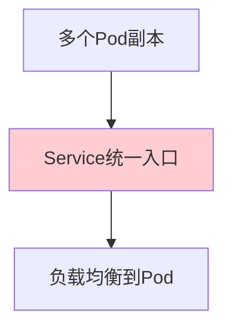
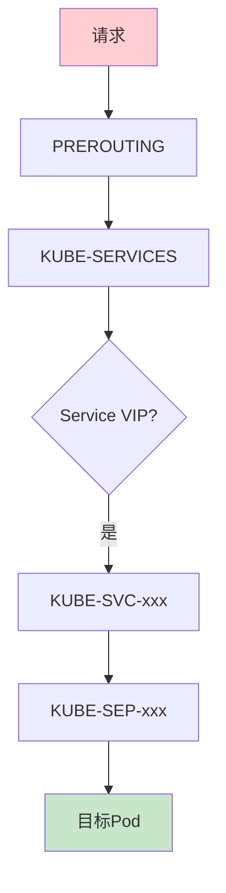
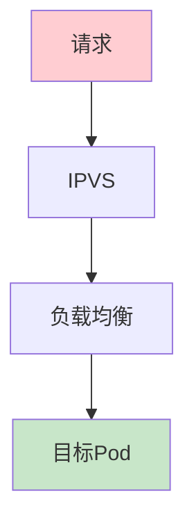
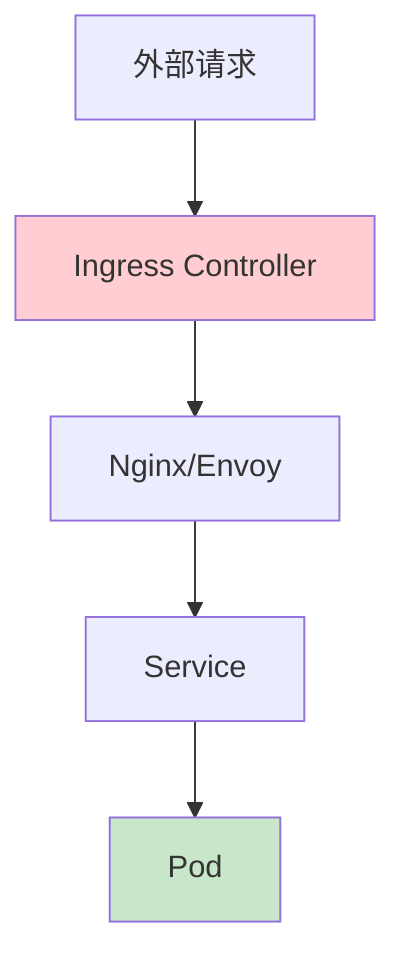

# Kubernetes Service流量路径与实现原理详解

## 情境与背景

Kubernetes Service是实现服务发现和负载均衡的核心资源。深入理解Service的流量路径和实现原理，对排查网络问题、设计高可用架构至关重要。

## 一、Service概述

### 1.1 Service定义

**Service概念**：

```markdown
## Service概述

**为什么需要Service**：

```yaml
service_purpose:
  pod_instability:
    description: "Pod IP不固定"
    problem: "Pod重建后IP会变"
    
  load_balancing:
    description: "负载均衡需求"
    problem: "多个Pod需要统一入口"
    
  service_discovery:
    description: "服务发现问题"
    problem: "客户端需要知道服务地址"
```

**Service工作模型**：


```

### 1.2 Service类型

**四种Service类型**：

```markdown
## Service类型

**类型对比**：

| 类型 | ClusterIP | NodePort | LoadBalancer | ExternalName |
|:----:|:---------:|:--------:|:------------:|:------------:|
| **用途** | 集群内部访问 | 外部访问 | 云厂商LB | 外部服务映射 |
| **范围** | 集群内 | 集群外 | 集群外 | 集群内 |
| **访问方式** | VIP | 节点IP:端口 | 云厂商分配 | DNS CNAME |
| **端口范围** | 任意端口 | 30000-32767 | 云厂商分配 | 无 |
| **Headless** | 支持 | 支持 | 不支持 | 支持 |

**ClusterIP Service**：

```yaml
# ClusterIP Service示例
apiVersion: v1
kind: Service
metadata:
  name: backend-clusterip
spec:
  type: ClusterIP
  selector:
    app: backend
  ports:
  - port: 80          # Service端口
    targetPort: 8080  # Pod端口
    protocol: TCP
```

**NodePort Service**：

```yaml
# NodePort Service示例
apiVersion: v1
kind: Service
metadata:
  name: backend-nodeport
spec:
  type: NodePort
  selector:
    app: backend
  ports:
  - port: 80
    targetPort: 8080
    nodePort: 30080  # 指定节点端口（可选）
  externalTrafficPolicy: Cluster  # 或Local
```

**LoadBalancer Service**：

```yaml
# LoadBalancer Service示例
apiVersion: v1
kind: Service
metadata:
  name: backend-lb
spec:
  type: LoadBalancer
  selector:
    app: backend
  ports:
  - port: 80
    targetPort: 8080
  loadBalancerIP: "1.2.3.4"  # 指定IP（可选）
  externalTrafficPolicy: Cluster
```

**ExternalName Service**：

```yaml
# ExternalName Service示例
apiVersion: v1
kind: Service
metadata:
  name: external-database
spec:
  type: ExternalName
  externalName: database.example.com
```
```

## 二、流量路径详解

### 2.1 kube-proxy工作原理

**kube-proxy角色**：

```markdown
## 流量路径详解

### kube-proxy工作原理

**kube-proxy核心功能**：

```yaml
kube_proxy_functions:
  service_management:
    description: "Service管理"
    action: "创建/更新/删除iptables/ipvs规则"
    
  endpoint_tracking:
    description: "Endpoints跟踪"
    action: "watch API Server获取Endpoints变化"
    
  traffic_forwarding:
    description: "流量转发"
    action: "根据规则转发请求到Pod"
```

**kube-proxy模式**：

```yaml
kube_proxy_modes:
  iptables:
    description: "iptables模式"
    advantage: "稳定、成熟"
    disadvantage: "规则多时性能下降"
    default: "K8s 1.22前默认"
    
  ipvs:
    description: "IPVS模式"
    advantage: "高性能、低延迟"
    disadvantage: "需要ipvs内核模块"
    default: "K8s 1.22+默认"
    
  userspace:
    description: "userspace模式"
    status: "已废弃"
```
```

### 2.2 iptables模式流量路径

**iptables规则**：

```markdown
### iptables模式

**iptables规则链**：



**iptables规则示例**：

```bash
# 查看Service相关规则
iptables -t nat -L KUBE-SERVICES -n

# 查看特定Service的规则
iptables -t nat -L KUBE-SVC-XXXXX -n -v

# 规则结构
# KUBE-SERVICES: 入口链
# KUBE-SVC-XXXXX: Service链
# KUBE-SEP-XXXXX: Endpoint链（DNAT到Pod IP）
```

**iptables配置**：

```yaml
# kube-proxy iptables配置
apiVersion: kubeproxy.config.k8s.io/v1alpha1
kind: KubeProxyConfiguration
mode: "iptables"
iptables:
  masqueradeAll: false
  masqueradeBit: 14
  minSyncPeriod: 0s
  syncPeriod: 30s
```

**流量转发流程**：

```yaml
traffic_flow_iptables:
  step_1: "请求到达Service VIP:Port"
  step_2: "PREROUTING链匹配KUBE-SERVICES"
  step_3: "跳转到KUBE-SVC-xxx Service链"
  step_4: "根据负载均衡算法选择KUBE-SEP-xxx"
  step_5: "DNAT到目标Pod IP:Port"
  step_6: "转发到目标Pod"
```
```

### 2.3 IPVS模式流量路径

**IPVS工作原理**：

```markdown
### IPVS模式

**IPVS架构**：



**IPVS负载均衡算法**：

```yaml
ipvs_schedulers:
  rr:
    description: "轮询"
    name: "Round Robin"
    
  wrr:
    description: "加权轮询"
    name: "Weighted Round Robin"
    
  lc:
    description: "最少连接"
    name: "Least Connections"
    
  wlc:
    description: "加权最少连接"
    name: "Weighted Least Connections"
    
  sh:
    description: "源哈希"
    name: "Source Hashing"
    
  dh:
    description: "目标哈希"
    name: "Destination Hashing"
    
  sed:
    description: "最短预期延迟"
    name: "Shortest Expected Delay"
    
  nq:
    description: "Never Queue"
    name: "Never Queue"
```

**IPVS配置**：

```yaml
# kube-proxy IPVS配置
apiVersion: kubeproxy.config.k8s.io/v1alpha1
kind: KubeProxyConfiguration
mode: "ipvs"
ipvs:
  scheduler: "rr"
  excludeCIDRs:
    - "10.96.0.0/12"
  minSyncPeriod: 0s
  syncPeriod: 30s
```

**流量转发流程**：

```yaml
traffic_flow_ipvs:
  step_1: "请求到达Service VIP:Port"
  step_2: "IPVS模块接收请求"
  step_3: "根据调度算法选择Pod"
  step_4: "DNAT到目标Pod IP:Port"
  step_5: "转发到目标Pod"
  
  advantage: "比iptables更高效的查找"
```
```

## 三、Service发现机制

### 3.1 环境变量发现

**环境变量方式**：

```markdown
## Service发现机制

### 环境变量发现

**工作原理**：

```yaml
env_discovery:
  description: "kubelet在Pod启动时注入环境变量"
  inject_time: "Pod创建时"
  scope: "同Namespace的Service"
  
  env_variables:
    - "{SVCNAME}_SERVICE_HOST": "Service ClusterIP"
    - "{SVCNAME}_SERVICE_PORT": "Service Port"
    - "其他环境变量"
```

**示例**：

```bash
# Pod内的环境变量
BACKEND_SERVICE_HOST=10.96.0.100
BACKEND_SERVICE_PORT=80
REDIS_SERVICE_HOST=10.96.0.101
REDIS_SERVICE_PORT=6379
```

**优缺点**：

```yaml
env_discovery_pros_cons:
  pros:
    - "简单易用"
    - "无需额外配置"
    
  cons:
    - "Service必须在Pod之前创建"
    - "环境变量过多会增加开销"
    - "不支持跨Namespace"
```
```

### 3.2 DNS发现

**DNS方式**：

```markdown
### DNS发现

**CoreDNS工作原理**：

```yaml
coredns_workflow:
  step_1: "Service创建"
  step_2: "Endpoints同步到CoreDNS"
  step_3: "Pod查询DNS"
  step_4: "CoreDNS返回IP"
```

**DNS查询示例**：

```bash
# 同Namespace查询
nslookup backend

# 跨Namespace查询
nslookup backend.default

# FQDN查询
nslookup backend.default.svc.cluster.local
```

**DNS记录类型**：

```yaml
dns_record_types:
  A_record:
    description: "Service ClusterIP"
    example: "backend.default.svc.cluster.local -> 10.96.0.100"
    
  SRV_record:
    description: "Service端口信息"
    example: "_http._tcp.backend.default.svc.cluster.local"
    
  Headless_Service:
    description: "Pod IP列表"
    example: "backend.default.svc.cluster.local -> [PodIP1, PodIP2]"
```

**CoreDNS配置**：

```yaml
# Corefile配置
apiVersion: v1
kind: ConfigMap
metadata:
  name: coredns
  namespace: kube-system
data:
  Corefile: |
    .:53 {
        errors
        health
        kubernetes cluster.local in-addr.arpa ip6.arpa {
            pods insecure
            fallthrough in-addr.arpa ip6.arpa
        }
        prometheus :9153
        forward . /etc/resolv.conf
        cache 30
        loop
        reload
        loadbalance
    }
```
```

## 四、Headless Service

### 4.1 Headless Service原理

**Headless Service特点**：

```markdown
## Headless Service

### Headless Service特点

**与普通Service的区别**：

```yaml
headless_vs_clusterip:
  clusterip:
    - "有ClusterIP"
    - "kube-proxy做负载均衡"
    - "DNS返回单个IP"
    
  headless:
    - "无ClusterIP"
    - "kube-proxy不做负载均衡"
    - "DNS返回所有Pod IP列表"
```

**配置示例**：

```yaml
# Headless Service示例
apiVersion: v1
kind: Service
metadata:
  name: backend-headless
spec:
  type: ClusterIP
  clusterIP: None  # 关键：设置为None
  selector:
    app: backend
  ports:
  - port: 80
    targetPort: 8080
```

**DNS查询结果**：

```bash
# 普通Service DNS
nslookup backend
# Name: backend.default.svc.cluster.local
# Address: 10.96.0.100

# Headless Service DNS
nslookup backend-headless
# Name: backend-headless.default.svc.cluster.local
# Addresses: 10.244.1.10, 10.244.2.10, 10.244.3.10
```

### 4.2 Headless Service应用场景

**应用场景**：

```yaml
headless_use_cases:
  statefulset:
    description: "StatefulSet应用"
    example: "MongoDB集群、Redis集群"
    
  service_discovery:
    description: "自定义服务发现"
    example: "应用自行选择目标Pod"
    
  testing:
    description: "测试场景"
    example: "直接测试特定Pod"
```
```

## 五、Ingress详解

### 5.1 Ingress工作原理

**Ingress架构**：

```markdown
## Ingress详解

### Ingress工作原理

**Ingress组件**：

```yaml
ingress_components:
  ingress_controller:
    description: "Ingress控制器"
    responsibility: "解析Ingress规则并转发流量"
    popular: "Nginx Ingress、Traefik"
    
  ingress_resource:
    description: "Ingress资源"
    responsibility: "定义路由规则"
```

**Ingress架构图**：


```

### 5.2 Ingress配置示例

**基本配置**：

```yaml
# Ingress基本配置
apiVersion: networking.k8s.io/v1
kind: Ingress
metadata:
  name: web-ingress
  annotations:
    nginx.ingress.kubernetes.io/rewrite-target: /
spec:
  ingressClassName: nginx
  rules:
  - host: www.example.com
    http:
      paths:
      - path: /api
        pathType: Prefix
        backend:
          service:
            name: api-service
            port:
              number: 80
      - path: /web
        pathType: Prefix
        backend:
          service:
            name: web-service
            port:
              number: 80
```

**HTTPS配置**：

```yaml
# TLS配置
apiVersion: networking.k8s.io/v1
kind: Ingress
metadata:
  name: web-ingress-tls
spec:
  ingressClassName: nginx
  tls:
  - hosts:
    - www.example.com
    secretName: example-tls
  rules:
  - host: www.example.com
    http:
      paths:
      - path: /
        pathType: Prefix
        backend:
          service:
            name: web-service
            port:
              number: 80
```

## 六、生产环境最佳实践

### 6.1 Service设计最佳实践

**设计原则**：

```markdown
## 生产环境最佳实践

### Service设计原则

**命名规范**：

```yaml
naming_conventions:
  service_name:
    pattern: "{app-name}-{role}"
    example: "backend-api", "frontend-web"
    
  port_naming:
    pattern: "{protocol}-{app}"
    example: "http-backend", "grpc-api"
```

**配置最佳实践**：

```yaml
service_best_practices:
  - "使用selector明确标签"
  - "设置合适的targetPort"
  - "为端口设置name便于升级"
  - "使用Headless Service进行StatefulSet"
  - "外部流量使用LoadBalancer或Ingress"
```
```

### 6.2 网络策略

**NetworkPolicy配置**：

```markdown
### 网络策略

**默认拒绝策略**：

```yaml
# 默认拒绝所有入站流量
apiVersion: networking.k8s.io/v1
kind: NetworkPolicy
metadata:
  name: default-deny-ingress
spec:
  podSelector: {}
  policyTypes:
  - Ingress
```

**允许特定流量**：

```yaml
# 允许特定Pod访问Service
apiVersion: networking.k8s.io/v1
kind: NetworkPolicy
metadata:
  name: allow-frontend-to-backend
spec:
  podSelector:
    matchLabels:
      app: backend
  policyTypes:
  - Ingress
  ingress:
  - from:
    - podSelector:
        matchLabels:
          app: frontend
    ports:
    - protocol: TCP
      port: 8080
```
```

### 6.3 故障排查

**常见问题排查**：

```markdown
### 故障排查

**Service无法访问排查**：

```bash
# 1. 检查Service是否存在
kubectl get svc <service-name>

# 2. 检查Endpoints是否健康
kubectl get endpoints <service-name>

# 3. 检查Pod是否运行
kubectl get pods -l app=<app-name>

# 4. 检查Pod日志
kubectl logs <pod-name>

# 5. 检查kube-proxy状态
kubectl get pods -n kube-system -l k8s-app=kube-proxy

# 6. 检查iptables规则
iptables -t nat -L KUBE-SVC-xxx -n -v

# 7. 测试DNS解析
kubectl exec -it <test-pod> -- nslookup <service-name>
```

**常见问题与解决方案**：

```yaml
troubleshooting_guide:
  no_endpoints:
    cause: "selector不匹配"
    solution: "检查selector和Pod标签"
    
  connection_timeout:
    cause: "kube-proxy不工作"
    solution: "重启kube-proxy Pod"
    
  dns_resolution_failed:
    cause: "CoreDNS问题"
    solution: "检查CoreDNS Pod状态"
    
  external_traffic_policy:
    cause: "Local模式限制"
    solution: "了解Local模式特点"
```
```

## 七、面试1分钟精简版（直接背）

**完整版**：

Service流量路径：客户端Pod请求Service VIP，通过kube-proxy根据iptables/ipvs规则转发到后端Endpoint（Pod）。kube-proxy通过watch API Server感知Endpoints变化，实时更新转发规则。Service类型：ClusterIP（默认，集群内访问）、NodePort（通过节点端口外部访问）、LoadBalancer（对接云厂商LB）、ExternalName（映射外部域名）。Headless Service的特殊之处是没有ClusterIP，直接DNS解析到Pod IP。

**30秒超短版**：

Service流量路径：VIP→kube-proxy→iptables/ipvs→Pod。Service类型：ClusterIP（集群内）、NodePort（节点端口）、LoadBalancer（云厂商）、ExternalName（外部映射）。Headless无ClusterIP，DNS返回Pod IP列表。

## 八、总结

### 8.1 Service核心概念总结

```yaml
service_summary:
  traffic_flow:
    - "请求 → kube-proxy → iptables/ipvs → Pod"
    - "kube-proxy watch Endpoints变化"
    - "实时更新转发规则"
    
  service_types:
    ClusterIP: "集群内访问"
    NodePort: "节点端口外部访问"
    LoadBalancer: "云厂商负载均衡"
    ExternalName: "外部服务映射"
    
  discovery:
    - "环境变量：Pod启动时注入"
    - "DNS：CoreDNS解析"
```

### 8.2 最佳实践清单

```yaml
best_practices:
  design:
    - "合理的命名规范"
    - "使用合适的Service类型"
    - "配置健康检查"
    
  security:
    - "使用NetworkPolicy限制流量"
    - "外部流量通过Ingress"
    - "TLS加密"
    
  operation:
    - "监控Service状态"
    - "定期检查Endpoints"
    - "故障时按流程排查"
```

### 8.3 记忆口诀

```
Service流量三步走，VIP到kube-proxy，
iptables或ipvs，转发规则要记清，
ClusterIP集群内，NodePort节点端口，
LoadBalancer云厂商，ExternalName外部名，
Headless无Cluster，DNS返回Pod列表，
服务发现两方式，环境变量和DNS。
```

> **参考链接**：[SRE运维面试题全解析：从理论到实践（第二部分）]()