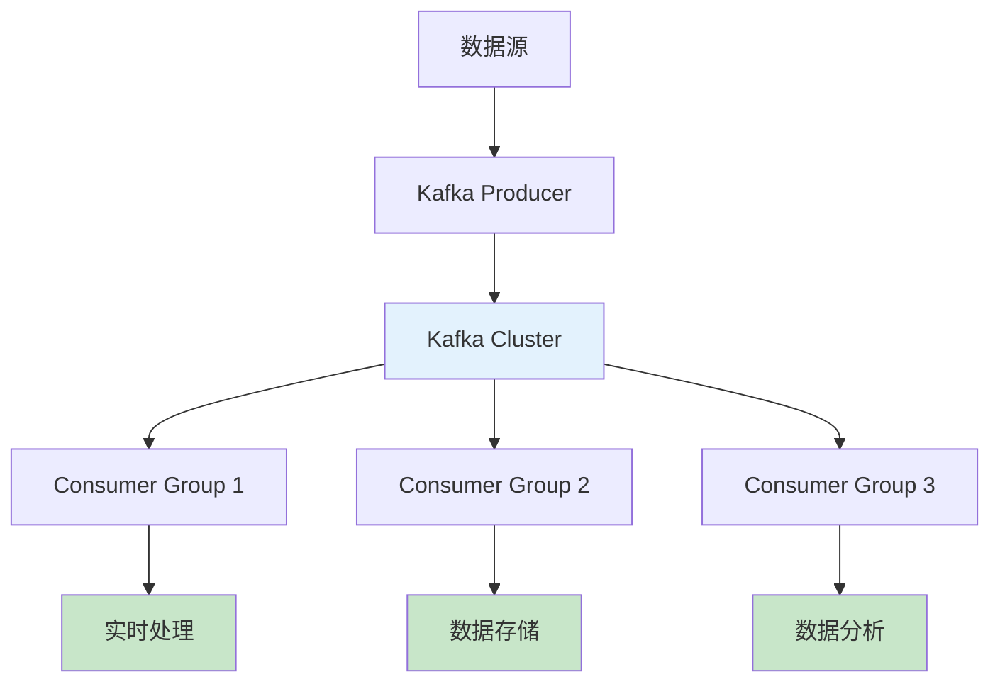
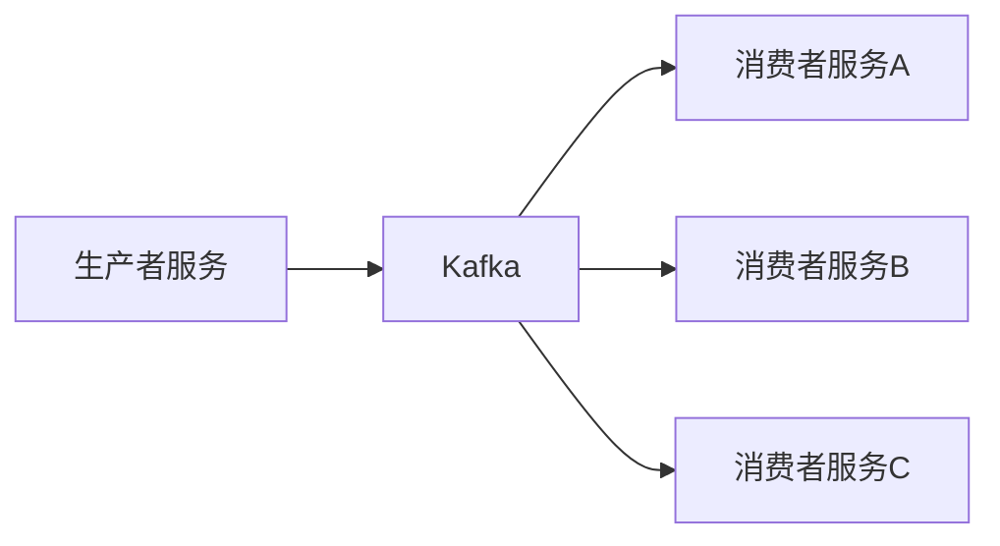
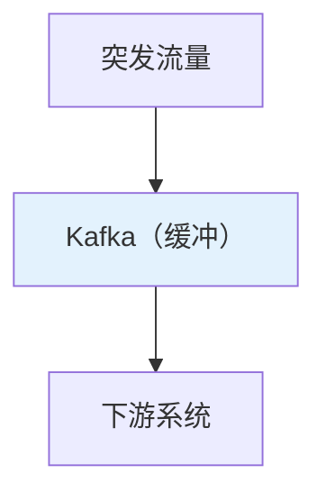
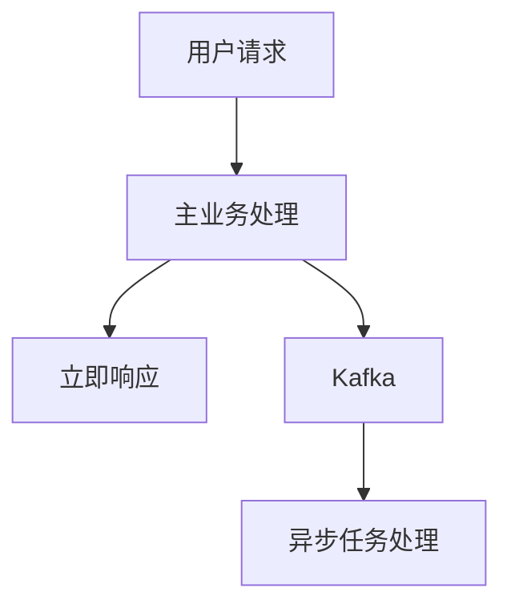
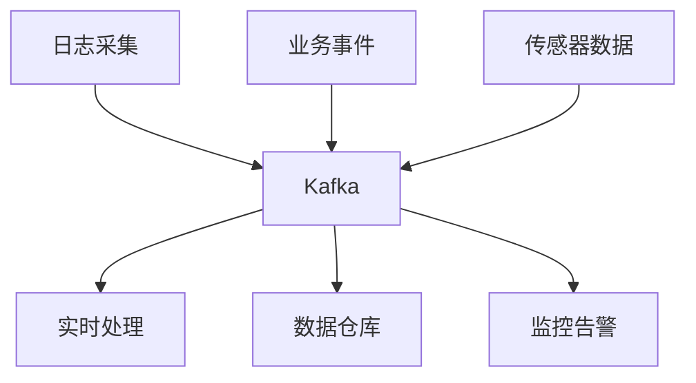
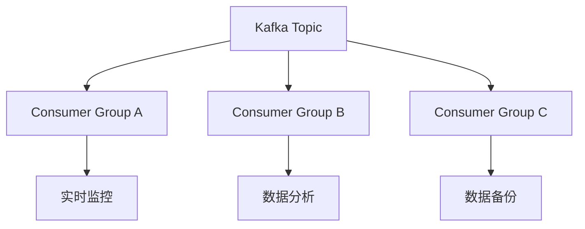

# Kafka核心作用与应用场景：从解耦到实时数据管道

## 情境与背景

Kafka作为分布式消息队列的领导者，在现代分布式系统中扮演着核心角色。理解Kafka的核心作用，对于设计高可用、高性能的系统至关重要。本文详细介绍Kafka在系统中的核心作用及其应用场景。

## 一、Kafka核心作用概述

### 1.1 核心作用架构

**Kafka在系统中的角色**：



### 1.2 核心作用对比

**Kafka与传统消息队列对比**：

| 特性 | Kafka | RabbitMQ | ActiveMQ |
|:----:|-------|----------|----------|
| **吞吐量** | 极高（百万级/秒） | 中等 | 中等 |
| **延迟** | 低（毫秒级） | 低 | 中等 |
| **持久化** | 磁盘持久化 | 支持 | 支持 |
| **分区** | 原生支持 | 无 | 无 |
| **多消费组** | 原生支持 | 有限 | 有限 |
| **分布式** | 原生分布式 | 需要集群 | 需要集群 |

## 二、核心作用详解

### 2.1 解耦

**解耦作用说明**：

```markdown
## 作用1：系统解耦

**定义**：
生产者和消费者之间不需要知道彼此的存在，通过Kafka作为中间层实现解耦。

**架构图**：


**优势**：
- **独立扩展**：生产者和消费者可以独立扩容
- **技术异构**：不同技术栈的系统可以互相通信
- **降低耦合**：修改一方不影响另一方
- **灵活扩展**：新增消费者无需修改生产者

**场景示例**：
```yaml
scenario:
  producer: "用户服务（Java）"
  consumer:
    - "邮件服务（Python）"
    - "统计服务（Go）"
    - "风控服务（Scala）"
  benefit: "用户服务只需关注核心业务，无需关心下游服务"
```
```

### 2.2 削峰填谷

**削峰填谷作用说明**：

```markdown
## 作用2：削峰填谷

**定义**：
通过Kafka缓冲突发流量，保护下游系统不被瞬时高峰压垮。

**架构图**：


**优势**：
- **流量缓冲**：平滑突发流量
- **系统保护**：避免下游系统过载
- **弹性伸缩**：根据消息堆积情况自动扩容

**场景示例**：
```yaml
scenario:
  event: "秒杀活动"
  peak_traffic: "10万QPS"
  normal_traffic: "1万QPS"
  kafka_role: "缓冲9万QPS的峰值"
  downstream: "订单系统（处理能力：2万QPS）"
  result: "系统稳定运行，无服务中断"
```

**配置建议**：
```yaml
configuration:
  topic_partitions: 100
  replication_factor: 3
  message_retention: "24小时"
  consumer_count: 100
```
```

### 2.3 异步通信

**异步通信作用说明**：

```markdown
## 作用3：异步通信

**定义**：
将非核心业务异步处理，提升主流程响应速度。

**架构图**：


**优势**：
- **响应更快**：主流程无需等待异步任务完成
- **资源优化**：异步任务可在空闲时段处理
- **解耦流程**：核心流程与非核心流程分离

**场景示例**：
```yaml
scenario:
  user_action: "用户注册"
  main_flow:
    - "验证用户信息"
    - "创建用户记录"
    - "返回成功响应"
    - "耗时：100ms"
    
  async_flow:
    - "发送欢迎邮件"
    - "初始化用户配置"
    - "通知相关系统"
    - "耗时：500ms"
    
  result: "用户体验提升5倍"
```
```

### 2.4 数据管道

**数据管道作用说明**：

```markdown
## 作用4：数据管道

**定义**：
作为实时数据总线，连接多个系统，实现数据流转。

**架构图**：


**优势**：
- **统一入口**：多种数据源统一接入
- **实时流转**：数据实时传递到各个消费端
- **灵活路由**：支持多种消费模式

**场景示例**：
```yaml
data_pipeline:
  sources:
    - "Filebeat日志"
    - "业务数据库CDC"
    - "API网关日志"
    - "传感器数据流"
    
  kafka_topics:
    - "logs-raw"
    - "business-events"
    - "metrics-data"
    
  consumers:
    - "Flink实时计算"
    - "Elasticsearch日志检索"
    - "ClickHouse数据分析"
    - "Prometheus监控"
```
```

### 2.5 多消费模式

**多消费模式说明**：

```markdown
## 作用5：多消费模式

**定义**：
支持多个消费者组独立消费同一数据，实现一份数据多系统使用。

**架构图**：


**优势**：
- **数据复用**：一份数据多系统消费
- **独立进度**：每个消费组独立管理offset
- **灵活扩展**：按需增减消费组

**场景示例**：
```yaml
multi_consumer_scenario:
  topic: "user-behavior"
  
  consumer_groups:
    - name: "real-time-monitor"
      purpose: "实时监控用户行为"
      processing: "Flink实时计算"
      
    - name: "data-analysis"
      purpose: "离线数据分析"
      processing: "Spark批处理"
      
    - name: "data-backup"
      purpose: "数据备份到数据仓库"
      processing: "Kafka Connect"
```
```

## 三、Kafka优势深度分析

### 3.1 技术优势

**Kafka核心优势**：

```yaml
kafka_advantages:
  high_throughput:
    description: "高吞吐量"
    capability: "百万级消息/秒"
    reason: "零拷贝、顺序读写、批量处理"
    
  low_latency:
    description: "低延迟"
    capability: "<10ms端到端延迟"
    reason: "内存缓冲、异步IO"
    
  high_availability:
    description: "高可用"
    capability: "99.99%可用性"
    reason: "多副本、故障自动转移"
    
  scalability:
    description: "水平扩展"
    capability: "线性扩展"
    reason: "分区机制、分布式架构"
    
  durability:
    description: "数据持久化"
    capability: "数据不丢失"
    reason: "磁盘持久化、副本同步"
```

### 3.2 与其他消息系统对比

**对比分析**：

```yaml
message_system_comparison:
  kafka:
    use_cases:
      - "日志收集"
      - "实时数据处理"
      - "大数据管道"
      - "事件驱动架构"
    advantages:
      - "高吞吐"
      - "低延迟"
      - "持久化"
      - "分布式"
    disadvantages:
      - "配置复杂"
      - "需要ZooKeeper"
      
  rabbitmq:
    use_cases:
      - "任务队列"
      - "RPC通信"
      - "工作队列"
    advantages:
      - "灵活路由"
      - "丰富的协议支持"
    disadvantages:
      - "吞吐量有限"
      
  redis:
    use_cases:
      - "简单消息队列"
      - "缓存"
    advantages:
      - "简单易用"
      - "高性能"
    disadvantages:
      - "消息可能丢失"
      - "持久化有限"
```

## 四、生产环境最佳实践

### 4.1 Topic设计

**Topic设计最佳实践**：

```yaml
topic_best_practices:
  naming:
    convention: "业务域-数据类型-用途"
    example: "user-action-log"
    
  partition_count:
    calculation: "目标吞吐量 / 单分区吞吐量"
    recommendation: "100-1000个分区"
    consideration: "每个broker最多2000个分区"
    
  replication_factor:
    production: 3
    development: 2
    consideration: "至少2个副本保证高可用"
    
  retention_policy:
    time_based: "根据业务需求设置"
    size_based: "配合磁盘容量"
    recommendation: "7-30天"
    
  cleanup_policy:
    delete: "默认，删除过期消息"
    compact: "保留最新消息，用于状态同步"
```

### 4.2 Producer配置

**Producer最佳实践**：

```yaml
producer_best_practices:
  acks:
    production: "all"
    development: "1"
    reason: "确保数据不丢失"
    
  retries:
    setting: 3
    reason: "处理网络抖动"
    
  compression:
    algorithm: "snappy"
    reason: "平衡压缩率和CPU开销"
    
  batch_size:
    setting: 16384
    reason: "批量发送提高效率"
    
  linger_ms:
    setting: 5
    reason: "等待更多消息一起发送"
    
  idempotence:
    enabled: true
    reason: "避免消息重复"
```

### 4.3 Consumer配置

**Consumer最佳实践**：

```yaml
consumer_best_practices:
  group_id:
    requirement: "必须设置"
    naming: "业务场景-用途"
    
  auto_offset_reset:
    production: "latest"
    initial_sync: "earliest"
    
  enable_auto_commit:
    production: false
    reason: "手动控制offset提交"
    
  max_poll_records:
    setting: 500
    reason: "控制每次拉取数量"
    
  consumer_count:
    recommendation: "等于分区数"
    reason: "最大化并行处理"
    
  processing:
    requirement: "幂等处理"
    reason: "消息可能重复"
```

## 五、实战案例

### 5.1 案例：日志收集系统

**案例描述**：

```markdown
## 案例1：日志收集系统

**需求**：
- 收集1000+台服务器日志
- 日均日志量10TB+
- 实时查询延迟<1分钟

**架构设计**：
```yaml
architecture:
  layers:
    - name: "采集层"
      components: ["Filebeat", "Logstash"]
      
    - name: "消息层"
      components: ["Kafka"]
      role: "解耦采集与处理"
      
    - name: "处理层"
      components: ["Flink", "Spark"]
      
    - name: "存储层"
      components: ["Elasticsearch", "ClickHouse"]
```

**Kafka配置**：
```yaml
kafka_config:
  topics:
    - name: "server-logs"
      partitions: 100
      replication_factor: 3
      retention: "7天"
      
  producer:
    acks: "all"
    compression: "snappy"
    
  consumer:
    group_id: "log-processing"
    consumer_count: 100
```

**效果**：
- 吞吐量：100MB/s+
- 查询延迟：<30秒
- 可用性：99.99%
```

### 5.2 案例：实时数据管道

**案例描述**：

```markdown
## 案例2：实时数据管道

**需求**：
- 实时同步业务数据到多个系统
- 支持多种数据源
- 保证数据一致性

**架构设计**：
```yaml
data_pipeline:
  sources:
    - "MySQL CDC"
    - "PostgreSQL CDC"
    - "API事件"
    
  kafka_topics:
    - "mysql-cdc"
    - "pg-cdc"
    - "api-events"
    
  consumers:
    - name: "elasticsearch-sink"
      purpose: "实时搜索"
      
    - name: "clickhouse-sink"
      purpose: "OLAP分析"
      
    - name: "redis-cache"
      purpose: "缓存更新"
```

**效果**：
- 数据延迟：<1秒
- 数据一致性：Exactly-Once
- 支持多系统消费
```

## 六、面试1分钟精简版（直接背）

**完整版**：

Kafka在系统中主要起四个核心作用：1. 解耦：生产者和消费者解耦，独立扩展；2. 削峰填谷：缓冲突发流量，保护下游系统；3. 异步通信：实现异步处理，提升响应速度；4. 数据管道：作为实时数据总线，支持多系统消费。此外，Kafka还提供高吞吐、低延迟、分布式高可用的特性，适合大规模数据场景。

**30秒超短版**：

Kafka四大核心作用：解耦、削峰填谷、异步通信、数据管道；高吞吐低延迟，分布式高可用。

## 七、总结

### 7.1 核心作用总结

```yaml
core_roles_summary:
  decoupling:
    description: "生产者与消费者解耦"
    benefit: "独立扩展、技术异构"
    
  peak_shaving:
    description: "缓冲突发流量"
    benefit: "系统保护、弹性伸缩"
    
  async_communication:
    description: "异步处理任务"
    benefit: "响应更快、资源优化"
    
  data_pipeline:
    description: "实时数据流转"
    benefit: "统一入口、灵活路由"
    
  multi_consumer:
    description: "多消费组独立消费"
    benefit: "数据复用、独立进度"
```

### 7.2 最佳实践清单

```yaml
best_practices_checklist:
  topic:
    - "合理设置分区数"
    - "使用3副本"
    - "设置合适的retention"
    
  producer:
    - "使用acks=all"
    - "启用重试和幂等性"
    - "使用压缩"
    
  consumer:
    - "手动提交offset"
    - "消费者数量等于分区数"
    - "处理逻辑幂等"
    
  monitoring:
    - "监控broker状态"
    - "监控consumer lag"
    - "设置告警规则"
```

### 7.3 记忆口诀

```
Kafka核心四作用，解耦削峰异步管道，
高吞吐低延迟，分布式高可用，
分区副本保可靠，生产环境少不了。
```

> **参考链接**：[SRE运维面试题全解析：从理论到实践（第二部分）]()