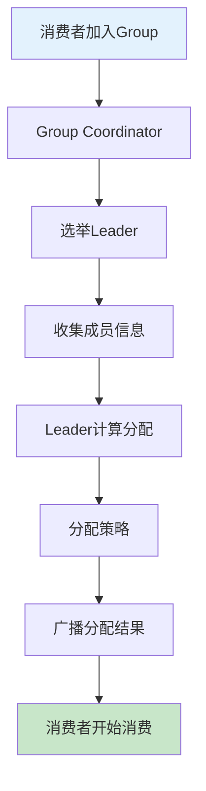

# Kafka分区分配策略与数量规划：生产环境最佳实践

## 情境与背景

Kafka分区分配是消费者组的核心机制，合理的分配策略和分区数量规划直接影响系统的性能和稳定性。本文深入分析分区分配机制、策略选择和生产环境分区数量规划。

## 一、分区分配机制概述

### 1.1 分配流程

**分区分配过程**：

```markdown
## 分配流程

**核心组件**：

```yaml
assignment_components:
  consumer_group:
    description: "消费者组"
    role: "协调分区分配"
    coordinator: "Group Coordinator"
    
  partition_assignor:
    description: "分区分配器"
    role: "决定分配策略"
    strategies: ["Range", "RoundRobin", "Sticky", "CooperativeSticky"]
    
  leader_consumer:
    description: "消费者组领导者"
    role: "执行分配计算"
    election: "第一个加入Group的消费者"
```

**分配流程**：


```

### 1.2 重平衡触发条件

**重平衡场景**：

```yaml
rebalance_triggers:
  consumer_join:
    description: "新消费者加入"
    action: "重新分配"
    
  consumer_leave:
    description: "消费者离开"
    action: "重新分配"
    
  session_timeout:
    description: "会话超时"
    action: "标记离开，重新分配"
    
  topic_partition_change:
    description: "Topic分区数变化"
    action: "重新分配"
    
  heartbeat_timeout:
    description: "心跳超时"
    action: "标记离开，重新分配"
```

## 二、分区分配策略详解

### 2.1 Range策略

**Range策略**：

```markdown
## Range策略

**原理**：
按Topic的分区范围分配给消费者。

**分配逻辑**：

```yaml
range_strategy:
  algorithm: "分区数 / 消费者数"
  remainder: "分区数 % 消费者数"
  distribution: "前remainder个消费者多分配1个分区"
  
  example:
    partitions: 5
    consumers: 2
    result:
      consumer_1: ["p0", "p1", "p2"]
      consumer_2: ["p3", "p4"]
```

**代码示例**：

```java
// Range分配策略配置
Properties props = new Properties();
props.put("partition.assignment.strategy", 
          "org.apache.kafka.clients.consumer.RangeAssignor");
```

**优缺点**：

```yaml
range_pros_cons:
  advantages:
    - "简单直观"
    - "易于理解"
    - "分区连续"
    
  disadvantages:
    - "分配不均匀"
    - "多个Topic时可能倾斜"
    
  best_for:
    - "单一Topic"
    - "分区数能被消费者数整除"
```
```

### 2.2 RoundRobin策略

**RoundRobin策略**：

```markdown
## RoundRobin策略

**原理**：
按轮询方式分配所有Topic的分区。

**分配逻辑**：

```yaml
round_robin_strategy:
  algorithm: "轮询分配"
  scope: "所有订阅的Topic"
  sort: "按Topic和分区排序"
  
  example:
    topics: ["topic-a", "topic-b"]
    partitions:
      topic-a: 3
      topic-b: 3
    consumers: 2
    result:
      consumer_1: ["topic-a-p0", "topic-a-p2", "topic-b-p1"]
      consumer_2: ["topic-a-p1", "topic-b-p0", "topic-b-p2"]
```

**代码示例**：

```java
// RoundRobin分配策略配置
Properties props = new Properties();
props.put("partition.assignment.strategy", 
          "org.apache.kafka.clients.consumer.RoundRobinAssignor");
```

**优缺点**：

```yaml
round_robin_pros_cons:
  advantages:
    - "分配均匀"
    - "多Topic场景友好"
    - "负载均衡"
    
  disadvantages:
    - "分区不连续"
    - "可能跨Topic分配"
    
  best_for:
    - "多个Topic"
    - "分区数不均匀"
    - "需要均匀分配"
```
```

### 2.3 Sticky策略

**Sticky策略**：

```markdown
## Sticky策略

**原理**：
保持分配的稳定性，减少重平衡时的分区迁移。

**分配逻辑**：

```yaml
sticky_strategy:
  first_assignment: "类似RoundRobin"
  rebalance: "尽量保持原有分配"
  goal: "最小化分区迁移"
  
  example:
    initial:
      consumer_1: ["p0", "p1", "p2"]
      consumer_2: ["p3", "p4", "p5"]
      
    after_rebalance:
      consumer_1: ["p0", "p1", "p3"]  # 只迁移p2->p3
      consumer_2: ["p2", "p4", "p5"]
```

**代码示例**：

```java
// Sticky分配策略配置
Properties props = new Properties();
props.put("partition.assignment.strategy", 
          "org.apache.kafka.clients.consumer.StickyAssignor");
```

**优缺点**：

```yaml
sticky_pros_cons:
  advantages:
    - "减少重平衡影响"
    - "保持本地缓存"
    - "提高稳定性"
    
  disadvantages:
    - "实现复杂"
    - "可能分配不均匀"
    
  best_for:
    - "频繁重平衡场景"
    - "需要保持状态"
    - "追求稳定性"
```
```

### 2.4 CooperativeSticky策略

**CooperativeSticky策略**：

```markdown
## CooperativeSticky策略

**原理**：
支持增量重平衡，不需要暂停所有消费者。

**分配逻辑**：

```yaml
cooperative_sticky_strategy:
  mode: "增量重平衡"
  phase_1: "释放多余分区"
  phase_2: "分配新分区"
  benefit: "消费不中断"
  
  example:
    scenario: "新增消费者"
    phase_1:
      description: "现有消费者释放部分分区"
      result: "继续消费未释放的分区"
    phase_2:
      description: "新消费者获得分配"
      result: "所有消费者正常消费"
```

**代码示例**：

```java
// CooperativeSticky分配策略配置
Properties props = new Properties();
props.put("partition.assignment.strategy", 
          "org.apache.kafka.clients.consumer.CooperativeStickyAssignor");
```

**优缺点**：

```yaml
cooperative_sticky_pros_cons:
  advantages:
    - "消费不中断"
    - "增量更新"
    - "高可用性"
    
  disadvantages:
    - "需要新版本支持"
    - "配置复杂"
    
  best_for:
    - "高可用场景"
    - "不能容忍中断"
    - "Kafka 2.3+"
```
```

### 2.5 策略对比

**策略选择指南**：

```yaml
strategy_comparison:
  range:
    description: "范围分配"
    best_for: "单一Topic，分区均匀"
    complexity: "简单"
    
  round_robin:
    description: "轮询分配"
    best_for: "多Topic，负载均衡"
    complexity: "中等"
    
  sticky:
    description: "粘性分配"
    best_for: "减少重平衡影响"
    complexity: "复杂"
    
  cooperative_sticky:
    description: "协作粘性分配"
    best_for: "高可用，不中断"
    complexity: "复杂"
```

## 三、分区数量规划

### 3.1 分区数计算

**计算公式**：

```markdown
## 分区数计算

**核心公式**：

```yaml
partition_calculation:
  formula: "分区数 = 目标吞吐量 / 单分区吞吐量"
  
  parameters:
    target_throughput: "系统目标吞吐量"
    single_partition_throughput: "单分区处理能力"
    
  typical_values:
    write_throughput: "10-50 MB/s"
    read_throughput: "20-100 MB/s"
```

**计算示例**：

```yaml
calculation_example:
  scenario: "日志收集系统"
  target_write: "100 MB/s"
  single_partition_write: "10 MB/s"
  result: "10个分区"
  
  scenario_2:
    description: "实时数据处理"
    target_read: "200 MB/s"
    single_partition_read: "20 MB/s"
    result: "10个分区"
```

**考虑因素**：

```yaml
considerations:
  broker_count:
    description: "broker数量"
    constraint: "分区数 >= broker数"
    
  consumer_count:
    description: "消费者数量"
    constraint: "分区数 >= 消费者数"
    
  replication_factor:
    description: "副本数"
    constraint: "分区数 * 副本数 <= broker容量"
    
  future_growth:
    description: "预留扩展空间"
    recommendation: "预留30%空间"
```
```

### 3.2 生产环境分区数参考

**经验值参考**：

```markdown
## 分区数参考

**按场景分类**：

```yaml
partition_guidelines:
  small_topic:
    description: "低吞吐量"
    example: "内部通知"
    partitions: 10-50
    
  medium_topic:
    description: "中等吞吐量"
    example: "业务日志"
    partitions: 50-200
    
  large_topic:
    description: "高吞吐量"
    example: "用户行为"
    partitions: 200-1000
    
  critical_topic:
    description: "核心业务"
    example: "订单事件"
    partitions: 500-2000
```

**按公司规模**：

```yaml
company_size_guidelines:
  small:
    description: "100人以下"
    total_partitions: 100-500
    
  medium:
    description: "100-500人"
    total_partitions: 500-2000
    
  large:
    description: "500人以上"
    total_partitions: 2000-10000
    
  enterprise:
    description: "大型企业"
    total_partitions: 10000+
```

**单个Broker限制**：

```yaml
broker_limits:
  max_partitions: 2000
  recommendation: 1000-1500
  reason:
    - "内存占用"
    - "元数据管理"
    - "ZooKeeper压力"
```
```

### 3.3 分区数调整

**调整策略**：

```markdown
## 分区调整

**增加分区数**：

```yaml
adding_partitions:
  command: "kafka-topics.sh --alter --topic my-topic --partitions 200"
  
  considerations:
    - "只能增加，不能减少"
    - "已有的数据不会重新分配"
    - "新消息路由到新分区"
    
  impact:
    - "提高并行处理能力"
    - "需要同步增加消费者"
    - "可能触发重平衡"
```

**减少分区数**：

```yaml
reducing_partitions:
  limitation: "不支持直接减少"
  workaround:
    - "创建新Topic（较少分区）"
    - "迁移数据"
    - "切换生产者"
    - "删除旧Topic"
    
  steps:
    1: "创建新Topic"
    2: "同步旧数据"
    3: "双写新旧Topic"
    4: "切换消费者"
    5: "停止写旧Topic"
    6: "删除旧Topic"
```
```

## 四、生产环境最佳实践

### 4.1 策略选择建议

**策略选择指南**：

```markdown
## 策略选择

**推荐策略**：

```yaml
strategy_recommendations:
  default: "CooperativeStickyAssignor"
  reason: "增量重平衡，不中断消费"
  
  alternatives:
    - name: "RoundRobinAssignor"
      use_case: "多Topic，需要均匀分配"
      
    - name: "StickyAssignor"
      use_case: "需要保持分配稳定性"
      
    - name: "RangeAssignor"
      use_case: "单一Topic，简单场景"
```

**配置示例**：

```java
// 推荐配置：CooperativeSticky + RoundRobin
Properties props = new Properties();
props.put("partition.assignment.strategy", 
          "org.apache.kafka.clients.consumer.CooperativeStickyAssignor," +
          "org.apache.kafka.clients.consumer.RoundRobinAssignor");
```
```

### 4.2 分区规划最佳实践

**规划原则**：

```markdown
## 分区规划

**规划流程**：

```yaml
partition_planning:
  step_1:
    description: "评估吞吐量需求"
    action: "计算目标QPS和数据量"
    
  step_2:
    description: "确定单分区能力"
    action: "测试环境验证"
    
  step_3:
    description: "计算初始分区数"
    formula: "分区数 = 目标吞吐量 / 单分区吞吐量"
    
  step_4:
    description: "考虑扩展性"
    action: "预留30%空间"
    
  step_5:
    description: "验证Broker容量"
    check: "分区数 * 副本数 <= Broker容量"
    
  step_6:
    description: "监控调整"
    action: "根据实际运行情况调整"
```

**监控指标**：

```yaml
monitoring_metrics:
  partition_utilization:
    description: "分区使用率"
    threshold: "< 80%"
    
  consumer_lag:
    description: "消费者滞后"
    threshold: "< 10000"
    
  under_replicated_partitions:
    description: "同步滞后的分区"
    threshold: "= 0"
    
  leader_imbalance:
    description: "Leader分布"
    target: "均匀分布"
```
```

### 4.3 重平衡优化

**优化策略**：

```markdown
## 重平衡优化

**减少重平衡频率**：

```yaml
rebalance_optimization:
  session_timeout:
    setting: "30-60秒"
    reason: "避免误判"
    
  heartbeat_interval:
    setting: "session_timeout / 3"
    reason: "及时发送心跳"
    
  max_poll_interval:
    setting: "根据处理时间调整"
    reason: "避免处理超时"
    
  static_membership:
    setting: "启用"
    reason: "减少不必要的重平衡"
    
  member_id:
    setting: "固定"
    reason: "保持成员身份"
```

**配置示例**：

```java
Properties props = new Properties();
props.put("session.timeout.ms", "30000");
props.put("heartbeat.interval.ms", "10000");
props.put("max.poll.interval.ms", "300000");
props.put("group.instance.id", "consumer-1"); // 静态成员身份
```
```

## 五、实战案例

### 5.1 案例：分区分配不均问题

**案例描述**：

```markdown
## 案例1：分配不均

**问题**：
使用Range策略时，多个Topic导致分配不均。

**原因分析**：

```yaml
problem_analysis:
  strategy: "RangeAssignor"
  topics: ["topic-a", "topic-b", "topic-c"]
  partitions_per_topic: 10
  consumers: 3
  
  range_assignment:
    consumer_1: ["topic-a-p0-3", "topic-b-p0-3", "topic-c-p0-3"]
    consumer_2: ["topic-a-p4-6", "topic-b-p4-6", "topic-c-p4-6"]
    consumer_3: ["topic-a-p7-9", "topic-b-p7-9", "topic-c-p7-9"]
    
  issue: "每个Topic都有余数，累加导致严重不均"
```

**解决方案**：

```yaml
solution:
  strategy: "RoundRobinAssignor"
  
  round_robin_assignment:
    consumer_1: ["topic-a-p0", "topic-b-p1", "topic-c-p2", ...]
    consumer_2: ["topic-a-p1", "topic-b-p2", "topic-c-p0", ...]
    consumer_3: ["topic-a-p2", "topic-b-p0", "topic-c-p1", ...]
    
  result: "均匀分配"
```
```

### 5.2 案例：分区数规划

**案例描述**：

```markdown
## 案例2：分区数规划

**需求**：
设计一个日志收集系统，目标吞吐量100MB/s写入。

**规划过程**：

```yaml
planning:
  target_throughput: "100 MB/s"
  single_partition_write: "10 MB/s"
  initial_partitions: 10
  replication_factor: 3
  brokers: 3
  
  verification:
    total_replicas: 30
    replicas_per_broker: 10
    ok: true
    
  future_growth:
    current: 100 MB/s
    expected: 150 MB/s
    buffer: 50%
    recommended: 15 partitions
```

**实施结果**：

```yaml
result:
  partitions: 15
  brokers: 3
  replicas: 45
  throughput: "150 MB/s"
  status: "稳定运行"
```
```

## 六、面试1分钟精简版（直接背）

**完整版**：

Kafka分区分配由Consumer Group协调，常见策略：1. Range策略按范围分配，适合分区数均匀；2. RoundRobin轮询分配，适合分区数不均匀；3. Sticky策略保持分配稳定性，减少重平衡影响；4. CooperativeSticky支持增量重平衡。生产环境中，我们根据吞吐量计算分区数，核心Topic通常100-500个分区，普通Topic50-100个，单个broker不超过2000个分区。

**30秒超短版**：

分区分配策略：Range范围、RoundRobin轮询、Sticky粘性、CooperativeSticky增量；分区数根据吞吐量计算，核心Topic100-500个，单个broker不超过2000个。

## 七、总结

### 7.1 分区分配要点

```yaml
assignment_key_points:
  strategies:
    - "Range: 范围分配，简单但可能不均"
    - "RoundRobin: 轮询分配，均匀但不连续"
    - "Sticky: 粘性分配，减少重平衡影响"
    - "CooperativeSticky: 增量重平衡，不中断"
    
  recommendation: "优先使用CooperativeSticky"
```

### 7.2 分区规划要点

```yaml
planning_key_points:
  calculation: "分区数 = 目标吞吐量 / 单分区吞吐量"
  guidelines:
    small: 10-50
    medium: 50-200
    large: 200-1000
    
  limits:
    per_broker: 2000
    recommendation: 1000-1500
```

### 7.3 最佳实践清单

```yaml
best_practices:
  strategy:
    - "使用CooperativeStickyAssignor"
    - "配置备用策略"
    
  planning:
    - "根据吞吐量计算"
    - "预留扩展空间"
    - "验证Broker容量"
    
  monitoring:
    - "监控分区使用率"
    - "监控consumer lag"
    - "检测分配不均"
    
  optimization:
    - "启用静态成员身份"
    - "合理设置超时参数"
    - "减少重平衡频率"
```

### 7.4 记忆口诀

```
分区分配有策略，Range范围RoundRobin轮，
Sticky粘性稳分配，Cooperative不中断，
分区数量算一算，吞吐量除以单分区，
核心Topic多分配，单个broker两千限。
```

> **参考链接**：[SRE运维面试题全解析：从理论到实践（第二部分）]()