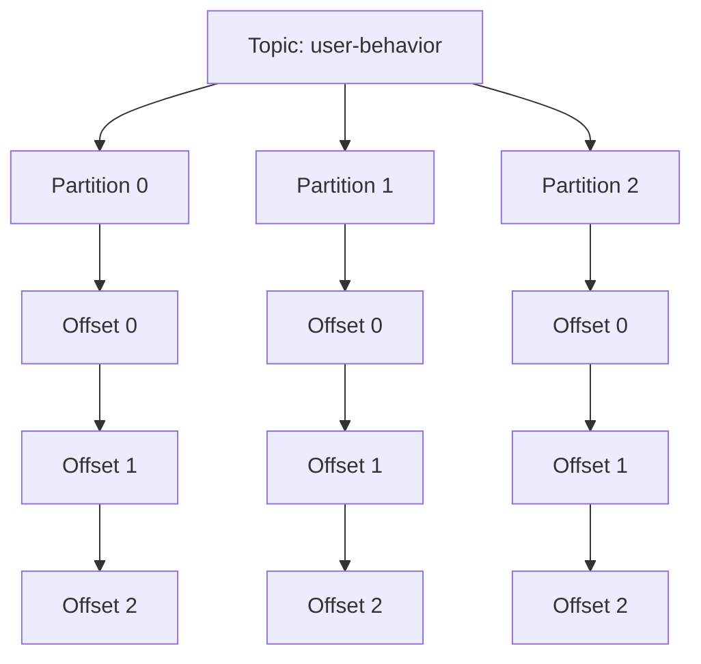
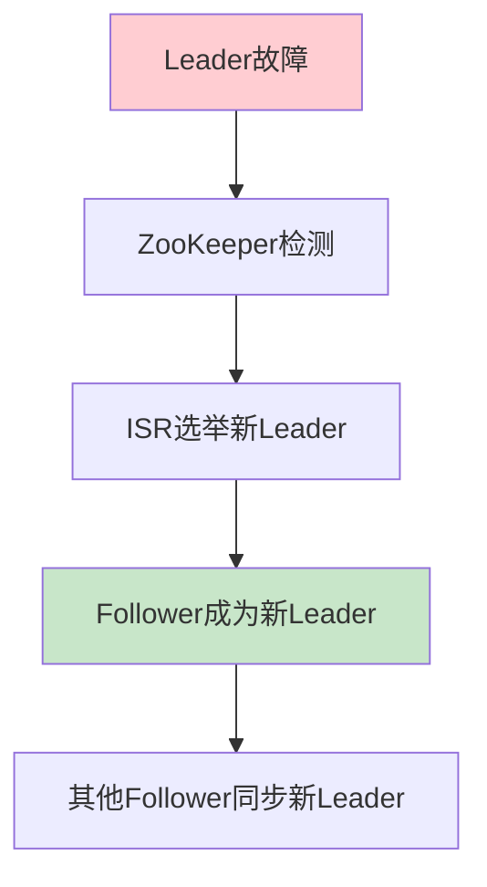

# Kafka Partition深度解析：设计原理与最佳实践

## 情境与背景

Partition是Kafka实现高吞吐量和水平扩展的核心机制。深入理解Partition的设计原理和使用方法，对于构建高性能、高可用的Kafka系统至关重要。

## 一、Partition基础概念

### 1.1 Partition定义

**Partition是什么**：

```markdown
## Partition定义

Partition是Kafka Topic的**物理分区**，是Kafka实现并行处理和水平扩展的基础单元。

**核心特性**：
- **并行性**：多个Partition可以并行读写
- **顺序性**：同一Partition内的消息严格有序
- **独立性**：每个Partition独立管理自己的数据

**架构示意**：



**类比理解**：
```yaml
analogy:
  topic: "一本书"
  partition: "书中的章节"
  message: "章节中的文字"
  offset: "页码"
  replica: "书的副本"
```
```

### 1.2 Partition vs Topic

**关系对比**：

```yaml
topic_partition_relation:
  topic:
    description: "逻辑概念，消息的类别"
    example: "user-behavior"
    properties:
      - "包含多个Partition"
      - "统一的配置"
      - "逻辑上的消息集合"
      
  partition:
    description: "物理概念，消息的存储单元"
    example: "user-behavior-0"
    properties:
      - "独立存储"
      - "独立的offset序列"
      - "可独立消费"
      
  relation:
    - "一个Topic包含多个Partition"
    - "Partition是Topic的物理实现"
    - "消息最终存储在Partition中"
```

## 二、Partition核心机制

### 2.1 消息路由机制

**分区策略**：

```markdown
## 消息路由

**分区键（Partition Key）**：
消息根据分区键路由到特定的Partition。

**路由策略**：

```yaml
partitioning_strategy:
  key_based:
    description: "根据key的hash值路由"
    algorithm: "hash(key) % partition_count"
    guarantee: "相同key的消息进入同一个Partition"
    advantage: "保证消息顺序性"
    
  round_robin:
    description: "轮询分配"
    algorithm: "依次分配到每个Partition"
    guarantee: "均匀分布"
    advantage: "负载均衡"
    
  custom_partitioner:
    description: "自定义分区器"
    use_case: "复杂业务场景"
    example: "根据业务规则分配"
```

**示例代码**：

```java
// 生产者配置分区策略
Properties props = new Properties();
props.put("bootstrap.servers", "localhost:9092");
props.put("key.serializer", "org.apache.kafka.common.serialization.StringSerializer");
props.put("value.serializer", "org.apache.kafka.common.serialization.StringSerializer");

// 发送消息时指定key
Producer<String, String> producer = new KafkaProducer<>(props);
producer.send(new ProducerRecord<>("topic", "user123", "login"));
producer.send(new ProducerRecord<>("topic", "user456", "logout"));
```
```

### 2.2 Offset机制

**Offset详解**：

```markdown
## Offset机制

**Offset定义**：
Offset是消息在Partition中的**唯一标识**，从0开始递增。

**Offset作用**：

```yaml
offset_functions:
  message_identification:
    description: "唯一标识消息"
    example: "Offset=5表示Partition中的第6条消息"
    
  consumer_progress:
    description: "追踪消费进度"
    example: "consumer_offset=3表示已消费到Offset 3"
    
  message_retrieval:
    description: "定位消息位置"
    example: "通过Offset快速定位消息"
    
  rebalancing:
    description: "重新平衡时恢复消费"
    example: "新消费者加入时从最新offset开始"
```

**Offset管理**：

```bash
# 查看Consumer Group的offset
kafka-consumer-groups.sh --describe --group my-group --bootstrap-server localhost:9092

# 重置offset到最早
kafka-consumer-groups.sh --reset-offsets --group my-group --topic my-topic --to-earliest --execute --bootstrap-server localhost:9092

# 重置offset到指定位置
kafka-consumer-groups.sh --reset-offsets --group my-group --topic my-topic --to-offset 100 --execute --bootstrap-server localhost:9092
```
```

### 2.3 Leader-Follower机制

**副本机制**：

```markdown
## Leader-Follower机制

**副本角色**：

```yaml
replica_roles:
  leader:
    description: "主副本"
    responsibilities:
      - "处理所有读写请求"
      - "维护ISR列表"
      - "选举新leader"
      
  follower:
    description: "从副本"
    responsibilities:
      - "同步leader的数据"
      - "保持与leader一致"
      - "在leader故障时接管"
```

**ISR（In-Sync Replicas）**：

```yaml
ISR:
  description: "同步副本列表"
  members: "所有与leader保持同步的副本"
  criteria: "在replica.lag.time.max.ms时间内同步"
  importance: "只有ISR中的副本可以成为leader"
  
  scenarios:
    - name: "正常状态"
      isr: ["leader", "follower1", "follower2"]
      
    - name: "follower同步滞后"
      isr: ["leader", "follower1"]
      removed: ["follower2"]
      
    - name: "follower恢复"
      isr: ["leader", "follower1", "follower2"]
      readded: ["follower2"]
```

**故障转移**：


```

### 2.4 顺序写入与读取

**性能优化**：

```markdown
## 顺序IO优化

**顺序写入**：

```yaml
sequential_write:
  description: "消息按offset顺序写入磁盘"
  advantage:
    - "减少磁盘寻道时间"
    - "提高写入吞吐量"
    - "利用磁盘预读缓存"
  mechanism: "追加写入，不修改已有数据"
  
  comparison:
    sequential:
      throughput: "100MB/s+"
      latency: "低"
      
    random:
      throughput: "10MB/s"
      latency: "高"
```

**分段存储**：

```yaml
segment_storage:
  description: "Partition分为多个段文件"
  segment_size: "默认1GB"
  benefit:
    - "方便清理旧数据"
    - "提高查找效率"
    - "减少文件大小"
    
  structure:
    - "00000000000000000000.index" # 索引文件
    - "00000000000000000000.log"   # 数据文件
    - "00000000000000000100.index"
    - "00000000000000000100.log"
```
```

## 三、Partition设计最佳实践

### 3.1 分区数规划

**分区数计算**：

```markdown
## 分区数设计

**计算公式**：

```yaml
partition_calculation:
  formula: "partition_count = target_throughput / single_partition_throughput"
  
  parameters:
    target_throughput: "目标吞吐量（如100MB/s）"
    single_partition_throughput: "单分区吞吐量（写入约10MB/s，读取约20MB/s）"
    
  example:
    target: "100MB/s写入"
    single_partition: "10MB/s"
    result: "10个分区"
```

**推荐范围**：

```yaml
partition_recommendations:
  small_topic:
    description: "低吞吐量场景"
    partitions: 10-50
    
  medium_topic:
    description: "中等吞吐量场景"
    partitions: 50-200
    
  large_topic:
    description: "高吞吐量场景"
    partitions: 200-1000
    
  very_large_topic:
    description: "超高吞吐量场景"
    partitions: 1000+
    
  consideration:
    - "单个broker最多2000个分区"
    - "分区数设置后不易修改"
    - "消费者数量不能超过分区数"
```
```

### 3.2 分区键选择

**分区键策略**：

```markdown
## 分区键选择

**选择原则**：

```yaml
key_selection:
  cardinality:
    description: "高基数key"
    example: "user_id, order_id"
    benefit: "均匀分布"
    
  ordering_requirement:
    description: "需要保证顺序的场景"
    example: "同一用户的操作"
    benefit: "顺序保证"
    
  avoiding_hot_partitions:
    description: "避免热点分区"
    example: "不要使用固定值作为key"
    benefit: "负载均衡"
    
  null_key_handling:
    description: "null key的处理"
    behavior: "轮询分配到各个Partition"
    consideration: "无法保证顺序"
```

**反模式**：

```yaml
anti_patterns:
  - name: "固定key"
    example: "key=\"constant\""
    problem: "所有消息进入同一个Partition"
    result: "热点分区，性能瓶颈"
    
  - name: "递增key"
    example: "timestamp"
    problem: "新消息总是进入最后一个Partition"
    result: "写入热点"
    
  - name: "随机key"
    example: "UUID"
    problem: "无法保证顺序"
    result: "业务逻辑错误"
```
```

### 3.3 副本配置

**副本策略**：

```markdown
## 副本配置

**副本数设置**：

```yaml
replication_factor:
  development: 2
  production: 3
  critical: 5
  
  considerations:
    - "副本数越多，可用性越高"
    - "副本数越多，写入延迟越高"
    - "至少2个副本才能保证高可用"
```

**机架感知**：

```yaml
rack_awareness:
  description: "副本分布在不同机架"
  benefit:
    - "防止机架故障导致数据丢失"
    - "提高可用性"
    
  configuration:
    broker_rack: "rack1"
    placement_strategy: "spread across racks"
    
  example:
    topic: "critical-topic"
    partitions: 10
    replication_factor: 3
    racks: ["rack1", "rack2", "rack3"]
    result: "每个Partition的3个副本分布在不同机架"
```
```

## 四、Partition管理与运维

### 4.1 分区重平衡

**重平衡场景**：

```markdown
## 分区重平衡

**触发场景**：

```yaml
rebalance_triggers:
  consumer_join:
    description: "新消费者加入Group"
    action: "重新分配Partition"
    
  consumer_leave:
    description: "消费者离开Group"
    action: "重新分配Partition"
    
  topic_partition_change:
    description: "Topic分区数变化"
    action: "重新分配Partition"
    
  session_timeout:
    description: "消费者会话超时"
    action: "标记为离开，重新分配"
```

**重平衡影响**：

```yaml
rebalance_impact:
  temporary_pause:
    description: "消费暂停"
    duration: "取决于Partition数量"
    
  offset_commit:
    description: "提交当前offset"
    importance: "避免消息重复或丢失"
    
  partition_reassignment:
    description: "重新分配Partition"
    result: "负载重新均衡"
```

**减少重平衡**：

```yaml
reduce_rebalance:
  session_timeout:
    setting: "适当增大"
    reason: "避免误判消费者离开"
    
  heartbeat_interval:
    setting: "session_timeout的1/3"
    reason: "及时发送心跳"
    
  max_poll_interval:
    setting: "根据处理时间设置"
    reason: "避免处理超时"
    
  static_membership:
    setting: "启用"
    reason: "减少不必要的重平衡"
```
```

### 4.2 分区监控

**监控指标**：

```markdown
## 分区监控

**关键指标**：

```yaml
partition_metrics:
  under_replicated_partitions:
    description: "同步滞后的Partition数量"
    alert_condition: "> 0"
    severity: "critical"
    
  leader_imbalance:
    description: "Leader分布不均衡"
    alert_condition: "某个broker的leader过多"
    severity: "warning"
    
  partition_count:
    description: "Topic的分区数"
    monitoring: "确保在推荐范围内"
    
  message_in_per_partition:
    description: "每个Partition的消息流入量"
    monitoring: "检测热点分区"
    
  consumer_lag_per_partition:
    description: "每个Partition的消费者滞后"
    alert_condition: "> 10000"
    severity: "critical"
```

**监控命令**：

```bash
# 查看Topic分区信息
kafka-topics.sh --describe --topic my-topic --bootstrap-server localhost:9092

# 查看Partition的Leader分布
kafka-topics.sh --describe --topic my-topic --bootstrap-server localhost:9092 | grep Leader

# 查看ISR状态
kafka-topics.sh --describe --topic my-topic --bootstrap-server localhost:9092 | grep ISR
```
```

### 4.3 分区扩展

**扩展策略**：

```markdown
## 分区扩展

**增加分区数**：

```yaml
adding_partitions:
  command: "kafka-topics.sh --alter --topic my-topic --partitions 200 --bootstrap-server localhost:9092"
  
  considerations:
    - "分区数只能增加，不能减少"
    - "已有的消息不会重新分配"
    - "新消息会路由到新分区"
    
  impact:
    - "提高并行处理能力"
    - "需要同步增加消费者数量"
    - "可能需要重新平衡"
```

**数据迁移**：

```yaml
data_migration:
  scenario: "需要重新分配数据"
  approach:
    - "创建新Topic，迁移数据"
    - "使用MirrorMaker同步"
    - "应用层双写"
    
  steps:
    1: "创建新Topic（更多分区）"
    2: "同步旧数据到新Topic"
    3: "切换生产者到新Topic"
    4: "等待消费者消费完旧Topic"
    5: "删除旧Topic"
```
```

## 五、实战案例

### 5.1 案例：热点分区问题

**案例描述**：

```markdown
## 案例1：热点分区

**问题**：
某个Partition的写入量远高于其他Partition，导致性能瓶颈。

**原因分析**：
```yaml
root_cause:
  key_distribution: "key分布不均匀"
  example: "大部分消息使用相同的key"
  result: "热点分区"
```

**解决方案**：

```yaml
solution:
  step_1: "分析key分布"
    command: "kafka-run-class.sh kafka.tools.GetOffsetShell --broker-list localhost:9092 --topic my-topic --time -1"
    
  step_2: "优化分区键"
    strategy: "增加key的基数"
    example: "user_id + timestamp"
    
  step_3: "增加分区数"
    command: "kafka-topics.sh --alter --topic my-topic --partitions 200"
    
  step_4: "监控验证"
    metrics: "message_in_per_partition"
    target: "均匀分布"
```
```

### 5.2 案例：顺序性保证

**案例描述**：

```markdown
## 案例2：消息顺序性

**需求**：
同一用户的操作需要保证顺序。

**解决方案**：

```yaml
solution:
  key_selection: "使用user_id作为key"
  guarantee: "相同user_id的消息进入同一Partition"
  result: "保证顺序"
  
  implementation:
    producer:
      key: "user_id"
      partitioner: "DefaultPartitioner"
      
  verification:
    test_case: "同一用户连续发送多条消息"
    expected: "按发送顺序消费"
```
```

## 六、面试1分钟精简版（直接背）

**完整版**：

Kafka的partition是Topic的物理分区，用于实现并行处理和水平扩展。每个Topic可以分为多个partition，消息根据分区键路由到特定partition，同一partition内的消息保证有序。每个partition有多个副本（Leader+Follower），Leader负责读写，Follower同步数据，保证高可用。Offset是消息在partition中的唯一标识，消费者通过offset追踪消费进度。

**30秒超短版**：

Partition是Topic的物理分区，用于并行处理；消息按key路由，同一partition内有序；多副本保证高可用；offset追踪消费进度。

## 七、总结

### 7.1 Partition核心要点

```yaml
partition_key_points:
  definition: "Topic的物理分区"
  purpose: "并行处理、水平扩展"
  ordering: "同一Partition内消息有序"
  replication: "多副本保证高可用"
  offset: "消息唯一标识和消费进度"
  key_routing: "根据key路由到Partition"
```

### 7.2 最佳实践清单

```yaml
best_practices:
  partition_count:
    - "根据吞吐量计算"
    - "100-1000个分区"
    - "单个broker不超过2000个分区"
    
  key_selection:
    - "使用高基数key"
    - "避免固定key"
    - "需要顺序时使用业务key"
    
  replication:
    - "生产环境使用3副本"
    - "机架感知部署"
    - "监控ISR状态"
    
  monitoring:
    - "监控under replicated partitions"
    - "监控consumer lag"
    - "检测热点分区"
```

### 7.3 记忆口诀

```
Partition是物理分区，并行处理靠它实现，
分区键决定路由，同一分区消息有序，
多副本保证高可用，Leader写Follower同步，
Offset标记消息位，消费者用它来追踪。
```

> **参考链接**：[SRE运维面试题全解析：从理论到实践（第二部分）]()