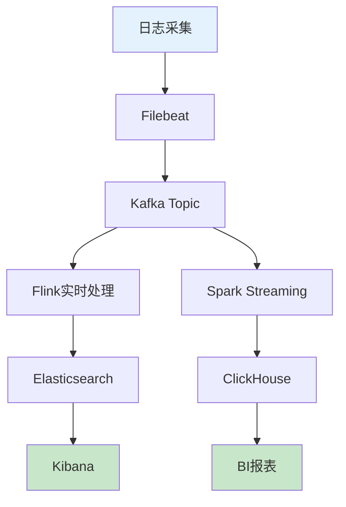
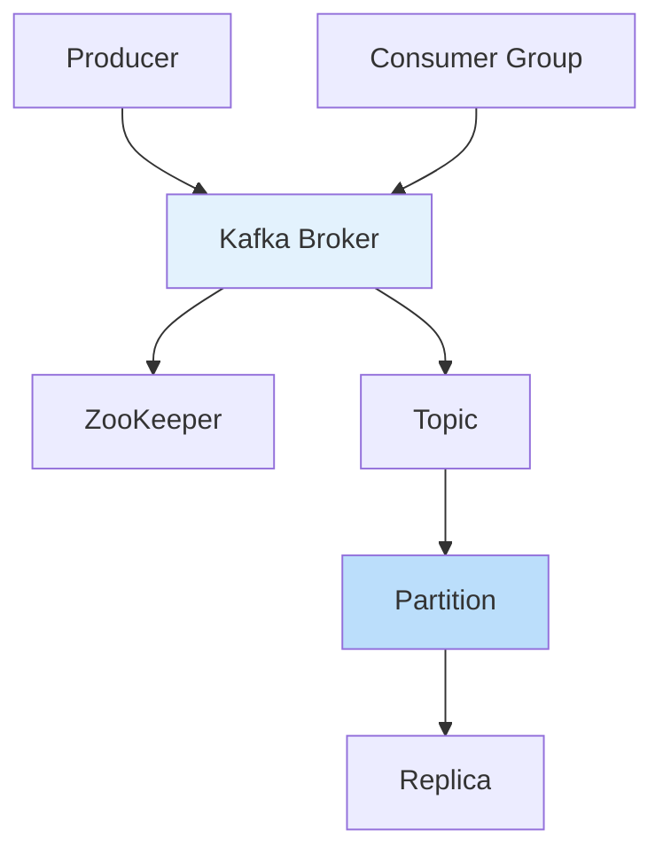
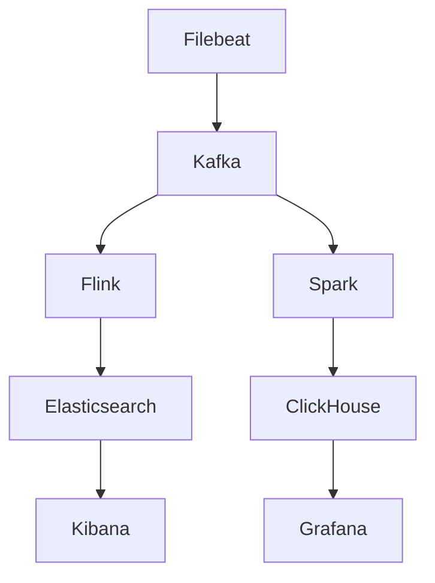

# Kafka在分布式系统中的设计与实践：从架构到最佳实践

## 情境与背景

Kafka作为分布式消息队列的核心组件，广泛应用于日志收集、实时数据处理、事件驱动架构等场景。作为高级DevOps/SRE工程师，深入理解Kafka的设计原理和生产实践是必备技能。

## 一、系统架构设计

### 1.1 典型架构图

**日志收集与实时处理系统**：



### 1.2 系统组件说明

**组件职责**：

```yaml
system_components:
  data_collection:
    - name: "Filebeat"
      description: "轻量级日志采集"
      role: "边缘采集"
      
    - name: "Logstash"
      description: "日志处理管道"
      role: "数据转换"
      
  message_queue:
    - name: "Kafka"
      description: "分布式消息队列"
      role: "消息缓冲、解耦"
      
  stream_processing:
    - name: "Apache Flink"
      description: "实时流处理"
      role: "复杂事件处理"
      
    - name: "Apache Spark"
      description: "批流一体处理"
      role: "大数据分析"
      
  storage:
    - name: "Elasticsearch"
      description: "全文搜索"
      role: "日志检索"
      
    - name: "ClickHouse"
      description: "列式数据库"
      role: "OLAP分析"
```

## 二、Kafka核心设计

### 2.1 Kafka架构

**Kafka组件架构**：



### 2.2 Topic设计

**Topic最佳实践**：

```yaml
topic_design:
  naming_convention:
    - "业务域-数据类型-用途"
    - "示例：user-action-log"
    
  partition_count:
    calculation: "吞吐量 / 单分区吞吐量"
    recommendation: "100-1000个分区"
    
  replication_factor:
    production: 3
    development: 2
    
  retention_policy:
    time_based: "7-30天"
    size_based: "按磁盘容量"
    
  cleanup_policy:
    delete: "默认，删除过期消息"
    compact: "保留最新消息"
```

### 2.3 Partition策略

**分区设计原则**：

```yaml
partition_strategy:
  key_based:
    description: "按业务键分区"
    advantage: "保证消息顺序"
    example: "user_id作为key"
    
  round_robin:
    description: "轮询分区"
    advantage: "均匀分布"
    disadvantage: "无法保证顺序"
    
  custom_partitioner:
    description: "自定义分区器"
    use_case: "复杂业务场景"
    
  considerations:
    - "分区键的选择影响数据分布"
    - "避免热点分区"
    - "分区数设置后不易修改"
```

## 三、Kafka生产环境配置

### 3.1 Broker配置

**关键配置**：

```yaml
broker_config:
  listeners:
    plaintext: "PLAINTEXT://:9092"
    ssl: "SSL://:9093"
    
  advertised_listeners:
    description: "外部访问地址"
    
  num_partitions:
    description: "默认分区数"
    default: 1
    
  default_replication_factor:
    description: "默认副本数"
    default: 1
    production: 3
    
  min_insync_replicas:
    description: "最小同步副本数"
    production: 2
    
  unclean_leader_election:
    description: "是否允许非同步副本成为leader"
    production: false
    
  log_retention_ms:
    description: "消息保留时间"
    production: "604800000" # 7天
    
  log_segment_bytes:
    description: "段文件大小"
    default: "1GB"
```

### 3.2 Producer配置

**Producer关键配置**：

```yaml
producer_config:
  acks:
    description: "确认级别"
    options:
      - "0: 不等待确认"
      - "1: 等待leader确认"
      - "all: 等待所有副本确认"
    production: "all"
    
  retries:
    description: "重试次数"
    production: 3
    
  retry_backoff_ms:
    description: "重试间隔"
    default: 100
    
  compression_type:
    description: "压缩方式"
    options: ["none", "gzip", "snappy", "lz4", "zstd"]
    recommendation: "snappy"
    
  batch_size:
    description: "批处理大小"
    default: 16384
    
  linger_ms:
    description: "等待时间"
    default: 0
    
  buffer_memory:
    description: "缓冲区大小"
    default: 33554432
```

### 3.3 Consumer配置

**Consumer关键配置**：

```yaml
consumer_config:
  group_id:
    description: "消费者组ID"
    requirement: "必须设置"
    
  auto_offset_reset:
    description: "offset重置策略"
    options:
      - "latest: 从最新消息开始"
      - "earliest: 从最早消息开始"
      - "none: 无offset时报错"
    production: "latest"
    
  enable_auto_commit:
    description: "自动提交offset"
    production: false
    
  auto_commit_interval_ms:
    description: "自动提交间隔"
    default: 5000
    
  fetch_min_bytes:
    description: "最小拉取字节数"
    default: 1
    
  fetch_max_wait_ms:
    description: "最大等待时间"
    default: 500
    
  max_poll_records:
    description: "单次拉取记录数"
    default: 500
    
  session_timeout_ms:
    description: "会话超时时间"
    default: 30000
    
  heartbeat_interval_ms:
    description: "心跳间隔"
    default: 3000
```

## 四、消息语义保证

### 4.1 消息语义级别

**三种消息语义**：

```yaml
message_semantics:
  at_most_once:
    description: "最多一次"
    behavior: "消息可能丢失"
    use_case: "非关键数据"
    
  at_least_once:
    description: "至少一次"
    behavior: "消息可能重复"
    use_case: "大多数业务场景"
    
  exactly_once:
    description: "恰好一次"
    behavior: "消息不丢失不重复"
    use_case: "金融交易"
```

### 4.2 Exactly-Once实现

**Exactly-Once配置**：

```yaml
exactly_once:
  producer:
    enable_idempotence: true
    acks: "all"
    
  transactional:
    transactional_id: "producer-transaction-id"
    transaction_timeout_ms: 60000
    
  consumer:
    isolation_level: "read_committed"
    
  processing_guarantees:
    - "使用幂等性生产者"
    - "使用事务"
    - "消费者手动提交offset"
    - "处理逻辑需幂等"
```

## 五、监控与运维

### 5.1 关键监控指标

**Kafka监控指标**：

```yaml
monitoring_metrics:
  broker:
    - "kafka.server:type=BrokerTopicMetrics,name=MessagesInPerSec"
    - "kafka.server:type=BrokerTopicMetrics,name=BytesInPerSec"
    - "kafka.server:type=BrokerTopicMetrics,name=BytesOutPerSec"
    - "kafka.controller:type=ControllerStats,name=ActiveControllerCount"
    - "kafka.server:type=ReplicaManager,name=UnderReplicatedPartitions"
    - "kafka.server:type=ReplicaManager,name=IsrShrinksPerSec"
    
  producer:
    - "record-send-rate"
    - "record-error-rate"
    - "batch-size-avg"
    - "compression-rate-avg"
    
  consumer:
    - "records-consumed-rate"
    - "fetch-rate"
    - "consumer-lag"
    - "commit-rate"
```

### 5.2 告警规则

**告警配置**：

```yaml
alert_rules:
  under_replicated_partitions:
    condition: "value > 0"
    severity: "critical"
    
  isr_shrinks:
    condition: "rate > 0"
    severity: "warning"
    
  consumer_lag:
    condition: "value > 10000"
    severity: "critical"
    
  broker_unavailable:
    condition: "count < expected"
    severity: "critical"
    
  disk_usage:
    condition: "usage > 80%"
    severity: "warning"
```

### 5.3 运维最佳实践

**运维清单**：

```yaml
operations_best_practices:
  deployment:
    - "使用奇数个broker"
    - "跨机架部署"
    - "避免单点故障"
    
  scaling:
    - "水平扩展broker"
    - "增加分区数"
    - "监控分区分布"
    
  backup:
    - "定期备份ZooKeeper数据"
    - "备份topic数据目录"
    - "测试恢复流程"
    
  upgrade:
    - "滚动升级"
    - "先升级broker再升级client"
    - "测试环境验证"
```

## 六、常见问题与解决方案

### 6.1 消息丢失

**问题与解决方案**：

```markdown
## 问题1：消息丢失

**现象**：
- 生产者发送消息后，消费者无法收到
- 消息未持久化到磁盘

**原因分析**：
- acks配置不当
- 副本同步问题
- 磁盘IO问题

**解决方案**：
```yaml
# 配置生产者
acks: all
retries: 3

# 配置broker
min.insync.replicas: 2
unclean.leader.election.enable: false
```

**预防措施**：
- 使用acks=all
- 配置足够的副本数
- 监控ISR状态
```

### 6.2 消息重复

**问题与解决方案**：

```markdown
## 问题2：消息重复

**现象**：
- 消费者收到重复消息
- 业务数据出现重复

**原因分析**：
- 生产者重试
- 消费者offset提交失败
- 网络分区

**解决方案**：
```yaml
# 配置消费者
enable.auto.commit: false

# 业务层面去重
- "使用消息ID去重"
- "实现幂等操作"
- "使用数据库唯一约束"
```

**预防措施**：
- 实现幂等性
- 使用事务
- 消息去重机制
```

### 6.3 消费者滞后

**问题与解决方案**：

```markdown
## 问题3：消费者滞后

**现象**：
- consumer lag持续增长
- 消息处理不及时

**原因分析**：
- 消费者处理速度慢
- 分区数不足
- 资源限制

**解决方案**：
```yaml
# 增加消费者数量
consumer_count: "等于分区数"

# 优化处理逻辑
- "批量处理"
- "异步处理"
- "增加资源"
```

**预防措施**：
- 设置合理的分区数
- 监控consumer lag
- 自动扩缩容
```

## 七、实战案例

### 7.1 案例：日志收集系统

**案例描述**：

```markdown
## 案例1：日志收集系统

**需求**：
- 收集1000+台服务器的日志
- 日均日志量10TB+
- 实时查询延迟<1分钟

**架构设计**：


**Kafka配置**：
```yaml
topic: "server-logs"
partitions: 100
replication_factor: 3
retention_ms: "604800000" # 7天
```

**效果**：
- 吞吐量：100MB/s+
- 查询延迟：<30秒
- 可用性：99.99%
```

### 7.2 案例：实时数据处理

**案例描述**：

```markdown
## 案例2：实时数据处理

**需求**：
- 实时计算用户行为指标
- 分钟级更新dashboard
- 支持Exactly-Once语义

**架构设计**：
```yaml
processing_pipeline:
  source: "Kafka topic"
  processing: "Apache Flink"
  sink:
    - "Redis"
    - "PostgreSQL"
    - "Kafka output topic"
```

**Flink配置**：
```yaml
execution_mode: "streaming"
checkpoint_interval: "1分钟"
state_backend: "RocksDB"
exactly_once: true
```

**效果**：
- 处理延迟：<1分钟
- 数据准确性：100%
- 支持故障恢复
```

## 八、面试1分钟精简版（直接背）

**完整版**：

以日志收集系统为例，架构包含：数据采集层（Filebeat/Logstash）→ Kafka消息队列 → 实时处理层（Spark/Flink）→ 存储层（Elasticsearch/ClickHouse）。Kafka设计要点：多分区提高并行度，3副本保证高可用，acks=all确保数据不丢失，合理设置retention策略。关键考虑：消息顺序性、Exactly-Once语义、分区键设计、监控告警。

**30秒超短版**：

日志采集→Kafka→实时处理→存储；Kafka配置：3副本、多分区、acks=all、合理retention；关注消息顺序、语义保证、监控告警。

## 九、总结

### 9.1 Kafka设计要点

```yaml
kafka_design_principles:
  scalability:
    - "分区机制"
    - "水平扩展"
    
  availability:
    - "多副本"
    - "故障自动转移"
    
  reliability:
    - "持久化"
    - "副本同步"
    - "ISR机制"
    
  performance:
    - "批量处理"
    - "零拷贝"
    - "顺序读写"
```

### 9.2 最佳实践清单

```yaml
best_practices:
  topic_design:
    - "合理设置分区数"
    - "使用3副本"
    - "设置合适的retention"
    
  producer:
    - "使用acks=all"
    - "启用重试"
    - "使用压缩"
    
  consumer:
    - "手动提交offset"
    - "消费者数量等于分区数"
    - "处理逻辑幂等"
    
  monitoring:
    - "监控broker状态"
    - "监控consumer lag"
    - "设置告警规则"
```

### 9.3 记忆口诀

```
Kafka设计有讲究，分区副本不可少，
acks=all保可靠，ISR同步不能掉，
生产者要重试，消费者要幂等，
监控告警要到位，生产环境才稳定。
```

> **参考链接**：[SRE运维面试题全解析：从理论到实践（第二部分）]()