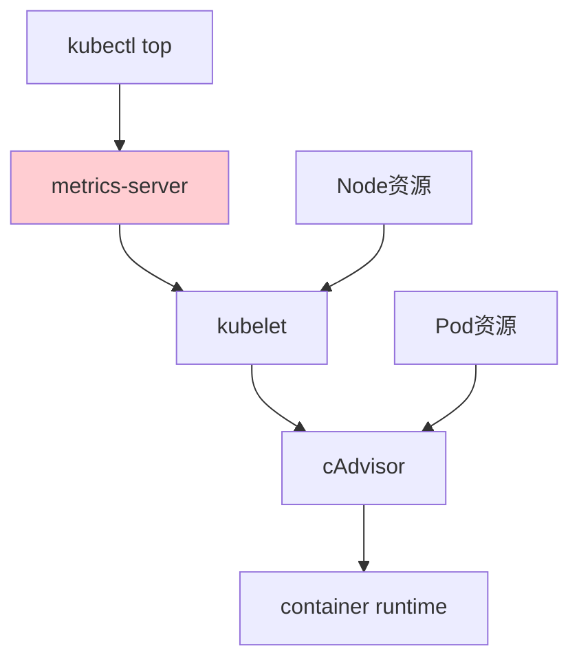
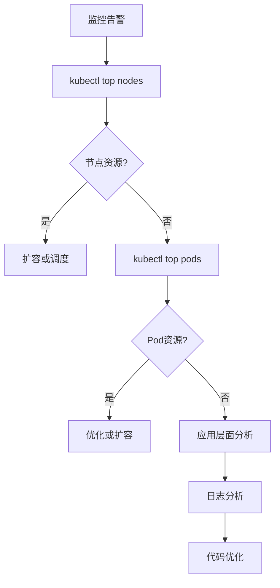

# kubectl top排查流程：Kubernetes资源监控与性能分析指南

## 情境与背景

kubectl top是Kubernetes中用于查看资源使用情况的命令，是SRE日常排查性能问题的利器。本指南详细讲解kubectl top的工作原理、使用方法、排查流程以及生产环境监控最佳实践。

## 一、kubectl top概述

### 1.1 kubectl top工作原理

**工作原理**：

```markdown
## kubectl top概述

### 工作原理

**架构图**：



**组件依赖**：

```yaml
kubectl_top_components:
  metrics-server:
    description: "核心指标收集组件"
    function: "聚合资源指标数据"
    port: 443
    
  kubelet:
    description: "节点代理"
    function: "暴露节点和Pod指标"
    port: 10250
    
  cAdvisor:
    description: "容器指标收集器"
    function: "收集容器级别指标"
```

### 1.2 安装metrics-server

**metrics-server安装**：

```markdown
### metrics-server安装

**Helm安装**：

```bash
helm repo add metrics-server https://kubernetes-sigs.github.io/metrics-server
helm repo update

helm install metrics-server metrics-server/metrics-server \
  --namespace kube-system \
  --set args[0]="--kubelet-insecure-tls=true" \
  --set args[1]="--kubelet-preferred-address-types=InternalIP"
```

**YAML安装**：

```yaml
apiVersion: rbac.authorization.k8s.io/v1
kind: ClusterRole
metadata:
  name: system:metrics-server
rules:
- apiGroups:
  - ""
  resources:
  - pods
  - nodes
  verbs:
  - get
  - list
  - watch
---
apiVersion: apps/v1
kind: Deployment
metadata:
  name: metrics-server
  namespace: kube-system
spec:
  selector:
    matchLabels:
      k8s-app: metrics-server
  template:
    metadata:
      labels:
        k8s-app: metrics-server
    spec:
      containers:
      - name: metrics-server
        image: registry.k8s.io/metrics-server/metrics-server:v0.7.0
        args:
        - --kubelet-insecure-tls=true
        - --kubelet-preferred-address-types=InternalIP
```

**验证安装**：

```bash
# 检查metrics-server状态
kubectl get pods -n kube-system -l k8s-app=metrics-server

# 测试kubectl top
kubectl top nodes
kubectl top pods -n kube-system
```
```

## 二、kubectl top使用方法

### 2.1 查看节点资源

**kubectl top node**：

```markdown
## kubectl top使用方法

### 查看节点资源

**基本用法**：

```bash
# 查看所有节点资源使用
kubectl top nodes

# 查看特定节点
kubectl top node node-name

# 显示资源请求和限制
kubectl top node --containers
```

**输出示例**：

```bash
NAME          CPU(cores)   CPU%   MEMORY(bytes)   MEMORY%
node-1        1500m        75%    4096Mi          60%
node-2        800m         40%    2048Mi          30%
node-3        2000m        100%   8192Mi          95%
```

**按资源排序**：

```bash
# 按CPU使用率排序
kubectl top nodes --sort-by=cpu

# 按内存使用率排序
kubectl top nodes --sort-by=memory
```
```

### 2.2 查看Pod资源

**kubectl top pod**：

```markdown
### 查看Pod资源

**基本用法**：

```bash
# 查看默认命名空间的Pod
kubectl top pods

# 查看特定命名空间
kubectl top pods -n namespace

# 查看所有命名空间
kubectl top pods --all-namespaces

# 查看包含特定标签的Pod
kubectl top pods -n namespace -l app=myapp
```

**输出示例**：

```bash
NAMESPACE   NAME          CPU(cores)   MEMORY(bytes)
default     app-1         100m         256Mi
default     app-2         200m         512Mi
kube-system metrics       50m          100Mi
```

**排序和过滤**：

```bash
# 按CPU排序
kubectl top pods -n namespace --sort-by=cpu

# 按内存排序
kubectl top pods -n namespace --sort-by=memory

# 显示资源请求和限制
kubectl top pods -n namespace --containers
```
```

### 2.3 查看容器资源

**kubectl top pod --containers**：

```markdown
### 查看容器资源

**容器级别查看**：

```bash
# 查看Pod内各容器资源
kubectl top pods -n namespace --containers

# 输出示例
POD          NAME          CPU(cores)   MEMORY(bytes)
app-pod      app           100m         256Mi
app-pod      sidecar       20m          64Mi
```

**配合describe使用**：

```bash
# 查看Pod详情
kubectl describe pod app-pod -n namespace

# 查看Pod内容器
kubectl get pod app-pod -n namespace -o jsonpath='{.spec.containers[*].name}'
```
```

## 三、排查流程

### 3.1 节点层面排查

**节点排查流程**：

```markdown
## 排查流程

### 节点层面排查

**排查步骤**：

```bash
# 1. 查看所有节点资源使用
kubectl top nodes

# 2. 查看节点详情
kubectl describe node node-name

# 3. 查看节点上运行的Pod
kubectl get pods -o wide --field-selector spec.nodeName=node-name

# 4. 查看节点资源分配情况
kubectl describe node node-name | grep -A 10 "Allocated resources"
```

**节点资源分配表**：

```bash
# 查看节点资源分配详情
kubectl describe node node-name | grep -A 5 "Capacity"
kubectl describe node node-name | grep -A 5 "Allocated"
```

**节点压力判断**：

```yaml
node_pressure_indicators:
  cpu_high:
    threshold: "> 80%"
    action: "需要扩容或优化"
    
  memory_high:
    threshold: "> 85%"
    action: "需要扩容或优化"
    
  pods_many:
    threshold: "> 100 Pods/节点"
    action: "考虑增加节点"
```
```

### 3.2 Pod层面排查

**Pod排查流程**：

```markdown
### Pod层面排查

**排查步骤**：

```bash
# 1. 查看命名空间Pod资源使用
kubectl top pods -n namespace

# 2. 按CPU排序找出异常Pod
kubectl top pods -n namespace --sort-by=cpu

# 3. 按内存排序找出异常Pod
kubectl top pods -n namespace --sort-by=memory

# 4. 查看特定Pod详情
kubectl describe pod pod-name -n namespace

# 5. 查看Pod日志
kubectl logs pod-name -n namespace --previous
```

**异常Pod识别**：

```bash
# CPU使用过高的Pod
kubectl top pods -n namespace --sort-by=cpu | head -5

# 内存使用过高的Pod
kubectl top pods -n namespace --sort-by=memory | head -5
```
```

### 3.3 容器层面排查

**容器排查流程**：

```markdown
### 容器层面排查

**排查步骤**：

```bash
# 1. 查看Pod内各容器资源使用
kubectl top pods -n namespace --containers

# 2. 查看容器日志
kubectl logs pod-name -n namespace -c container-name

# 3. 进入容器调试
kubectl exec -it pod-name -n namespace -c container-name -- /bin/sh

# 4. 查看容器资源限制
kubectl get pod pod-name -n namespace -o jsonpath='{.spec.containers[*].resources}'
```

**资源限制检查**：

```bash
# 查看Pod资源配置
kubectl get pod pod-name -n namespace -o yaml | grep -A 10 "resources:"
```
```

## 四、性能分析实践

### 4.1 资源热点分析

**资源热点分析**：

```markdown
## 性能分析实践

### 资源热点分析

**CPU热点分析**：

```bash
# 找出CPU使用最高的Pod
kubectl top pods -n namespace --sort-by=cpu

# 查看Pod内容器CPU使用
kubectl top pods -n namespace --containers --sort-by=cpu

# 查看节点的CPU使用分布
kubectl top node --sort-by=cpu
```

**内存热点分析**：

```bash
# 找出内存使用最高的Pod
kubectl top pods -n namespace --sort-by=memory

# 查看Pod内容器内存使用
kubectl top pods -n namespace --containers --sort-by=memory
```

**热点分析报告**：

```yaml
# CPU热点分析
cpu_hotspot_analysis:
  step_1: "kubectl top nodes --sort-by=cpu"
  step_2: "找出CPU>80%的节点"
  step_3: "kubectl top pods --node=node-name"
  step_4: "找出该节点上CPU使用高的Pod"
  step_5: "kubectl describe pod分析原因"
```
```

### 4.2 资源使用趋势

**趋势分析方法**：

```markdown
### 资源使用趋势

**Prometheus查询**：

```promql
# Pod CPU使用趋势
rate(container_cpu_usage_seconds_total{pod=~".*",namespace="default"}[5m])

# Pod内存使用趋势
container_memory_working_set_bytes{pod=~".*",namespace="default"}

# 节点CPU使用趋势
rate(node_cpu_seconds_total[5m])
```

**Grafana Dashboard**：

```yaml
# 推荐Dashboard
dashboards:
  - name: "Kubernetes Node Overview"
    uid: "k8s-node-overview"
    
  - name: "Kubernetes Pod Overview"
    uid: "k8s-pod-overview"
    
  - name: "Kubernetes Cluster Overview"
    uid: "k8s-cluster-overview"
```
```

### 4.3 瓶颈定位

**瓶颈定位方法**：

```markdown
### 瓶颈定位

**瓶颈定位流程**：



**瓶颈定位检查清单**：

```yaml
bottleneck_checklist:
  node_level:
    - "节点CPU使用率"
    - "节点内存使用率"
    - "节点Pod数量"
    - "节点网络带宽"
    
  pod_level:
    - "Pod CPU使用率"
    - "Pod内存使用率"
    - "Pod临时存储"
    - "Pod网络带宽"
    
  application_level:
    - "应用日志"
    - "应用性能"
    - "数据库连接"
    - "外部依赖"
```
```

## 五、生产环境最佳实践

### 5.1 监控架构

**监控架构设计**：

```markdown
## 生产环境最佳实践

### 监控架构设计

**多层次监控架构**：

```yaml
monitoring_architecture:
  level_1:
    name: "kubectl top"
    description: "快速查看资源使用"
    use_case: "日常巡检、快速排查"
    
  level_2:
    name: "Prometheus + Grafana"
    description: "全面指标采集和可视化"
    use_case: "历史数据分析、趋势预测"
    
  level_3:
    name: "Alertmanager"
    description: "告警通知"
    use_case: "异常告警、自动通知"
```

**Prometheus监控配置**：

```yaml
# Prometheus抓取metrics-server
- job_name: 'kubernetes-nodes'
  kubernetes_sd_configs:
  - role: node
  relabel_configs:
  - source_labels: [__address__]
    regex: '(.*):10250'
    replacement: '${1}:9100'
    target_label: __address__
```
```

### 5.2 告警配置

**告警规则配置**：

```yaml
# Prometheus告警规则
groups:
- name: resource-monitoring
  rules:
  - alert: NodeHighCPU
    expr: |
      (1 - rate(node_cpu_seconds_total{mode="idle"}[5m])) * 100 > 80
    for: 5m
    labels:
      severity: warning
    annotations:
      summary: "节点CPU使用率过高"
      description: "节点 {{ $labels.node }} CPU使用率为 {{ $value | humanize }}%"
      
  - alert: NodeHighMemory
    expr: |
      (1 - node_memory_MemAvailable_bytes / node_memory_MemTotal_bytes) * 100 > 85
    for: 5m
    labels:
      severity: warning
    annotations:
      summary: "节点内存使用率过高"
      description: "节点 {{ $labels.node }} 内存使用率为 {{ $value | humanize }}%"
      
  - alert: PodHighCPU
    expr: |
      rate(container_cpu_usage_seconds_total{container!=""}[5m]) * 100 > 80
    for: 5m
    labels:
      severity: warning
    annotations:
      summary: "Pod CPU使用率过高"
      
  - alert: PodHighMemory
    expr: |
      container_memory_working_set_bytes / container_spec_memory_limit_bytes * 100 > 90
    for: 5m
    labels:
      severity: warning
    annotations:
      summary: "Pod内存使用率过高"
```
```

### 5.3 自动化巡检

**自动化巡检脚本**：

```bash
#!/bin/bash
# resource-check.sh - Kubernetes资源巡检脚本

NAMESPACE=${1:-"default"}
CPU_THRESHOLD=${2:-80}
MEMORY_THRESHOLD=${3:-80}

echo "========== Kubernetes资源巡检 =========="
echo "命名空间: $NAMESPACE"
echo "CPU阈值: $CPU_THRESHOLD%"
echo "内存阈值: $MEMORY_THRESHOLD%"
echo ""

# 检查节点资源
echo "--- 节点资源检查 ---"
NODES=$(kubectl get nodes -o name)
for NODE in $NODES; do
    NODE_NAME=${NODE#node/}
    CPU=$(kubectl top node $NODE_NAME --no-headers 2>/dev/null | awk '{print $3}' | tr -d '%')
    MEMORY=$(kubectl top node $NODE_NAME --no-headers 2>/dev/null | awk '{print $5}' | tr -d '%')
    
    if [ ! -z "$CPU" ]; then
        if [ "$CPU" -gt "$CPU_THRESHOLD" ]; then
            echo "⚠️ $NODE_NAME CPU: ${CPU}% (超过阈值)"
        fi
        if [ "$MEMORY" -gt "$MEMORY_THRESHOLD" ]; then
            echo "⚠️ $NODE_NAME Memory: ${MEMORY}% (超过阈值)"
        fi
    fi
done

# 检查Pod资源
echo ""
echo "--- Pod资源检查 ---"
kubectl top pods -n $NAMESPACE --no-headers 2>/dev/null | sort -k3 -r -n | head -10 | while read line; do
    POD=$(echo $line | awk '{print $1}')
    CPU=$(echo $line | awk '{print $2}')
    MEMORY=$(echo $line | awk '{print $3}')
    echo "Top Pod: $POD CPU: $CPU Memory: $MEMORY"
done

echo ""
echo "========== 巡检完成 =========="
```
```

### 5.4 资源配额管理

**ResourceQuota配置**：

```yaml
# 命名空间资源配额
apiVersion: v1
kind: ResourceQuota
metadata:
  name: compute-resources
spec:
  hard:
    requests.cpu: "100"
    requests.memory: 200Gi
    limits.cpu: "200"
    limits.memory: 400Gi
    pods: "500"
---
# LimitRange配置
apiVersion: v1
kind: LimitRange
metadata:
  name: compute-resources
spec:
  limits:
  - max:
      cpu: "4"
      memory: 8Gi
    min:
      cpu: "50m"
      memory: 64Mi
    default:
      cpu: "500m"
      memory: 512Mi
    defaultRequest:
      cpu: "200m"
      memory: 256Mi
    type: Container
```

## 六、高级用法

### 6.1 结合其他命令

**组合使用**：

```bash
# 查看资源使用最高的Pod并显示标签
kubectl top pods -n namespace --sort-by=cpu | head -5 | while read line; do
    NAME=$(echo $line | awk '{print $1}')
    kubectl get pod $NAME -n namespace -o jsonpath='{.metadata.labels}' 2>/dev/null
done

# 查看Pod的资源使用和限制
kubectl top pods -n namespace --sort-by=memory | head -5 | while read line; do
    NAME=$(echo $line | awk '{print $1}')
    kubectl get pod $NAME -n namespace -o jsonpath='{.spec.containers[*].resources.limits}' 2>/dev/null
done

# 查看节点的资源和容量
kubectl top nodes && kubectl describe nodes | grep -A 5 "Capacity"
```
```

### 6.2 常见问题排查

**常见问题与解决**：

```yaml
kubectl_top_issues:
  no_metrics:
    symptom: "Error from server (NotFound)"
    cause: "metrics-server未安装或未运行"
    solution: "安装metrics-server"
    
  connection_refused:
    symptom: "connection refused"
    cause: "metrics-server端口问题"
    solution: "检查metrics-server状态"
    
  node_not_ready:
    symptom: "node not ready"
    cause: "节点状态异常"
    solution: "检查节点kubelet状态"
```

**问题排查命令**：

```bash
# 检查metrics-server状态
kubectl get pods -n kube-system -l k8s-app=metrics-server

# 查看metrics-server日志
kubectl logs -n kube-system -l k8s-app=metrics-server --tail=100

# 重启metrics-server
kubectl rollout restart deployment metrics-server -n kube-system
```

## 七、面试1分钟精简版（直接背）

**完整版**：

kubectl top排查流程：1. kubectl top node查看节点维度，找出资源使用率高的节点；2. kubectl top pod -n xxx查看Pod维度，按CPU或内存排序找出异常Pod；3. kubectl top pod -n xxx --containers查看容器级别；4. 结合kubectl describe定位具体原因。前提是部署metrics-server组件，如无输出需检查组件状态。生产环境建议配合Prometheus+Grafana做全面监控。

**30秒超短版**：

kubectl top排查：node看节点级，pod看应用级，containers看容器级别，配合describe定位原因，前提是metrics-server运行正常。

## 八、总结

### 8.1 排查流程总结

```yaml
troubleshooting_flow:
  step_1: "kubectl top nodes - 找出异常节点"
  step_2: "kubectl top pods - 找出异常Pod"
  step_3: "kubectl top pods --containers - 定位容器"
  step_4: "kubectl describe - 分析原因"
  step_5: "kubectl logs - 查看日志"
```

### 8.2 最佳实践清单

```yaml
best_practices:
  installation:
    - "部署metrics-server"
    - "配置监控告警"
    - "设置资源配额"
    
  daily:
    - "定期巡检"
    - "及时处理异常"
    - "记录分析报告"
    
  production:
    - "Prometheus全面监控"
    - "Grafana可视化"
    - "Alertmanager告警"
```

### 8.3 记忆口诀

```
kubectl top排查，node看节点级，
pod看应用级，containers看容器，
metrics-server是前提，
describe定位原因，logs查日志，
生产监控靠Prometheus，告警及时保稳定。
```

> **参考链接**：[SRE运维面试题全解析：从理论到实践（第二部分）]()