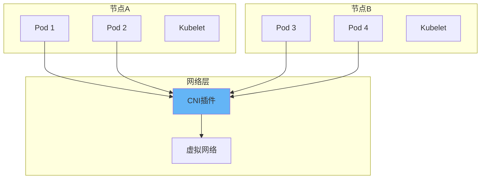

# Kubernetes网络插件详解：Calico/Flannel/Cilium特性对比与选型指南

## 情境与背景

Kubernetes网络插件是实现Pod间通信、Service发现和网络策略的核心组件。本指南详细讲解主流网络插件（Calico、Flannel、Cilium、Weave）的特性、架构、配置及生产环境最佳实践。

## 一、K8s网络模型概述

### 1.1 CNI标准

**CNI规范**：

```yaml
cni_standard:
  full_name: "Container Network Interface"
  
  requirements:
    - "Pod间互通"
    - "Pod与Service互通"
    - "节点间互通"
    - "网络隔离"
    
  components:
    - "CNI插件"
    - "IPAM插件"
    - "网络配置"
```

**网络模型**：



## 二、Calico

### 2.1 架构与特性

**Calico架构**：

```markdown
## Calico

### 架构与特性

```yaml
calico:
  full_name: "Project Calico"
  
  architecture:
    components:
      - "Felix（节点代理）"
      - "BIRD（BGP路由）"
      - "Typha（分布式存储）"
      - "Calicoctl（管理工具）"
      
  networking:
    modes:
      - "BGP"
      - "IPIP"
      - "VXLAN"
      - "Host-GW"
      
  features:
    - "NetworkPolicy"
    - "NetworkSet"
    - "服务质量(QoS)"
    - "可观测性"
```

**核心组件**：

```yaml
calico_components:
  felix:
    description: "节点代理"
    responsibility:
      - "路由管理"
      - "ACL配置"
      - "状态同步"
      
  bird:
    description: "BGP守护进程"
    responsibility:
      - "路由分发"
      - "BGP邻居管理"
      
  typha:
    description: "etcd代理"
    responsibility:
      - "减少etcd压力"
      - "缓存数据"
```

### 2.2 配置示例

**Calico部署**：

```bash
# 部署Calico
kubectl apply -f https://docs.projectcalico.org/manifests/calico.yaml

# 查看状态
kubectl get pods -n calico-system -w

# 配置BGP模式
cat > calico-config.yaml <<EOF
apiVersion: projectcalico.org/v3
kind: BGPConfiguration
metadata:
  name: default
spec:
  logSeverityScreen: Info
  nodeToNodeMeshEnabled: true
  asNumber: 64512
EOF

kubectl apply -f calico-config.yaml
```

## 三、Flannel

### 3.1 架构与特性

**Flannel架构**：

```yaml
flannel:
  full_name: "Flannel"
  
  architecture:
    components:
      - "flanneld（守护进程）"
      - "etcd（存储网络配置）"
      
  networking:
    modes:
      - "VXLAN"
      - "Host-GW"
      - "UDP"
      - "AWS VPC"
      
  features:
    - "简单轻量"
    - "高性能"
    - "易于部署"
    
  limitations:
    - "不支持NetworkPolicy"
    - "功能较少"
```

### 3.2 配置示例

**Flannel部署**：

```bash
# 部署Flannel
kubectl apply -f https://raw.githubusercontent.com/flannel-io/flannel/master/Documentation/kube-flannel.yml

# 查看状态
kubectl get pods -n kube-flannel -w

# 配置Host-GW模式
cat > kube-flannel-hostgw.yml <<EOF
apiVersion: v1
kind: ConfigMap
metadata:
  name: kube-flannel-cfg
  namespace: kube-flannel
data:
  net-conf.json: |
    {
      "Network": "10.244.0.0/16",
      "Backend": {
        "Type": "host-gw"
      }
    }
EOF

kubectl apply -f kube-flannel-hostgw.yml
```

## 四、Cilium

### 4.1 架构与特性

**Cilium架构**：

```markdown
## Cilium

### 架构与特性

```yaml
cilium:
  full_name: "Cilium"
  
  architecture:
    components:
      - "Cilium Agent（节点代理）"
      - "Cilium Operator（控制器）"
      - "Hubble（可观测性）"
      
  networking:
    technology: "eBPF"
    
  features:
    - "eBPF网络策略"
    - "透明加密"
    - "高级负载均衡"
    - "服务网格集成"
    - "全链路可观测性"
      
  performance:
    description: "高性能网络"
    benchmark: "低延迟、高吞吐"
```

**eBPF优势**：

```yaml
ebpf_advantages:
  performance:
    - "内核态处理"
    - "零拷贝"
    - "减少上下文切换"
    
  security:
    - "细粒度策略"
    - "运行时防护"
    - "流量可视化"
    
  flexibility:
    - "动态编程"
    - "无需修改内核"
    - "热更新"
```

### 4.2 配置示例

**Cilium部署**：

```bash
# 安装Cilium CLI
curl -L --remote-name-all https://github.com/cilium/cilium-cli/releases/latest/download/cilium-linux-amd64.tar.gz{,.sha256sum}
sha256sum --check cilium-linux-amd64.tar.gz.sha256sum
sudo tar xzvfC cilium-linux-amd64.tar.gz /usr/local/bin
rm cilium-linux-amd64.tar.gz{,.sha256sum}

# 部署Cilium
cilium install

# 启用Hubble
cilium hubble enable

# 查看状态
cilium status

# 配置网络策略
cat > cilium-network-policy.yaml <<EOF
apiVersion: cilium.io/v2
kind: CiliumNetworkPolicy
metadata:
  name: allow-http
spec:
  endpointSelector:
    matchLabels:
      app: nginx
  ingress:
    - fromEndpoints:
      - matchLabels:
          app: frontend
      toPorts:
      - ports:
        - port: "80"
          protocol: TCP
EOF

kubectl apply -f cilium-network-policy.yaml
```

## 五、Weave

### 5.1 架构与特性

**Weave架构**：

```yaml
weave:
  full_name: "Weave Net"
  
  architecture:
    components:
      - "weave-router（路由器）"
      - "weave-npc（网络策略）"
      
  networking:
    modes:
      - "VXLAN"
      
  features:
    - "自动配置"
    - "加密通信"
    - "NetworkPolicy支持"
    
  advantages:
    - "零配置部署"
    - "自动发现节点"
    - "内置DNS"
```

### 5.2 配置示例

**Weave部署**：

```bash
# 部署Weave
kubectl apply -f "https://cloud.weave.works/k8s/net?k8s-version=$(kubectl version | base64 | tr -d '\n')"

# 查看状态
kubectl get pods -n weave-net -w
```

## 六、插件对比与选型

### 6.1 详细对比

**对比分析**：

```markdown
## 插件对比与选型

### 详细对比

```yaml
plugin_comparison:
  calico:
    technology: "BGP/IPIP/VXLAN"
    network_policy: true
    performance: "中高"
    observability: "好"
    complexity: "中"
    use_case: "生产环境"
    
  flannel:
    technology: "VXLAN/Host-GW"
    network_policy: false
    performance: "高"
    observability: "一般"
    complexity: "低"
    use_case: "简单场景"
    
  cilium:
    technology: "eBPF"
    network_policy: true
    performance: "最高"
    observability: "优秀"
    complexity: "高"
    use_case: "高性能场景"
    
  weave:
    technology: "VXLAN"
    network_policy: true
    performance: "中"
    observability: "一般"
    complexity: "低"
    use_case: "快速部署"
```

### 6.2 选型建议

**选型策略**：

```yaml
selection_strategy:
  development:
    recommend: "Flannel"
    reason: "简单快速"
    
  production:
    recommend: "Calico"
    reason: "功能全面"
    
  high_performance:
    recommend: "Cilium"
    reason: "eBPF高性能"
    
  quick_start:
    recommend: "Weave"
    reason: "零配置"
    
  security_requirement:
    recommend: "Cilium/Calico"
    reason: "高级网络策略"
```

## 七、生产环境最佳实践

### 7.1 网络策略配置

**最佳实践**：

```markdown
## 生产环境最佳实践

### 网络策略配置

```yaml
network_policy_best_practices:
  default_deny:
    description: "默认拒绝所有流量"
    configuration: |
      apiVersion: networking.k8s.io/v1
      kind: NetworkPolicy
      metadata:
        name: default-deny
      spec:
        podSelector: {}
        policyTypes:
        - Ingress
        - Egress
        
  allow_specific:
    description: "允许特定流量"
    principle: "最小权限原则"
    
  namespace_isolation:
    description: "命名空间隔离"
    configuration: "NetworkPolicy per namespace"
```

### 7.2 性能优化

**优化策略**：

```yaml
performance_optimization:
  network_mode:
    recommendation: "Host-GW优先"
    reason: "减少封装开销"
    
  mtu_setting:
    recommendation: "调整MTU"
    value: "VXLAN建议1450"
    
  resource_limits:
    description: "配置资源限制"
    configuration:
      requests:
        cpu: "100m"
        memory: "256Mi"
      limits:
        cpu: "500m"
        memory: "512Mi"
```

### 7.3 监控与排障

**监控策略**：

```yaml
monitoring:
  metrics:
    - "Pod网络流量"
    - "网络策略命中"
    - "连接数"
    - "延迟"
    
  tools:
    - "Prometheus"
    - "Grafana"
    - "Hubble（Cilium）"
    - "Calicoctl"
    
  troubleshooting:
    commands:
      - "kubectl get pods -n <namespace>"
      - "kubectl logs <pod> -n <namespace>"
      - "ip route show"
      - "cni-check"
```

## 八、面试1分钟精简版（直接背）

**完整版**：

K8s主流网络插件特性：1. Calico：基于BGP/VXLAN，支持NetworkPolicy，功能全面，适合生产环境；2. Flannel：基于VXLAN，简单轻量，性能好，但不支持NetworkPolicy，适合开发环境；3. Cilium：基于eBPF，性能最优，支持高级网络策略和可观测性，适合高性能场景；4. Weave：基于VXLAN，零配置自动发现，适合快速部署。选型建议：开发环境用Flannel，生产环境用Calico，高性能安全需求用Cilium。

**30秒超短版**：

Calico功能全，Flannel速度快，Cilium性能高，Weave易部署，根据场景选插件。

## 九、总结

### 9.1 选型指南

```yaml
selection_guide:
  development_testing:
    plugin: "Flannel"
    reason: "简单快速"
    
  production_general:
    plugin: "Calico"
    reason: "功能全面"
    
  production_high_performance:
    plugin: "Cilium"
    reason: "eBPF优势"
    
  quick_proof_of_concept:
    plugin: "Weave"
    reason: "零配置"
```

### 9.2 最佳实践清单

```yaml
best_practices_checklist:
  network_policy:
    - "配置默认拒绝策略"
    - "最小权限原则"
    - "命名空间隔离"
    
  performance:
    - "选择合适的网络模式"
    - "优化MTU"
    - "配置资源限制"
    
  monitoring:
    - "监控网络流量"
    - "设置告警"
    - "定期健康检查"
```

### 9.3 记忆口诀

```
Calico功能全，适合生产环境，
Flannel速度快，简单又轻量，
Cilium性能高，eBPF是法宝，
Weave易部署，零配就上路。
```

> **参考链接**：[SRE运维面试题全解析：从理论到实践（第二部分）]()