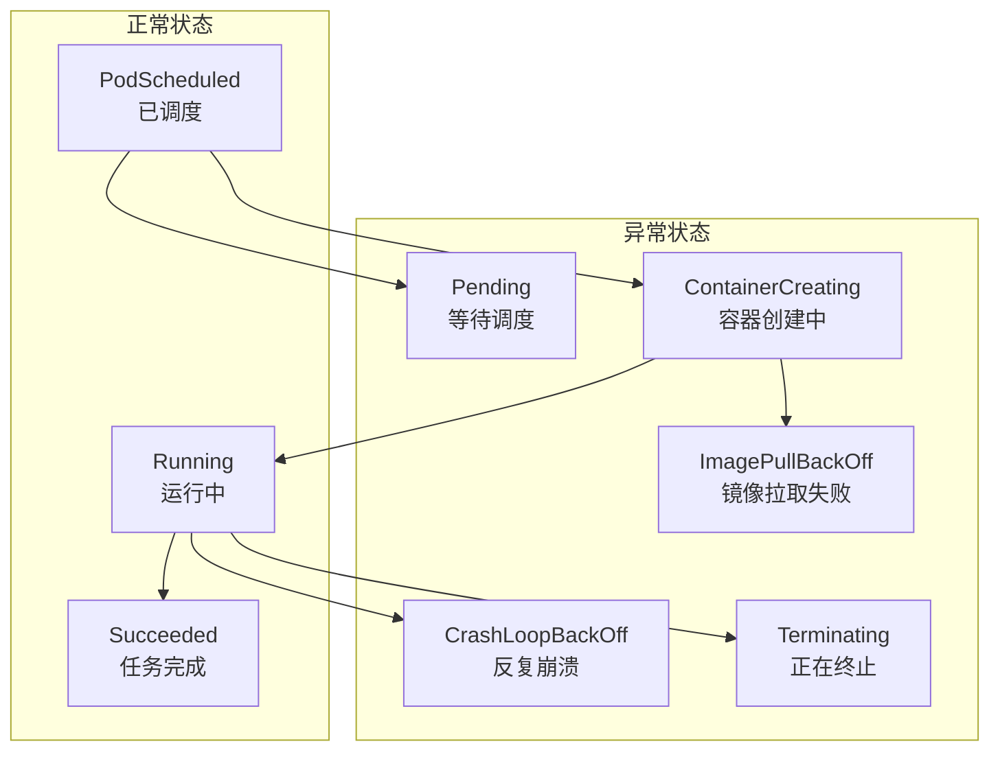
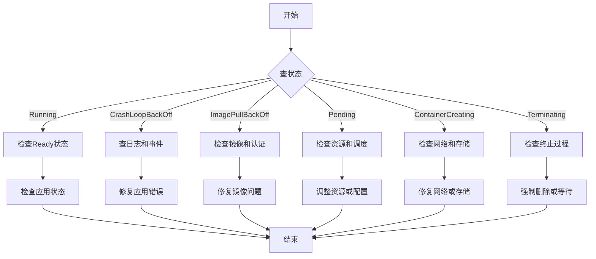

# Kubernetes Pod故障排查：从状态到解决方案

## 情境(Situation)

在Kubernetes集群中，Pod是最小的部署单元，Pod的状态反映了其生命周期中的不同阶段。作为SRE工程师，我们经常需要面对各种Pod状态异常的情况，如CrashLoopBackOff、ImagePullBackOff、Pending等。这些状态异常可能导致应用无法正常运行，影响业务服务的可用性。

如何快速识别和解决Pod状态异常，是SRE工程师的核心技能之一。本文将从Pod状态分析入手，提供一套完整的故障排查方法论和最佳实践。

## 冲突(Conflict)

在实际运维中，SRE工程师经常面临以下挑战：

- **状态识别困难**：对Pod状态含义理解不深入，难以快速定位问题
- **排查方法不当**：缺乏系统的排查流程，导致问题定位缓慢
- **解决方案不全面**：只解决表面问题，没有从根本上解决问题
- **监控告警不足**：缺乏对Pod状态的有效监控和告警机制
- **经验积累不足**：没有建立故障知识库，重复解决相同问题

## 问题(Question)

如何系统地排查和解决Kubernetes Pod的各种状态异常？

## 答案(Answer)

本文将从SRE视角出发，详细介绍Kubernetes Pod的状态分析、排查方法和最佳实践，提供一套完整的Pod故障排查体系。核心方法论基于 [SRE面试题解析：pod的各种状态出现的原因是啥？](#64-pod的各种状态出现的原因是啥)。

---

## 一、Pod状态全景图

### 1.1 状态分类

**Pod状态分类**：



### 1.2 状态速查表

**Pod状态速查表**：

| 状态 | 含义 | 严重程度 | 首要排查方向 |
|:------|:------|:------|:------|
| **Running** | 容器运行中 | ✅ 正常 | 检查Ready状态 |
| **Succeeded** | 任务完成 | ✅ 正常 | 一次性任务完成 |
| **Pending** | 等待调度 | ⚠️ 注意 | 资源/调度器 |
| **ContainerCreating** | 容器创建中 | ⚠️ 注意 | 网络/存储 |
| **CrashLoopBackOff** | 重启循环 | 🔴 严重 | 应用日志 |
| **ImagePullBackOff** | 镜像拉取失败 | 🔴 严重 | 镜像配置 |
| **Terminating** | 正在终止 | ⚠️ 注意 | 等待或强制删除 |

---

## 二、常见状态分析

### 2.1 CrashLoopBackOff

**状态含义**：Pod反复崩溃并重启，进入退避期。

**常见原因**：
- 应用启动失败
- 配置文件错误
- 健康检查失败
- 资源限制过低
- 依赖服务不可用
- 代码错误

**排查方法**：
1. 查看容器日志：`kubectl logs <pod-name>`
2. 查看崩溃前日志：`kubectl logs <pod-name> --previous`
3. 查看Pod事件：`kubectl describe pod <pod-name>`
4. 检查资源限制：`kubectl get pod <pod-name> -o yaml`
5. 检查健康检查配置：`kubectl get pod <pod-name> -o yaml | grep -A 20 readinessProbe`

**解决方案**：
- 修复应用代码错误
- 修正配置文件
- 调整健康检查参数
- 增加资源限制
- 确保依赖服务可用
- 检查环境变量配置

**示例**：

```bash
# 查看崩溃前日志
kubectl logs myapp-5d6757c8d4-8x7z9 --previous

# 查看Pod事件
kubectl describe pod myapp-5d6757c8d4-8x7z9

# 检查资源限制
kubectl get pod myapp-5d6757c8d4-8x7z9 -o yaml | grep -A 10 resources
```

### 2.2 ImagePullBackOff

**状态含义**：Pod无法拉取容器镜像，进入退避期。

**常见原因**：
- 镜像名称或标签错误
- 私有仓库认证失败
- 网络连接问题
- 镜像仓库不可用
- 镜像不存在
- 镜像拉取超时

**排查方法**：
1. 检查镜像名称和标签：`kubectl get pod <pod-name> -o yaml | grep image`
2. 检查镜像仓库认证：`kubectl get secret`
3. 测试镜像拉取：`docker pull <image>`
4. 检查网络连接：`kubectl exec <pod-name> -- ping -c 4 docker.io`
5. 查看Pod事件：`kubectl describe pod <pod-name>`

**解决方案**：
- 修正镜像名称和标签
- 创建或更新镜像仓库Secret
- 检查网络连接和DNS配置
- 确保镜像仓库可用
- 增加镜像拉取超时时间
- 使用本地镜像或私有镜像仓库

**示例**：

```bash
# 检查镜像配置
kubectl get pod myapp-5d6757c8d4-8x7z9 -o yaml | grep image

# 检查镜像仓库Secret
kubectl get secret

# 测试镜像拉取
docker pull myapp:latest

# 查看Pod事件
kubectl describe pod myapp-5d6757c8d4-8x7z9
```

### 2.3 Pending

**状态含义**：Pod等待调度，无法分配到节点。

**常见原因**：
- 集群资源不足
- 节点选择器不匹配
- 污点和容忍度设置
- 存储卷无法挂载
- 节点亲和性/反亲和性规则
- Pod优先级和抢占

**排查方法**：
1. 检查集群资源：`kubectl describe node`
2. 检查Pod资源请求：`kubectl get pod <pod-name> -o yaml | grep -A 10 resources`
3. 检查节点选择器：`kubectl get pod <pod-name> -o yaml | grep -A 10 nodeSelector`
4. 检查污点和容忍度：`kubectl get node <node-name> -o yaml | grep -A 10 taints`
5. 查看调度器事件：`kubectl describe pod <pod-name>`

**解决方案**：
- 增加集群资源（添加节点或调整资源限制）
- 修正节点选择器配置
- 调整污点和容忍度设置
- 确保存储卷可用
- 修改节点亲和性规则
- 调整Pod优先级

**示例**：

```bash
# 检查集群资源
kubectl describe node

# 检查Pod资源请求
kubectl get pod myapp-5d6757c8d4-8x7z9 -o yaml | grep -A 10 resources

# 检查节点选择器
kubectl get pod myapp-5d6757c8d4-8x7z9 -o yaml | grep -A 10 nodeSelector

# 查看调度器事件
kubectl describe pod myapp-5d6757c8d4-8x7z9
```

### 2.4 ContainerCreating

**状态含义**：Pod正在创建容器，但遇到问题。

**常见原因**：
- 网络配置错误
- 存储卷挂载失败
- 容器运行时问题
- CNI插件故障
- 安全上下文配置错误
- 镜像拉取延迟

**排查方法**：
1. 查看Pod事件：`kubectl describe pod <pod-name>`
2. 检查网络配置：`kubectl get pod <pod-name> -o yaml | grep -A 10 network`
3. 检查存储卷配置：`kubectl get pod <pod-name> -o yaml | grep -A 10 volume`
4. 检查容器运行时状态：`systemctl status containerd`
5. 检查CNI插件状态：`kubectl get pods -n kube-system | grep cni`

**解决方案**：
- 修正网络配置
- 确保存储卷可用
- 重启容器运行时
- 检查CNI插件配置
- 修正安全上下文配置
- 增加容器创建超时时间

**示例**：

```bash
# 查看Pod事件
kubectl describe pod myapp-5d6757c8d4-8x7z9

# 检查网络配置
kubectl get pod myapp-5d6757c8d4-8x7z9 -o yaml | grep -A 10 network

# 检查存储卷配置
kubectl get pod myapp-5d6757c8d4-8x7z9 -o yaml | grep -A 10 volume

# 检查容器运行时状态
systemctl status containerd
```

### 2.5 Terminating

**状态含义**：Pod正在终止，但无法完成。

**常见原因**：
- 应用无法优雅退出
- 终止超时
- 资源回收失败
- 网络连接问题
- 容器卡住

**排查方法**：
1. 查看Pod事件：`kubectl describe pod <pod-name>`
2. 检查应用退出行为：`kubectl logs <pod-name>`
3. 检查终止超时设置：`kubectl get pod <pod-name> -o yaml | grep terminationGracePeriodSeconds`
4. 强制删除Pod：`kubectl delete pod <pod-name> --grace-period=0 --force`

**解决方案**：
- 确保应用实现优雅退出
- 调整终止超时时间
- 检查资源回收机制
- 网络问题排查
- 强制删除卡住的Pod

**示例**：

```bash
# 查看Pod事件
kubectl describe pod myapp-5d6757c8d4-8x7z9

# 检查终止超时设置
kubectl get pod myapp-5d6757c8d4-8x7z9 -o yaml | grep terminationGracePeriodSeconds

# 强制删除Pod
kubectl delete pod myapp-5d6757c8d4-8x7z9 --grace-period=0 --force
```

---

## 三、故障排查方法论

### 3.1 三步排查法

**三步排查法**：

1. **查状态**：使用`kubectl get pods`查看Pod状态
2. **查事件**：使用`kubectl describe pod`查看详细事件
3. **查日志**：使用`kubectl logs`查看容器日志

**排查流程图**：



### 3.2 高级排查工具

**高级排查工具**：

| 工具 | 用途 | 命令示例 |
|:------|:------|:------|
| **kubectl-debug** | 调试运行中的Pod | `kubectl debug <pod-name> -it --image=busybox` |
| **stern** | 多容器日志聚合 | `stern <pod-name>` |
| **kubectl top** | 查看资源使用情况 | `kubectl top pod <pod-name>` |
| **ephemeral containers** | 临时容器调试 | `kubectl alpha debug <pod-name> --image=busybox -it` |
| **k9s** | 交互式集群管理 | `k9s` |
| **lens** | 图形化集群管理 | 启动Lens应用 |

**示例**：

```bash
# 使用kubectl-debug调试Pod
kubectl debug myapp-5d6757c8d4-8x7z9 -it --image=busybox

# 使用stern查看多容器日志
stern myapp

# 查看Pod资源使用情况
kubectl top pod myapp-5d6757c8d4-8x7z9

# 使用ephemeral containers
kubectl alpha debug myapp-5d6757c8d4-8x7z9 --image=busybox -it
```

### 3.3 常见问题解决方案

**常见问题解决方案**：

| 问题 | 解决方案 | 命令示例 |
|:------|:------|:------|
| **应用崩溃** | 查看日志，修复代码 | `kubectl logs --previous <pod-name>` |
| **镜像拉取失败** | 检查镜像名称和认证 | `kubectl describe pod <pod-name>` |
| **资源不足** | 调整资源限制或添加节点 | `kubectl patch deployment <deploy-name> -p '{"spec":{"template":{"spec":{"containers":[{"name":"<container-name>","resources":{"limits":{"cpu":"1","memory":"1Gi"},"requests":{"cpu":"500m","memory":"512Mi"}}}]}}}'` |
| **网络问题** | 检查CNI插件和网络策略 | `kubectl get pods -n kube-system | grep cni` |
| **存储问题** | 检查PV和PVC状态 | `kubectl get pv,pvc` |
| **调度失败** | 检查节点选择器和污点 | `kubectl describe node <node-name>` |
| **健康检查失败** | 调整健康检查参数 | `kubectl patch deployment <deploy-name> -p '{"spec":{"template":{"spec":{"containers":[{"name":"<container-name>","livenessProbe":{"httpGet":{"path":"/health","port":8080},"initialDelaySeconds":30,"periodSeconds":10}}]}}}'` |
| **终止卡住** | 强制删除Pod | `kubectl delete pod <pod-name> --grace-period=0 --force` |

---

## 四、监控与告警

### 4.1 状态监控

**监控指标**：
- Pod状态变化
- 容器重启次数
- 镜像拉取失败率
- 调度失败率
- 容器启动时间
- 健康检查失败率

**Prometheus监控**：

```yaml
# Pod状态监控
apiVersion: monitoring.coreos.com/v1
kind: ServiceMonitor
metadata:
  name: kubernetes-pods
  namespace: monitoring
spec:
  selector:
    matchLabels:
      app: kubernetes
  endpoints:
  - port: https
    path: /metrics
    scheme: https
    tlsConfig:
      insecureSkipVerify: true
    relabelings:
    - sourceLabels: [__meta_kubernetes_pod_name]
      targetLabel: pod
    - sourceLabels: [__meta_kubernetes_namespace]
      targetLabel: namespace
    metricRelabelings:
    - sourceLabels: [__name__]
      regex: kube_pod_status_.*
      action: keep
```

### 4.2 告警配置

**告警规则**：

```yaml
# Pod状态告警
apiVersion: monitoring.coreos.com/v1
kind: PrometheusRule
metadata:
  name: kubernetes-pod-alerts
  namespace: monitoring
spec:
  groups:
  - name: kubernetes-pod
    rules:
    - alert: PodCrashLooping
      expr: rate(kube_pod_container_status_restarts_total[5m]) > 0
      for: 5m
      labels:
        severity: critical
      annotations:
        summary: "Pod {{ $labels.pod }} is crash looping"
        description: "Pod {{ $labels.pod }} in namespace {{ $labels.namespace }} has been restarting {{ $value }} times in the last 5 minutes."

    - alert: PodImagePullBackOff
      expr: kube_pod_container_status_waiting_reason{reason="ImagePullBackOff"} == 1
      for: 5m
      labels:
        severity: critical
      annotations:
        summary: "Pod {{ $labels.pod }} image pull backoff"
        description: "Pod {{ $labels.pod }} in namespace {{ $labels.namespace }} is stuck in ImagePullBackOff state."

    - alert: PodPending
      expr: kube_pod_status_phase{phase="Pending"} == 1
      for: 10m
      labels:
        severity: warning
      annotations:
        summary: "Pod {{ $labels.pod }} is pending"
        description: "Pod {{ $labels.pod }} in namespace {{ $labels.namespace }} has been pending for more than 10 minutes."

    - alert: PodNotReady
      expr: kube_pod_status_ready{condition="true"} == 0
      for: 5m
      labels:
        severity: warning
      annotations:
        summary: "Pod {{ $labels.pod }} is not ready"
        description: "Pod {{ $labels.pod }} in namespace {{ $labels.namespace }} is not ready for more than 5 minutes."
```

### 4.3 日志管理

**日志收集**：

```yaml
# Fluentd配置
apiVersion: v1
kind: ConfigMap
metadata:
  name: fluentd-config
  namespace: logging
data:
  fluent.conf: |
    <source>
      @type tail
      path /var/log/containers/*.log
      pos_file /var/log/fluentd.pos
      tag kubernetes.*
      <parse>
        @type json
        time_key time
        time_format %Y-%m-%dT%H:%M:%S.%NZ
      </parse>
    </source>
    <filter kubernetes.**>
      @type kubernetes_metadata
      @id filter_kube_metadata
    </filter>
    <match kubernetes.**>
      @type elasticsearch
      host elasticsearch.logging.svc.cluster.local
      port 9200
      logstash_format true
      logstash_prefix kubernetes
    </match>
```

**日志查询**：

```bash
# 使用ELK查询Pod日志
curl -X GET "http://elasticsearch:9200/kubernetes-*/_search" -H "Content-Type: application/json" -d '
{
  "query": {
    "bool": {
      "must": [
        { "match": { "kubernetes.pod.name": "myapp-5d6757c8d4-8x7z9" } },
        { "range": { "@timestamp": { "gte": "now-1h" } } }
      ]
    }
  }
}'
```

---

## 五、最佳实践总结

### 5.1 预防措施

**预防措施**：

- [ ] 合理配置资源请求和限制
- [ ] 实现健康检查（就绪探针和存活探针）
- [ ] 配置优雅退出和终止超时
- [ ] 使用PodDisruptionBudget确保高可用
- [ ] 配置Pod优先级和抢占
- [ ] 实现Pod亲和性和反亲和性
- [ ] 定期清理无用资源
- [ ] 监控Pod状态和资源使用
- [ ] 建立故障演练机制
- [ ] 完善文档和知识库

### 5.2 排查流程

**标准排查流程**：

1. **确认问题**：收到告警或用户反馈
2. **收集信息**：
   - 查看Pod状态：`kubectl get pods`
   - 查看Pod详情：`kubectl describe pod`
   - 查看容器日志：`kubectl logs`
   - 查看集群状态：`kubectl get nodes`
3. **分析原因**：
   - 识别状态类型
   - 分析事件信息
   - 检查日志内容
   - 关联其他资源
4. **解决方案**：
   - 实施修复措施
   - 验证修复结果
   - 记录问题和解决方案
5. **预防措施**：
   - 优化配置
   - 完善监控
   - 更新文档

### 5.3 常见错误模式

**常见错误模式**：

| 错误模式 | 症状 | 原因 | 解决方案 |
|:------|:------|:------|:------|
| **应用崩溃** | CrashLoopBackOff | 代码错误、配置问题 | 查看日志，修复代码 |
| **资源不足** | Pending | 内存/CPU不足 | 调整资源限制或添加节点 |
| **镜像问题** | ImagePullBackOff | 镜像不存在、认证失败 | 检查镜像和Secret |
| **网络故障** | ContainerCreating | CNI插件问题、网络策略 | 检查网络配置 |
| **存储问题** | ContainerCreating | PV/PVC问题 | 检查存储配置 |
| **健康检查失败** | CrashLoopBackOff | 探针配置错误 | 调整探针参数 |
| **调度失败** | Pending | 节点选择器不匹配 | 修正节点选择器 |
| **终止卡住** | Terminating | 应用无法优雅退出 | 强制删除或调整超时 |

---

## 六、案例分析

### 6.1 案例一：CrashLoopBackOff

**问题现象**：
- Pod状态为CrashLoopBackOff
- 应用反复崩溃重启

**排查过程**：
1. 查看Pod状态：`kubectl get pods`
2. 查看崩溃前日志：`kubectl logs myapp-5d6757c8d4-8x7z9 --previous`
3. 发现错误：`Error: failed to connect to database: connection refused`
4. 检查数据库服务：`kubectl get svc`
5. 发现数据库服务未运行

**解决方案**：
1. 启动数据库服务：`kubectl apply -f db-deployment.yaml`
2. 验证数据库服务状态：`kubectl get pods | grep db`
3. 重启应用Pod：`kubectl delete pod myapp-5d6757c8d4-8x7z9`
4. 验证应用状态：`kubectl get pods`

### 6.2 案例二：ImagePullBackOff

**问题现象**：
- Pod状态为ImagePullBackOff
- 镜像拉取失败

**排查过程**：
1. 查看Pod状态：`kubectl get pods`
2. 查看Pod详情：`kubectl describe pod myapp-5d6757c8d4-8x7z9`
3. 发现错误：`Failed to pull image "myapp:latest": rpc error: code = Unknown desc = failed to pull and unpack image "docker.io/library/myapp:latest": failed to resolve reference "docker.io/library/myapp:latest": pull access denied, repository does not exist or may require 'docker login'`
4. 检查镜像名称：`kubectl get pod myapp-5d6757c8d4-8x7z9 -o yaml | grep image`
5. 发现镜像名称错误

**解决方案**：
1. 修正镜像名称：`kubectl patch deployment myapp -p '{"spec":{"template":{"spec":{"containers":[{"name":"myapp","image":"correct-registry/myapp:v1.0.0"}]}}}'`
2. 验证Pod状态：`kubectl get pods`

### 6.3 案例三：Pending

**问题现象**：
- Pod状态为Pending
- 无法调度到节点

**排查过程**：
1. 查看Pod状态：`kubectl get pods`
2. 查看Pod详情：`kubectl describe pod myapp-5d6757c8d4-8x7z9`
3. 发现错误：`0/3 nodes are available: 3 Insufficient memory.`
4. 检查节点资源：`kubectl describe node`
5. 发现所有节点内存不足

**解决方案**：
1. 调整Pod资源请求：`kubectl patch deployment myapp -p '{"spec":{"template":{"spec":{"containers":[{"name":"myapp","resources":{"requests":{"memory":"256Mi"},"limits":{"memory":"512Mi"}}}]}}}'`
2. 验证Pod状态：`kubectl get pods`

---

## 总结

Kubernetes Pod故障排查是SRE工程师的核心技能之一。通过本文的详细介绍，我们可以掌握Pod状态分析、故障排查方法和最佳实践，建立一套完整的Pod故障排查体系。

**核心要点**：

1. **状态分析**：理解Pod各种状态的含义和原因
2. **排查方法**：使用三步排查法（查状态、查事件、查日志）
3. **工具使用**：掌握kubectl、kubectl-debug、stern等工具
4. **监控告警**：建立Pod状态监控和告警机制
5. **预防措施**：通过配置优化和最佳实践预防故障
6. **案例分析**：从实际案例中学习故障排查经验

通过遵循这些最佳实践，我们可以快速识别和解决Pod状态异常，提高集群的可用性和稳定性，为业务应用提供可靠的运行环境。

> **延伸学习**：更多面试相关的Pod状态知识，请参考 [SRE面试题解析：pod的各种状态出现的原因是啥？](#64-pod的各种状态出现的原因是啥)。

---

## 参考资料

- [Kubernetes Pod生命周期](https://kubernetes.io/docs/concepts/workloads/pods/pod-lifecycle/)
- [Kubernetes Pod状态](https://kubernetes.io/docs/concepts/workloads/pods/pod-lifecycle/#pod-phase)
- [Kubernetes故障排查](https://kubernetes.io/docs/tasks/debug-application-cluster/)
- [Kubernetes健康检查](https://kubernetes.io/docs/tasks/configure-pod-container/configure-liveness-readiness-startup-probes/)
- [Kubernetes资源管理](https://kubernetes.io/docs/concepts/configuration/manage-resources-containers/)
- [Kubernetes调度](https://kubernetes.io/docs/concepts/scheduling-eviction/kube-scheduler/)
- [Kubernetes网络](https://kubernetes.io/docs/concepts/services-networking/)
- [Kubernetes存储](https://kubernetes.io/docs/concepts/storage/)
- [kubectl命令参考](https://kubernetes.io/docs/reference/generated/kubectl/kubectl-commands)
- [Prometheus监控](https://prometheus.io/docs/introduction/overview/)
- [Grafana监控](https://grafana.com/docs/grafana/latest/)
- [Fluentd日志收集](https://www.fluentd.org/)
- [ELK Stack](https://www.elastic.co/elastic-stack)
- [kubectl-debug](https://github.com/aylei/kubectl-debug)
- [stern](https://github.com/wercker/stern)
- [k9s](https://github.com/derailed/k9s)
- [Lens](https://k8slens.dev/)
- [Kubernetes最佳实践](https://kubernetes.io/docs/concepts/configuration/overview/)
- [Kubernetes性能调优](https://kubernetes.io/docs/concepts/configuration/manage-resources-containers/)
- [Kubernetes安全最佳实践](https://kubernetes.io/docs/concepts/security/)
- [Kubernetes网络最佳实践](https://kubernetes.io/docs/concepts/services-networking/network-policies/)
- [Kubernetes存储最佳实践](https://kubernetes.io/docs/concepts/storage/)
- [Kubernetes升级策略](https://kubernetes.io/docs/tasks/administer-cluster/kubeadm/kubeadm-upgrade/)
- [Kubernetes故障排查指南](https://kubernetes.io/docs/tasks/debug-application-cluster/debug-pod-replication-controller/)
- [Kubernetes容器日志](https://kubernetes.io/docs/concepts/cluster-administration/logging/)
- [Kubernetes事件](https://kubernetes.io/docs/concepts/overview/working-with-objects/events/)
- [Kubernetes节点亲和性](https://kubernetes.io/docs/concepts/scheduling-eviction/assign-pod-node/)
- [Kubernetes污点和容忍度](https://kubernetes.io/docs/concepts/scheduling-eviction/taint-and-toleration/)
- [Kubernetes PodDisruptionBudget](https://kubernetes.io/docs/concepts/workloads/pods/disruptions/)
- [Kubernetes Pod优先级和抢占](https://kubernetes.io/docs/concepts/scheduling-eviction/pod-priority-preemption/)