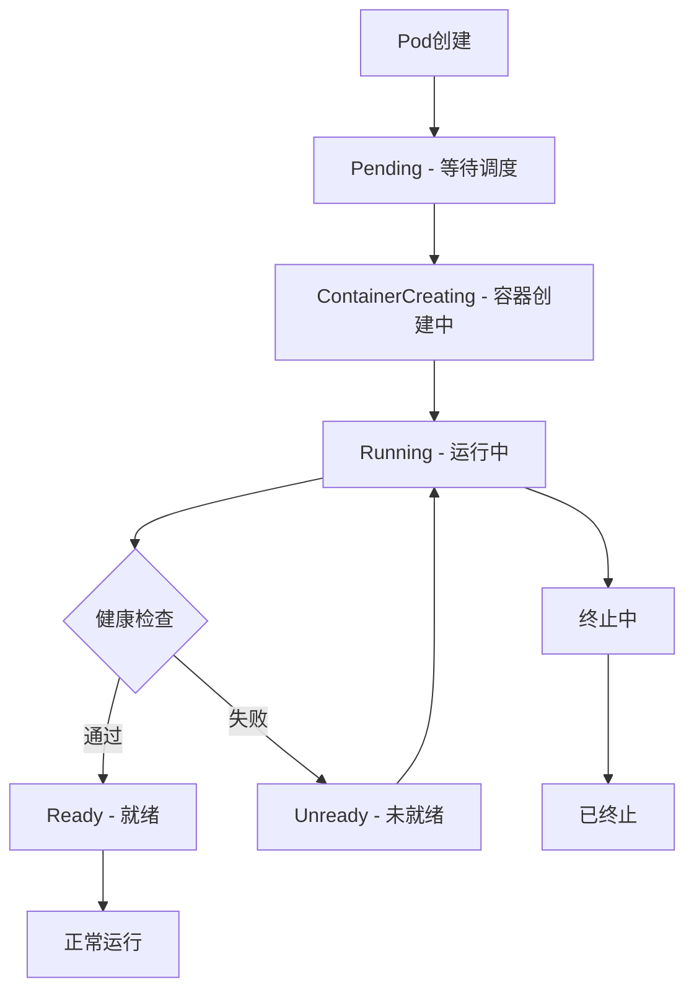
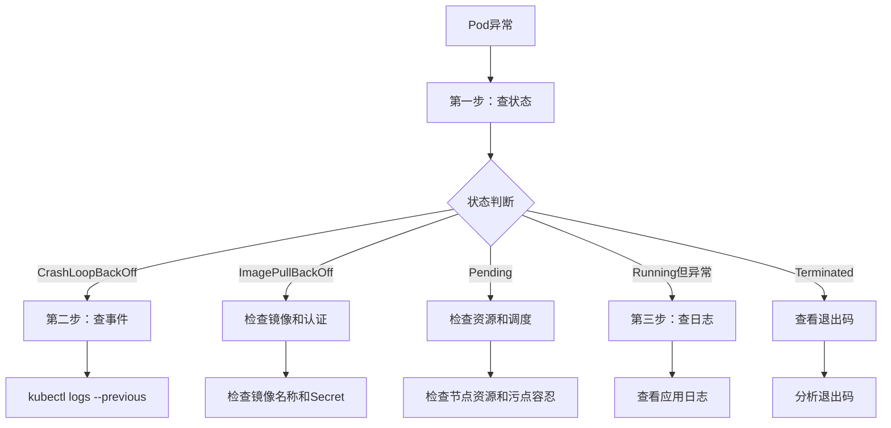
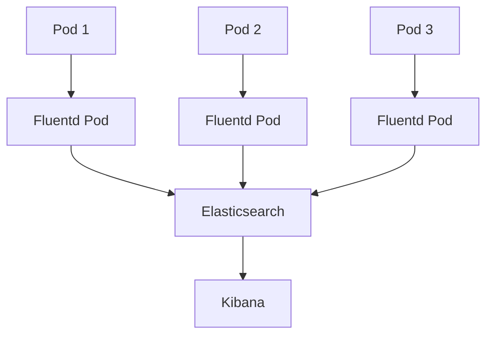

# Kubernetes Pod故障排查深度解析：从原理到实践

## 情境(Situation)

在Kubernetes集群管理中，Pod是最小的调度单元，Pod故障是SRE工程师日常工作中最常遇到的问题之一。无论是应用启动失败、资源不足还是健康检查不通过，都需要SRE工程师快速定位问题并解决。

作为SRE工程师，我们需要掌握Pod故障排查的系统方法，理解不同故障状态的原因和解决方案，以便在实际工作中快速响应和解决问题。

## 冲突(Conflict)

在实际应用中，SRE工程师经常面临以下挑战：

- **故障定位难**：不知道从哪个步骤开始排查
- **状态理解不清**：不清楚CrashLoopBackOff、ImagePullBackOff等状态的含义
- **日志获取困难**：容器崩溃后无法获取上次运行的日志
- **多容器排查复杂**：多容器Pod中不知如何查看特定容器的日志
- **生产环境调试困难**：生产环境不能随意进入容器调试
- **根因分析不足**：只解决表面问题，不深入分析根本原因

## 问题(Question)

如何系统化地排查Pod故障，快速定位问题根本原因并解决？

## 答案(Answer)

本文将从SRE视角出发，详细介绍Pod故障排查的三步法、不同故障状态的原因和解决方案、常用排查命令和工具，以及生产环境最佳实践，提供一套完整的Pod故障排查方法论。核心方法论基于 [SRE面试题解析：pod出问题了，怎么排查原因？](#61-pod出问题了怎么排查原因)。

---

## 一、Pod故障排查基础

### 1.1 Pod生命周期

**Pod生命周期**：



**Pod状态**：
- **Pending**：Pod已被Kubernetes系统接受，但容器镜像尚未创建
- **Running**：Pod已绑定到节点，所有容器已创建，至少有一个容器正在运行
- **Succeeded**：Pod中的所有容器都已成功终止，不会重启
- **Failed**：Pod中的所有容器都已终止，至少有一个容器以失败终止
- **Unknown**：无法获取Pod状态，通常是节点通信问题

### 1.2 Pod故障排查三步法

**Pod故障排查三步法**：

| 步骤 | 命令 | 作用 | 适用场景 |
|:------|:------|:------|:------|
| **第一步：查状态** | `kubectl get pods` | 查看Pod状态、重启次数、READY状态 | 所有故障场景 |
| **第二步：查事件** | `kubectl describe pod` | 查看Events、配置问题、资源状态 | 了解故障原因 |
| **第三步：查日志** | `kubectl logs` | 查看应用输出、错误信息 | 应用层面问题 |

**排查流程图**：



---

## 二、常见Pod状态详解

### 2.1 CrashLoopBackOff

**CrashLoopBackOff状态**：

| 项目 | 说明 |
|:------|:------|
| **含义** | 容器反复崩溃后被Kubernetes重启 |
| **原因** | 应用启动失败、配置错误、资源不足、依赖服务不可用 |
| **排查方法** | `kubectl logs --previous`查看上次运行的日志 |

**排查步骤**：

1. **查看Pod状态和重启次数**：

```bash
kubectl get pods -n <namespace>
```

2. **查看Pod详细信息和事件**：

```bash
kubectl describe pod <pod-name> -n <namespace>
```

3. **查看当前日志**：

```bash
kubectl logs <pod-name> -n <namespace>
```

4. **查看上次运行的日志**（关键）：

```bash
kubectl logs <pod-name> --previous -n <namespace>
```

5. **进入容器交互式调试**：

```bash
kubectl exec -it <pod-name> -n <namespace> -- /bin/sh
```

**常见原因及解决方案**：

| 原因 | 排查方法 | 解决方案 |
|:------|:------|:------|
| **应用启动失败** | 查看日志 | 修复应用配置或代码 |
| **端口冲突** | 检查端口使用 | 修改容器端口或配置 |
| **环境变量错误** | 检查Env和ConfigMap | 修正环境变量配置 |
| **依赖服务不可用** | 检查依赖服务状态 | 确保依赖服务正常运行 |
| **资源不足** | 检查资源限制 | 调整资源限制 |
| **权限问题** | 检查安全上下文 | 调整Pod安全策略 |

### 2.2 ImagePullBackOff

**ImagePullBackOff状态**：

| 项目 | 说明 |
|:------|:------|
| **含义** | Kubernetes无法拉取容器镜像 |
| **原因** | 镜像名称错误、私有仓库认证失败、网络问题、镜像不存在 |
| **排查方法** | 检查镜像名称、Secret配置、网络连通性 |

**排查步骤**：

1. **查看Pod详细信息**：

```bash
kubectl describe pod <pod-name> -n <namespace>
```

2. **检查镜像名称和标签**：

```bash
kubectl get pod <pod-name> -n <namespace> -o jsonpath='{.spec.containers[*].image}'
```

3. **测试镜像拉取**：

```bash
# 在节点上测试拉取镜像
docker pull <image-name>

# 使用kubectl测试
kubectl run test --image=<image-name> --rm -it
```

4. **检查私有仓库认证**：

```bash
# 查看Secret
kubectl get secrets -n <namespace>

# 检查ServiceAccount使用的Secret
kubectl get serviceaccount <sa-name> -n <namespace> -o yaml
```

**常见原因及解决方案**：

| 原因 | 排查方法 | 解决方案 |
|:------|:------|:------|
| **镜像名称错误** | 检查镜像名称 | 修正镜像名称 |
| **镜像标签不存在** | 检查镜像标签 | 使用正确的标签或latest |
| **私有仓库认证失败** | 检查Secret | 创建或更新Secret |
| **网络问题** | 测试网络连通性 | 配置网络策略或代理 |
| **镜像不存在** | 检查镜像仓库 | 上传镜像或使用其他镜像 |

**私有仓库认证配置**：

```bash
# 创建Docker registry Secret
kubectl create secret docker-registry <secret-name> \
  --docker-server=<registry-server> \
  --docker-username=<username> \
  --docker-password=<password> \
  --docker-email=<email> \
  -n <namespace>

# 在Pod中使用Secret
apiVersion: v1
kind: Pod
metadata:
  name: nginx
spec:
  containers:
  - name: nginx
    image: <private-registry>/nginx:latest
  imagePullSecrets:
  - name: <secret-name>
```

### 2.3 Pending

**Pending状态**：

| 项目 | 说明 |
|:------|:------|
| **含义** | Pod等待被调度到节点 |
| **原因** | 资源不足、节点选择器不匹配、污点容忍、调度器问题 |
| **排查方法** | 检查节点资源、调度配置、污点容忍 |

**排查步骤**：

1. **查看Pod详细信息和调度原因**：

```bash
kubectl describe pod <pod-name> -n <namespace>
```

2. **查看节点资源状态**：

```bash
kubectl describe nodes
kubectl top nodes
```

3. **查看Pod调度事件**：

```bash
kubectl get events -n <namespace> --field-selector involvedObject.name=<pod-name>
```

**常见原因及解决方案**：

| 原因 | 排查方法 | 解决方案 |
|:------|:------|:------|
| **资源不足** | 检查节点资源 | 增加节点或调整资源请求 |
| **节点选择器不匹配** | 检查节点选择器 | 修正节点选择器配置 |
| **污点不容忍** | 检查节点污点 | 添加污点容忍或移除污点 |
| **亲和性不满足** | 检查亲和性配置 | 调整亲和性规则 |
| **调度器故障** | 检查调度器状态 | 重启调度器 |
| **PVC未绑定** | 检查PVC状态 | 创建或修复PVC |

### 2.4 Terminated

**Terminated状态**：

| 项目 | 说明 |
|:------|:------|
| **含义** | Pod已被终止 |
| **原因** | 主动删除、超时、手动终止 |
| **排查方法** | 查看Pod状态和退出码 |

**排查步骤**：

1. **查看Pod状态**：

```bash
kubectl get pods -n <namespace>
```

2. **查看Pod详情**：

```bash
kubectl describe pod <pod-name> -n <namespace>
```

3. **查看历史事件**：

```bash
kubectl get events -n <namespace> --sort-by='.metadata.creationTimestamp'
```

**常见退出码**：

| 退出码 | 含义 | 原因 |
|:------|:------|:------|
| **0** | 正常退出 | 容器任务完成 |
| **1** | 应用程序错误 | 应用异常退出 |
| **137** | 被信号终止 | 被SIGKILL信号杀死，通常是资源限制 |
| **139** | 段错误 | 内存访问错误 |
| **143** | 被信号终止 | 被SIGTERM信号正常终止 |

### 2.5 Running但异常

**Running但异常状态**：

| 项目 | 说明 |
|:------|:------|
| **含义** | Pod处于Running但应用不正常 |
| **原因** | 健康检查失败、依赖服务异常、应用内部错误 |
| **排查方法** | 查看应用日志、健康检查配置 |

**排查步骤**：

1. **查看Pod状态和健康检查**：

```bash
kubectl describe pod <pod-name> -n <namespace>
```

2. **查看应用日志**：

```bash
kubectl logs <pod-name> -n <namespace>
```

3. **进入容器调试**：

```bash
kubectl exec -it <pod-name> -n <namespace> -- /bin/sh
```

4. **端口转发进行本地调试**：

```bash
kubectl port-forward <pod-name> 8080:80 -n <namespace>
```

---

## 三、常用排查命令

### 3.1 基础排查命令

**基础排查命令**：

```bash
# 查看Pod状态
kubectl get pods -n <namespace>

# 查看Pod详细信息
kubectl describe pod <pod-name> -n <namespace>

# 查看Pod日志
kubectl logs <pod-name> -n <namespace>

# 查看上次运行的日志（容器崩溃后）
kubectl logs <pod-name> --previous -n <namespace>

# 多容器Pod查看特定容器日志
kubectl logs <pod-name> -c <container-name> -n <namespace>

# 查看上次运行的特定容器日志
kubectl logs <pod-name> -c <container-name> --previous -n <namespace>

# 进入容器交互式调试
kubectl exec -it <pod-name> -n <namespace> -- /bin/bash

# 多容器Pod进入特定容器
kubectl exec -it <pod-name> -c <container-name> -n <namespace> -- /bin/bash

# 端口转发进行本地调试
kubectl port-forward <pod-name> 8080:80 -n <namespace>

# 复制文件到本地
kubectl cp <pod-name>:/path/in/container /local/path -n <namespace>

# 复制文件到容器
kubectl cp /local/path <pod-name>:/path/in/container -n <namespace>
```

### 3.2 高级排查命令

**高级排查命令**：

```bash
# 查看集群事件（按时间排序）
kubectl get events -n <namespace> --sort-by='.metadata.creationTimestamp'

# 查看所有命名空间的事件
kubectl get events --all-namespaces --sort-by='.metadata.creationTimestamp'

# 查看特定类型的事件
kubectl get events -n <namespace> --field-selector involvedObject.name=<pod-name>

# 查看节点状态
kubectl get nodes -o wide

# 查看节点详细信息
kubectl describe node <node-name>

# 查看节点资源使用
kubectl top node <node-name>

# 查看Pod资源使用
kubectl top pod -n <namespace>

# 查看Pod的YAML配置
kubectl get pod <pod-name> -n <namespace> -o yaml

# 查看Pod的JSON格式配置
kubectl get pod <pod-name> -n <namespace> -o json

# 查看Pod的环境变量
kubectl exec <pod-name> -n <namespace> -- env

# 查看Pod的网络连接
kubectl exec <pod-name> -n <namespace> -- netstat -tlnp

# 查看Pod的进程列表
kubectl exec <pod-name> -n <namespace> -- ps aux

# 查看Pod的系统资源限制
kubectl exec <pod-name> -n <namespace> -- cat /sys/fs/cgroup/memory/memory.limit_in_bytes
```

### 3.3 调试工具

**调试工具**：

1. **kubectl-debug**：

```bash
# 安装kubectl-debug
curl -Lo kubectl-debug https://github.com/aylei/kubectl-debug/releases/download/v0.1.1/kubectl-debug_linux_amd64
chmod +x kubectl-debug
sudo mv kubectl-debug /usr/local/bin/

# 使用kubectl-debug进行调试
kubectl debug <pod-name> -n <namespace> --agent-only

# 使用kubectl-debug复制镜像并调试
kubectl debug <pod-name> -n <namespace> --fork
```

2. **ephemeral containers**（临时容器，K8s 1.16+）：

```bash
# 添加临时容器进行调试
kubectl debug <pod-name> -n <namespace> -it --image=busybox --target=<container-name>
```

3. **stern**（日志查看工具）：

```bash
# 安装stern
curl -Lo stern https://github.com/stern/stern/releases/download/v1.20.0/stern_1.20.0_linux_amd64.tar.gz
tar -xzf stern_1.20.0_linux_amd64.tar.gz
sudo mv stern /usr/local/bin/

# 查看Pod日志（支持多Pod和颜色输出）
stern <pod-name> -n <namespace>

# 查看特定容器的日志
stern <pod-name> -c <container-name> -n <namespace>

# 查看符合正则表达式的Pod日志
stern "nginx-*" -n <namespace> --since=15m
```

4. **kail**（日志查看工具）：

```bash
# 安装kail
go install github.com/boz/kail@latest

# 查看所有Pod日志
kail -n <namespace>

# 查看特定标签的Pod日志
kail -n <namespace> -l app=nginx
```

---

## 四、故障场景与解决方案

### 4.1 应用启动失败

**应用启动失败**：

1. **配置错误**：
   - 检查环境变量配置
   - 检查ConfigMap和Secret挂载
   - 检查启动命令和参数

2. **依赖服务不可用**：
   - 检查数据库连接
   - 检查缓存服务
   - 检查API服务可用性

3. **资源限制**：
   - 检查内存限制
   - 检查CPU限制
   - 检查临时存储限制

**排查命令**：

```bash
# 查看应用日志
kubectl logs <pod-name> --previous -n <namespace>

# 检查环境变量
kubectl exec <pod-name> -n <namespace> -- env

# 检查配置文件
kubectl exec <pod-name> -n <namespace> -- cat /path/to/config

# 检查依赖服务连接
kubectl exec <pod-name> -n <namespace> -- nc -zv <service-name> <port>
```

### 4.2 健康检查失败

**健康检查失败**：

1. **Liveness探针失败**：
   - 导致容器被重启
   - 检查探针配置和探测路径
   - 检查应用健康状态

2. **Readiness探针失败**：
   - 导致Pod从Service中移除
   - 检查探针配置和探测路径
   - 检查应用就绪状态

3. **Startup探针失败**：
   - 导致容器被终止
   - 检查探针配置和超时时间
   - 检查应用启动时间

**排查命令**：

```bash
# 查看Pod健康检查配置
kubectl describe pod <pod-name> -n <namespace>

# 测试健康检查端点
kubectl exec <pod-name> -n <namespace> -- curl -k http://localhost:<port>/<health-check-path>

# 查看健康检查失败事件
kubectl get events -n <namespace> --field-selector reason=FailedScheduling
```

**健康检查配置示例**：

```yaml
apiVersion: v1
kind: Pod
metadata:
  name: nginx
spec:
  containers:
  - name: nginx
    image: nginx:latest
    livenessProbe:
      httpGet:
        path: /healthz
        port: 80
      initialDelaySeconds: 10
      periodSeconds: 10
      timeoutSeconds: 5
      failureThreshold: 3
    readinessProbe:
      httpGet:
        path: /ready
        port: 80
      initialDelaySeconds: 5
      periodSeconds: 5
      timeoutSeconds: 3
      failureThreshold: 3
    startupProbe:
      httpGet:
        path: /started
        port: 80
      failureThreshold: 30
      periodSeconds: 10
```

### 4.3 资源不足

**资源不足**：

1. **内存不足（OOMKilled）**：
   - 容器被OOM Killer杀死
   - 检查内存限制和实际使用
   - 优化应用内存使用

2. **CPU不足**：
   - 容器CPU使用被限制
   - 检查CPU限制和实际使用
   - 调整CPU限制或优化应用

3. **临时存储不足**：
   - 容器临时存储被限制
   - 检查临时存储限制
   - 清理临时文件

**排查命令**：

```bash
# 查看Pod资源使用
kubectl top pod <pod-name> -n <namespace>

# 查看Pod资源限制
kubectl get pod <pod-name> -n <namespace> -o jsonpath='{.spec.containers[*].resources}'

# 查看节点资源
kubectl describe node <node-name> | grep -A 10 "Allocated resources"

# 查看容器的OOM事件
kubectl get events -n <namespace> --field-selector reason=OOMKilled
```

**资源配置示例**：

```yaml
apiVersion: v1
kind: Pod
metadata:
  name: nginx
spec:
  containers:
  - name: nginx
    image: nginx:latest
    resources:
      requests:
        memory: "128Mi"
        cpu: "250m"
      limits:
        memory: "256Mi"
        cpu: "500m"
    volumeMounts:
    - name: tmp
      mountPath: /tmp
  volumes:
  - name: tmp
    emptyDir:
      medium: Memory
      sizeLimit: 100Mi
```

### 4.4 网络问题

**网络问题**：

1. **DNS解析失败**：
   - 检查CoreDNS状态
   - 检查DNS配置
   - 测试DNS解析

2. **网络连接失败**：
   - 检查网络策略
   - 检查iptables规则
   - 测试网络连通性

3. **服务发现失败**：
   - 检查Service配置
   - 检查Endpoints
   - 测试服务连接

**排查命令**：

```bash
# 查看Service
kubectl get svc -n <namespace>

# 查看Endpoints
kubectl get endpoints -n <namespace>

# 测试DNS解析
kubectl exec <pod-name> -n <namespace> -- nslookup <service-name>

# 测试网络连接
kubectl exec <pod-name> -n <namespace> -- ping <target-ip>

# 测试端口连接
kubectl exec <pod-name> -n <namespace> -- nc -zv <target-ip> <port>

# 查看网络策略
kubectl get networkpolicies -n <namespace>

# 查看iptables规则（需要进入节点）
iptables -L -n -t nat | grep <pod-ip>
```

### 4.5 存储问题

**存储问题**：

1. **PVC挂载失败**：
   - 检查PVC状态
   - 检查StorageClass
   - 检查PV绑定

2. **权限问题**：
   - 检查Volume挂载
   - 检查文件系统权限
   - 调整安全上下文

3. **存储容量不足**：
   - 检查存储使用
   - 扩容存储
   - 清理不需要的数据

**排查命令**：

```bash
# 查看PVC状态
kubectl get pvc -n <namespace>

# 查看PV状态
kubectl get pv

# 查看PVC详情
kubectl describe pvc <pvc-name> -n <namespace>

# 查看Pod中的存储挂载
kubectl describe pod <pod-name> -n <namespace> | grep -A 20 "Volumes"

# 进入容器检查存储
kubectl exec <pod-name> -n <namespace> -- df -h

# 检查文件权限
kubectl exec <pod-name> -n <namespace> -- ls -la /path/to/mount
```

---

## 五、生产环境最佳实践

### 5.1 日志收集系统

**日志收集系统**：

1. **EFK栈**（Elasticsearch + Fluentd + Kibana）：
   - 集中式日志管理
   - 日志搜索和分析
   - 可视化展示

2. **Loki + Promtail + Grafana**：
   - 轻量级日志解决方案
   - 与Prometheus集成
   - 低资源消耗

3. **Jaeger**：
   - 分布式追踪
   - 请求链路追踪
   - 性能分析

**日志收集架构**：



**Fluentd配置示例**：

```yaml
apiVersion: v1
kind: ConfigMap
metadata:
  name: fluentd-config
  namespace: logging
data:
  fluent.conf: |
    <source>
      @type tail
      path /var/log/containers/*.log
      pos_file /var/log/fluentd.pos
      tag kubernetes.*
      <parse>
        @type json
        time_key time
        time_format %Y-%m-%dT%H:%M:%S.%NZ
      </parse>
    </source>
    <filter kubernetes.**>
      @type kubernetes_metadata
      @id filter_kube_metadata
    </filter>
    <match kubernetes.**>
      @type elasticsearch
      host elasticsearch.logging.svc.cluster.local
      port 9200
      logstash_format true
      logstash_prefix kubernetes
    </match>
```

### 5.2 监控告警系统

**监控告警系统**：

1. **Prometheus + Grafana**：
   - 指标收集和存储
   - 可视化展示
   - 告警管理

2. **Alertmanager**：
   - 告警聚合
   - 告警路由
   - 告警抑制

**关键监控指标**：

| 指标类型 | 指标名称 | 说明 |
|:------|:------|:------|
| **Pod状态** | kube_pod_status_phase | Pod所处状态 |
| **Pod重启** | kube_pod_container_status_restarts | 容器重启次数 |
| **CPU使用** | container_cpu_usage_seconds_total | CPU使用时间 |
| **内存使用** | container_memory_usage_bytes | 内存使用量 |
| **网络流量** | container_network_receive_bytes_total | 网络接收字节 |
| **文件系统** | container_fs_usage_bytes | 文件系统使用量 |

**Prometheus告警规则示例**：

```yaml
apiVersion: monitoring.coreos.com/v1
kind: PrometheusRule
metadata:
  name: pod-alerts
  namespace: monitoring
spec:
  groups:
  - name: pod-alerts
    rules:
    - alert: PodCrashLooping
      expr: rate(kube_pod_container_status_restarts[15m]) > 0.1
      for: 5m
      labels:
        severity: critical
      annotations:
        summary: "Pod频繁崩溃"
        description: "Pod {{ $labels.namespace }}/{{ $labels.pod }} 频繁崩溃"

    - alert: PodHighMemoryUsage
      expr: (sum(container_memory_working_set_bytes) by (pod, namespace) / sum(container_spec_memory_limit_bytes) by (pod, namespace)) > 0.9
      for: 10m
      labels:
        severity: warning
      annotations:
        summary: "Pod内存使用率过高"
        description: "Pod {{ $labels.namespace }}/{{ $labels.pod }} 内存使用率超过90%"

    - alert: PodNotReady
      expr: kube_pod_status_ready{condition="true"} == 0
      for: 10m
      labels:
        severity: warning
      annotations:
        summary: "Pod未就绪"
        description: "Pod {{ $labels.namespace }}/{{ $labels.pod }} 未就绪"
```

### 5.3 故障复盘机制

**故障复盘机制**：

1. **故障记录**：
   - 记录故障时间、现象、原因
   - 记录排查过程和解决方案
   - 记录教训和改进措施

2. **根因分析**：
   - 使用5Why分析方法
   - 识别系统性问题
   - 制定长期解决方案

3. **改进措施**：
   - 优化监控告警
   - 完善文档和手册
   - 自动化常见问题处理

**故障复盘报告模板**：

```markdown
# 故障复盘报告

## 基本信息
- **故障时间**：2026-XX-XX XX:XX
- **故障时长**：XX分钟
- **影响范围**：XX系统/XX用户
- **严重程度**：P0/P1/P2/P3

## 故障现象
- 描述故障的现象和影响

## 故障原因
- 分析故障的根本原因

## 排查过程
- 时间线记录排查过程

## 解决方案
- 描述解决方案和效果

## 根因分析
- 使用5Why分析方法

## 改进措施
- 短期改进措施
- 长期改进措施
- 预防措施

## 经验教训
- 从本次故障中学到的经验
```

---

## 六、故障排查清单

### 6.1 通用排查清单

**通用排查清单**：

- [ ] kubectl get pods 查看Pod状态
- [ ] kubectl describe pod 查看详细信息和事件
- [ ] kubectl logs 查看应用日志
- [ ] kubectl logs --previous 查看上次运行的日志
- [ ] kubectl exec 进入容器交互式调试
- [ ] kubectl top pod 查看资源使用
- [ ] kubectl get events 查看集群事件
- [ ] 检查节点资源状态
- [ ] 检查网络连通性
- [ ] 检查存储挂载状态

### 6.2 特定状态排查清单

**CrashLoopBackOff**：

- [ ] kubectl logs --previous 查看上次运行的日志
- [ ] 检查应用启动命令和参数
- [ ] 检查环境变量和配置文件
- [ ] 检查依赖服务可用性
- [ ] 检查资源限制是否合理
- [ ] 检查应用代码是否有bug

**ImagePullBackOff**：

- [ ] kubectl describe pod 查看拉取失败原因
- [ ] 检查镜像名称和标签是否正确
- [ ] 检查私有仓库Secret是否配置
- [ ] 检查Secret是否关联到Pod
- [ ] 测试镜像能否正常拉取
- [ ] 检查网络连通性

**Pending**：

- [ ] kubectl describe pod 查看调度失败原因
- [ ] kubectl describe node 查看节点状态
- [ ] 检查节点资源是否充足
- [ ] 检查节点选择器和污点容忍
- [ ] 检查PVC是否已绑定
- [ ] 检查调度器是否正常工作

**Running但异常**：

- [ ] kubectl logs 查看应用日志
- [ ] 检查健康检查配置
- [ ] 检查依赖服务可用性
- [ ] 检查网络连通性
- [ ] 进入容器进行交互式调试
- [ ] 使用端口转发进行本地调试

---

## 总结

Pod故障排查是SRE工程师的核心技能之一。通过掌握Pod故障排查的三步法（查状态→查事件→查日志），理解不同故障状态的原因和解决方案，建立完善的监控告警和日志收集系统，我们可以快速定位和解决Pod故障。

**核心要点**：

1. **三步法**：查状态→查事件→查日志
2. **状态理解**：理解CrashLoopBackOff、ImagePullBackOff、Pending等状态的含义
3. **日志获取**：使用kubectl logs --previous获取崩溃前的日志
4. **多容器排查**：使用-c参数指定容器名称
5. **生产环境**：配置日志收集系统和监控告警
6. **故障复盘**：记录故障过程，制定改进措施
7. **工具使用**：熟练使用kubectl-debug、stern等调试工具
8. **预防为主**：通过监控告警提前发现潜在问题

通过遵循这些最佳实践，我们可以构建一个高效的故障排查体系，快速响应和解决Pod故障，确保系统的高可用性和稳定性。

> **延伸学习**：更多面试相关的Pod故障排查知识，请参考 [SRE面试题解析：pod出问题了，怎么排查原因？](#61-pod出问题了怎么排查原因)。

---

## 参考资料

- [Kubernetes官方文档](https://kubernetes.io/docs/)
- [kubectl命令参考](https://kubernetes.io/docs/reference/generated/kubectl/kubectl-commands)
- [Pod生命周期](https://kubernetes.io/docs/concepts/workloads/pods/pod-lifecycle/)
- [调试Kubernetes Pod](https://kubernetes.io/docs/tasks/debug-application-cluster/debug-pod/)
- [调试Kubernetes服务](https://kubernetes.io/docs/tasks/debug-application-cluster/debug-service/)
- [健康检查](https://kubernetes.io/docs/tasks/configure-pod-container/configure-liveness-readiness-startup-probes/)
- [资源管理](https://kubernetes.io/docs/concepts/configuration/manage-resources-containers/)
- [网络调试](https://kubernetes.io/docs/tasks/debug-application-cluster/debug-cluster/)
- [存储调试](https://kubernetes.io/docs/tasks/debug-application-cluster/debug-persistent-volume/)
- [kubectl-debug](https://github.com/aylei/kubectl-debug)
- [stern](https://github.com/stern/stern)
- [kail](https://github.com/boz/kail)
- [EFK日志系统](https://www.elastic.co/what-is/elk-stack)
- [Loki日志系统](https://grafana.com/docs/loki/latest/)
- [Prometheus监控](https://prometheus.io/docs/introduction/overview/)
- [Grafana监控](https://grafana.com/docs/grafana/latest/)
- [Kubernetes监控最佳实践](https://kubernetes.io/docs/concepts/cluster-administration/system-metrics/)
- [告警管理](https://prometheus.io/docs/alerting/latest/alertmanager/)
- [故障复盘指南](https://www.atlassian.com/incident-management/incident-review)
- [SRE最佳实践](https://sre.google/sre-book/table-of-contents/)
- [Kubernetes故障排查](https://kubernetes.io/docs/tasks/debug/)
- [容器运行时调试](https://kubernetes.io/docs/tasks/debug-application-cluster/crictool/)
- [事件过滤](https://kubernetes.io/docs/reference/generated/kubernetes-api/v1.25/#event-v1-core)