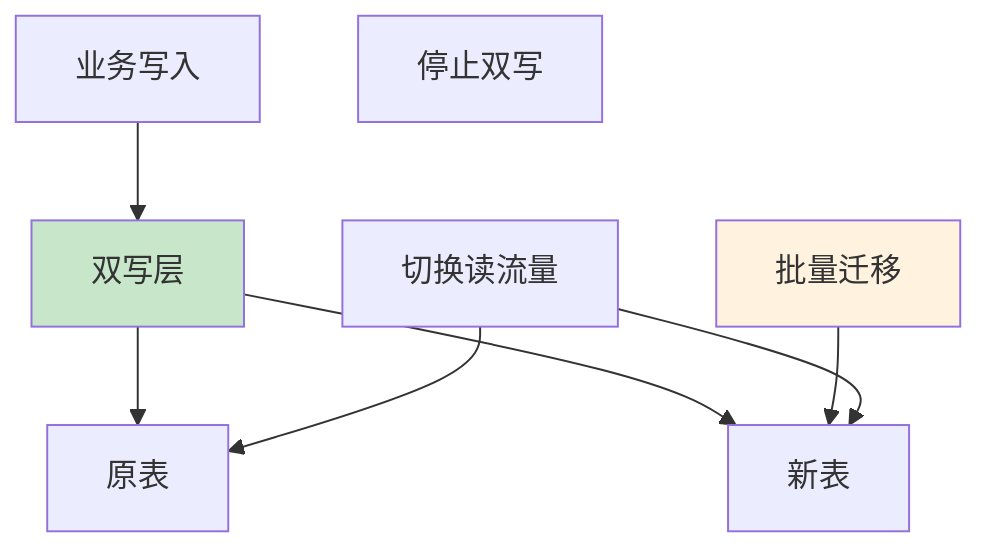

# 大规模数据安全更新：从分批到零停机方案

## 情境与背景

在生产环境中，面对几千万条数据的更新需求，如果处理不当会导致严重的锁表问题，影响业务正常运行。作为高级DevOps/SRE工程师，需要掌握一套完整的大规模数据更新策略，确保数据更新的安全性和业务连续性。

## 一、分批更新策略

### 1.1 分批原理

**分批更新的核心思想**：将大规模更新拆分为多个小批次，每次只更新一部分数据，避免长时间持有锁。

```sql
-- 分批更新示例（MySQL）
-- 每次更新1000条，通过ID范围分批
UPDATE orders
SET status = 'processed', updated_at = NOW()
WHERE id BETWEEN 1 AND 1000
  AND status = 'pending';
```

### 1.2 分批策略选择

**分批策略对比**：

| 策略 | 实现方式 | 适用场景 |
|:----:|----------|----------|
| **主键范围分批** | WHERE id BETWEEN x AND y | 主键自增有序 |
| **LIMIT分批** | LIMIT offset, size | 无合适索引 |
| **时间范围分批** | WHERE created_at BETWEEN ... | 按时间分布均匀 |
| **HASH分批** | WHERE MOD(id, N) = 0 | 分布式更新 |

### 1.3 分批更新脚本

**Shell脚本实现**：

```bash
#!/bin/bash
# 大规模数据分批更新脚本

DB_HOST="localhost"
DB_USER="admin"
DB_PASS="password"
DB_NAME="production"

BATCH_SIZE=1000
SLEEP_TIME=0.5
MAX_ID=$(mysql -h $DB_HOST -u $DB_USER -p$DB_PASS -D $DB_NAME -e "SELECT MAX(id) FROM orders;" -s)

echo "Total records to update: $MAX_ID"
echo "Batch size: $BATCH_SIZE"

for ((i=1; i<=$MAX_ID; i+=$BATCH_SIZE)); do
    start_id=$i
    end_id=$((i + BATCH_SIZE - 1))
    
    echo "Updating batch $start_id - $end_id"
    
    mysql -h $DB_HOST -u $DB_USER -p$DB_PASS -D $DB_NAME <<EOF
        UPDATE orders
        SET status = 'processed', updated_at = NOW()
        WHERE id BETWEEN $start_id AND $end_id
          AND status = 'pending';
EOF
    
    ROWS_AFFECTED=$(mysql -h $DB_HOST -u $DB_USER -p$DB_PASS -D $DB_NAME -e "SELECT ROW_COUNT();" -s)
    echo "Updated $ROWS_AFFECTED rows"
    
    if [ $ROWS_AFFECTED -eq 0 ]; then
        echo "No more records to update"
        break
    fi
    
    sleep $SLEEP_TIME
done

echo "Update completed successfully"
```

### 1.4 Python脚本实现

**更智能的分批更新**：

```python
import MySQLdb
import time

def batch_update():
    db = MySQLdb.connect(
        host="localhost",
        user="admin",
        passwd="password",
        db="production",
        autocommit=True
    )
    
    cursor = db.cursor()
    batch_size = 1000
    sleep_time = 0.5
    offset = 0
    
    while True:
        query = """
            UPDATE orders
            SET status = 'processed', updated_at = NOW()
            WHERE id > %s
              AND status = 'pending'
            ORDER BY id
            LIMIT %s
        """
        
        cursor.execute(query, (offset, batch_size))
        rows_updated = cursor.rowcount
        
        if rows_updated == 0:
            print("No more records to update")
            break
            
        print(f"Updated {rows_updated} records (offset: {offset})")
        
        # 获取最后更新的ID作为下次的起点
        cursor.execute("SELECT LAST_INSERT_ID()")
        result = cursor.fetchone()
        if result:
            offset = result[0]
        
        time.sleep(sleep_time)
    
    cursor.close()
    db.close()

if __name__ == "__main__":
    batch_update()
```

## 二、事务控制策略

### 2.1 小事务原则

**事务大小控制**：

```sql
-- ❌ 错误：大事务
BEGIN;
UPDATE orders SET status = 'processed' WHERE status = 'pending';
COMMIT;

-- ✅ 正确：小事务
BEGIN;
UPDATE orders 
SET status = 'processed', updated_at = NOW()
WHERE id BETWEEN 1 AND 1000 AND status = 'pending';
COMMIT;
```

### 2.2 事务隔离级别

**合理选择隔离级别**：

```sql
-- 降低隔离级别减少锁竞争
SET TRANSACTION ISOLATION LEVEL READ COMMITTED;

BEGIN;
UPDATE orders 
SET status = 'processed'
WHERE id BETWEEN 1 AND 1000 AND status = 'pending';
COMMIT;
```

### 2.3 死锁预防

**避免死锁的原则**：

```sql
-- 1. 按相同顺序访问资源
UPDATE orders SET status = 'processed' WHERE id = 100;
UPDATE order_items SET order_status = 'processed' WHERE order_id = 100;

-- 2. 保持事务短小
BEGIN;
UPDATE orders SET status = 'processed' WHERE id = 100;
COMMIT;

BEGIN;
UPDATE order_items SET order_status = 'processed' WHERE order_id = 100;
COMMIT;

-- 3. 使用较低的隔离级别
SET TRANSACTION ISOLATION LEVEL READ COMMITTED;
```

## 三、索引优化

### 3.1 更新条件索引

**确保WHERE条件有索引**：

```sql
-- 创建索引
CREATE INDEX idx_orders_status ON orders(status);
CREATE INDEX idx_orders_id_status ON orders(id, status);

-- 验证索引使用
EXPLAIN UPDATE orders 
SET status = 'processed', updated_at = NOW()
WHERE id BETWEEN 1 AND 1000 AND status = 'pending';
```

### 3.2 避免索引失效

**避免在索引列上做函数操作**：

```sql
-- ❌ 错误：索引失效
UPDATE orders 
SET status = 'processed'
WHERE YEAR(created_at) = 2024;

-- ✅ 正确：使用范围查询
UPDATE orders 
SET status = 'processed'
WHERE created_at >= '2024-01-01' 
  AND created_at < '2025-01-01';
```

### 3.3 临时索引策略

**创建临时索引加速更新**：

```sql
-- 1. 创建临时索引
CREATE INDEX idx_temp_orders_status_created ON orders(status, created_at);

-- 2. 执行更新
UPDATE orders 
SET status = 'processed'
WHERE status = 'pending' AND created_at < '2024-01-01';

-- 3. 删除临时索引（如果不再需要）
DROP INDEX idx_temp_orders_status_created ON orders;
```

## 四、低峰期执行

### 4.1 定时任务配置

**使用cron在低峰期执行**：

```bash
# /etc/cron.d/large-scale-update
# 凌晨2点执行大规模数据更新
0 2 * * * root /usr/local/bin/batch_update.sh >> /var/log/batch_update.log 2>&1
```

### 4.2 流量控制

**使用pt-online-schema-change（Percona Toolkit）**：

```bash
# 使用pt-online-schema-change执行在线更新
pt-online-schema-change \
  --alter "ADD COLUMN processed TINYINT(1) DEFAULT 0" \
  D=production,t=orders \
  --execute \
  --chunk-size=1000 \
  --sleep=0.5 \
  --max-lag=10
```

### 4.3 读写分离

**在从库更新，然后同步到主库**：

```sql
-- 在从库执行更新（适用于可接受短暂数据不一致的场景）
-- 注意：需要确保从库可以写或者切换为主库

-- 1. 暂停复制
STOP SLAVE;

-- 2. 在从库执行更新
UPDATE orders 
SET status = 'processed'
WHERE status = 'pending';

-- 3. 切换为主库
-- （根据实际架构进行主从切换）
```

## 五、监控与告警

### 5.1 锁等待监控

**监控锁等待情况**：

```sql
-- 查看当前锁等待
SHOW PROCESSLIST;

-- 查看锁等待详情
SELECT * FROM INFORMATION_SCHEMA.INNODB_LOCK_WAITS;

-- 查看InnoDB状态
SHOW ENGINE INNODB STATUS;
```

### 5.2 性能监控

**Prometheus监控指标**：

```yaml
groups:
  - name: database-update-alerts
    rules:
      - alert: LockWaitHigh
        expr: |
          sum by(instance) (mysql_global_status_Innodb_row_lock_wait_time_avg) > 1000
        for: 5m
        labels:
          severity: warning
          
      - alert: UpdateSlowQuery
        expr: |
          sum by(instance) (mysql_slow_queries) > 100
        for: 5m
        labels:
          severity: warning
```

### 5.3 进度监控

**实时监控更新进度**：

```bash
#!/bin/bash
# 监控更新进度

DB_HOST="localhost"
DB_USER="admin"
DB_PASS="password"
DB_NAME="production"

while true; do
    total=$(mysql -h $DB_HOST -u $DB_USER -p$DB_PASS -D $DB_NAME -e "SELECT COUNT(*) FROM orders WHERE status = 'pending';" -s)
    processed=$(mysql -h $DB_HOST -u $DB_USER -p$DB_PASS -D $DB_NAME -e "SELECT COUNT(*) FROM orders WHERE status = 'processed';" -s)
    
    echo "$(date): Pending: $total, Processed: $processed"
    
    if [ $total -eq 0 ]; then
        echo "Update completed"
        break
    fi
    
    sleep 10
done
```

## 六、零停机更新方案

### 6.1 双写方案

**零停机迁移策略**：



### 6.2 双写实现

**应用层双写逻辑**：

```python
def update_order_status(order_id, status):
    # 1. 更新原表
    cursor.execute(
        "UPDATE orders SET status = %s WHERE id = %s",
        (status, order_id)
    )
    
    # 2. 更新新表（或新字段）
    cursor.execute(
        "UPDATE orders_new SET status = %s WHERE id = %s",
        (status, order_id)
    )
    
    db.commit()
```

### 6.3 数据迁移流程

**完整迁移步骤**：

```yaml
# 数据迁移流程
migration_steps:
  - step: 1
    description: "创建新表/新字段"
    action: "ALTER TABLE orders ADD COLUMN new_status TINYINT(1);"
    
  - step: 2
    description: "开启双写"
    action: "修改应用代码，同时写入新旧字段"
    
  - step: 3
    description: "批量同步历史数据"
    action: "分批更新 new_status = status"
    
  - step: 4
    description: "切换读流量"
    action: "应用读取新字段"
    
  - step: 5
    description: "验证数据一致性"
    action: "SELECT COUNT(*) FROM orders WHERE status != new_status"
    
  - step: 6
    description: "停止写入旧字段"
    action: "修改应用代码，不再写入旧字段"
    
  - step: 7
    description: "清理旧字段（可选）"
    action: "ALTER TABLE orders DROP COLUMN status;"
```

## 七、实战案例

### 7.1 案例一：状态字段更新

**场景**：将1000万条订单的状态从pending更新为processed

```sql
-- 分批更新脚本
DELIMITER $$
CREATE PROCEDURE BatchUpdateOrders()
BEGIN
    DECLARE batch_size INT DEFAULT 1000;
    DECLARE offset INT DEFAULT 0;
    DECLARE row_count INT DEFAULT 1;
    
    WHILE row_count > 0 DO
        UPDATE orders
        SET status = 'processed', updated_at = NOW()
        WHERE id > offset
          AND status = 'pending'
        ORDER BY id
        LIMIT batch_size;
        
        SET row_count = ROW_COUNT();
        SET offset = offset + batch_size;
        
        DO SLEEP(0.1);
    END WHILE;
END$$
DELIMITER ;

-- 调用存储过程
CALL BatchUpdateOrders();
```

### 7.2 案例二：字段迁移

**场景**：将用户表的email字段迁移到新的存储结构

```sql
-- 步骤1：创建新字段
ALTER TABLE users ADD COLUMN new_email VARCHAR(255);

-- 步骤2：分批迁移
SET @offset = 0;
SET @batch_size = 1000;

REPEAT
    UPDATE users
    SET new_email = email, updated_at = NOW()
    WHERE id > @offset
      AND new_email IS NULL
    ORDER BY id
    LIMIT @batch_size;
    
    SET @offset = @offset + @batch_size;
    
    DO SLEEP(0.1);
UNTIL ROW_COUNT() = 0 END REPEAT;
```

## 八、面试1分钟精简版（直接背）

**完整版**：

对于几千万数据的更新，我们采用分批更新策略。首先按照主键或索引字段分批，每次更新1000-5000条；使用LIMIT控制每批数量，配合WHERE条件避免全表扫描；在低峰期执行，每次更新后短暂休眠；开启事务但保持事务短小；同时监控锁等待和性能指标，设置超时和告警。这样既保证了数据更新的安全性，又最大限度减少对业务的影响。

**30秒超短版**：

分批更新，每次1000-5000条，低峰期执行，小事务，监控告警。

## 九、总结

### 9.1 策略选择指南

| 数据规模 | 推荐策略 | 说明 |
|:--------:|----------|------|
| **100万以下** | 直接更新 | 影响较小 |
| **100-1000万** | 分批更新 | 控制每批1000-5000条 |
| **1000万以上** | 双写迁移 | 零停机方案 |

### 9.2 最佳实践清单

```yaml
best_practices:
  - "分批更新：每批1000-5000条，避免大事务"
  - "索引优化：确保WHERE条件有索引"
  - "低峰期执行：凌晨2-4点最佳"
  - "监控告警：监控锁等待和慢查询"
  - "事务控制：使用小事务，降低隔离级别"
  - "备份恢复：更新前备份，准备回滚方案"
```

### 9.3 记忆口诀

```
大规模更新要分批，事务要小锁要短，
索引要对条件要准，低峰执行最安全，
监控告警不能少，备份恢复要提前。
```

> **参考链接**：[SRE运维面试题全解析：从理论到实践（第二部分）]()