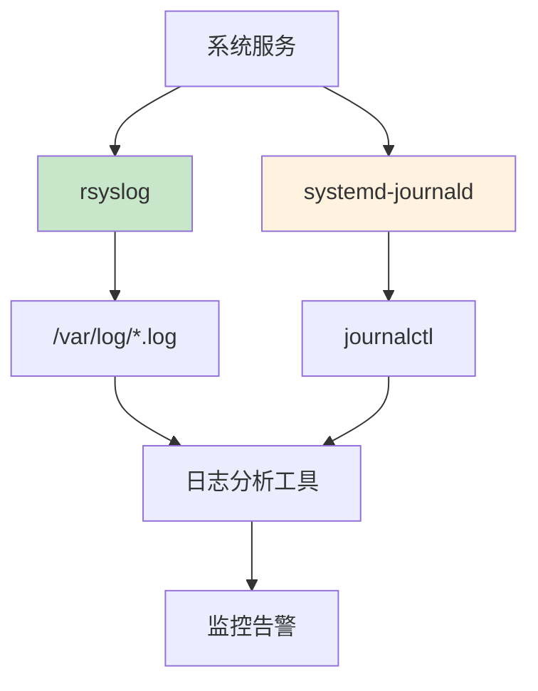
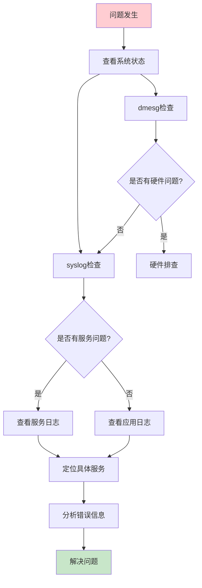

# Linux系统日志分析与故障定位：从dmesg到journalctl全攻略

## 情境与背景

Linux系统日志是故障定位的核心信息源，记录了系统运行的各种事件。作为高级DevOps/SRE工程师，掌握系统日志的位置、内容和分析方法是快速定位问题的关键。本博客详细介绍Linux系统日志体系、常用日志文件、分析工具和故障排查流程。

## 一、日志体系概述

### 1.1 日志分类

**日志分类体系**：

```yaml
# Linux日志分类
log_categories:
  - name: "内核日志"
    description: "记录内核启动、硬件驱动、系统调用等信息"
    examples:
      - "/var/log/dmesg"
      - "/var/log/kern.log"
      
  - name: "系统服务日志"
    description: "记录系统服务运行状态、启动停止等信息"
    examples:
      - "/var/log/syslog"
      - "/var/log/messages"
      
  - name: "认证日志"
    description: "记录用户登录、认证失败等信息"
    examples:
      - "/var/log/auth.log"
      - "/var/log/secure"
      
  - name: "应用日志"
    description: "记录各类应用程序运行日志"
    examples:
      - "/var/log/nginx/"
      - "/var/log/mysql/"
```

### 1.2 日志收集架构

**日志收集流程**：



## 二、常用系统日志详解

### 2.1 内核日志

**dmesg日志**：

```bash
# 查看dmesg日志
dmesg
dmesg | grep -i error
dmesg | grep -i warning

# 查看最近的内核消息
dmesg -T | tail -50

# 按时间过滤
dmesg --time-format=iso | grep "2024-01-15"
```

**kern.log日志**：

```bash
# 查看内核日志
tail -f /var/log/kern.log

# 过滤错误信息
grep -i "error\|warn\|fail" /var/log/kern.log
```

### 2.2 系统服务日志

**syslog日志**：

```bash
# 查看系统日志
tail -f /var/log/syslog

# 过滤特定服务
grep -i "nginx\|mysql\|docker" /var/log/syslog

# 按时间范围过滤
awk '$3 >= "10:00:00" && $3 <= "11:00:00"' /var/log/syslog
```

**messages日志**：

```bash
# 查看通用系统消息
cat /var/log/messages

# 查找特定关键词
grep -i "out of memory\|oom" /var/log/messages
```

### 2.3 认证日志

**auth.log日志**：

```bash
# 查看认证日志
tail -f /var/log/auth.log

# 查找登录失败
grep -i "failed\|failure" /var/log/auth.log

# 查找成功登录
grep -i "session opened" /var/log/auth.log

# 统计登录失败次数
grep -i "failed" /var/log/auth.log | wc -l
```

**secure日志**（CentOS/RHEL）：

```bash
# 查看安全日志
tail -f /var/log/secure

# 查找SSH登录
grep -i "ssh" /var/log/secure
```

### 2.4 应用日志

**常见应用日志位置**：

```yaml
# 应用日志位置
application_logs:
  - name: "Nginx"
    path: "/var/log/nginx/"
    files:
      - "access.log"
      - "error.log"
      
  - name: "Apache"
    path: "/var/log/apache2/"
    files:
      - "access.log"
      - "error.log"
      
  - name: "MySQL"
    path: "/var/log/mysql/"
    files:
      - "error.log"
      
  - name: "Docker"
    path: "/var/log/docker/"
    files:
      - "daemon.log"
```

## 三、日志工具详解

### 3.1 journalctl

**systemd日志工具**：

```bash
# 查看所有日志
journalctl

# 查看最近日志
journalctl -n 100

# 实时查看
journalctl -f

# 按时间范围
journalctl --since "2024-01-15" --until "2024-01-16"

# 按服务过滤
journalctl -u nginx
journalctl -u mysql

# 按进程过滤
journalctl _PID=1234

# 按优先级过滤
journalctl -p err
journalctl -p warning

# 输出格式
journalctl -o short-iso
journalctl -o json
```

### 3.2 grep

**文本搜索工具**：

```bash
# 基本用法
grep "ERROR" /var/log/syslog

# 忽略大小写
grep -i "error" /var/log/syslog

# 显示上下文
grep -A 5 -B 5 "ERROR" /var/log/syslog

# 递归搜索
grep -r "ERROR" /var/log/

# 统计匹配数量
grep -c "ERROR" /var/log/syslog
```

### 3.3 awk

**文本处理工具**：

```bash
# 提取特定字段
awk '{print $1, $2, $3, $NF}' /var/log/syslog

# 过滤时间范围
awk '$3 >= "10:00:00"' /var/log/syslog

# 统计分析
awk '/ERROR/ {count++} END {print count}' /var/log/syslog
```

### 3.4 tail与head

**查看文件首尾**：

```bash
# 查看最后100行
tail -n 100 /var/log/syslog

# 实时跟踪
tail -f /var/log/syslog

# 查看前100行
head -n 100 /var/log/syslog

# 查看最后100字节
tail -c 100 /var/log/syslog
```

## 四、故障排查流程

### 4.1 标准化排查流程

**排查流程图**：



### 4.2 排查清单

**故障排查清单**：

```yaml
# 故障排查清单
troubleshooting_checklist:
  - step: "检查系统状态"
    commands:
      - "uptime"
      - "top"
      - "free -h"
      - "df -h"
      
  - step: "检查内核日志"
    commands:
      - "dmesg | tail -50"
      - "cat /var/log/kern.log | tail -50"
      
  - step: "检查系统日志"
    commands:
      - "tail -f /var/log/syslog"
      - "journalctl -f"
      
  - step: "检查认证日志"
    commands:
      - "tail -50 /var/log/auth.log"
      
  - step: "检查相关服务"
    commands:
      - "systemctl status <service>"
      - "journalctl -u <service>"
```

### 4.3 常见问题排查

**常见问题日志定位**：

| 问题类型 | 优先查看日志 | 关键字 |
|:--------:|--------------|--------|
| **系统启动失败** | dmesg, syslog | failed, error, panic |
| **网络问题** | dmesg, syslog | network, eth0, bond |
| **磁盘问题** | dmesg, syslog | disk, sda, IO |
| **内存问题** | dmesg, messages | oom, memory, swap |
| **登录失败** | auth.log, secure | failed, sshd |
| **服务启动失败** | syslog, journalctl | failed, exited |

## 五、日志管理最佳实践

### 5.1 日志轮转

**logrotate配置**：

```bash
# /etc/logrotate.d/syslog
/var/log/syslog {
    daily
    rotate 7
    compress
    delaycompress
    missingok
    notifempty
    create 640 syslog adm
    sharedscripts
    postrotate
        /usr/lib/rsyslog/rsyslog-rotate
    endscript
}
```

### 5.2 日志集中管理

**ELK/EFK栈**：

```yaml
# 日志收集架构
log_collection:
  components:
    - name: "Filebeat"
      role: "日志收集"
      config: "/etc/filebeat/filebeat.yml"
      
    - name: "Logstash"
      role: "日志处理"
      config: "/etc/logstash/conf.d/"
      
    - name: "Elasticsearch"
      role: "日志存储"
      config: "/etc/elasticsearch/elasticsearch.yml"
      
    - name: "Kibana"
      role: "日志展示"
      config: "/etc/kibana/kibana.yml"
```

**Filebeat配置示例**：

```yaml
# filebeat.yml
filebeat.inputs:
  - type: log
    paths:
      - /var/log/*.log
      - /var/log/syslog
      - /var/log/auth.log
    
output.elasticsearch:
  hosts: ["elasticsearch:9200"]
  
setup.kibana:
  host: "kibana:5601"
```

### 5.3 日志监控告警

**Promtail + Loki + Grafana**：

```yaml
# Loki日志监控
loki_config:
  scrape_configs:
    - job_name: "system"
      static_configs:
        - targets:
            - localhost
          labels:
            job: "system"
            __path__: "/var/log/*.log"
```

**告警规则**：

```yaml
# Prometheus告警规则
groups:
  - name: log-alerts
    rules:
      - alert: HighErrorRate
        expr: |
          sum(rate({job="system"} |= "ERROR" [5m])) > 10
        for: 2m
        labels:
          severity: warning
          
      - alert: ServiceDown
        expr: |
          absent(rate({job="nginx"} [5m]))
        for: 5m
        labels:
          severity: critical
```

## 六、实战案例

### 6.1 案例一：系统启动失败

**问题**：系统启动后无法正常运行

```bash
# 查看dmesg
dmesg | grep -i error

# 查看系统日志
cat /var/log/syslog | grep -i failed

# 查看systemd状态
systemctl --failed

# 查看具体服务日志
journalctl -u failed-service
```

### 6.2 案例二：登录失败排查

**问题**：SSH登录失败

```bash
# 查看认证日志
tail -50 /var/log/auth.log

# 查找失败记录
grep -i "failed" /var/log/auth.log

# 检查SSH服务状态
systemctl status sshd

# 查看SSH配置
cat /etc/ssh/sshd_config | grep -i permitrootlogin
```

### 6.3 案例三：内存不足问题

**问题**：系统内存不足导致OOM

```bash
# 查看OOM日志
dmesg | grep -i "out of memory"

# 查看系统日志
grep -i oom /var/log/messages

# 查看当前内存使用
free -h

# 查看进程内存使用
ps aux --sort=-%mem | head -10
```

## 七、面试1分钟精简版（直接背）

**完整版**：

Linux常用系统日志包括：/var/log/dmesg用于查看内核启动信息和硬件驱动问题；/var/log/syslog记录系统服务运行状态；/var/log/auth.log记录认证和登录信息；/var/log/kern.log记录内核错误；/var/log/messages是通用系统消息日志。此外还有journalctl可以查看systemd日志，/var/log下还有各应用的独立日志目录。排查时先看dmesg和syslog定位问题类型，再深入具体日志。

**30秒超短版**：

dmesg看内核，syslog看系统，auth.log看认证，journalctl看systemd日志。

## 八、总结

### 8.1 日志文件速查表

| 日志文件 | 内容 | 用途 |
|:--------:|------|------|
| **/var/log/dmesg** | 内核启动信息 | 硬件驱动问题 |
| **/var/log/syslog** | 系统服务日志 | 服务运行状态 |
| **/var/log/auth.log** | 认证日志 | 登录失败排查 |
| **/var/log/kern.log** | 内核日志 | 内核错误排查 |
| **/var/log/messages** | 系统消息 | 通用系统日志 |

### 8.2 工具速查表

| 工具 | 用途 | 常用选项 |
|:----:|------|----------|
| **dmesg** | 查看内核消息 | -T, -n |
| **journalctl** | 查看systemd日志 | -f, -u, -p |
| **grep** | 文本搜索 | -i, -A, -B |
| **tail** | 查看文件末尾 | -f, -n |
| **awk** | 文本处理 | 字段提取、统计 |

### 8.3 排查口诀

```
系统问题先看dmesg，服务问题看syslog，
认证问题看auth.log，内存问题看messages，
journalctl统管systemd，grep/awk来帮忙，
日志集中用ELK，监控告警不能少。
```

### 8.4 最佳实践清单

```yaml
best_practices:
  - "定期检查系统日志"
  - "配置日志轮转，避免磁盘满"
  - "建立日志集中管理体系"
  - "配置日志监控告警"
  - "保留足够的日志历史"
  - "安全审计日志单独存储"
```

> **参考链接**：[SRE运维面试题全解析：从理论到实践（第二部分）]()