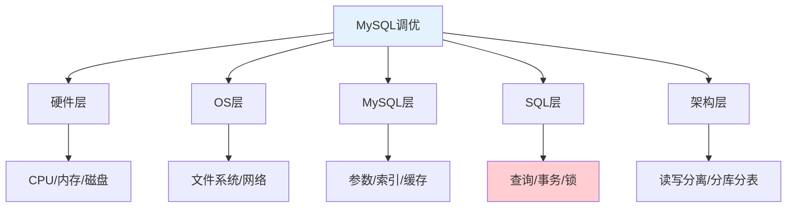
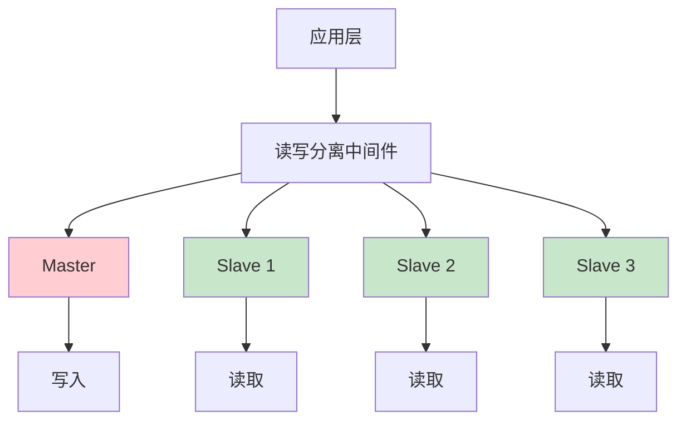

# MySQL全面调优：从SQL到架构的完整指南

## 情境与背景

MySQL调优是一个系统性工程，需要从硬件层、操作系统层、MySQL层、SQL层和架构层多个维度综合考虑。本指南将详细讲解每个维度的调优策略和最佳实践。

## 一、调优维度全景图

### 1.1 五层调优架构

**调优层次结构**：

```markdown
## 调优维度总览

**五层调优架构**：



**调优优先级**：

```yaml
tuning_priority:
  sql_layer:
    priority: "最高"
    reason: "收益最大、见效最快"
    effort: "中等"
    
  mysql_layer:
    priority: "高"
    reason: "配置优化提升整体性能"
    effort: "低"
    
  architecture_layer:
    priority: "高"
    reason: "解决数据量级问题"
    effort: "高"
    
  os_layer:
    priority: "中"
    reason: "基础环境优化"
    effort: "中"
    
  hardware_layer:
    priority: "低"
    reason: "成本较高"
    effort: "高"
```
```

## 二、SQL层优化（最重要）

### 2.1 索引优化

**索引设计原则**：

```markdown
## SQL层优化

### 索引优化

**索引设计原则**：

```yaml
index_design_principles:
  high_cardinality:
    description: "选择高选择性列"
    example: "user_id比status选择性高"
    
  leftmost_prefix:
    description: "复合索引遵循最左前缀"
    example: "idx(a,b,c) 支持 WHERE a=1, a=1 AND b=2"
    
  covering_index:
    description: "使用覆盖索引"
    example: "SELECT id,name FROM users WHERE name='test'"
    
  avoid_redundant:
    description: "避免冗余索引"
    example: "idx(a) 和 idx(a,b) 冗余"
```

**索引类型选择**：

```yaml
index_types:
  btree:
    description: "B+树索引"
    usage: "默认选择，适合范围查询"
    
  hash:
    description: "哈希索引"
    usage: "仅等值查询，Memory引擎"
    
  fulltext:
    description: "全文索引"
    usage: "文本搜索"
    
  composite:
    description: "复合索引"
    usage: "多条件查询"
    order: "区分度高的列放前面"
```

**索引维护**：

```bash
# 检查索引使用情况
SELECT * FROM sys.statements_with_indexes;

# 查看冗余索引
SELECT * FROM sys.schema_redundant_indexes;

# 重建碎片化索引
OPTIMIZE TABLE table_name;

# 分析表
ANALYZE TABLE table_name;
```
```

### 2.2 SQL语句优化

**常见SQL优化技巧**：

```markdown
### SQL语句优化

**SELECT优化**：

```yaml
select_optimization:
  avoid_select_star:
    bad: "SELECT * FROM users"
    good: "SELECT id, name, email FROM users"
    
  use_covering_index:
    description: "使用覆盖索引避免回表"
    example: "SELECT id, name FROM users WHERE name='test'"
    
  pagination_optimization:
    bad: "SELECT * FROM orders LIMIT 100000, 10"
    good: "SELECT * FROM orders WHERE id > 100000 ORDER BY id LIMIT 10"
```

**JOIN优化**：

```yaml
join_optimization:
  join_order:
    description: "小表驱动大表"
    example: "SELECT * FROM small_table s JOIN large_table l ON s.id = l.id"
    
  avoid_nested_loop:
    description: "避免嵌套循环"
    example: "使用EXISTS替代子查询"
    
  index_on_join_column:
    description: "连接列必须有索引"
    example: "ON s.id = l.id 两边都要有索引"
```

**UPDATE/DELETE优化**：

```yaml
update_delete_optimization:
  use_index:
    description: "确保使用索引"
    example: "UPDATE orders SET status=1 WHERE id=12345"
    
  batch_update:
    description: "批量更新"
    example: "UPDATE orders SET status=1 WHERE id IN (1,2,3,4,5)"
    
  avoid_lock_contention:
    description: "避免锁竞争"
    example: "分批更新大量数据"
```
```

### 2.3 事务优化

**事务隔离级别**：

```markdown
### 事务优化

**隔离级别对比**：

```yaml
transaction_isolation:
  READ_UNCOMMITTED:
    description: "读未提交"
    dirty_read: "允许"
    performance: "最高"
    usage: "几乎不用"
    
  READ_COMMITTED:
    description: "读已提交"
    dirty_read: "不允许"
    performance: "较高"
    usage: "Oracle默认"
    
  REPEATABLE_READ:
    description: "可重复读"
    dirty_read: "不允许"
    performance: "中等"
    usage: "MySQL默认"
    
  SERIALIZABLE:
    description: "串行化"
    dirty_read: "不允许"
    performance: "最低"
    usage: "几乎不用"
```

**事务使用原则**：

```yaml
transaction_best_practices:
  - "保持事务简短"
  - "避免长事务"
  - "选择合适的隔离级别"
  - "使用合理的锁范围"
  - "避免在事务中执行远程调用"
```
```

### 2.4 锁优化

**锁类型与排查**：

```markdown
### 锁优化

**锁类型**：

```yaml
lock_types:
  shared_lock:
    description: "共享锁"
    usage: "允许并发读"
    
  exclusive_lock:
    description: "排他锁"
    usage: "阻塞其他读写"
    
  record_lock:
    description: "记录锁"
    usage: "锁定单条记录"
    
  gap_lock:
    description: "间隙锁"
    usage: "锁定范围"
    
  next_key_lock:
    description: "临键锁"
    usage: "记录锁+间隙锁"
```

**锁等待排查**：

```sql
-- 查看锁等待
SELECT * FROM information_schema.INNODB_LOCK_WAITS;

-- 查看锁
SELECT * FROM information_schema.INNODB_LOCKS;

-- 查看事务
SELECT * FROM information_schema.INNODB_TRX;
```
```

## 三、MySQL层优化

### 3.1 缓冲池优化

**缓冲池配置**：

```markdown
## MySQL层优化

### 缓冲池优化

**关键参数**：

```yaml
buffer_pool_config:
  innodb_buffer_pool_size:
    description: "缓冲池大小"
    recommendation: "物理内存的50-70%"
    example: "32GB内存设置20GB"
    note: "不要超过物理内存"
    
  innodb_buffer_pool_instances:
    description: "缓冲池实例数"
    recommendation: "每4GB一个实例"
    example: "20GB内存设置5个实例"
    
  innodb_buffer_pool_dump_at_shutdown:
    description: "关闭时保存热点数据"
    recommendation: "开启"
    
  innodb_buffer_pool_load_at_startup:
    description: "启动时加载热点数据"
    recommendation: "开启"
```

**缓冲池监控**：

```sql
-- 查看缓冲池命中率
SELECT 
  (1 - (PI.pool_reads / PI.buffer_pool_read_requests)) * 100 AS hit_rate
FROM information_schema.INNODB_BUFFER_POOL_STATS PI;

-- 查看缓冲池状态
SHOW ENGINE INNODB STATUS\G

-- 查看页面统计
SELECT * FROM information_schema.INNODB_BUFFER_PAGE;
```
```

### 3.2 连接优化

**连接参数配置**：

```markdown
### 连接优化

**连接参数**：

```yaml
connection_config:
  max_connections:
    description: "最大连接数"
    recommendation: "根据业务需求"
    typical: "1000-5000"
    calculation: "max_connections =可用内存/单连接内存"
    
  wait_timeout:
    description: "非交互连接超时"
    recommendation: "60-300秒"
    typical: "120"
    
  interactive_timeout:
    description: "交互连接超时"
    recommendation: "60-300秒"
    typical: "120"
    
  thread_cache_size:
    description: "线程缓存大小"
    recommendation: "max_connections的10-20%"
```

**连接状态监控**：

```sql
-- 查看连接状态
SHOW STATUS LIKE 'Threads%';

-- 查看当前连接
SHOW PROCESSLIST;

-- 查看最大连接数
SHOW VARIABLES LIKE 'max_connections';
```
```

### 3.3 日志优化

**日志配置**：

```markdown
### 日志优化

**Binlog配置**：

```yaml
binlog_config:
  log_bin:
    description: "开启binlog"
    recommendation: "开启"
    
  binlog_format:
    description: "binlog格式"
    recommendation: "ROW"
    options:
      - "STATEMENT: 记录SQL语句"
      - "ROW: 记录行变化（推荐）"
      - "MIXED: 混合模式"
      
  sync_binlog:
    description: "binlog刷盘策略"
    recommendation: "1（最安全）或100（高性能）"
    
  expire_logs_days:
    description: "binlog保留天数"
    recommendation: "7"
```

**慢查询日志**：

```yaml
slow_query_log:
  slow_query_log:
    description: "开启慢查询日志"
    recommendation: "开启"
    
  long_query_time:
    description: "慢查询阈值"
    recommendation: "1秒"
    
  log_queries_not_using_indexes:
    description: "记录未使用索引查询"
    recommendation: "开启"
```
```

### 3.4 InnoDB核心参数

**InnoDB关键配置**：

```markdown
### InnoDB核心参数

**核心参数**：

```yaml
innodb_core_config:
  innodb_flush_log_at_trx_commit:
    description: "日志刷盘策略"
    options:
      - "0: 每秒刷盘，可能丢失数据"
      - "1: 每次提交刷盘（最安全）"
      - "2: 提交到OS缓存，每秒刷盘"
    recommendation: "1（安全） 或 2（性能）"
    
  innodb_log_file_size:
    description: "日志文件大小"
    recommendation: "256MB-2GB"
    note: "越大越好，但恢复时间越长"
    
  innodb_log_buffer_size:
    description: "日志缓冲区"
    recommendation: "64MB"
    
  innodb_file_per_table:
    description: "独立表空间"
    recommendation: "开启"
    
  innodb_flush_method:
    description: "刷盘方式"
    options:
      - "O_DIRECT: 直接IO（Linux推荐）"
      - "fdatasync: 同步IO"
```
```

## 四、OS层优化

### 4.1 磁盘IO优化

**IO调度策略**：

```markdown
## OS层优化

### 磁盘IO优化

**IO调度策略**：

```bash
# 查看当前调度策略
cat /sys/block/sda/queue/scheduler

# 设置调度策略（SSD建议用noop或deadline）
echo noop > /sys/block/sda/queue/scheduler

# 永久修改（CentOS 7）
grubby --update-kernel=ALL --args="elevator=noop"
```

**调度策略对比**：

```yaml
io_scheduler:
  cfq:
    description: "完全公平队列"
    suitable: "机械硬盘，IO负载均匀"
    
  deadline:
    description: "期限调度"
    suitable: "数据库IO"
    advantage: "保证延迟"
    
  noop:
    description: "NOOP调度"
    suitable: "SSD、虚拟化环境"
    advantage: "CPU开销最低"
    
  mq-deadline:
    description: "多队列期限调度"
    suitable: "现代SSD"
    advantage: "高并发优化"
```
```

### 4.2 网络优化

**网络参数优化**：

```markdown
### 网络优化

**内核参数**：

```bash
# 查看当前网络参数
sysctl -a | grep net.core

# 优化参数（添加到/etc/sysctl.conf）
cat >> /etc/sysctl.conf << EOF
# 网络优化
net.core.somaxconn = 65535
net.core.netdev_max_backlog = 65535
net.ipv4.tcp_max_syn_backlog = 65535
net.ipv4.tcp_fin_timeout = 30
net.ipv4.tcp_keepalive_time = 1200
net.ipv4.tcp_max_tw_buckets = 5000
net.ipv4.tcp_tw_reuse = 1
net.ipv4.ip_local_port_range = 1024 65535
EOF

# 生效配置
sysctl -p
```

**文件描述符**：

```bash
# 修改limits.conf
cat >> /etc/security/limits.conf << EOF
mysql soft nofile 65535
mysql hard nofile 65535
mysql soft nproc 65535
mysql hard nproc 65535
EOF
```
```

### 4.3 文件系统优化

**文件系统选择**：

```markdown
### 文件系统优化

**文件系统对比**：

```yaml
filesystem_comparison:
  ext4:
    description: "Ext4文件系统"
    advantage: "成熟稳定"
    disadvantage: "不适合大文件"
    suitable: "通用场景"
    
  xfs:
    description: "XFS文件系统"
    advantage: "高性能、大文件支持"
    disadvantage: "元数据操作较慢"
    suitable: "大数据库"
    
  btrfs:
    description: "BTRFS文件系统"
    advantage: "支持快照、压缩"
    disadvantage: "生产环境稳定性待验证"
    suitable: "需要快照的场景"
```

**文件系统挂载选项**：

```bash
# 查看当前挂载选项
mount | grep /data

# 推荐挂载选项（MySQL数据目录）
# noatime: 不记录访问时间
# nodiratime: 不记录目录访问时间
# barrier=0: 禁用写入屏障（使用电池备份RAID时可开启）
mount -o noatime,nodiratime,barrier=0 /dev/sdb1 /data
```
```

## 五、架构层优化

### 5.1 读写分离

**读写分离架构**：

```markdown
## 架构层优化

### 读写分离

**架构设计**：



**实现方式**：

```yaml
read_write_split:
  proxy:
    description: "中间件代理"
    tools: ["ProxySQL", "MySQL Router", "Atlas"]
    advantage: "对应用透明"
    
  application:
    description: "应用层分离"
    method: "动态数据源路由"
    advantage: "灵活可控"
    disadvantage: "需要改代码"
    
  gtid:
    description: "基于GTID的读写分离"
    advantage: "自动故障转移"
    disadvantage: "需要MySQL 5.6+"
```

**配置示例（ProxySQL）**：

```bash
# 添加MySQL节点
INSERT INTO mysql_servers (hostgroup_id, hostname, port) VALUES (1, 'master_host', 3306);
INSERT INTO mysql_servers (hostgroup_id, hostname, port) VALUES (2, 'slave1_host', 3306);
INSERT INTO mysql_servers (hostgroup_id, hostname, port) VALUES (2, 'slave2_host', 3306);

# 配置用户
INSERT INTO mysql_users (username, password, default_hostgroup) VALUES ('app_user', 'password', 1);

# 配置路由规则
INSERT INTO mysql_query_rules (rule_id, match_pattern, destination_hostgroup, apply) 
VALUES (1, '^SELECT.*FOR UPDATE$', 1, 1);
INSERT INTO mysql_query_rules (rule_id, match_pattern, destination_hostgroup, apply) 
VALUES (2, '^SELECT', 2, 1);
```
```

### 5.2 分库分表

**分片策略**：

```markdown
### 分库分表

**分片策略**：

```yaml
sharding_strategies:
  vertical:
    description: "垂直分库"
    method: "按业务模块拆分"
    example: "用户库、订单库、商品库"
    advantage: "简单直接"
    
  horizontal:
    description: "水平分表"
    method: "按数据量拆分"
    example: "按user_id哈希分表"
    advantage: "数据量可控"
    
  sharding_key:
    description: "分片键选择"
    principles:
      - "选择查询频繁的列"
      - "避免跨分片查询"
      - "均匀分布数据"
    examples:
      - "user_id: 用户中心"
      - "order_id: 订单系统"
      - "time: 日志系统"
```

**分片工具**：

```yaml
sharding_tools:
  MyCat:
    description: "Java实现"
    advantage: "功能完善"
    
  ShardingSphere:
    description: "Apache顶级项目"
    advantage: "生态好"
    
  Vitess:
    description: "YouTube开源"
    advantage: "成熟度高"
    
  TiDB:
    description: "NewSQL"
    advantage: "分布式原生"
```
```

### 5.3 缓存策略

**多级缓存架构**：

```markdown
### 缓存策略

**缓存层次**：

```yaml
cache_hierarchy:
  local_cache:
    description: "本地缓存"
    tools: ["Caffeine", "Guava Cache"]
    usage: "热点数据"
    advantage: "无网络开销"
    disadvantage: "内存有限"
    
  distributed_cache:
    description: "分布式缓存"
    tools: ["Redis", "Memcached"]
    usage: "Session、热点数据"
    advantage: "跨进程共享"
    disadvantage: "有网络开销"
    
  cdn_cache:
    description: "CDN缓存"
    usage: "静态资源"
    advantage: "就近访问"
```

**缓存策略**：

```yaml
cache_strategy:
  cache_aside:
    description: "旁路缓存"
    flow: "先查缓存，缓存miss查DB，写入DB并更新缓存"
    usage: "读多写少"
    
  write_through:
    description: "写穿透"
    flow: "写入DB同时写入缓存"
    usage: "数据一致性要求高"
    
  write_back:
    description: "写回"
    flow: "先写缓存，定期写DB"
    usage: "写性能要求高"
```
```

## 六、调优工具与方法

### 6.1 性能分析工具

**常用分析工具**：

```markdown
## 调优工具

### 性能分析工具

**系统工具**：

```bash
# CPU、内存、IO监控
top
htop
vmstat 1
iostat -x 1 10

# 网络监控
netstat -s
ss -s

# 磁盘IO
iotop
iostat
```

**MySQL工具**：

```bash
# 慢查询分析
mysqldumpslow -s t /var/log/mysql/slow.log
pt-query-digest /var/log/mysql/slow.log

# 索引分析
EXPLAIN
SHOW INDEX FROM table_name

# 状态分析
SHOW ENGINE INNODB STATUS
SHOW PROCESSLIST
SHOW STATUS LIKE '%'
SHOW VARIABLES LIKE '%'
```

**Percona Toolkit**：

```bash
# 安装
yum install percona-toolkit

# 常用工具
pt-query-digest     # 慢查询分析
pt-index-usage      # 索引使用分析
pt-duplicate-key-checker  # 冗余索引检查
pt-table-checksum   # 主从数据一致性检查
pt-kill             # 杀掉慢查询
```
```

### 6.2 调优流程

**系统性调优步骤**：

```markdown
### 调优流程

**调优步骤**：

```yaml
tuning_steps:
  step_1:
    title: "确定基线"
    action: "记录当前性能指标"
    metrics:
      - "QPS/TPS"
      - "响应时间"
      - "连接数"
      - "CPU/内存/IO"
      
  step_2:
    title: "识别瓶颈"
    action: "使用工具定位问题"
    tools:
      - "慢查询日志"
      - "EXPLAIN"
      - "系统监控"
      
  step_3:
    title: "制定方案"
    action: "根据瓶颈制定优化方案"
    priorities:
      - "SQL层优化"
      - "配置优化"
      - "架构优化"
      
  step_4:
    title: "实施优化"
    action: "小范围测试后上线"
    method: "灰度发布"
    
  step_5:
    title: "验证效果"
    action: "对比优化前后指标"
    method: "AB测试"
```
```

## 七、面试1分钟精简版（直接背）

**完整版**：

MySQL调优有五个维度：1. SQL层优化（最重要）：索引优化、SQL语句优化、避免全表扫描；2. MySQL层优化：调整innodb_buffer_pool_size、max_connections等参数；3. OS层优化：磁盘调度、网络参数、内核参数；4. 硬件层：根据负载选择SSD、增加内存；5. 架构层：读写分离、分库分表、引入缓存。实际工作中，我们通常先从SQL层入手，因为收益最大。

**30秒超短版**：

MySQL调优分五层，SQL层最关键（索引、查询、事务、锁），其次MySQL配置层（缓冲池、连接数、日志），然后OS层（IO调度、网络），最后架构层（读写分离、分库分表）。

## 八、总结

### 8.1 调优维度总结

```yaml
tuning_summary:
  sql_layer:
    priority: 1
    items: ["索引优化", "SQL优化", "事务优化", "锁优化"]
    
  mysql_layer:
    priority: 2
    items: ["缓冲池", "连接数", "日志", "InnoDB参数"]
    
  architecture_layer:
    priority: 3
    items: ["读写分离", "分库分表", "缓存"]
    
  os_layer:
    priority: 4
    items: ["IO调度", "网络", "文件系统"]
    
  hardware_layer:
    priority: 5
    items: ["SSD", "内存", "CPU"]
```

### 8.2 最佳实践清单

```yaml
best_practices:
  daily:
    - "监控慢查询"
    - "检查连接数"
    - "查看缓冲池命中率"
    
  weekly:
    - "分析慢查询日志"
    - "检查索引使用情况"
    - "检查锁等待"
    
  monthly:
    - "全面性能评估"
    - "容量规划"
    - "架构优化评审"
    
  quarterly:
    - "压测验证"
    - "配置审计"
    - "技术分享"
```

### 8.3 记忆口诀

```
MySQL调优分五层，SQL层排第一，
索引SQL事务锁，配置层排第二，
缓冲连接和日志，架构层排第三，
读写分离分库表，OS层排第四，
IO调度网络文件系统，硬件层排第五，
成本高见效慢，调优顺序要记牢。
```

> **参考链接**：[SRE运维面试题全解析：从理论到实践（第二部分）]()