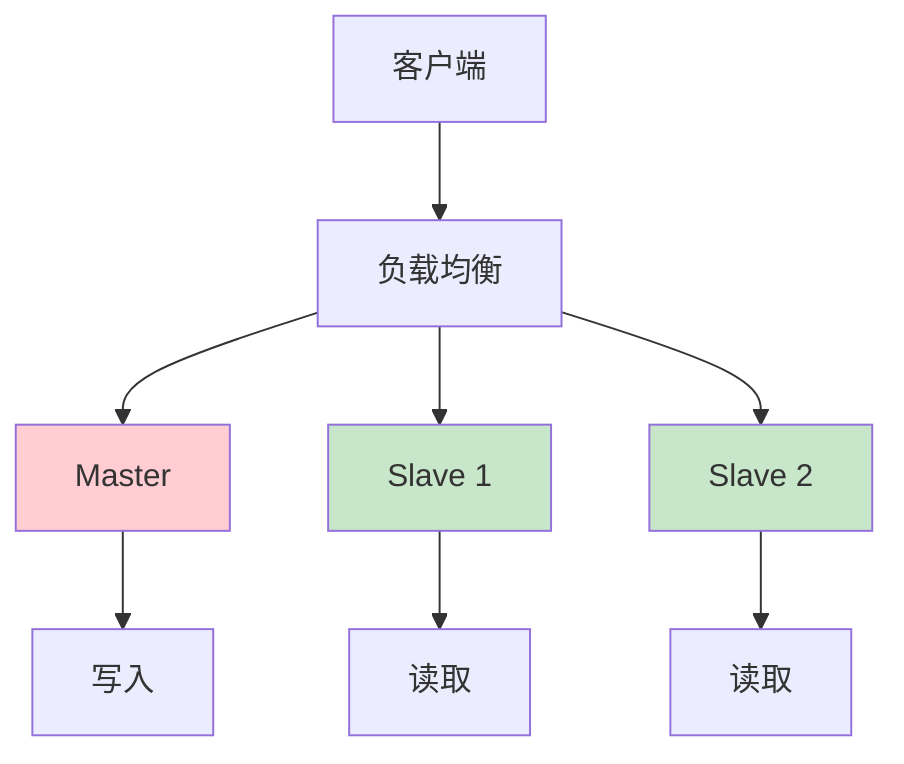
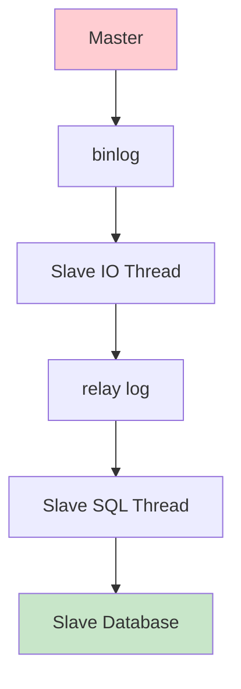

# MySQL优化与主从复制：从原理到生产环境最佳实践

## 情境与背景

MySQL是互联网行业最常用的关系型数据库之一。深入理解MySQL的优化方法和主从复制原理，对于构建高性能、高可用的数据库系统至关重要。

## 一、常用数据库概述

### 1.1 数据库分类

**数据库类型对比**：

```yaml
database_types:
  relational:
    name: "关系型数据库"
    examples: ["MySQL", "PostgreSQL", "Oracle", "SQL Server"]
    use_case: "结构化数据、事务处理"
    
  nosql:
    name: "非关系型数据库"
    examples: ["MongoDB", "Redis", "Cassandra", "Elasticsearch"]
    use_case: "非结构化数据、高并发"
    
  new_sql:
    name: "NewSQL数据库"
    examples: ["TiDB", "CockroachDB", "Spanner"]
    use_case: "分布式事务、水平扩展"
```

### 1.2 常用数据库对比

**数据库特性对比**：

| 数据库 | 类型 | 优势 | 适用场景 |
|:------:|------|------|----------|
| **MySQL** | 关系型 | 开源、高性能、生态成熟 | 互联网业务、中小型系统 |
| **PostgreSQL** | 关系型 | 功能强大、支持JSON | 复杂查询、数据分析 |
| **Redis** | 缓存 | 高性能、支持多种数据结构 | 缓存、会话管理 |
| **MongoDB** | 文档型 | 灵活schema、水平扩展 | 日志存储、内容管理 |
| **TiDB** | NewSQL | 分布式、强一致 | 大规模数据、高并发 |

## 二、MySQL优化详解

### 2.1 索引优化

**索引原理与优化**：

```markdown
## 索引优化

**索引类型**：

```yaml
index_types:
  btree:
    description: "B+树索引"
    usage: "最常用，适合范围查询"
    example: "CREATE INDEX idx_name ON users(name)"
    
  hash:
    description: "哈希索引"
    usage: "等值查询，不支持范围"
    example: "适合内存表"
    
  fulltext:
    description: "全文索引"
    usage: "文本搜索"
    example: "CREATE FULLTEXT INDEX idx_content ON articles(content)"
    
  spatial:
    description: "空间索引"
    usage: "地理位置查询"
    example: "适合GIS应用"
```

**索引失效场景**：

```yaml
index_failure_scenarios:
  - "SELECT * FROM users WHERE name LIKE '%test%'"  # 前缀模糊
  - "SELECT * FROM users WHERE age + 1 = 30"        # 函数运算
  - "SELECT * FROM users WHERE status = 1 OR age > 18" # OR条件
  - "SELECT * FROM users WHERE name = 'test' COLLATE utf8_bin" # 字符集不同
  - "SELECT * FROM users WHERE id IN (SELECT id FROM orders)" # 子查询
```

**索引最佳实践**：

```yaml
index_best_practices:
  - "选择高基数列作为索引"
  - "复合索引遵循最左前缀原则"
  - "避免冗余索引"
  - "定期重建碎片化索引"
  - "使用覆盖索引减少回表"
```
```

### 2.2 SQL优化

**SQL优化技巧**：

```markdown
## SQL优化

**查询优化**：

```yaml
sql_optimization:
  select_specific_columns:
    bad: "SELECT * FROM users"
    good: "SELECT id, name, email FROM users"
    
  join_optimization:
    bad: "SELECT * FROM orders o, users u WHERE o.user_id = u.id"
    good: "SELECT o.id, o.amount, u.name FROM orders o JOIN users u ON o.user_id = u.id"
    
  subquery_optimization:
    bad: "SELECT * FROM users WHERE id IN (SELECT user_id FROM orders)"
    good: "SELECT u.* FROM users u JOIN orders o ON u.id = o.user_id"
    
  limit_optimization:
    bad: "SELECT * FROM orders ORDER BY id LIMIT 100000, 10"
    good: "SELECT * FROM orders WHERE id > 100000 ORDER BY id LIMIT 10"
```

**执行计划分析**：

```bash
# 查看执行计划
EXPLAIN SELECT * FROM users WHERE name = 'test';

# 查看详细执行计划
EXPLAIN ANALYZE SELECT * FROM users WHERE name = 'test';

# 查看profile
SET profiling = 1;
SELECT * FROM users WHERE name = 'test';
SHOW PROFILE;
```
```

### 2.3 配置优化

**关键配置参数**：

```markdown
## 配置优化

**内存配置**：

```yaml
memory_configuration:
  innodb_buffer_pool_size:
    description: "InnoDB缓冲池大小"
    recommendation: "物理内存的50-70%"
    example: "8GB内存设置为5G"
    
  innodb_log_buffer_size:
    description: "日志缓冲区大小"
    recommendation: "16-64MB"
    example: "64M"
    
  query_cache_size:
    description: "查询缓存大小"
    recommendation: "MySQL 8.0已移除"
    note: "使用应用层缓存替代"
    
  tmp_table_size:
    description: "临时表大小"
    recommendation: "64-256MB"
    example: "128M"
```

**连接配置**：

```yaml
connection_configuration:
  max_connections:
    description: "最大连接数"
    recommendation: "根据业务需求设置"
    example: "1000"
    
  wait_timeout:
    description: "连接空闲超时"
    recommendation: "60-300秒"
    example: "120"
    
  interactive_timeout:
    description: "交互式连接超时"
    recommendation: "60-300秒"
    example: "120"
```

**InnoDB配置**：

```yaml
innodb_configuration:
  innodb_flush_log_at_trx_commit:
    description: "日志刷新策略"
    values:
      - "1: 每次事务提交刷新（最安全）"
      - "2: 每秒刷新（平衡性能和安全）"
      - "0: 由操作系统决定（性能最好，最不安全）"
    production: 1
    
  innodb_file_per_table:
    description: "每张表独立表空间"
    recommendation: "开启"
    value: "ON"
    
  innodb_doublewrite:
    description: "双写缓冲"
    recommendation: "开启"
    value: "ON"
```
```

### 2.4 架构优化

**架构扩展方案**：

```markdown
## 架构优化

**读写分离**：



**分库分表**：

```yaml
sharding_strategy:
  vertical:
    description: "垂直分库"
    example: "按业务模块拆分"
    benefit: "隔离不同业务"
    
  horizontal:
    description: "水平分表"
    example: "按user_id哈希拆分"
    benefit: "单表数据量可控"
    
  sharding_key:
    description: "分片键选择"
    recommendation: "选择查询频繁的列"
    example: "user_id, order_id"
```

**缓存策略**：

```yaml
caching_strategy:
  redis_cache:
    description: "Redis缓存"
    usage: "热点数据缓存"
    example: "用户信息、商品信息"
    
  query_cache:
    description: "应用层缓存"
    usage: "查询结果缓存"
    example: "ORM框架缓存"
    
  cache_warmup:
    description: "缓存预热"
    usage: "系统启动时加载热点数据"
    benefit: "避免缓存击穿"
```
```

## 三、主从复制原理

### 3.1 复制架构

**复制架构图**：

```markdown
## 复制原理

**复制架构**：



**复制流程**：

```yaml
replication_flow:
  step_1:
    description: "Master执行SQL"
    action: "记录到binlog"
    
  step_2:
    description: "Slave连接Master"
    action: "IO线程请求binlog"
    
  step_3:
    description: "Master发送binlog"
    action: "通过网络传输"
    
  step_4:
    description: "Slave接收binlog"
    action: "写入relay log"
    
  step_5:
    description: "Slave执行relay log"
    action: "SQL线程重放SQL"
```
```

### 3.2 复制模式

**复制模式对比**：

```markdown
## 复制模式

**异步复制**：

```yaml
async_replication:
  description: "异步复制"
  behavior: "Master不等待Slave确认"
  advantage: "性能最好"
  disadvantage: "可能丢失数据"
  use_case: "非关键业务"
```

**半同步复制**：

```yaml
semi_sync_replication:
  description: "半同步复制"
  behavior: "Master等待至少一个Slave确认"
  advantage: "数据安全有保障"
  disadvantage: "性能略有下降"
  use_case: "关键业务"
  configuration:
    - "plugin_load_add = rpl_semi_sync_master.so"
    - "plugin_load_add = rpl_semi_sync_slave.so"
    - "loose_rpl_semi_sync_master_enabled = 1"
    - "loose_rpl_semi_sync_slave_enabled = 1"
```

**GTID复制**：

```yaml
gtid_replication:
  description: "GTID复制"
  behavior: "基于全局事务ID"
  advantage: "自动故障转移、简化复制配置"
  disadvantage: "需要MySQL 5.6+"
  use_case: "高可用架构"
  configuration:
    - "gtid_mode = ON"
    - "enforce_gtid_consistency = ON"
    - "log_slave_updates = ON"
```
```

### 3.3 复制配置

**主从配置步骤**：

```markdown
## 复制配置

**Master配置**：

```bash
# my.cnf配置
[mysqld]
server-id = 1
log_bin = /var/log/mysql/mysql-bin.log
binlog_format = row
expire_logs_days = 7
max_binlog_size = 1G
```

**Slave配置**：

```bash
# my.cnf配置
[mysqld]
server-id = 2
relay_log = /var/log/mysql/relay-bin.log
read_only = 1
log_slave_updates = 1
```

**建立复制**：

```bash
# 在Master上创建复制用户
CREATE USER 'repl'@'%' IDENTIFIED BY 'password';
GRANT REPLICATION SLAVE ON *.* TO 'repl'@'%';

# 在Master上获取binlog位置
FLUSH TABLES WITH READ LOCK;
SHOW MASTER STATUS;
# 记录File和Position

# 在Slave上配置复制
CHANGE MASTER TO
  MASTER_HOST='master_host',
  MASTER_USER='repl',
  MASTER_PASSWORD='password',
  MASTER_LOG_FILE='mysql-bin.000001',
  MASTER_LOG_POS=154;

# 启动复制
START SLAVE;

# 检查复制状态
SHOW SLAVE STATUS\G
```
```

## 四、生产环境最佳实践

### 4.1 监控与告警

**关键监控指标**：

```markdown
## 监控与告警

**监控指标**：

```yaml
monitoring_metrics:
  performance:
    - "Queries per second"
    - "Slow queries"
    - "Connection count"
    - "Buffer pool hit ratio"
    
  replication:
    - "Slave lag"
    - "Replication status"
    - "Seconds behind master"
    
  storage:
    - "Disk usage"
    - "InnoDB buffer pool usage"
    - "Binary log size"
```

**告警规则**：

```yaml
alert_rules:
  slow_queries:
    condition: "slow_queries > 100 per minute"
    severity: "warning"
    
  slave_lag:
    condition: "seconds_behind_master > 300"
    severity: "critical"
    
  connection_count:
    condition: "connections > 80% of max_connections"
    severity: "warning"
    
  disk_usage:
    condition: "disk_usage > 80%"
    severity: "warning"
```
```

### 4.2 备份与恢复

**备份策略**：

```markdown
## 备份与恢复

**备份方法**：

```yaml
backup_methods:
  mysqldump:
    description: "逻辑备份"
    usage: "适合小中型数据库"
    example: "mysqldump -u root -p --all-databases > backup.sql"
    
  xtrabackup:
    description: "物理备份"
    usage: "适合大型数据库"
    advantage: "快速恢复"
    example: "innobackupex --user=root --password=password /backup"
    
  lvm_snapshot:
    description: "LVM快照"
    usage: "快速备份"
    advantage: "几乎不影响业务"
```

**恢复流程**：

```yaml
recovery_process:
  step_1:
    description: "停止业务"
    action: "确保数据一致性"
    
  step_2:
    description: "恢复备份"
    action: "使用备份文件恢复"
    
  step_3:
    description: "应用增量日志"
    action: "恢复备份后到故障前的数据"
    
  step_4:
    description: "验证数据"
    action: "检查数据完整性"
    
  step_5:
    description: "启动业务"
    action: "切换流量"
```
```

### 4.3 高可用架构

**高可用方案**：

```markdown
## 高可用架构

**MHA架构**：

```yaml
mha_architecture:
  description: "Master High Availability"
  components:
    - "Manager节点"
    - "Master节点"
    - "多个Slave节点"
  advantage: "自动故障转移"
  disadvantage: "需要额外组件"
```

**ProxySQL架构**：

```yaml
proxysql_architecture:
  description: "SQL代理"
  components:
    - "ProxySQL节点"
    - "Master节点"
    - "多个Slave节点"
  advantage: "读写分离、负载均衡"
  disadvantage: "单点故障风险"
```

**MySQL Group Replication**：

```yaml
group_replication:
  description: "组复制"
  components:
    - "多个节点组成集群"
    - "自动选主"
    - "多主模式"
  advantage: "高可用、自动故障转移"
  disadvantage: "配置复杂"
```
```

## 五、实战案例

### 5.1 案例：慢查询优化

**案例描述**：

```markdown
## 案例1：慢查询优化

**问题**：
某查询耗时超过5秒，严重影响用户体验。

**分析过程**：

```yaml
problem_analysis:
  query: "SELECT * FROM orders WHERE user_id = 12345 ORDER BY create_time DESC LIMIT 10"
  table_size: "1000万行"
  index_status: "没有合适的索引"
  
  explain_result:
    type: "ALL"  # 全表扫描
    rows: "10000000"
    Extra: "Using filesort"
```

**解决方案**：

```yaml
solution:
  create_index: "CREATE INDEX idx_user_time ON orders(user_id, create_time)"
  
  optimized_query: "SELECT id, order_no, amount FROM orders WHERE user_id = 12345 ORDER BY create_time DESC LIMIT 10"
  
  result:
    before: "5秒+"
    after: "<100ms"
    improvement: "50倍+"
```
```

### 5.2 案例：主从复制延迟

**案例描述**：

```markdown
## 案例2：复制延迟

**问题**：
Slave延迟超过5分钟，影响读数据一致性。

**分析过程**：

```yaml
problem_analysis:
  slave_lag: "300秒+"
  master_write: "高写入压力"
  slave_config: "配置不合理"
  
  check_items:
    - "innodb_buffer_pool_size太小"
    - "relay_log空间不足"
    - "网络延迟"
    - "大事务阻塞"
```

**解决方案**：

```yaml
solution:
  config_tuning:
    - "innodb_buffer_pool_size = 4G"
    - "innodb_log_file_size = 512M"
    - "sync_relay_log = 10000"
    
  optimize_writes:
    - "拆分大事务"
    - "使用批量操作"
    - "异步写入非关键数据"
    
  result:
    before: "300秒+"
    after: "<10秒"
```
```

## 六、面试1分钟精简版（直接背）

**完整版**：

常用数据库包括MySQL、PostgreSQL、Redis。MySQL优化方面：1. 索引优化：创建合适的B+树索引，避免索引失效；2. SQL优化：避免SELECT *、使用覆盖索引、优化JOIN；3. 配置优化：调整innodb_buffer_pool_size、max_connections等参数；4. 架构优化：读写分离、分库分表。主从复制原理：Master记录binlog，Slave通过IO线程拉取binlog到relay log，SQL线程执行relay log实现数据同步，支持异步、半同步、GTID模式。

**30秒超短版**：

常用MySQL、PostgreSQL、Redis；优化包括索引、SQL、配置、架构；主从复制：Master写binlog，Slave IO线程拉取，SQL线程执行，支持异步、半同步、GTID。

## 七、总结

### 7.1 MySQL优化要点

```yaml
mysql_optimization_summary:
  index:
    - "创建合适的B+树索引"
    - "遵循最左前缀原则"
    - "避免索引失效"
    
  sql:
    - "避免SELECT *"
    - "使用覆盖索引"
    - "优化JOIN和子查询"
    
  configuration:
    - "调整内存参数"
    - "优化InnoDB配置"
    - "设置合理连接数"
    
  architecture:
    - "读写分离"
    - "分库分表"
    - "引入缓存"
```

### 7.2 主从复制要点

```yaml
replication_summary:
  flow:
    - "Master记录binlog"
    - "Slave IO线程拉取"
    - "写入relay log"
    - "SQL线程执行"
    
  modes:
    - "异步：性能最好，可能丢失数据"
    - "半同步：平衡性能和安全"
    - "GTID：自动故障转移"
    
  best_practices:
    - "使用半同步复制"
    - "配置GTID"
    - "监控复制延迟"
```

### 7.3 最佳实践清单

```yaml
best_practices:
  monitoring:
    - "监控慢查询"
    - "监控复制状态"
    - "设置告警规则"
    
  backup:
    - "定期备份"
    - "测试恢复流程"
    - "保留多份备份"
    
  high_availability:
    - "部署主从复制"
    - "配置自动故障转移"
    - "定期演练"
```

### 7.4 记忆口诀

```
MySQL优化有方法，索引SQL配置架构，
索引创建要合理，SQL书写有技巧，
配置调优看参数，架构扩展分库表，
主从复制三步骤，binlog relay SQL执行，
异步半同步GTID，生产环境半同步。
```

> **参考链接**：[SRE运维面试题全解析：从理论到实践（第二部分）]()