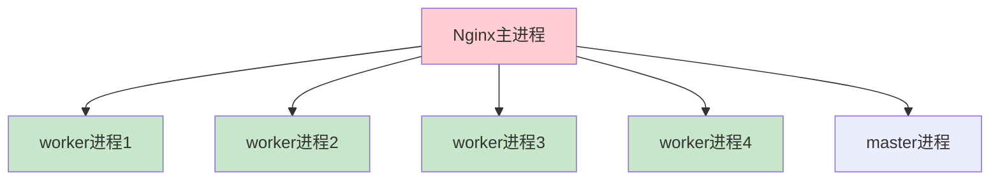
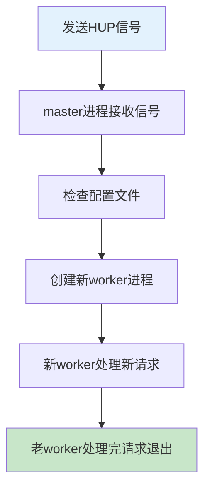
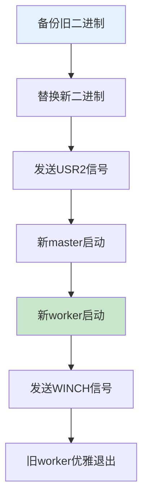

# Nginx运维实战：从启动到平滑重载全解析

## 情境与背景

Nginx作为高性能Web服务器和反向代理，其运维操作直接影响服务的可用性。理解Nginx的启动、停止、重启和重载命令的区别，以及掌握平滑重载的原理，是高级DevOps/SRE工程师必备的技能。本博客详细介绍Nginx的进程管理机制和运维最佳实践。

## 一、Nginx进程结构

### 1.1 进程架构

**Nginx进程模型**：



**进程类型说明**：

| 进程类型 | 角色 | 特点 |
|:--------:|------|------|
| **Master进程** | 管理进程 | 读取配置、启动worker、监控worker |
| **Worker进程** | 工作进程 | 处理客户端请求 |

### 1.2 进程管理机制

**信号机制**：

```yaml
# Nginx信号处理
signals:
  - name: "TERM/INT"
    action: "强制停止"
    description: "立即终止所有进程"
    
  - name: "QUIT"
    action: "优雅停止"
    description: "处理完当前请求后停止"
    
  - name: "HUP"
    action: "重载配置"
    description: "平滑重启，零停机"
    
  - name: "USR1"
    action: "重新打开日志"
    description: "用于日志轮转"
    
  - name: "USR2"
    action: "升级二进制"
    description: "热升级Nginx版本"
    
  - name: "WINCH"
    action: "优雅关闭worker"
    description: "准备升级"
```

## 二、常用命令详解

### 2.1 启动命令

**启动方式**：

```bash
# 方式1：直接启动
nginx

# 方式2：指定配置文件
nginx -c /etc/nginx/nginx.conf

# 方式3：指定前缀路径
nginx -p /usr/local/nginx/

# 方式4：测试配置文件
nginx -t
nginx -t -c /etc/nginx/nginx.conf

# 方式5：查看版本
nginx -v
nginx -V  # 显示编译参数
```

### 2.2 停止命令

**停止方式对比**：

```bash
# 方式1：优雅停止（推荐）
nginx -s quit

# 方式2：强制停止
nginx -s stop

# 方式3：使用kill命令
kill -QUIT <master_pid>  # 优雅停止
kill -TERM <master_pid>  # 强制停止
kill -INT <master_pid>   # 强制停止

# 方式4：systemd管理
systemctl stop nginx
```

**停止方式对比表**：

| 方式 | 命令 | 特点 | 适用场景 |
|:----:|------|------|----------|
| **优雅停止** | `nginx -s quit` | 处理完请求后退出 | 正常维护 |
| **强制停止** | `nginx -s stop` | 立即终止 | 紧急情况 |

### 2.3 重启命令

**重启方式**：

```bash
# 方式1：systemd重启
systemctl restart nginx

# 方式2：停止+启动
nginx -s stop && nginx

# 方式3：优雅停止+启动
nginx -s quit && nginx
```

### 2.4 重载命令

**重载方式**：

```bash
# 方式1：使用信号
nginx -s reload

# 方式2：使用kill命令
kill -HUP <master_pid>

# 方式3：systemd重载
systemctl reload nginx
```

**重载流程**：



## 三、reload与restart的区别

### 3.1 原理对比

**reload原理**：

```yaml
reload_process:
  step: 1
  description: "master进程接收HUP信号"
  
  step: 2
  description: "master进程检查配置文件语法"
  
  step: 3
  description: "master进程启动新worker进程"
  
  step: 4
  description: "新worker进程开始处理新请求"
  
  step: 5
  description: "master进程向老worker进程发送QUIT信号"
  
  step: 6
  description: "老worker进程处理完当前请求后退出"
```

**restart原理**：

```yaml
restart_process:
  step: 1
  description: "停止所有进程"
  
  step: 2
  description: "等待进程完全退出"
  
  step: 3
  description: "启动新进程"
  
  step: 4
  description: "新进程开始处理请求"
```

### 3.2 对比表

**reload vs restart**：

| 特性 | reload | restart |
|:----:|--------|---------|
| **停机时间** | 零停机 | 有停机时间 |
| **配置验证** | 验证配置 | 验证配置 |
| **进程替换** | 平滑替换 | 完全替换 |
| **适用场景** | 配置变更 | 二进制升级 |
| **风险** | 低 | 高（配置错误会导致服务中断） |

### 3.3 适用场景

**场景选择**：

```yaml
# 场景选择
scenarios:
  - name: "配置文件变更"
    recommendation: "使用reload"
    reason: "零停机，配置错误不会影响服务"
    
  - name: "Nginx版本升级"
    recommendation: "使用热升级或restart"
    reason: "需要替换二进制文件"
    
  - name: "紧急修复"
    recommendation: "使用reload"
    reason: "快速生效，不影响用户"
    
  - name: "系统维护"
    recommendation: "使用restart"
    reason: "确保完全重启"
```

## 四、热升级

### 4.1 热升级流程

**热升级步骤**：

```bash
# 步骤1：备份旧二进制
cp /usr/sbin/nginx /usr/sbin/nginx.old

# 步骤2：替换新二进制
cp /path/to/new/nginx /usr/sbin/nginx

# 步骤3：发送USR2信号
kill -USR2 <master_pid>

# 步骤4：发送WINCH信号（可选，优雅关闭旧worker）
kill -WINCH <old_master_pid>

# 步骤5：测试后关闭旧master（可选）
kill -QUIT <old_master_pid>
```

**热升级流程图**：



### 4.2 回滚操作

**回滚步骤**：

```bash
# 步骤1：发送HUP信号给旧master
kill -HUP <old_master_pid>

# 步骤2：发送QUIT信号给新master
kill -QUIT <new_master_pid>
```

## 五、配置验证

### 5.1 配置测试

**配置验证命令**：

```bash
# 测试配置文件
nginx -t

# 指定配置文件测试
nginx -t -c /etc/nginx/nginx.conf

# 详细输出
nginx -t -v
```

### 5.2 配置检查脚本

**自动化配置检查**：

```bash
#!/bin/bash
# Nginx配置检查脚本

CONFIG_FILE="/etc/nginx/nginx.conf"
BACKUP_FILE="/etc/nginx/nginx.conf.backup"

# 测试配置文件
echo "Testing Nginx configuration..."
nginx -t -c $CONFIG_FILE

if [ $? -eq 0 ]; then
    echo "Configuration test passed"
    
    # 备份当前配置
    cp $CONFIG_FILE $BACKUP_FILE
    echo "Configuration backed up to $BACKUP_FILE"
    
    # 重载配置
    echo "Reloading Nginx..."
    nginx -s reload
    
    if [ $? -eq 0 ]; then
        echo "Nginx reloaded successfully"
    else
        echo "Failed to reload Nginx"
        # 回滚配置
        cp $BACKUP_FILE $CONFIG_FILE
        echo "Configuration rolled back"
    fi
else
    echo "Configuration test failed"
    exit 1
fi
```

## 六、日志轮转

### 6.1 日志轮转配置

**logrotate配置**：

```bash
# /etc/logrotate.d/nginx
/var/log/nginx/*.log {
    daily
    rotate 7
    compress
    delaycompress
    missingok
    notifempty
    create 640 www-data www-data
    sharedscripts
    postrotate
        /usr/sbin/nginx -s reload > /dev/null 2>&1 || true
    endscript
}
```

### 6.2 手动日志轮转

**手动轮转**：

```bash
# 步骤1：重命名日志文件
mv /var/log/nginx/access.log /var/log/nginx/access.log.old

# 步骤2：重新打开日志
nginx -s reopen

# 或者使用USR1信号
kill -USR1 <master_pid>
```

## 七、监控与告警

### 7.1 进程监控

**监控命令**：

```bash
# 查看进程状态
ps aux | grep nginx

# 查看端口监听
netstat -tlnp | grep nginx
ss -tlnp | grep nginx

# 查看连接数
curl -s http://localhost/nginx_status

# Prometheus监控指标
nginx_upstream_connections
nginx_http_requests_total
nginx_server_response_time
```

### 7.2 告警规则

**Prometheus告警规则**：

```yaml
groups:
  - name: nginx-alerts
    rules:
      - alert: NginxDown
        expr: nginx_up == 0
        for: 1m
        labels:
          severity: critical
          
      - alert: NginxHighConnections
        expr: nginx_upstream_connections > 1000
        for: 5m
        labels:
          severity: warning
          
      - alert: NginxHighResponseTime
        expr: avg(nginx_server_response_time) > 1
        for: 5m
        labels:
          severity: warning
```

## 八、实战案例

### 8.1 案例一：配置变更

**场景**：更新Nginx配置文件

```bash
# 步骤1：备份配置
cp /etc/nginx/nginx.conf /etc/nginx/nginx.conf.bak

# 步骤2：修改配置
vim /etc/nginx/nginx.conf

# 步骤3：测试配置
nginx -t

# 步骤4：重载配置
nginx -s reload

# 步骤5：验证
curl -I http://localhost
```

### 8.2 案例二：版本升级

**场景**：升级Nginx到新版本

```bash
# 步骤1：查看当前版本
nginx -v

# 步骤2：下载新版本
wget http://nginx.org/download/nginx-1.24.0.tar.gz

# 步骤3：编译安装
tar -xzf nginx-1.24.0.tar.gz
cd nginx-1.24.0
./configure --prefix=/usr/local/nginx
make && make install

# 步骤4：热升级
kill -USR2 $(cat /var/run/nginx.pid)

# 步骤5：验证
nginx -v

# 步骤6：关闭旧进程（可选）
kill -QUIT $(cat /var/run/nginx.pid.oldbin)
```

### 8.3 案例三：紧急修复

**场景**：修复安全漏洞

```bash
# 步骤1：分析问题
tail -f /var/log/nginx/error.log

# 步骤2：快速修复
sed -i 's/old_value/new_value/' /etc/nginx/nginx.conf

# 步骤3：测试并重载
nginx -t && nginx -s reload

# 步骤4：验证修复
curl -I http://localhost
```

## 九、面试1分钟精简版（直接背）

**完整版**：

Nginx常用命令：启动用`nginx -c /etc/nginx/nginx.conf`，停止用`nginx -s quit`（优雅停止）或`nginx -s stop`（强制停止），重载用`nginx -s reload`。用reload不用restart是因为reload是平滑重启，新进程启动后老进程处理完请求再退出，零停机；而restart会先停止再启动，中间有服务中断时间。生产环境优先用reload保证高可用性。

**30秒超短版**：

启动nginx，停止quit，重载reload；reload零停机，restart有中断，生产用reload。

## 十、总结

### 10.1 命令速查表

| 命令 | 作用 | 特点 |
|:----:|------|------|
| `nginx` | 启动 | 启动Nginx服务 |
| `nginx -t` | 测试配置 | 验证配置文件语法 |
| `nginx -s quit` | 优雅停止 | 处理完请求后退出 |
| `nginx -s stop` | 强制停止 | 立即终止 |
| `nginx -s reload` | 平滑重载 | 零停机 |
| `nginx -s reopen` | 重新打开日志 | 日志轮转 |

### 10.2 最佳实践清单

```yaml
best_practices:
  - "修改配置前先备份"
  - "重载前先测试配置"
  - "生产环境优先使用reload"
  - "版本升级使用热升级"
  - "配置日志轮转"
  - "监控Nginx状态"
```

### 10.3 记忆口诀

```
Nginx运维有讲究，启动停止要温柔，
配置变更用reload，版本升级热替换，
测试配置先验证，日志轮转要做好，
监控告警不能少，服务稳定最重要。
```

> **参考链接**：[SRE运维面试题全解析：从理论到实践（第二部分）]()