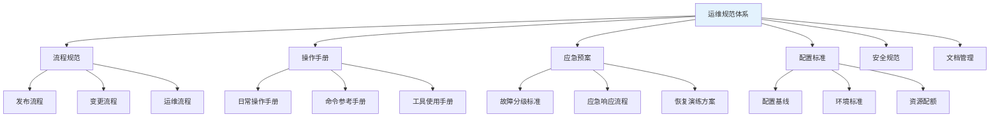
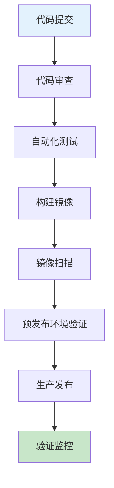
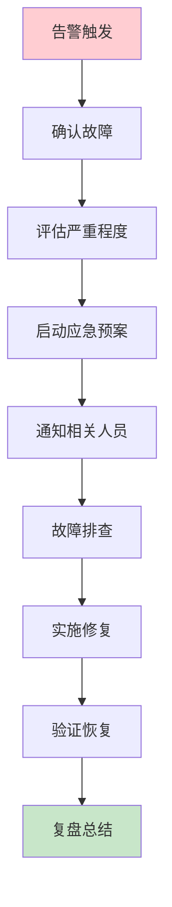

# DevOps运维规范建设：降低系统风险的最佳实践

## 情境与背景

在大规模生产环境中，标准化的运维规范和文档是保障系统稳定性、降低风险的基石。作为高级DevOps/SRE工程师，制定和完善运维规范是核心职责之一。本博客系统介绍运维规范体系的建设方法和最佳实践。

## 一、运维规范体系架构

### 1.1 规范体系结构

**运维规范体系**：



### 1.2 规范体系说明

**规范体系详解**：

```yaml
ops_standards:
  process_standards:
    description: "定义各类流程和审批机制"
    documents:
      - "发布流程规范"
      - "变更管理规范"
      - "问题管理流程"
      - "事件响应流程"
      
  operation_manuals:
    description: "标准化日常操作步骤"
    documents:
      - "日常运维操作手册"
      - "命令参考手册"
      - "工具使用指南"
      - "巡检清单"
      
  emergency_plans:
    description: "故障应急响应和恢复"
    documents:
      - "故障分级标准"
      - "应急预案"
      - "灾备恢复方案"
      - "演练计划"
      
  configuration_standards:
    description: "配置和环境标准"
    documents:
      - "配置管理规范"
      - "环境标准文档"
      - "资源配额标准"
      - "标签规范"
      
  security_standards:
    description: "安全相关规范"
    documents:
      - "安全基线"
      - "访问控制规范"
      - "审计日志规范"
      - "数据加密标准"
```

## 二、流程规范

### 2.1 发布流程规范

**发布流程**：



**发布流程规范内容**：

```yaml
release_process:
  step_1:
    name: "代码提交"
    requirements:
      - "代码必须通过lint检查"
      - "提交信息规范"
      
  step_2:
    name: "代码审查"
    requirements:
      - "至少2人审查"
      - "代码覆盖率达标"
      - "安全检查通过"
      
  step_3:
    name: "自动化测试"
    requirements:
      - "单元测试覆盖率≥80%"
      - "集成测试通过"
      - "性能测试通过"
      
  step_4:
    name: "构建镜像"
    requirements:
      - "使用标准化Dockerfile"
      - "镜像标签规范"
      - "镜像推送到私有仓库"
      
  step_5:
    name: "镜像扫描"
    requirements:
      - "安全漏洞扫描"
      - "依赖版本检查"
      
  step_6:
    name: "预发布验证"
    requirements:
      - "功能验证"
      - "性能验证"
      - "回归测试"
      
  step_7:
    name: "生产发布"
    requirements:
      - "非高峰时段发布"
      - "滚动发布策略"
      - "灰度发布支持"
      
  step_8:
    name: "验证监控"
    requirements:
      - "检查服务状态"
      - "监控指标正常"
      - "回滚预案准备"
```

### 2.2 变更管理规范

**变更管理流程**：

```yaml
change_management:
  types:
    - name: "紧急变更"
      description: "生产故障修复"
      approval: "即时审批"
      time_window: "随时"
      
    - name: "标准变更"
      description: "常规配置变更"
      approval: "单人审批"
      time_window: "工作时间"
      
    - name: "重大变更"
      description: "架构变更、大版本升级"
      approval: "多人审批"
      time_window: "维护窗口"
      
  process:
    - "提交变更申请"
    - "评估变更影响"
    - "获取审批"
    - "执行变更"
    - "验证变更效果"
    - "记录变更日志"
```

## 三、操作手册

### 3.1 日常操作手册

**日常运维操作手册**：

```yaml
daily_operations:
  daily_checklist:
    - "检查集群状态"
    - "检查节点健康"
    - "检查Pod状态"
    - "检查监控告警"
    - "查看日志异常"
    
  weekly_checklist:
    - "备份验证"
    - "清理无用资源"
    - "更新安全补丁"
    - "检查证书有效期"
    - "性能评估"
    
  monthly_checklist:
    - "容量规划评估"
    - "安全审计"
    - "文档更新"
    - "团队培训"
```

### 3.2 命令参考手册

**常用命令手册**：

```bash
# Kubernetes命令
kubectl get pods
kubectl describe pod <name>
kubectl logs <pod>
kubectl exec -it <pod> -- bash

# Docker命令
docker ps
docker logs <container>
docker exec -it <container> bash

# 系统命令
df -h
top
free -h
systemctl status <service>
```

## 四、应急预案

### 4.1 故障分级标准

**故障分级**：

```yaml
incident_severity:
  P0:
    description: "系统完全不可用，业务中断"
    response_time: "立即"
    notification: "全员通知"
    
  P1:
    description: "核心功能故障，大量用户受影响"
    response_time: "15分钟内"
    notification: "核心团队"
    
  P2:
    description: "部分功能故障，部分用户受影响"
    response_time: "1小时内"
    notification: "相关团队"
    
  P3:
    description: "次要功能故障，影响范围小"
    response_time: "4小时内"
    notification: "负责人"
```

### 4.2 应急响应流程

**应急响应流程**：



### 4.3 灾备恢复方案

**灾备恢复流程**：

```yaml
disaster_recovery:
  backup_strategy:
    - "数据库每日全量备份"
    - "增量备份每小时"
    - "备份保留30天"
    - "异地备份存储"
    
  recovery_process:
    - "确认故障范围"
    - "选择恢复点"
    - "执行恢复操作"
    - "验证数据完整性"
    - "恢复服务"
    - "同步数据"
```

## 五、配置标准

### 5.1 配置管理规范

**配置管理原则**：

```yaml
configuration_management:
  principles:
    - "配置即代码"
    - "版本控制"
    - "自动化部署"
    - "环境隔离"
    
  standards:
    - "配置文件命名规范"
    - "配置参数说明"
    - "敏感数据加密"
    - "配置变更审计"
```

### 5.2 环境标准

**环境分层标准**：

```yaml
environment_standards:
  development:
    description: "开发环境"
    resources: "最小配置"
    isolation: "独立"
    
  testing:
    description: "测试环境"
    resources: "中等配置"
    isolation: "隔离"
    
  staging:
    description: "预发布环境"
    resources: "接近生产"
    isolation: "隔离"
    
  production:
    description: "生产环境"
    resources: "完整配置"
    isolation: "严格隔离"
```

## 六、安全规范

### 6.1 安全基线

**安全基线配置**：

```yaml
security_baseline:
  system:
    - "禁用root远程登录"
    - "启用防火墙"
    - "定期更新补丁"
    - "审计日志开启"
    
  container:
    - "非root用户运行"
    - "资源限制"
    - "镜像签名验证"
    - "网络隔离"
    
  kubernetes:
    - "RBAC权限控制"
    - "网络策略配置"
    - "Secret加密"
    - "Pod安全标准"
```

### 6.2 访问控制规范

**访问控制策略**：

```yaml
access_control:
  principles:
    - "最小权限原则"
    - "职责分离"
    - "多因素认证"
    - "定期审计"
    
  levels:
    - "管理员级别"
    - "运维级别"
    - "开发级别"
    - "只读级别"
```

## 七、文档管理

### 7.1 文档结构

**文档管理体系**：

```yaml
document_management:
  structure:
    - "README.md"
    - "architecture.md"
    - "deployment.md"
    - "operations.md"
    - "troubleshooting.md"
    - "api.md"
    
  version_control:
    - "使用Git管理"
    - "定期更新"
    - "变更记录"
    - "审查机制"
```

### 7.2 文档模板

**文档模板示例**：

```markdown
# 服务名称文档

## 一、概述
- 服务描述
- 功能定位
- 架构说明

## 二、部署指南
- 环境要求
- 部署步骤
- 配置说明

## 三、运维指南
- 日常操作
- 监控指标
- 故障排查

## 四、API文档
- 接口列表
- 参数说明
- 示例

## 五、变更记录
| 日期 | 变更内容 | 负责人 |
|:----:|----------|--------|
| YYYY-MM-DD | 变更描述 | 姓名 |
```

## 八、规范落地与执行

### 8.1 规范推广

**推广策略**：

```yaml
promotion_strategy:
  - "培训和宣导"
  - "模板提供"
  - "工具支持"
  - "定期检查"
  - "奖励机制"
```

### 8.2 自动化保障

**自动化工具**：

```yaml
automation_tools:
  - "CI/CD流水线"
  - "配置管理工具"
  - "合规检查工具"
  - "自动化测试"
  - "监控告警"
```

## 九、实战案例

### 9.1 案例：发布流程规范落地

**案例背景**：

```markdown
## 案例：发布流程规范

**问题**：
发布过程不规范，导致多次线上故障。

**解决方案**：
1. 制定发布流程规范文档
2. 实现CI/CD自动化流水线
3. 配置代码审查和自动化测试
4. 实施灰度发布策略

**效果**：
- 发布故障率降低80%
- 发布时间缩短50%
- 回滚时间从30分钟缩短到5分钟
```

### 9.2 案例：应急预案演练

**案例背景**：

```markdown
## 案例：应急预案演练

**问题**：
故障发生时响应缓慢，恢复时间长。

**解决方案**：
1. 制定故障分级标准
2. 编写应急预案文档
3. 定期进行故障演练
4. 建立升级机制

**效果**：
- 平均故障恢复时间缩短60%
- 团队响应效率提升
- 故障处理流程标准化
```

## 十、面试1分钟精简版（直接背）

**完整版**：

我制定过的运维规范包括：发布流程规范（代码审查、自动化测试、滚动发布）、运维操作手册（日常操作步骤、命令清单、最佳实践）、应急预案（故障分级、响应流程、恢复步骤）、配置管理规范（配置标准、变更流程、版本控制）、安全基线（安全配置、访问控制、审计日志）。这些规范确保了操作标准化、故障可追溯、风险可控。

**30秒超短版**：

发布流程、操作手册、应急预案、配置标准、安全基线。

## 十一、总结

### 11.1 规范体系总结

```yaml
standards_summary:
  process_standards:
    - "发布流程规范"
    - "变更管理规范"
    
  operation_manuals:
    - "日常操作手册"
    - "命令参考手册"
    
  emergency_plans:
    - "故障分级标准"
    - "应急预案"
    
  configuration_standards:
    - "配置管理规范"
    - "环境标准"
    
  security_standards:
    - "安全基线"
    - "访问控制规范"
```

### 11.2 最佳实践清单

```yaml
best_practices:
  - "规范文档化"
  - "流程标准化"
  - "操作自动化"
  - "定期审查更新"
  - "培训和宣导"
  - "持续改进"
```

### 11.3 记忆口诀

```
运维规范很重要，流程标准要记牢，
发布流程严把控，变更管理有规条，
操作手册标准化，应急预案不可少，
配置安全双保障，系统稳定风险小。
```

> **参考链接**：[SRE运维面试题全解析：从理论到实践（第二部分）]()