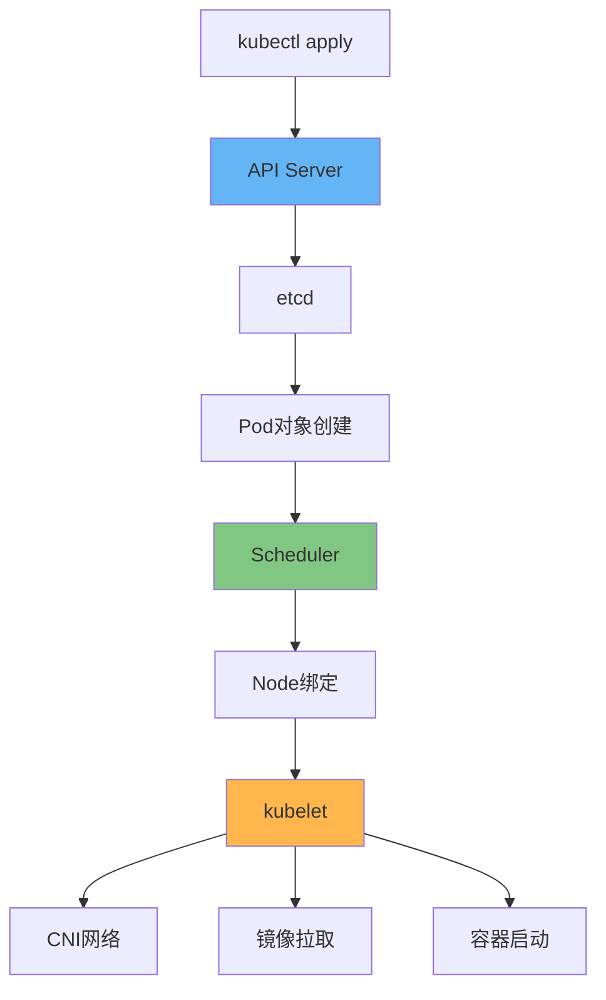
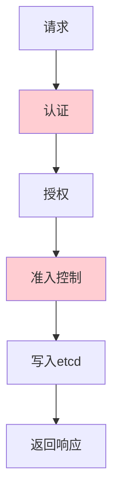
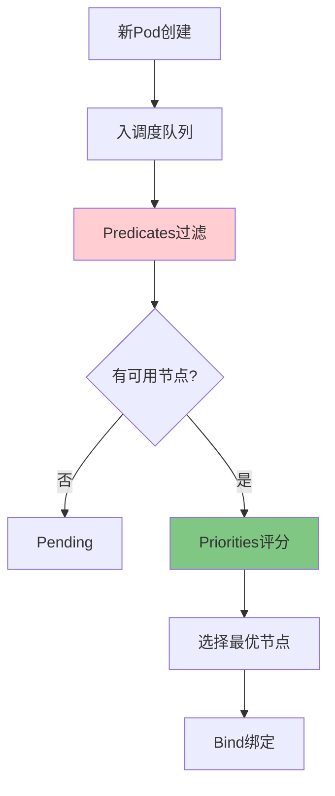
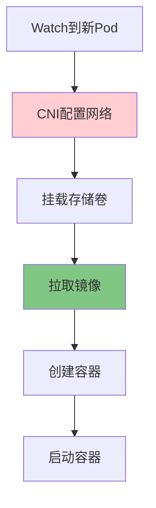
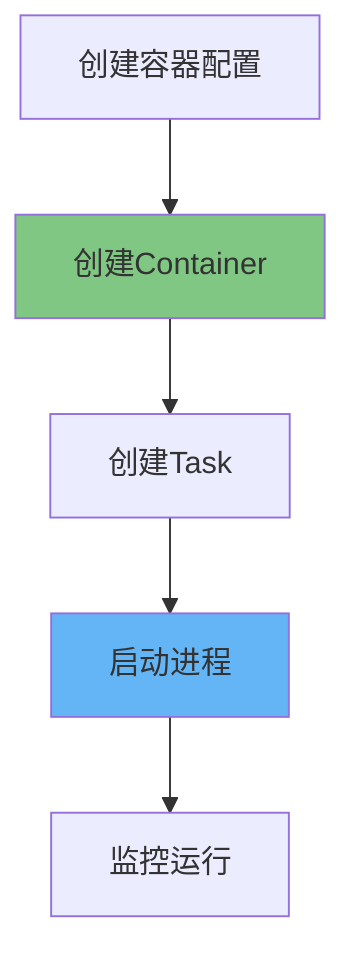

# Kubernetes Pod创建流程：核心组件交互详解

## 情境与背景

理解Kubernetes Pod创建流程是掌握K8s核心原理的基础。本指南通过详细的时序图和流程分析，讲解Pod从创建到启动的完整流程，以及每个阶段的核心组件交互。

## 一、Pod创建流程概述

### 1.1 整体架构图

**Pod创建流程总览**：

```markdown
## Pod创建流程概述

### 整体架构图

**Pod创建流程图**：



**核心组件职责**：

```yaml
core_components:
  api_server:
    role: "统一入口"
    responsibility: "接收请求、认证授权、写入存储"
    
  etcd:
    role: "存储中心"
    responsibility: "存储集群状态、Pod信息"
    
  scheduler:
    role: "调度中心"
    responsibility: "选择最优节点、绑定Pod"
    
  kubelet:
    role: "执行者"
    responsibility: "管理Pod生命周期、镜像容器"
    
  cni:
    role: "网络配置"
    responsibility: "分配IP、配置网络"
```
```

### 1.2 创建流程阶段划分

**五大阶段**：

```yaml
creation_stages:
  stage_1:
    name: "请求阶段"
    component: "API Server"
    duration: "< 100ms"
    
  stage_2:
    name: "调度阶段"
    component: "Scheduler"
    duration: "100-500ms"
    
  stage_3:
    name: "准备阶段"
    component: "kubelet"
    duration: "1-10s (取决于镜像)"
    
  stage_4:
    name: "启动阶段"
    component: "container runtime"
    duration: "1-5s"
    
  stage_5:
    name: "就绪阶段"
    component: "kubelet"
    duration: "取决于应用"
```

## 二、请求阶段

### 2.1 API Server处理

**请求处理流程**：

```markdown
## 请求阶段

### API Server处理

**认证授权流程**：



**认证方式**：

```yaml
authentication_methods:
  certificate:
    description: "X509证书认证"
    usage: "kubelet、服务账号"
    
  bearer_token:
    description: "Token认证"
    usage: "ServiceAccount"
    
  webhook:
    description: "Webhook外部认证"
    usage: "集成外部认证系统"
```

**准入控制器**：

```yaml
admission_controllers:
  default_ingress_class:
    description: "设置默认IngressClass"
    
  limit_ranger:
    description: "应用资源限制"
    
  resource_quota:
    description: "检查命名空间配额"
    
  mutating_webhook:
    description: "修改对象（注入sidecar等）"
    
  validating_webhook:
    description: "验证对象（安全策略等）"
```
```

### 2.2 etcd写入

**数据写入**：

```yaml
etcd_write_process:
  key_structure:
    - "/registry/pods/{namespace}/{pod_name}"
    - "/registry/nodes/{node_name}"
    - "/registry/services/.../endpoints"
    
  write_concern:
    - "Majority: 高可靠"
    - "One: 低延迟"
    
  watch通知:
    - "Scheduler"
    - "kubelet"
    - "Endpoints Controller"
```

## 三、调度阶段

### 3.1 Scheduler工作流程

**调度决策流程**：

```markdown
## 调度阶段

### Scheduler工作流程

**调度流程图**：



**过滤阶段（Predicates）**：

```yaml
predicates_filters:
  PodFitsHostPorts:
    description: "节点端口是否冲突"
    
  HostName:
    description: "节点名称匹配"
    
  MatchNodeSelector:
    description: "节点选择器匹配"
    
  PodFitsResources:
    description: "节点资源是否满足"
    
  NoDiskConflict:
    description: "存储卷是否冲突"
    
  CheckNodeMemoryPressure:
    description: "节点内存压力"
    
  CheckNodePIDPressure:
    description: "节点进程ID压力"
    
  CheckNodeDiskPressure:
    description: "节点磁盘压力"
    
  CheckNodeCondition:
    description: "节点状态检查"
```

**评分阶段（Priorities）**：

```yaml
priorities_scoring:
  LeastRequestedPriority:
    description: "优先选择资源使用少的节点"
    weight: 1
    
  BalancedResourceAllocation:
    description: "平衡CPU和内存使用"
    weight: 1
    
  ImageLocalityPriority:
    description: "优先选择已有镜像的节点"
    weight: 1
    
  InterPodAffinityPriority:
    description: "Pod亲缘性"
    weight: 1
    
  NodeAffinityPriority:
    description: "节点亲和性"
    weight: 1
    
  TaintTolerancePriority:
    description: "污点容忍度"
    weight: 1
```

### 3.2 绑定流程

**Bind操作**：

```yaml
binding_process:
  api_call:
    - "API: PATCH /api/v1/pods/{namespace}/{name}/binding"
    
  etcd_update:
    - "更新Pod的nodeName字段"
    - "更新Binding对象"
    
  informers通知:
    - "kubelet Watch到分配给自己的Pod"
    - "开始拉取镜像和启动容器"
```
```

## 四、准备阶段

### 4.1 kubelet准备流程

**准备阶段流程**：

```markdown
## 准备阶段

### kubelet准备流程

**准备阶段流程图**：



**网络配置（CNI）**：

```yaml
cni_network_setup:
  ip_allocation:
    action: "从IP池分配IP"
    tool: "IPAM插件"
    
  network_setup:
    action: "创建网络命名空间"
    tool: "CNI插件 (Calico/Flannel/Cilium)"
    
  routes:
    action: "配置路由规则"
    destination: "Pod子网路由"
    
  iptables:
    action: "更新iptables规则"
    purpose: "Service到Pod的流量"
```

**存储挂载**：

```yaml
volume_mount_process:
  volume_attachment:
    action: " Attach volume到节点"
    CSI_driver: "CSI驱动"
    
  mount_filesystem:
    action: "格式化并挂载文件系统"
    path: "/var/lib/kubelet/pods/{pod-uid}/volumes"
    
  secret_configmap:
    action: "注入Secrets和ConfigMaps"
    mount_path: "/etc/secrets"
```
```

### 4.2 镜像拉取

**镜像拉取流程**：

```yaml
image_pull_process:
  image_reference:
    - "registry.example.com/namespace/image:tag"
    
  pull_policy:
    Always: "总是拉取"
    IfNotPresent: "本地没有才拉取"
    Never: "从不拉取"
    
  auth:
    - "ImagePullSecrets"
    - "registry凭证"
    
  parallel_pull:
    - "顺序拉取（serialImagePulls）"
    - "并发拉取（parallelImagePulls）"
```

**镜像预热**：

```yaml
image_prewarm:
  purpose: "减少Pod创建时间"
  methods:
    - "DaemonSet在每节点预热"
    - "手动prepull常用镜像"
    - "配置imagePullPolicy: IfNotPresent"
```

## 五、启动阶段

### 5.1 容器创建

**容器创建流程**：

```markdown
## 启动阶段

### 容器创建

**containerd创建容器**：



**容器配置**：

```yaml
container_config:
  rootfs:
    - "容器的根文件系统"
    - "从镜像解压"
    
  resources:
    - "CPU限制和请求"
    - "内存限制和请求"
    - "设备访问控制"
    
  env:
    - "环境变量"
    - "来自ConfigMap/Secret"
    
  command:
    - "ENTRYPOINT"
    - "CMD"
    - "工作目录"
```

**namespace隔离**：

```yaml
linux_namespaces:
  pid:
    description: "进程ID隔离"
    view: "ps aux看到的独立PID"
    
  net:
    description: "网络隔离"
    view: "独立网络栈"
    
  mnt:
    description: "挂载隔离"
    view: "独立文件系统视图"
    
  ipc:
    description: "IPC隔离"
    view: "独立信号量和共享内存"
    
  uts:
    description: "主机名隔离"
    view: "独立hostname"
    
  user:
    description: "用户隔离"
    view: "独立UID/GID映射"
```
```

### 5.2 健康检查配置

**探针配置**：

```yaml
probe_configuration:
  livenessProbe:
    purpose: "判断容器是否需要重启"
    failure_action: "重启容器"
    path: "/healthz"
    
  readinessProbe:
    purpose: "判断容器是否可以接收流量"
    failure_action: "从Service移除"
    path: "/ready"
    
  startupProbe:
    purpose: "判断容器是否启动完成"
    failure_action: "重启容器"
    delay: "容器启动后的初始延迟"
```

## 六、状态上报

### 6.1 kubelet状态同步

**状态上报流程**：

```markdown
## 状态上报

### kubelet状态同步

**状态更新流程**：

```yaml
status_sync_process:
  sync_interval: "10秒（默认）"
  
  reported_status:
    - "phase: Pending/Running/Succeeded/Failed/Unknown"
    - "conditions: Ready/Initialized/ContainersReady"
    - "podIP: Pod分配的IP地址"
    - "hostIP: 节点IP地址"
    
  reason_field:
    - "PodScheduled"
    - "Initialized"
    - "ContainersReady"
    - "Ready"
```
```

### 6.2 Endpoint更新

**Endpoints控制器**：

```yaml
endpoint_update:
  controller: "endpoint controller"
  trigger: "Pod IP变化"
  
  update_action:
    - "添加新Pod IP到Endpoints"
    - "删除旧Pod IP"
    
  downstream_effects:
    - "kube-proxy更新iptables规则"
    - "Service负载均衡更新"
```
```

## 七、生产环境最佳实践

### 7.1 加速Pod创建

**优化策略**：

```markdown
## 生产环境最佳实践

### 加速Pod创建

**镜像优化**：

```yaml
image_optimization:
  small_image:
    - "使用Alpine等轻量镜像"
    - "减少镜像体积"
    
  multi_stage:
    - "多阶段构建减少体积"
    - "分离构建工具和运行时"
    
  caching:
    - "合理利用Layer缓存"
    - "Dockerfile指令顺序优化"
```

**镜像预热**：

```yaml
image_prewarm_strategy:
  common_images:
    - "基础运行时镜像"
    - "监控代理镜像"
    
  prewarm_method:
    - "Pod启动前DaemonSet预热"
    - "定期同步到节点"
```

**CNI优化**：

```yaml
cni_optimization:
  ipam:
    - "配置足够的IP段"
    - "避免IP碎片化"
    
  policy:
    - "减少不必要的网络策略"
    - "批量更新iptables"
```
```

### 7.2 调度优化

**调度策略优化**：

```yaml
scheduling_optimization:
  predicates:
    - "排除压力节点"
    - "配置正确的资源请求"
    
  priorities:
    - "利用镜像本地性"
    - "配置Pod亲缘性"
    
  hints:
    - "nodeAffinity"
    - "podAffinity/podAntiAffinity"
    - "taints/tolerations"
```
```

### 7.3 资源限制配置

**合理资源配置**：

```yaml
resource_configuration:
  requests:
    purpose: "调度依据"
    principle: "设置为应用正常运行值"
    
  limits:
    purpose: "保障稳定"
    principle: "略高于实际使用"
```
```

### 7.4 监控与排查

**创建过程监控**：

```bash
# 查看Pod创建事件
kubectl describe pod <pod-name> -n <namespace> | grep -A 20 "Events:"

# 查看调度延迟
kubectl get events -n <namespace> --field-selector reason=Scheduled

# 查看镜像拉取问题
kubectl describe pod <pod-name> -n <namespace> | grep -i image

# 查看容器启动问题
kubectl logs <pod-name> -n <namespace> --previous
```

**Prometheus指标**：

```yaml
# Pod创建相关指标
kubelet_pod_start_duration_seconds
kubelet_pod_worker_duration_seconds
container_network_receive_bytes_total
image_pull_duration_seconds
```
```

## 八、面试1分钟精简版（直接背）

**完整版**：

Pod创建流程：1. 用户提交YAML，API Server接收请求完成认证授权后写入etcd；2. Scheduler监听未调度Pod，通过Predicates过滤不可用节点，再通过Priorities评分选择最优节点，将Pod绑定到Node；3. kubelet监听到新Pod，开始准备阶段：先配置网络（CNI分配IP）、挂载存储卷；4. kubelet从Registry拉取镜像、创建容器、启动应用进程；5. kubelet汇报Pod状态到API Server。核心组件：API Server统一入口、etcd存储、Scheduler调度决策、kubelet执行。

**30秒超短版**：

Pod创建流程五步：请求写入etcd、Scheduler调度选节点、kubelet配网络、镜像拉取、容器启动，最后汇报状态。

## 九、总结

### 9.1 流程总结

```yaml
creation_flow_summary:
  step_1: "API Server认证授权写入etcd"
  step_2: "Scheduler过滤评分选择节点绑定"
  step_3: "kubelet配置网络CNI分配IP"
  step_4: "kubelet挂载存储卷"
  step_5: "kubelet拉取镜像创建容器"
  step_6: "启动容器汇报状态"
```

### 9.2 核心组件总结

```yaml
core_components_summary:
  api_server: "统一入口、认证授权、存储"
  etcd: "分布式存储、状态持久化"
  scheduler: "调度决策、节点选择"
  kubelet: "Pod生命周期管理"
  cni: "网络配置、IP分配"
  container_runtime: "容器创建运行"
```

### 9.3 记忆口诀

```
Pod创建流程五步走，请求写入etcd先，
认证授权不可少，Scheduler调度选节点，
Predicates来过滤，Priorities来评分，
kubelet执行配置，网络存储和镜像，
CNI分配IP地址，容器启动保运行，
状态上报到API Server，Pod就绪服务上线。
```

> **参考链接**：[SRE运维面试题全解析：从理论到实践（第二部分）]()