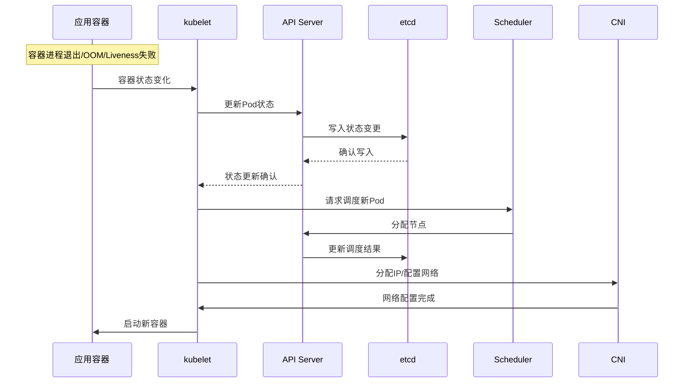

# Pod频繁重启对K8s组件的压力分析与优化指南

## 情境与背景

Pod频繁重启不仅影响应用可用性，还会对Kubernetes集群的各个组件产生压力。本指南详细分析Pod频繁重启对kubelet、etcd、API Server、Scheduler、CNI等组件的影响，以及相应的优化策略。

## 一、Pod重启流程分析

### 1.1 Pod重启完整流程

**Pod重启流程图**：

```markdown
## Pod重启流程分析

### Pod重启完整流程

**Pod生命周期事件**：



**每个Pod重启产生的事件**：

```yaml
pod_restart_events:
  status_update:
    - "Pod状态更新到API Server"
    - "状态写入etcd"
    - "Watch事件通知各组件"
    
  endpoint_update:
    - "Endpoints对象更新"
    - "Service端点变更"
    - "kube-proxy规则更新"
    
  scheduling:
    - "调度请求到Scheduler"
    - "调度决策"
    - "节点分配"
    
  network:
    - "CNI分配IP"
    - "网络规则配置"
    - "防火墙规则更新"
```
```

### 1.2 重启频率影响评估

**频率影响评估表**：

```yaml
restart_frequency_impact:
  occasional:
    frequency: "几次/天"
    impact: "可忽略"
    
  moderate:
    frequency: "几次/小时"
    impact: "轻微影响"
    
  frequent:
    frequency: "几十次/小时"
    impact: "明显压力"
    
  severe:
    frequency: "几百次/小时"
    impact: "严重压力，可能导致集群不稳定"
```
```

## 二、对etcd的影响

### 2.1 etcd压力分析

**etcd负载来源**：

```markdown
## 对etcd的影响

### etcd压力分析

**写入负载**：

```yaml
etcd_write_impact:
  pod_status_update:
    description: "每次Pod状态变化写入一次"
    key_size: "~1KB"
    frequency_per_restart: 1
    
  endpoint_update:
    description: "Endpoints对象更新"
    key_size: "~5KB"
    frequency_per_restart: 1
    
  event_record:
    description: "Event对象记录"
    key_size: "~500B"
    frequency_per_restart: 5-10
```

**Watch事件负载**：

```yaml
etcd_watch_impact:
  watchers:
    - "kubelet: Pod状态"
    - "kube-proxy: Endpoints"
    - "kube-controller: ReplicaSet"
    - "Endpoint Controller: Endpoints"
    
  event_size_per_restart:
    - "Status更新: ~1KB"
    - "Endpoint变更: ~5KB"
    - "Events: ~5KB"
    total: "~11KB/次重启"
```
```

### 2.2 压力表现与解决

**压力表现**：

```bash
# 检查etcd延迟
ETCDCTL_API=3 etcdctl endpoint health

# 检查etcd写入延迟
ETCDCTL_API=3 etcdctl check perf

# 查看etcd监控指标
curl -s http://localhost:2379/metrics | grep etcd_server_apply_duration_seconds
```

**优化方案**：

```yaml
# etcd性能优化配置
apiVersion: v1
kind: Pod
metadata:
  name: etcd
spec:
  containers:
  - name: etcd
    command:
    - etcd
    - --snapshot-count=10000
    - --heartbeat-interval=500
    - --election-timeout=5000
    - --max-snapshots=5
    - --max-wals=5
```
```

## 三、对API Server的影响

### 3.1 API Server压力分析

**请求负载**：

```markdown
## 对API Server的影响

### API Server压力分析

**请求类型和频率**：

```yaml
apiserver_request_impact:
  per_restart:
    - "DELETE /api/v1/namespaces/{ns}/pods/{name} - 1次"
    - "POST /api/v1/namespaces/{ns}/pods - 1次"
    - "PATCH /api/v1/namespaces/{ns}/pods/{name}/status - 多次"
    - "GET /api/v1/namespaces/{ns}/pods/{name} - 多次"
    
  endpoint_impact:
    - "UPDATE /api/v1/namespaces/{ns}/endpoints/{name} - 1次"
    - "Watch Endpoints - 触发所有Service的Endpoints Watch"
```

**带宽消耗估算**：

```yaml
request_bandwidth:
  per_restart_request_size: "~50KB"
  requests_per_restart: 10-20
  total_per_restart: "~500KB - 1MB"
  with_300_pods_hourly: "~150MB - 300MB/小时"
```
```

### 3.2 优化方案

**API Server优化**：

```yaml
# 增加API Server副本
apiVersion: apps/v1
kind: Deployment
metadata:
  name: kube-apiserver
spec:
  replicas: 3
  selector:
    matchLabels:
      component: kube-apiserver
---
# 使用缓存减少etcd访问
apiVersion: v1
kind: ConfigMap
metadata:
  name: kube-apiserver-legacy
data:
  enable-aggregator-routing: "true"
```
```

## 四、对kubelet的影响

### 4.1 kubelet压力分析

**kubelet职责**：

```markdown
## 对kubelet的影响

### kubelet压力分析

**kubelet工作负载**：

```yaml
kubelet_workload:
  status_reporting:
    frequency: "每10秒"
    per_restart: "增加状态同步"
    
  image_pulling:
    frequency: "每次Pod创建"
    impact: "网络带宽和磁盘IO"
    
  health_checking:
    frequency: "每10秒/探针"
    per_restart: "重新开始探针检查"
    
  volume_mount:
    frequency: "每次Pod创建"
    impact: "存储操作"
```

**镜像拉取影响**：

```yaml
image_pull_impact:
  first_restart:
    action: "从registry拉取镜像"
    time: "10秒-5分钟（取决于镜像大小）"
    
  subsequent_restarts:
    action: "可能使用本地缓存"
    time: "1-5秒"
    
  pressure:
    - "网络带宽消耗"
    - "磁盘IO压力"
    - "本地存储占用"
```
```

### 4.2 优化方案

**kubelet配置优化**：

```yaml
# kubelet配置优化
apiVersion: kubelet.config.k8s.io/v1beta1
kind: KubeletConfiguration
authentication:
  anonymous:
    enabled: false
authorization:
  mode: Webhook
maxPods: 110
podPidsLimit: 4096
serializeImagePulls: true
imagePullProgressDeadline: 5m
```

**镜像预热**：

```yaml
# ImagePullPolicy配置
apiVersion: v1
kind: Pod
spec:
  containers:
  - name: app
    image: app:v1
    imagePullPolicy: Always  # 或 IfNotPresent
```
```

## 五、对Scheduler的影响

### 5.1 Scheduler压力分析

**调度负载**：

```markdown
## 对Scheduler的影响

### 调度压力分析

**调度决策流程**：

```yaml
scheduler_workload_per_restart:
  scheduling_queue:
    action: "Pod进入调度队列"
    priority: "基于PriorityClass"
    
  filtering:
    action: "过滤不合适的节点"
    steps: " predicates检查"
    
  scoring:
    action: "对可用节点评分"
    steps: " priorities计算"
    
  binding:
    action: "绑定Pod到节点"
    api_calls: "3-5次API调用"
```

**资源消耗估算**：

```yaml
scheduler_resource_per_restart:
  cpu: "~50-100ms CPU时间"
  memory: "~10-50KB内存"
  api_calls: "10-20次"
  total_time: "~100-500ms"
```
```

### 5.2 优化方案

**调度优化**：

```yaml
# 使用Pod优先级
apiVersion: scheduling.k8s.io/v1
kind: PriorityClass
metadata:
  name: high-priority
value: 10000
globalDefault: false

---
# Pod配置优先级
apiVersion: v1
kind: Pod
spec:
  priorityClassName: high-priority
  containers:
  - name: app
    image: app:v1
```

**调度器配置**：

```yaml
# 调度器配置优化
apiVersion: kubescheduler.config.k8s.io/v1beta3
kind: KubeSchedulerConfiguration
leaderElection:
  leaderElect: true
profiles:
- schedulerName: default-scheduler
  percentageOfNodesToScore: 50  # 减少扫描节点数
```
```

## 六、对CNI的影响

### 6.1 CNI压力分析

**网络配置流程**：

```markdown
## 对CNI的影响

### CNI压力分析

**CNI操作流程**：

```yaml
cni_operations_per_restart:
  ip_allocation:
    action: "分配IP地址"
    time: "~10-50ms"
    
  network_setup:
    action: "配置网络命名空间"
    time: "~50-100ms"
    
  firewall_rules:
    action: "更新iptables/ipvs规则"
    time: "取决于规则数量"
    
  routes:
    action: "配置路由"
    time: "~10-50ms"
```

**IPAM压力**：

```yaml
ipam_pressure:
  allocation:
    action: "从IP地址池分配"
    contention: "多Pod同时分配可能冲突"
    
  release:
    action: "释放到IP地址池"
    cleanup: "可能需要等待租约过期"
```
```

### 6.2 优化方案

**CNI配置优化**：

```yaml
# Calico IPAM配置
apiVersion: crd.projectcalico.org/v1
kind: IPPool
metadata:
  name: default-pool
spec:
  cidr: 192.168.0.0/16
  ipipMode: Always
  natOutgoing: true
  blockSize: 26
  nodeSelector: all()
---
# 禁用频繁网络策略更新
apiVersion: crd.projectcalico.org/v1
kind: FelixConfiguration
metadata:
  name: default
spec:
 IPTablesBackend: auto
  PolicySyncStatusPrefix: ''
```

**减少网络重启**：

```yaml
# 使用hostNetwork减少网络配置
apiVersion: v1
kind: Pod
spec:
  hostNetwork: true
  dnsPolicy: ClusterFirstWithHostNet
---
# 使用headless service减少网络开销
apiVersion: v1
kind: Service
metadata:
  name: app-headless
spec:
  clusterIP: None
  selector:
    app: app
```
```

## 七、对其他组件的影响

### 7.1 kube-proxy影响

**kube-proxy负载**：

```markdown
## 对其他组件的影响

### kube-proxy影响

**Endpoints更新负载**：

```yaml
kube_proxy_impact:
  endpoint_watch:
    action: "监听所有Service的Endpoints"
    trigger: "Pod IP变化"
    
  iptables_rules:
    action: "更新Service到Pod的规则"
    rules_per_endpoint: "~10条规则"
    update_time: "取决于规则总数"
```

**影响范围**：

```yaml
impact_scope:
  single_restart:
    services_affected: "该Pod所属的所有Service"
    rules_updated: "~N*10条 (N为该Pod的Service数)"
    
  frequent_restart:
    cpu: "规则更新的CPU消耗"
    latency: "iptables规则过多导致的延迟"
```
```

### 7.2 CoreDNS影响

**DNS缓存和TTL**：

```yaml
core_dns_impact:
  dns_cache:
    action: "Pod IP变化后DNS缓存需要更新"
    ttl: "取决于配置的TTL"
    
  a_record:
    action: "Service的A记录指向Pod IP"
    update_trigger: "Endpoints变化"
```
```

## 八、生产环境最佳实践

### 8.1 减少不必要的重启

**优化探针配置**：

```markdown
## 生产环境最佳实践

### 减少不必要的重启

**探针优化配置**：

```yaml
# 合理的探针配置
apiVersion: v1
kind: Pod
spec:
  containers:
  - name: app
    livenessProbe:
      httpGet:
        path: /healthz
        port: 8080
      initialDelaySeconds: 60  # 等待应用启动完成
      periodSeconds: 10
      timeoutSeconds: 3
      failureThreshold: 3
    readinessProbe:
      httpGet:
        path: /ready
        port: 8080
      initialDelaySeconds: 10
      periodSeconds: 5
      timeoutSeconds: 2
      failureThreshold: 3
    startupProbe:
      httpGet:
        path: /started
        port: 8080
      failureThreshold: 30  # 30*5s = 150s启动窗口
      periodSeconds: 5
```
```

**优雅退出配置**：

```yaml
# 优雅退出配置
apiVersion: v1
kind: Pod
spec:
  terminationGracePeriodSeconds: 30  # 30秒优雅退出时间
  containers:
  - name: app
    lifecycle:
      preStop:
        exec:
          command:
          - /bin/sh
          - -c
          - "sleep 10 && kill -SIGTERM 1"
```
```

### 8.2 资源限制配置

**合理的资源限制**：

```yaml
# 资源限制配置
apiVersion: v1
kind: Pod
spec:
  containers:
  - name: app
    resources:
      requests:
        cpu: "500m"
        memory: "512Mi"
      limits:
        cpu: "1000m"
        memory: "1Gi"  # 设置合理的内存限制
    env:
    - name: JAVA_OPTS
      value: "-Xms256m -Xmx768m"  # JVM堆内存小于limit
```
```

### 8.3 监控告警配置

**Pod重启监控**：

```yaml
# Prometheus告警规则
groups:
- name: pod-restart-monitoring
  rules:
  - alert: PodRestartFrequent
    expr: |
      sum(rate(kube_pod_container_status_restarts_total[15m])) by (namespace, pod) > 0.05
    for: 5m
    labels:
      severity: warning
    annotations:
      summary: "Pod重启过于频繁"
      description: "{{ $labels.namespace }}/{{ $labels.pod }} 在过去15分钟内重启过于频繁"
      
  - alert: ClusterWidePodRestartStorm
    expr: |
      sum(rate(kube_pod_container_status_restarts_total[5m])) > 10
    for: 2m
    labels:
      severity: critical
    annotations:
      summary: "集群范围内Pod重启风暴"
      description: "集群内Pod重启频率异常增高，当前速率: {{ $value }}/5分钟"
```
```

### 8.4 容量规划

**容量规划建议**：

```yaml
# 容量规划
capacity_planning:
  etcd:
    max_pods_per_cluster: 5000
    recommended_events_per_second: < 1000
    
  apiserver:
    max_requests_per_second: 1000-3000
    max_pods_per_node: 110
    
  scheduler:
    max_pods_per_second: 50-100
```
```

## 九、面试1分钟精简版（直接背）

**完整版**：

Pod频繁重启会对多个K8s组件产生压力：1. etcd：每个Pod状态变化产生Watch事件，频繁重启导致事件堆积、存储压力增大；2. API Server：Pod创建销毁产生大量请求，Endpoints变化触发Service端点更新；3. kubelet：负责Pod生命周期管理，频繁重启需要状态上报和健康检查；4. Scheduler：每次重启都需要调度决策，高频调度消耗CPU；5. CNI：每次创建分配IP，销毁释放IP，网络配置频繁变更。优化方向：减少不必要的重启、优化探针配置、使用PreStop钩子优雅退出。

**30秒超短版**：

Pod重启影响多组件：etcd事件堆积、API Server请求增多、kubelet状态上报、Scheduler调度决策、CNI网络配置，300个Pod频繁重启可能导致集群不稳定。

## 十、总结

### 10.1 组件影响总结

```yaml
component_impact_summary:
  etcd:
    impact: "事件堆积、存储压力"
    severity: "高"
    
  apiserver:
    impact: "请求堆积、带宽消耗"
    severity: "高"
    
  kubelet:
    impact: "状态上报、镜像拉取"
    severity: "中"
    
  scheduler:
    impact: "调度决策消耗"
    severity: "中"
    
  cni:
    impact: "网络配置频繁"
    severity: "中"
```

### 10.2 优化策略总结

```yaml
optimization_summary:
  reduce_restarts:
    - "优化探针配置"
    - "合理设置资源限制"
    - "优雅退出配置"
    
  reduce_impact:
    - "使用Pod优先级"
    - "配置资源配额"
    - "优化CNI配置"
    
  monitoring:
    - "配置重启告警"
    - "监控组件压力"
    - "定期巡检"
```

### 10.3 记忆口诀

```
Pod重启影响多，etcd事件堆积忙，
API Server请求多，kubelet心跳频，
Scheduler调度频，CNI网络配置多，
优化探针和资源，优雅退出是保障，
生产监控要到位，集群稳定有保障。
```

> **参考链接**：[SRE运维面试题全解析：从理论到实践（第二部分）]()