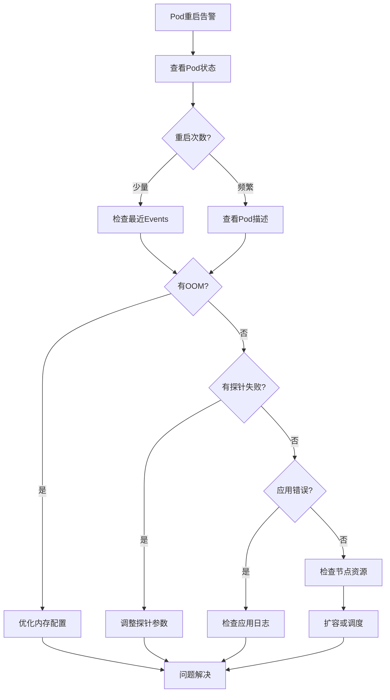

# Kubernetes Pod频繁重启：排查思路与生产环境优化指南

## 情境与背景

Pod频繁重启是Kubernetes生产环境中常见的问题，会影响服务可用性和稳定性。本指南详细讲解Pod重启的原因分析、排查方法、解决方案以及生产环境优化实践。

## 一、Pod重启概述

### 1.1 Pod生命周期

**Pod重启机制**：

```markdown
## Pod重启概述

### Pod生命周期

**Pod重启原理**：

```yaml
pod_restart_mechanism:
  restart_policy:
    description: "Pod重启策略"
    options:
      - "Always（默认）"
      - "OnFailure"
      - "Never"
      
  restart_conditions:
    - "容器进程退出"
    - "OOMKilled"
    - "健康检查失败"
    - "节点故障"
```

**重启计数器**：

```bash
# 查看Pod重启次数
kubectl get pods -n default -o wide

# 查看特定Pod重启详情
kubectl describe pod <pod-name> -n default | grep -A 5 "Containers"

# 查看Pod日志（包含历史）
kubectl logs <pod-name> -n default --previous
```
```

### 1.2 常见重启原因

**五大重启原因**：

```yaml
common_restart_reasons:
  oom_killed:
    description: "内存不足被Kill"
    exit_code: 137
    symptom: "OOMKilled"
    
  liveness_probe_failed:
    description: "存活探针失败"
    exit_code: 143
    symptom: "Liveness probe failed"
    
  readiness_probe_failed:
    description: "就绪探针失败"
    exit_code: 143
    symptom: " Readiness probe failed"
    
  error_exit:
    description: "应用错误退出"
    exit_code: "非0"
    symptom: "Error"
    
  node_failure:
    description: "节点故障"
    exit_code: "不确定"
    symptom: "Node Not Ready"
```

## 二、排查方法论

### 2.1 排查流程

**系统化排查流程**：

```markdown
## 排查方法论

### 系统化排查流程

**排查流程图**：



**排查命令清单**：

```bash
# 1. 查看Pod基本状态
kubectl get pods -n <namespace> -o wide

# 2. 查看Pod详细信息
kubectl describe pod <pod-name> -n <namespace>

# 3. 查看Pod日志
kubectl logs <pod-name> -n <namespace> --previous

# 4. 查看节点资源
kubectl top node <node-name>

# 5. 查看节点事件
kubectl get events -n <namespace> --field-selector involvedObject.name=<pod-name>
```
```

### 2.2 日志分析

**日志分析方法**：

```markdown
### 日志分析

**日志分析要点**：

```yaml
log_analysis:
  oom_indicators:
    - "killed process"
    - "out of memory"
    - "cannot allocate memory"
    
  probe_indicators:
    - "connection refused"
    - "timeout"
    - "health check failed"
    
  app_error_indicators:
    - "panic"
    - "fatal"
    - "exception"
```

**常见错误日志示例**：

```bash
# OOM日志
kubectl logs <pod-name> --previous | grep -i "oom"

# 探针失败日志
kubectl logs <pod-name> | grep -i "probe"

# 应用崩溃日志
kubectl logs <pod-name> --previous | tail -100
```
```

## 三、OOMKilled问题解决

### 3.1 原因分析

**OOM原因**：

```markdown
## OOMKilled问题解决

### 内存问题原因

**内存超限原理**：

```yaml
oom原理:
  description: "容器内存使用超过limit被kernel kill"
  exit_code: 137
  kernel_action: "OOM Killer选择最占用内存的进程杀死"
```

**内存限制配置问题**：

```yaml
memory_limit_issues:
  limit_too_low:
    description: "内存限制设置过低"
    solution: "根据应用实际需求调整"
    
  memory_leak:
    description: "应用内存泄漏"
    solution: "修复应用代码或重启策略"
    
  jvm_memory:
    description: "JVM堆内存设置不当"
    solution: "调整JVM -Xmx参数"
```

### 3.2 解决方案

**内存优化配置**：

```yaml
# 资源配置优化
resources:
  requests:
    memory: "256Mi"
  limits:
    memory: "512Mi"
    
# JVM应用配置
env:
  - name: JAVA_OPTS
    value: "-Xms256m -Xmx512m -XX:+UseG1GC"
```

**内存限制调整**：

```yaml
# 调整内存限制
apiVersion: v1
kind: Pod
metadata:
  name: app
spec:
  containers:
  - name: app
    image: app:v1
    resources:
      requests:
        memory: "512Mi"
        cpu: "250m"
      limits:
        memory: "1Gi"
        cpu: "500m"
```

**Java应用内存配置**：

```yaml
# Java应用特殊配置
apiVersion: v1
kind: Pod
metadata:
  name: java-app
spec:
  containers:
  - name: app
    image: java-app:v1
    env:
    - name: JAVA_TOOL_OPTIONS
      value: "-XX:+PrintGCDetails -Xloggc:/var/log/gc.log -XX:+UseG1GC -Xms512m -Xmx1g"
    resources:
      limits:
        memory: "1.5Gi"  # JVM heap + overhead
```

### 3.3 内存监控

**内存监控配置**：

```yaml
# Prometheus内存监控
- expr: |
    container_memory_working_set_bytes{
      pod=~".*",
      namespace=~".*"
    }
  record: "pod:memory_usage:working_set"
  
- expr: |
    sum(rate(container_memory_working_set_bytes[5m])) by (pod, namespace)
  record: "pod:memory_usage_rate:5m"
```

**告警规则**：

```yaml
# 内存使用告警
- alert: PodMemoryUsageHigh
  expr: |
    (sum(container_memory_working_set_bytes) by (pod, namespace) /
     sum(container_spec_memory_limit_bytes) by (pod, namespace)) > 0.9
  for: 5m
  labels:
    severity: warning
  annotations:
    summary: "Pod内存使用超过90%限制"
```

## 四、探针失败问题解决

### 4.1 探针配置问题

**探针类型**：

```markdown
## 探针失败问题解决

### 探针配置

**三种探针**：

```yaml
probes:
  livenessProbe:
    description: "存活探针，判断容器是否需要重启"
    failure_action: "重启容器"
    use_case: "检测应用僵死"
    
  readinessProbe:
    description: "就绪探针，判断容器是否可以接收流量"
    failure_action: "从Service移除"
    use_case: "检测应用未就绪"
    
  startupProbe:
    description: "启动探针，判断容器是否启动完成"
    failure_action: "杀死容器"
    use_case: "慢启动应用"
```

**探针配置参数**：

```yaml
probe_parameters:
  initialDelaySeconds:
    description: "启动后多久开始探测"
    default: 0
    recommendation: "根据应用启动时间设置"
    
  periodSeconds:
    description: "探测间隔"
    default: 10
    recommendation: "一般10-30秒"
    
  timeoutSeconds:
    description: "探测超时时间"
    default: 1
    recommendation: "根据应用响应时间调整"
    
  successThreshold:
    description: "成功阈值"
    default: 1
    recommendation: "一般保持1"
    
  failureThreshold:
    description: "失败阈值"
    default: 3
    recommendation: "根据容忍度调整"
```
```

### 4.2 探针配置优化

**HTTP探针配置**：

```yaml
# HTTP探针配置
apiVersion: v1
kind: Pod
metadata:
  name: app
spec:
  containers:
  - name: app
    image: app:v1
    livenessProbe:
      httpGet:
        path: /healthz
        port: 8080
      initialDelaySeconds: 30
      periodSeconds: 10
      timeoutSeconds: 3
      failureThreshold: 3
    readinessProbe:
      httpGet:
        path: /ready
        port: 8080
      initialDelaySeconds: 10
      periodSeconds: 5
      timeoutSeconds: 2
      failureThreshold: 3
    startupProbe:
      httpGet:
        path: /started
        port: 8080
      initialDelaySeconds: 0
      periodSeconds: 5
      timeoutSeconds: 3
      failureThreshold: 30  # 30 * 5s = 150s启动时间
```

**TCP探针配置**：

```yaml
# TCP探针配置
apiVersion: v1
kind: Pod
metadata:
  name: app
spec:
  containers:
  - name: app
    image: app:v1
    livenessProbe:
      tcpSocket:
        port: 3306
      initialDelaySeconds: 30
      periodSeconds: 10
      failureThreshold: 3
```

**Exec探针配置**：

```yaml
# Exec探针配置
apiVersion: v1
kind: Pod
metadata:
  name: app
spec:
  containers:
  - name: app
    image: app:v1
    livenessProbe:
      exec:
        command:
        - cat
        - /tmp/healthy
      initialDelaySeconds: 30
      periodSeconds: 10
      failureThreshold: 3
```

### 4.3 探针优化建议

**探针优化原则**：

```yaml
probe_optimization:
  initialDelaySeconds:
    principle: "应略大于应用正常启动时间"
    example: "如果应用启动需要20s，设置为25-30s"
    
  periodSeconds:
    principle: "在敏感度和资源消耗间平衡"
    recommendation: "一般10-30秒"
    
  timeoutSeconds:
    principle: "应略大于应用正常响应时间"
    example: "如果应用响应需要500ms，设置为1-2s"
    
  failureThreshold:
    principle: "initialDelaySeconds + failureThreshold * periodSeconds应大于最大启动时间"
    example: "启动探针: 30 * 5s = 150s启动窗口"
```

## 五、应用错误退出解决

### 5.1 错误类型

**常见应用错误**：

```markdown
## 应用错误退出解决

### 错误类型分析

**退出码含义**：

```yaml
exit_codes:
  0:
    description: "正常退出"
    action: "无需处理"
    
  1:
    description: "一般错误"
    action: "检查应用日志"
    
  137:
    description: "OOMKilled或SIGKILL"
    action: "增加内存限制"
    
  143:
    description: "优雅退出 SIGTERM"
    action: "正常现象"
    
  other:
    description: "其他信号"
    action: "检查具体原因"
```

**常见错误场景**：

```yaml
common_errors:
  config_error:
    - "配置文件缺失"
    - "环境变量错误"
    - "依赖服务不可达"
    
  dependency_error:
    - "数据库连接失败"
    - "Redis连接失败"
    - "API调用超时"
    
  runtime_error:
    - "空指针异常"
    - "数组越界"
    - "死锁"
```
```

### 5.2 排查方法

**错误排查流程**：

```bash
# 1. 查看Pod事件
kubectl describe pod <pod-name> -n <namespace>

# 2. 查看应用日志
kubectl logs <pod-name> -n <namespace> --previous --tail=200

# 3. 查看详细错误信息
kubectl logs <pod-name> -n <namespace> --previous 2>&1 | tail -500

# 4. 检查环境变量
kubectl exec <pod-name> -n <namespace> -- env | sort

# 5. 检查配置文件
kubectl exec <pod-name> -n <namespace> -- ls -la /app/config/
```

### 5.3 优雅退出配置

**优雅退出配置**：

```yaml
# terminationGracePeriodSeconds配置
apiVersion: v1
kind: Pod
metadata:
  name: app
spec:
  terminationGracePeriodSeconds: 30  # 优雅退出等待时间
  containers:
  - name: app
    image: app:v1
    env:
    - name: SHUTDOWN_HANDLER
      value: "true"
```

**应用优雅退出实现**：

```yaml
# 应用优雅退出示例
lifecycle:
  preStop:
    exec:
      command:
      - /bin/sh
      - -c
      - "sleep 10 && kill -SIGTERM 1"
```
```

## 六、节点资源问题解决

### 6.1 节点资源压力

**节点压力排查**：

```markdown
## 节点资源问题解决

### 节点压力排查

**节点资源检查**：

```bash
# 查看所有节点资源使用
kubectl top nodes

# 查看节点详情
kubectl describe node <node-name>

# 查看节点可分配资源
kubectl get node <node-name> -o jsonpath='{.status.allocatable}'
```

**节点资源不足表现**：

```yaml
node_pressure:
  cpu:
    symptom: "Pod调度延迟，CPU使用率高"
    solution: "扩容或重新调度"
    
  memory:
    symptom: "Pod OOMKilled，内存使用率高"
    solution: "扩容或增加内存"
    
  disk:
    symptom: "Pod无法创建，磁盘空间不足"
    solution: "清理磁盘或扩容"
```
```

### 6.2 调度优化

**调度策略优化**：

```yaml
# Pod优先级配置
apiVersion: v1
kind: Pod
metadata:
  name: important-app
spec:
  priorityClassName: high-priority
  containers:
  - name: app
    image: app:v1
---
apiVersion: scheduling.k8s.io/v1
kind: PriorityClass
metadata:
  name: high-priority
value: 10000
globalDefault: false
```

**资源配额配置**：

```yaml
# ResourceQuota限制
apiVersion: v1
kind: ResourceQuota
metadata:
  name: compute-quota
spec:
  hard:
    requests.cpu: "100"
    requests.memory: 200Gi
    limits.cpu: "200"
    limits.memory: 400Gi
```

### 6.3 节点池管理

**节点池配置**：

```yaml
# NodePool配置示例
apiVersion: v1
kind: NodePool
metadata:
  name: worker-pool
spec:
  replicas: 5
  selector:
    matchLabels:
      pool: worker
  template:
    spec:
      taints:
      - key: "workload-type"
        value: "general"
        effect: NoSchedule
      resources:
        requests:
          cpu: "2"
          memory: "4Gi"
        limits:
          cpu: "4"
          memory: "8Gi"
```

## 七、生产环境最佳实践

### 7.1 资源配置最佳实践

**资源配置模板**：

```markdown
## 生产环境最佳实践

### 资源配置最佳实践

**资源配置原则**：

```yaml
resource_configuration:
  requests:
    cpu:
      principle: "设置保证应用正常运行的基础值"
      method: "测试得出"
      
    memory:
      principle: "设置为应用正常使用的1.2倍"
      method: "观察监控得出"
      
  limits:
    cpu:
      principle: "一般与requests相同或略高"
      method: "避免突发流量导致失败"
      
    memory:
      principle: "设置为requests的1.5-2倍"
      method: "留有buffer防止突发"
```

**推荐配置示例**：

```yaml
# 生产环境推荐配置
apiVersion: v1
kind: Pod
metadata:
  name: production-app
spec:
  containers:
  - name: app
    image: app:v1
    resources:
      requests:
        cpu: "500m"
        memory: "512Mi"
      limits:
        cpu: "1000m"
        memory: "1Gi"
    livenessProbe:
      httpGet:
        path: /health
        port: 8080
      initialDelaySeconds: 30
      periodSeconds: 10
      failureThreshold: 3
    readinessProbe:
      httpGet:
        path: /ready
        port: 8080
      initialDelaySeconds: 10
      periodSeconds: 5
      failureThreshold: 3
    startupProbe:
      httpGet:
        path: /started
        port: 8080
      failureThreshold: 30
      periodSeconds: 5
```
```

### 7.2 监控告警最佳实践

**监控指标**：

```yaml
# 关键监控指标
monitoring_metrics:
  pod_restart:
    - "Pod重启次数"
    - "Pod重启率"
    - "重启时间分布"
    
  pod_resources:
    - "内存使用率"
    - "CPU使用率"
    - "临时存储使用"
    
  pod_status:
    - "Pending时间"
    - "Running时间"
    - "终止时间"
```

**告警规则**：

```yaml
# Pod重启告警
groups:
- name: pod-monitoring
  rules:
  - alert: PodRestartHigh
    expr: |
      sum(rate(kube_pod_container_status_restarts_total[15m])) by (namespace, pod) > 0.1
    for: 5m
    labels:
      severity: warning
    annotations:
      summary: "Pod重启过于频繁"
      description: "Pod {{ $labels.namespace }}/{{ $labels.pod }} 重启频率过高"
      
  - alert: PodRestartCritical
    expr: |
      sum(rate(kube_pod_container_status_restarts_total[15m])) by (namespace, pod) > 1
    for: 2m
    labels:
      severity: critical
    annotations:
      summary: "Pod持续重启"
      description: "Pod {{ $labels.namespace }}/{{ $labels.pod }} 持续重启中"
```
```

### 7.3 巡检机制

**自动巡检脚本**：

```bash
#!/bin/bash
# pod-health-check.sh

NAMESPACE=${1:-"default"}
RESTART_THRESHOLD=${2:-5}

echo "========== Pod健康检查 =========="
echo "命名空间: $NAMESPACE"
echo "重启阈值: $RESTART_THRESHOLD"
echo ""

# 检查重启次数过多的Pod
echo "--- 重启次数过多的Pod ---"
kubectl get pods -n $NAMESPACE --field-selector=status.phase=Running | tail -n +2 | while read line; do
    NAME=$(echo $line | awk '{print $1}')
    READY=$(echo $line | awk '{print $2}')
    STATUS=$(echo $line | awk '{print $3}')
    RESTARTS=$(echo $line | awk '{print $4}')
    
    if [ $RESTARTS -gt $RESTART_THRESHOLD ]; then
        echo "⚠️ $NAME - 重启次数: $RESTARTS"
        kubectl describe pod $NAME -n $NAMESPACE | grep -A 10 "Events:"
        echo ""
    fi
done

# 检查OOMKilled的Pod
echo "--- 最近OOMKilled的Pod ---"
kubectl get pods -n $NAMESPACE --field-selector=status.phase=Running | tail -n +2 | while read line; do
    NAME=$(echo $line | awk '{print $1}')
    kubectl logs $NAME -n $NAMESPACE --previous 2>/dev/null | grep -i "killed" && echo "OOM in $NAME"
done
```

## 八、面试1分钟精简版（直接背）

**完整版**：

Pod频繁重启排查思路：1. 查看Pod状态：kubectl describe pod查看Events，定位退出原因；2. 常见原因：OOMKilled（exitCode 137）需增加内存限制，探针失败需调整超时和阈值，Error退出需检查应用日志；3. 节点层面：kubectl top node查看节点资源，确认节点是否压力过大；4. 优化方向：优化应用内存使用、合理配置资源限制和探针、扩容节点或优化调度。300个Pod重启频繁，重点检查是否资源限制过紧或节点资源不足。

**30秒超短版**：

Pod重启三步查：OOM加内存、探针调参数、应用错误查日志，节点压力要扩容。

## 九、总结

### 9.1 问题解决总结

```yaml
problem_solving_summary:
  oom:
    symptom: "exitCode 137, OOMKilled"
    solution: "增加内存限制，优化JVM配置"
    
  liveness_failed:
    symptom: "Liveness probe failed"
    solution: "调整initialDelaySeconds和timeoutSeconds"
    
  error_exit:
    symptom: "exitCode != 0"
    solution: "检查应用日志，修复bug"
    
  node_pressure:
    symptom: "资源使用率高"
    solution: "扩容或调度优化"
```

### 9.2 最佳实践清单

```yaml
best_practices:
  configuration:
    - "合理设置resources requests和limits"
    - "配置适当的探针参数"
    - "使用startupProbe处理慢启动应用"
    
  monitoring:
    - "配置Pod重启告警"
    - "监控内存使用趋势"
    - "定期巡检Pod健康状态"
    
  optimization:
    - "优化应用内存使用"
    - "减少不必要的依赖"
    - "使用轻量级基础镜像"
```

### 9.3 记忆口诀

```
Pod重启三步查，先看状态和日志，
OOM要加内存，探针调参是重点，
应用错误查日志，节点压力要扩容，
资源配置要合理，生产环境不慌张。
```

> **参考链接**：[SRE运维面试题全解析：从理论到实践（第二部分）]()